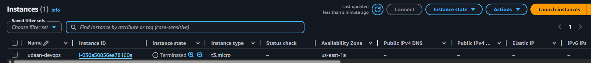
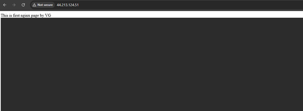

# Day 08 - Cloud Deployment using AWS EC2 and Nginx

## Objective
Launch an AWS EC2 instance, connect using SSH, install Nginx, configure security groups, and verify webpage access from the internet.

---

# Step 1: Launch EC2 Instance

- Created an EC2 instance on AWS
- Used Ubuntu Server
- Downloaded `.pem` key file for SSH access

## Snapshot
Add screenshot here.

---

# Step 2: Connect to EC2 via SSH

```bash
ssh -i your-key.pem ubuntu@44.213.124.51
```

## Snapshot
Add screenshot here.

---

# Step 3: Update Packages

```bash
sudo apt update
```

## Snapshot
Add screenshot here.

---

# Step 4: Install Nginx

```bash
sudo apt install nginx -y
```

## Check Nginx Status

```bash
systemctl status nginx
```

## Snapshot
Add screenshot here.

---

# Step 5: Verify Nginx Locally

```bash
curl localhost
```

Output:

```text
This is first nginx page by VG
```

## Snapshot
Add screenshot here.

---

# Step 6: Verify Nginx Using Public IP

```bash
curl http://44.213.124.51
```

## Snapshot
Add screenshot here.

---

# Step 7: Configure Security Group

Added inbound rules:

| Type | Port | Source |
|------|------|---------|
| HTTP | 80 | 0.0.0.0/0 |
| SSH | 22 | Your Public IP/32 |

## Snapshot
Add screenshot here.

---

# Step 8: Verify Website in Browser

Open in browser:

```text
http://44.213.124.51
```

## Snapshot
Add screenshot here.



---

# Conclusion

Successfully:
- Launched AWS EC2 instance
- Connected using SSH
- Installed and configured Nginx
- Configured security group rules
- Verified webpage access from the internet