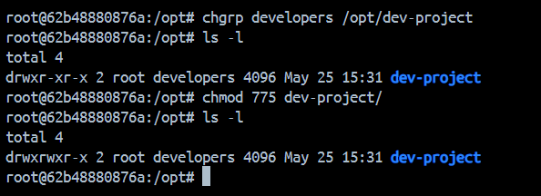
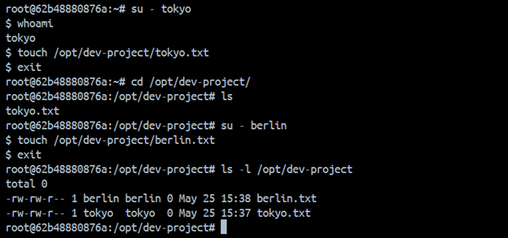
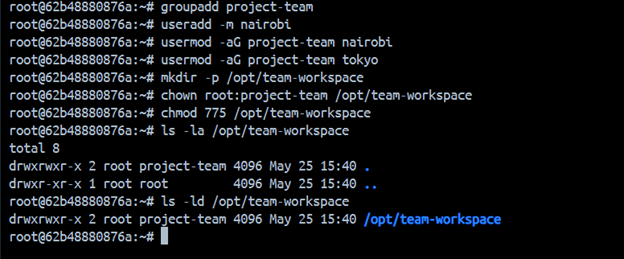

# Day 09 - Linux User & Group Management

## View Existing Users

```bash
cat /etc/passwd
```

---

## Create Users and Set Passwords

### Set password for existing user

```bash
passwd tokyo
```

### Create berlin user

```bash
useradd -m berlin
passwd berlin
```

### Create professor user

```bash
useradd -m professor
passwd professor
```

### Verify users

```bash
cat /etc/passwd
```

## Snapshot
Users:


---

# Group Management

## Create Groups

```bash
groupadd developers
groupadd admins
```

## Add Users to Groups

```bash
usermod -aG developers tokyo
usermod -aG developers berlin

usermod -aG admins berlin
usermod -aG admins professor
```

## Verify Groups

```bash
cat /etc/group
```
## Snapshot
Groups:


---

# Task 4 - Shared Directory

## Create Shared Directory

```bash
mkdir -p /opt/dev-project
```

## Change Group Ownership

```bash
chgrp developers /opt/dev-project
```

## Set Permissions

```bash
chmod 775 /opt/dev-project
```

## Snapshot
Verify Folder created with 775 permission:



---

## Test Access as tokyo

```bash
su - tokyo
touch /opt/dev-project/tokyo.txt
exit
```

## Test Access as berlin

```bash
su - berlin
touch /opt/dev-project/berlin.txt
exit
```

## Snapshot
Verify files created by users:



---

# Task 5 - Team Workspace

## Create Group

```bash
groupadd project-team
```

## Create User

```bash
useradd -m nairobi
```

## Add Users to Group

```bash
usermod -aG project-team nairobi
usermod -aG project-team tokyo
```

---

## Create Workspace Directory

```bash
mkdir -p /opt/team-workspace
```

## Set Group Ownership

```bash
chown root:project-team /opt/team-workspace
```

## Set Permissions

```bash
chmod 775 /opt/team-workspace
```

## Verify Permissions

```bash
ls -ld /opt/team-workspace
```

## Snapshot
Verify Workspace Directory with group:



---

## Test Access as nairobi

```bash
su - nairobi
touch /opt/team-workspace/nairobi-file.txt
exit
```

## Verify File Creation

```bash
ls -l /opt/team-workspace
```

## Snapshot
Verify File Creation:


---

# Concepts Learned

- Linux user management
- Creating users with home directories
- Setting passwords
- Linux group management
- Adding users to groups
- Directory permissions (775)
- Group ownership
- SGID bit usage
- Shared directory access
- Multi-user collaboration in Linux