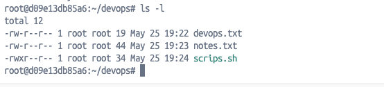
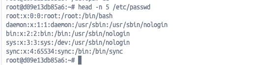
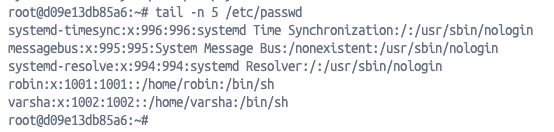
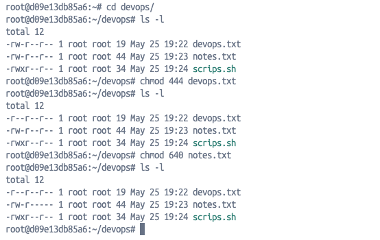
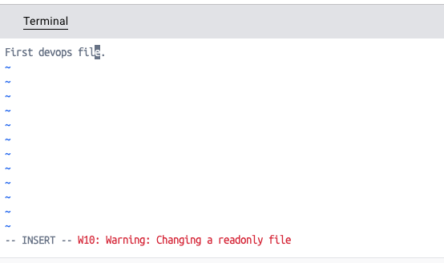

# Day 10 – File Permissions & File Operations Challenge

## Overview

Today I practiced Linux file permissions, file ownership, system files, and basic file operations using terminal commands.

---

# Tasks Completed

## 1. Listed File Permissions

### Command Used

```bash
ls -l
```

### Practiced

- Viewed file permissions
- Identified owners and groups
- Checked file sizes and timestamps
- Understood permission structure

### Files Used

- `devops.txt`
- `notes.txt`
- `scripts.sh`

---

## Snapshot
Output:



---

## 2. Explored `/etc/passwd`

### Commands Used

```bash
head -n 5 /etc/passwd
```

## Snapshot
Output:



```bash
tail -n 5 /etc/passwd
```

## Snapshot
Output:



### Practiced

- Viewed system users
- Understood login shells
- Explored Linux user account information

### Learned

- `/etc/passwd` stores user details
- Each line represents one user account
- Login shells define terminal access

---

## 3. Changed File Permissions

### Commands Used

```bash
chmod 444 devops.txt
```

```bash
chmod 640 notes.txt
```

## Snapshot
Output:



### Practiced

- Modified file permissions
- Made files read-only
- Controlled read/write access for users and groups

### Permission Understanding

- `4` = Read
- `2` = Write
- `1` = Execute

---

## 4. Verified Updated Permissions

### Command Used

```bash
ls -l
```

### Command Used

```bash
vim devops.txt
```

## Snapshot
Output:



In a read-only file, you cannot save and exit using `:wq`. You must force quit using `:q!` and then press `Enter`. 

### Practiced

- Confirmed permission changes
- Compared permission states before and after `chmod`

---

## 5. Tested Read-Only File Behavior

### Practiced

- Opened read-only file in editor
- Observed warning while attempting modification
- Understood how Linux restricts file editing based on permissions

---

# Key Learnings

- Linux permissions use:
  - `r` → read
  - `w` → write
  - `x` → execute

- File permissions apply to:
  - Owner
  - Group
  - Others

- `chmod` is used to change file permissions

- Read-only files cannot be modified without proper write permissions

- `/etc/passwd` contains important system user information

- `ls -l` provides detailed file metadata and permission details

---
