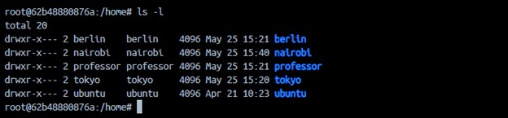
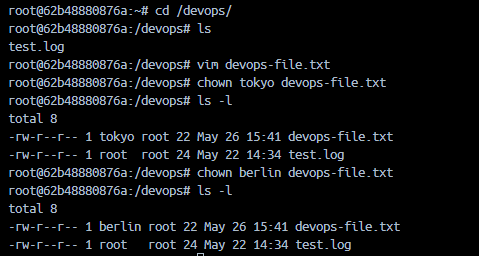
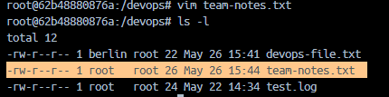
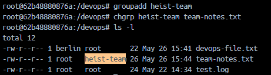
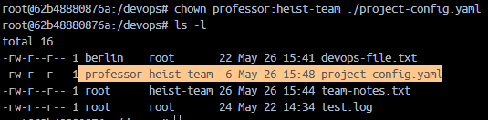
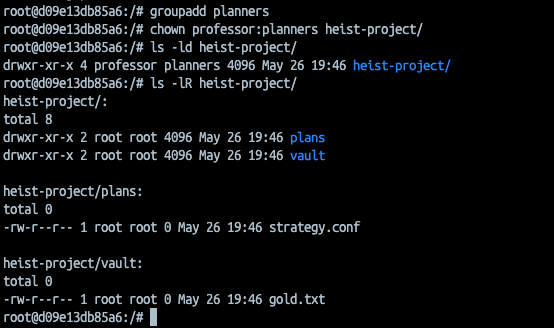
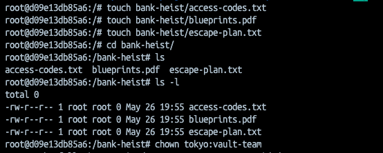
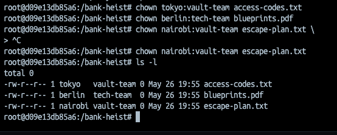

# Day 11 - Linux File Ownership & Group Management

## What I Learned

Today I practiced Linux file ownership and group management commands.

### Topics Covered
- Understanding file owners and groups
- Using `chown` command
- Using `chgrp` command
- Changing both owner and group together
- Verifying ownership using `ls -l`

---

# Task 1: Understanding Ownership

## Command Used
```bash
ls -l
```

### File Format
```bash
-rw-r--r-- 1 owner group size date filename
```

### Difference Between Owner and Group

- **Owner** → The individual user who controls the file
- **Group** → A collection of users who can access the file based on permissions

The owner has primary control over the file, while the group helps multiple users share access without changing ownership.

## Snapshot
Output:



---

# Task 2: Basic chown Operations

## Commands Practiced
```bash
vim devops-file.txt

ls -l devops-file.txt

sudo chown tokyo devops-file.txt

sudo chown berlin devops-file.txt

ls -l
```

### Learning
- `chown` is used to change file ownership
- Ownership changes can be verified using `ls -l`

## Snapshot
Output:



---

# Task 3: Basic chgrp Operations

## Commands Practiced
```bash
vim team-notes.txt

sudo groupadd heist-team

chgrp heist-team team-notes.txt

ls -l
```

## Snapshot
group while file created:




File permission after group change:



### Learning
- `groupadd` creates a new group
- `chgrp` changes the group ownership of a file

---

# Task 4: Combined Owner & Group Change

## Commands Practiced
```bash
vim project-config.yaml

sudo chown professor:heist-team project-config.yaml

mkdir app-logs

sudo chown berlin:heist-team app-logs

ls -l
```

## Snapshot
group while file created:



### Learning
- `chown owner:group` changes both owner and group together
- Ownership can also be applied to directories

---

## Task 5: Recursive Ownership

### 1. Create Directory Structure
```bash
mkdir -p heist-project/vault
mkdir -p heist-project/plans
touch heist-project/vault/gold.txt
touch heist-project/plans/strategy.conf
```

### 2. Create Group
```bash
sudo groupadd planners
```

### 3. Change Ownership Recursively
Changed ownership of the entire `heist-project/` directory:

- **Owner:** professor
- **Group:** planners
- Used recursive flag `-R`

```bash
chown professor:planners -R heist-project/
```

### 4. Verify Ownership Changes
```bash
ls -lR heist-project/
```

## Snapshot
Output:



---

## Task 6: Practice Challenge

### 1. Create Users
```bash
# Users already created in Day 9:
tokyo
berlin
nairobi
```

### 2. Create Groups
```bash
groupadd vault-team
groupadd tech-team
```

### 3. Create Directory
```bash
mkdir bank-heist/
```

### 4. Create 3 files inside `bank-heist`
```bash
touch bank-heist/access-codes.txt
touch bank-heist/blueprints.pdf
touch bank-heist/escape-plan.txt
```

## Snapshot
Output:



### 5. Set different ownership:
   - `access-codes.txt` → owner: `tokyo`, group: `vault-team`
   - `blueprints.pdf` → owner: `berlin`, group: `tech-team`
   - `escape-plan.txt` → owner: `nairobi`, group: `vault-team`

```bash
chown tokyo:vault-team access-codes.txt
chown berlin:tech-team blueprints.pdf
chown nairobi:vault-team escape-plan.txt
```

**Verify:** `ls -l bank-heist/`

## Snapshot
Output:



---

# Commands Learned

```bash
ls -l
chown
chgrp
groupadd
mkdir
vim
```

# Conclusion

Today I learned how Linux file ownership and group permissions work.  
I practiced changing owners and groups using `chown` and `chgrp`, and verified the changes using `ls -l`.