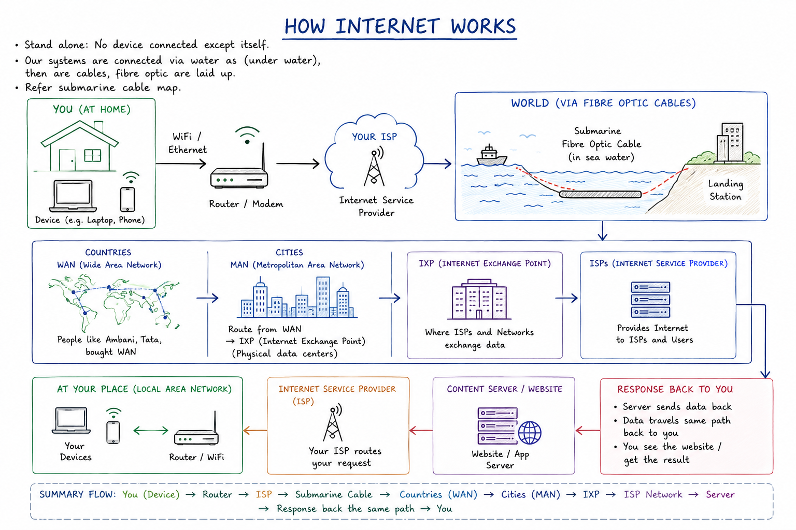
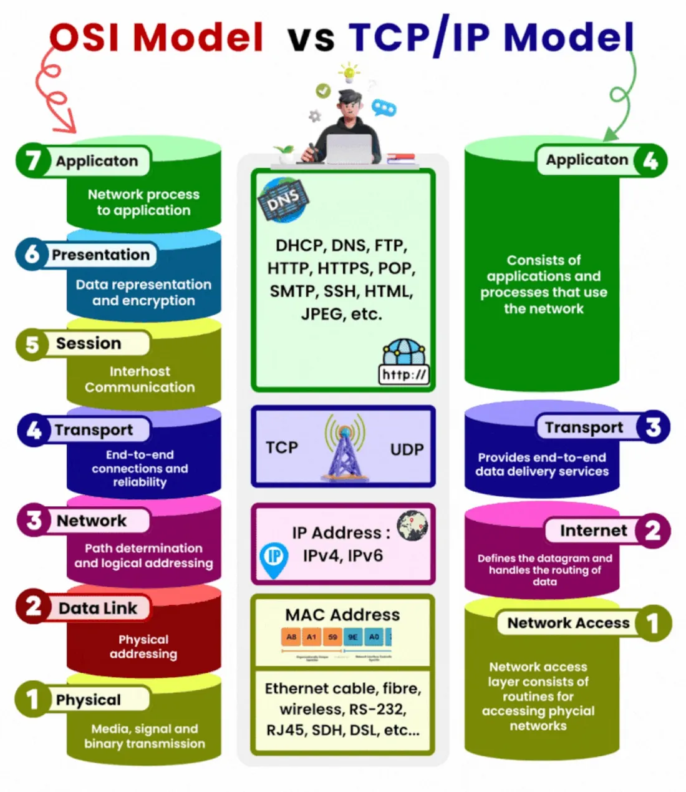

# Day 14 - Computer Networking Fundamentals

## Topics Covered

- Physical Internet
- OSI and TCP/IP Model
- LAN, MAN, WAN
- Data Transfer
- Latency, Bandwidth, Jitter, Packet Loss
- Router, Switch, Hub
- Data Centers
- CDN (Content Delivery Network)
- AWS Regions & Availability Zones

---

## What is the Internet?

A network of interconnected devices is called a **network**.

The **Internet** is a network of networks that allows devices worldwide to communicate with each other.

Example:

```text
Laptop (India)
       |
    Internet
       |
Server (Canada)
```
### How Internet Works



### Standalone System

A standalone system is a device that is not connected to any other device.

---

## Physical Internet

The Internet is a physical infrastructure consisting of:

- Fiber optic cables
- Routers
- Switches
- Data centers
- Submarine cables

Most global internet traffic travels through underwater fiber optic cables.

##### "Submarine Cable Map" to visualize how countries are connected.


---

## Network Types

### LAN (Local Area Network)

A small network within a home, office, or building.

Examples:

- Home WiFi
- Office Network

### MAN (Metropolitan Area Network)

A network that covers an entire city.

Example:

- City-wide internet infrastructure

### WAN (Wide Area Network)

A network that covers large geographical areas.

Examples:

- Airtel Backbone Network
- Tata Communications
- Reliance Network

WANs connect cities and countries.

---

## Data Transfer

Data is transferred across the internet in small units called **Packets**.

Each packet contains:

- Source Address
- Destination Address
- Data

---

## Latency

Latency is the time taken for data to travel from source to destination.

Example:

```text
40 ms
```

Lower latency is better.

---

## Bandwidth

Bandwidth is the amount of data that can be transferred per second.

Examples:

- 100 Mbps
- 1 Gbps

Higher bandwidth means more data can be transferred.

---

## Jitter

Jitter is the variation in latency.

Example:

```text
40ms → 55ms → 35ms
```

---

## Packet Loss

Packet loss occurs when packets fail to reach the destination.

Examples:

- Broken voice calls
- Gaming lag
- Video buffering

---

## Networking Devices

### Router

A router connects different networks.

Responsibilities:

- Packet routing
- Internet connectivity

### Switch

A switch connects devices within the same network.

Commonly used in:

- Offices
- Data Centers

### Hub

An older networking device that broadcasts data to every connected device.

Limitations:

- Slow
- Inefficient

Mostly replaced by switches.

---

## Data Centers

Data centers are facilities that store:

- Servers
- Storage
- Networking Equipment

Examples:

- AWS
- Azure
- Google Cloud

Data centers are often called the heart of the Internet.

---

## CDN (Content Delivery Network)

A CDN stores copies of static content closer to users.

Examples of static content:

- Images
- CSS
- JavaScript
- Videos

### Why CDN?

Without CDN:

```text
User → USA Data Center
```

With CDN:

```text
User → Nearby Edge Location
```

Lower latency and faster performance.

---

## Cache

Cache is temporary storage used to store frequently accessed content.

## Edge Location

Examples:

- Mumbai
- Dubai
- Singapore

---

## AWS Region

A Region is a geographical location containing multiple data centers.

Examples:

- Mumbai
- Singapore
- Ohio

---

## Availability Zone (AZ)

An Availability Zone is an isolated data center within a region.

```text
Mumbai Region
├── AZ-1
├── AZ-2
└── AZ-3
```

Benefits:

- High Availability
- Disaster Recovery

---
# OSI Model

The OSI Model contains 7 layers.

```text
7. Application
6. Presentation
5. Session
4. Transport
3. Network
2. Data Link
1. Physical
```

## Layer Overview

| Layer | Purpose |
|---------|----------|
| Application | User-facing applications |
| Presentation | Data formatting |
| Session | Session management |
| Transport | TCP/UDP |
| Network | IP Routing |
| Data Link | MAC Address |
| Physical | Cable/Fiber |


---

# TCP/IP Model

Practical model used by the Internet.

```text
Application
Transport
Internet
Network Access
```

---

# OSI vs TCP/IP

| OSI | TCP/IP |
|------|---------|
| Application | Application |
| Presentation | Application |
| Session | Application |
| Transport | Transport |
| Network | Internet |
| Data Link | Network Access |
| Physical | Network Access |



---

# TCP vs UDP

## TCP

Reliable protocol.

Features:

- Connection-oriented
- Error recovery
- Ordered delivery

### TCP Handshake
##### Three-Way Handshake

```text
Client → SYN
Server → SYN-ACK
Client → ACK
```

Examples:

- HTTP
- HTTPS
- SSH
- SMTP

---

## UDP

Fast but unreliable.

Features:

- No handshake
- No delivery guarantee

Examples:

- Gaming
- Streaming
- Voice Calls

---

# Network Troubleshooting Commands

## ping

Check connectivity.

```bash
ping google.com
```

---

## traceroute

Check packet route.

```bash
traceroute google.com
```

---

## nslookup

DNS lookup.

```bash
nslookup google.com
```

---

## dig

Advanced DNS lookup.

```bash
dig google.com
```

---

## curl

Test HTTP/HTTPS endpoints.

```bash
curl -I https://google.com
```

---

## ss

Check open ports and active connections.

```bash
ss -tulpn
```

---

## nc (Netcat)

Test specific ports.

```bash
nc -vz google.com 443
```

---

# Mini Network Check

```bash
nslookup google.com
ping google.com
traceroute google.com
curl -I https://google.com
```


---

# Quick Revision

- Internet = Network of Networks
- Router connects networks
- Switch connects devices
- TCP is reliable
- UDP is fast
- OSI is conceptual
- TCP/IP is practical
- Ping, traceroute, nslookup, dig and curl are essential troubleshooting tools