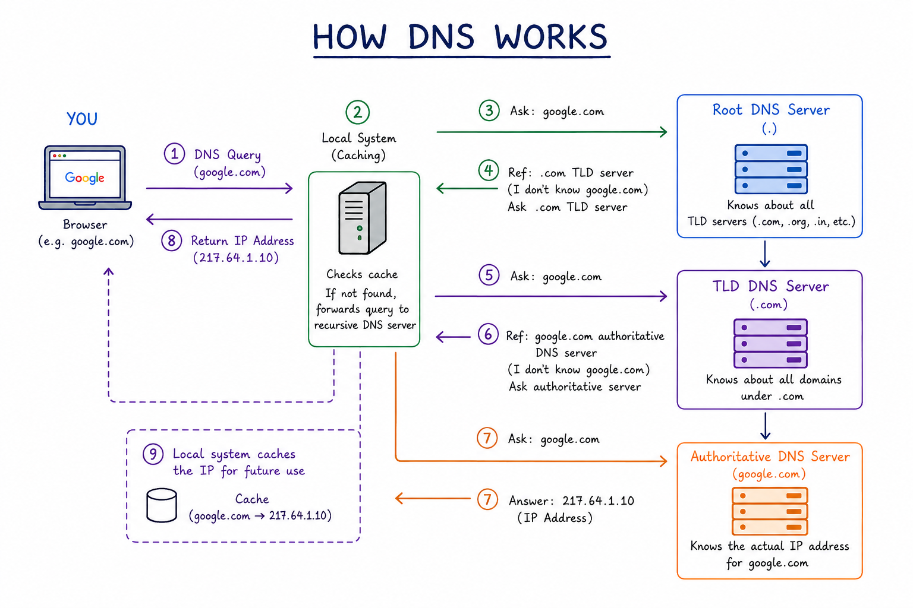
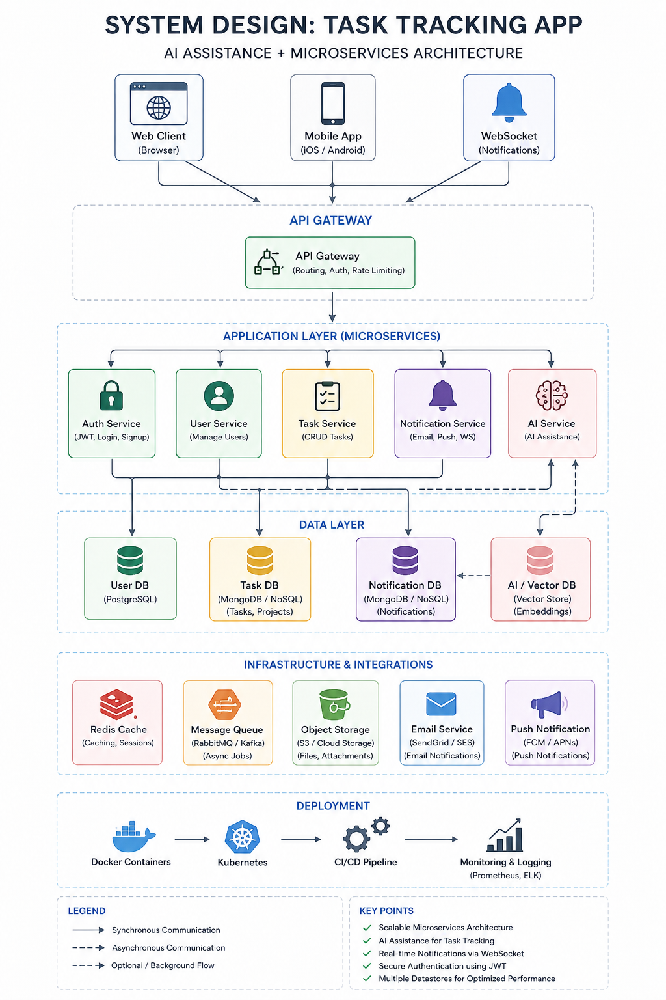

# Day 15 - IP Addressing, DNS, Security and AWS VPC

## Objective

Understand how devices are addressed on the Internet and how AWS networking works.

---

# Task 1: DNS - How Names Become IPs
## What happens when you type google.com in a browser?
- Browser checks local DNS cache.
- Request is sent to a DNS Resolver.
- Resolver queries Root DNS Server.
- Root DNS directs to the TLD Server (.com).
- TLD Server directs to the Authoritative DNS Server.
- Authoritative DNS Server returns the IP address.
- Browser connects to the server using the returned IP.
- Webpage loads.

## DNS Resolution Flow

```text
192.168.1.10
     ↓
```

# DNS (Domain Name System)

DNS converts domain names into IP addresses.

Example:

```text
google.com
     ↓
142.x.x.x
```
### How DNS Works


- You enter a website address (e.g., google.com) in your browser
- The browser sends a DNS request to find the website's IP address.
- The DNS Resolver checks its cache; if not found, it queries the Root DNS Server.
- The Root DNS Server directs it to the TLD Server (e.g., .com).
- The TLD Server points to the Authoritative DNS Server.
- The Authoritative DNS Server returns the website's IP address.
- The DNS Resolver sends the IP address back to your browser.
- Your browser connects to the website's server using that IP address and loads the page.
- The result is cached for faster access next time

---

## DNS Resolution Flow

DNS (Domain Name System) acts like the phonebook of the Internet. It translates human-friendly domain names (e.g., google.com) into machine-readable IP addresses (e.g., 142.250.x.x). This entire process typically takes only a few milliseconds, making web browsing seamless.

```text
User
   ↓
Browser
   ↓
Local Cache
   ↓
Recursive DNS Resolver
   ↓
Root DNS Server
   ↓
TLD DNS Server (.com)
   ↓
Authoritative DNS Server
   ↓
IP Address Returned
   ↓
Website Server
   ↓
Webpage Loads
```

---

# Common DNS Components

## DNS Record Types 

| Record | Purpose |
|--------|----------|
| A | Maps domain to IPv4 address |
| AAAA | Maps domain to IPv6 address |
| CNAME | Alias of another domain |
| MX | Mail server record |
| NS | Name server record |

## Root DNS

Knows TLD locations.

---

## TLD Server

Examples:

- .com
- .org
- .in

---

## Authoritative DNS

Stores actual DNS records.


# Task 2: IP Addressing
## What is an IP Address?

An IP Address uniquely identifies a device on a network.

Example:

```text
192.168.1.10
```

---

# Internet Protocol (IP)

Defines rules for:

- Addressing
- Routing
- Packet Delivery

---

# IPv4

IPv4 uses a 32-bit address.

Example:

```text
192.168.1.10
```

Total possible addresses:

```text
4.3 Billion Addresses
```

---

# IPv6

IPv6 uses a 128-bit address.
Provides virtually unlimited addresses.

Example:

```text
2001:db8::1
```

Benefits:

- Massive address space
- Better scalability

# Public vs Private IP

| Type | Example |
|--------|----------|
| Public | 8.8.8.8 |
| Private | 192.168.1.10 |

# Private IP Ranges

```text
10.0.0.0 – 10.255.255.255
172.16.0.0 – 172.31.255.255
192.168.0.0 – 192.168.255.255
```

Find Your IP:

```text
ip addr show
```

---
# Task 3: CIDR & Subnetting

## Subnet

A subnet is a logical subdivision of a network.

Benefits:

- Better organization
- Better security
- Efficient IP allocation

---

## CIDR

Classless Inter-Domain Routing.

Example:

```text
192.168.1.0/24
```

Formula:

```text
Number of IPs = 2^(32 - n)
```

Where:

```text
n = CIDR value
```

Examples:

| CIDR | Total IPs | Usable Hosts |
|--------|----------|----------|
| /24 | 256 | 254 |
| /16 | 65,536 | 65534 |
| /28 | 16 | 14 |

---

# Network Address

First IP in a subnet.

Example:

```text
192.168.1.0
```

---

# Broadcast Address

Last IP in a subnet.

Example:

```text
192.168.1.255
```

## Why Do We Subnet? 

Subnetting helps:

- Reduce broadcast traffic
- Improve security
- Improve network management
- Optimize IP utilization

---

---

# Task 4: Ports & Network Security

## What is a Port?
A port is a communication endpoint.

Think:

IP Address = Building

```text
Port = Room Number
```

Example:
```text
10.0.0.5:443
```

# Common Ports

| Service | Port |
|----------|------|
| HTTP | 80 |
| HTTPS | 443 |
| SSH | 22 |
| SMTP | 25 |

### View Open Ports

```text
ss -tulpn
```

## Firewall

Controls network traffic entering and leaving systems.

## Ingress

Incoming traffic.

```text
Internet → Server
```

## Egress

Outgoing traffic.

```text
Server → Internet
```

---

# TLS

Transport Layer Security.

Provides:

- Encryption
- Authentication

HTTPS uses TLS.

SSL is outdated.

---

# Port

Virtual communication endpoint.

Think:

```text
IP Address = Building
Port = Room Number
```

Example:

```text
10.0.0.5:443
```

---

# Task 5: Troubleshooting

```bash
curl http://myapp.com:8080
```

Networking concepts involved:

- DNS Resolution
- IP Routing
- TCP Connection
- Port 8080 Access
- Server Response

### App Cannot Reach Database at 10.0.1.50:3306

Check:

- Network connectivity
- Database service status
- Firewall rules
- Security groups
- Route tables
- Correct hostname/IP
- Port availability

# AWS VPC Fundamentals

## VPC

VPC (Virtual Private Cloud) is a private isolated network in AWS.

A private network inside AWS.

---

## Public Subnet

Accessible from the Internet.

Examples:

- Web Servers
- Load Balancers

---

## Private Subnet

Not directly accessible from the Internet.

Examples:

- Databases
- Internal Services

---

## Internet Gateway

Provides Internet access to public subnets.

---

## NAT Gateway

Allows private resources to access the Internet without exposing them publicly.

```text
Private EC2
     ↓
NAT Gateway
     ↓
Internet
```

---

## Route Table

Controls how traffic moves inside a VPC.

Contains routes for:

- Internet Gateway
- NAT Gateway
- Internal Networks

---

## System Design

System Design is the process of planning a system before implementation.

Goals:

- Scalability
- Reliability
- Security
- Availability
- Cost Optimization

---

## Typical Architecture

```text
React Frontend
      ↓
Backend API
      ↓
PostgreSQL
      ↓
Redis Cache
```



---

## Databases

### PostgreSQL

Best for:

- Structured Data
- Transactions

### MongoDB

Best for:

- Flexible Schema
- Unstructured Data

---

## JWT

Used for:

- Authentication
- Authorization
- User Sessions

---

## Microservices

Application split into multiple independent services.

Examples:

- Auth Service
- User Service
- Notification Service
- AI Service

Benefits:

- Independent deployment
- Better scaling
- Easier maintenance

---

## Load Balancer

Distributes traffic across multiple servers.

```text
Users
  ↓
Load Balancer
  ↓
Server 1
Server 2
Server 3
```

---

## Scaling

### Vertical Scaling

```text
2 CPU → 8 CPU
```

### Horizontal Scaling

```text
1 Server → 10 Servers
```

Preferred for large systems.

---

## Kubernetes

Responsibilities:

- Deployment
- Auto Scaling
- Self Healing
- Service Discovery

---

## Monitoring

### Prometheus

Collects metrics.

Examples:

- CPU
- Memory
- Requests

### Grafana

Visualizes metrics using dashboards.

---

## Redis

In-memory datastore used for:

- Caching
- Sessions
- Fast lookups

---

# Key Takeaways

- DNS converts domain names into IP addresses
- IPv4 is limited; IPv6 solves address exhaustion.
- CIDR defines subnet size and host capacity.
- Ports identify services running on a system.
- Firewalls control ingress and egress traffic.
- TLS secures communication.
- AWS VPC provides isolated networking.
- Public and private subnets improve security.
- NAT Gateway enables secure outbound internet access.
- Route tables control traffic flow.
- Load balancers improve availability.
- Kubernetes automates container orchestration.
- Monitoring helps maintain application health.
- Redis improves performance through caching