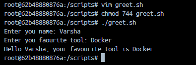
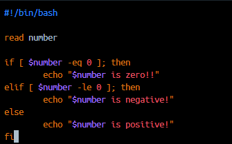
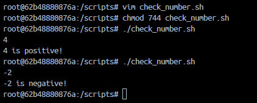
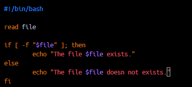
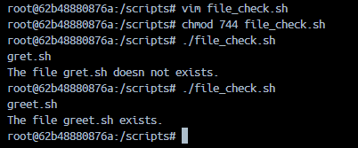
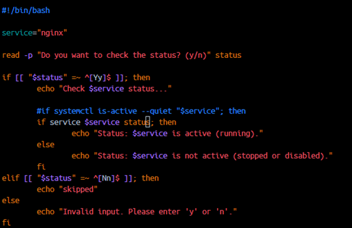
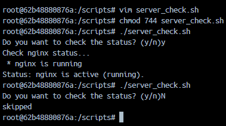

# Day 16 - Shell Scripting Basics

## Task 1: Your First Script

### Objective
Create and execute your first shell script using Bash.

---

## Commands

```bash
mkdir scripts
cd scripts
vim hello.sh
```

Add the following content:

```bash
#!/bin/bash

echo "Hello, DevOps!"
```

---

### Make Script Executable

```bash
chmod 740 hello.sh
```

---

### Run the Script

```bash
./hello.sh
```

## Screenshot


---

# Task 2: Variables in Shell Script

## Objective
Learn how to use variables in Bash scripts.

---

## Commands

```bash
vim variables.sh
chmod 740 variables.sh
./variables.sh
```

## Screenshot


---

# Difference Between Single Quotes and Double Quotes

## Using Double Quotes


---

## Using Single Quotes


Single quotes treat variables as plain text and do not expand them.

---

# Task 3: User Input with read

## Objective

Learn how to accept user input in a Bash script using the `read` command.

---

## Commands

```bash
vim greet.sh
chmod 744 greet.sh
./greet.sh
```

---

### Output



---

# Task 4: If-Else Conditions

## Objective

Learn conditional statements and comparison operators in Bash.

---

## Create Script

```bash
vim check_number.sh
```

### Add content



---

### Make Script Executable & run

```bash
chmod 744 check_number.sh
./check_number.sh
```

---

### Output



---

## Core Numeric Operators

| Operator | Description |
|-----------|-------------|
| -lt | Less than |
| -le | Less than or equal |
| -gt | Greater than |
| -ge | Greater than or equal |
| -eq | Equal to |
| -ne | Not equal to |

---

## Part 2: file_check.sh

### Create Script

```bash
vim file_check.sh
```

### Add content



---

### Make Script Executable & Run

```bash
chmod 744 file_check.sh
./file_check.sh
```

### Output



---

## Core File Operators

| Operator | Description |
|-----------|-------------|
| -f | File exists and is a regular file |
| -e | Path exists |
| -d | Directory exists |

---

# Task 5: Combine It All

## Objective

Combine variables, user input, and conditional statements into a practical script.

---

## Step 1: Install Nginx (if not installed)

```bash
apt update
apt install nginx -y
```

Verify installation:

```bash
systemctl status nginx
```

---

## Step 2: Create server_check.sh

```bash
vim server_check.sh
```

### Add the following content:



---

## Step 3: Make Script Executable & Run

```bash
chmod 744 server_check.sh
./server_check.sh
```

---

### Output:



---

# Key Learnings

- Used `read` to accept user input.
- Applied `if`, `elif`, and `else` conditions.
- Performed numeric comparisons using Bash operators.
- Checked file existence using file test operators.
- Combined variables, conditions, and system commands into a practical automation script.
- Learned basic service status monitoring using `systemctl`.

---

# Conclusion

In this exercise, I learned how to build interactive Bash scripts by accepting user input, making decisions with conditional statements, validating files, and checking service status. These concepts form the foundation for Linux automation and DevOps scripting.