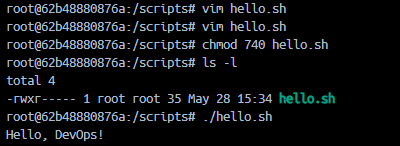
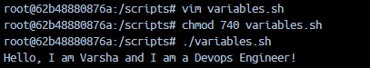
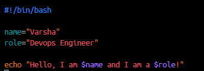
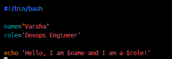

# Day 16 - Shell Scripting Basics

## Task 1: Your First Script

### Objective
Create and execute your first shell script using Bash.

---

## Commands

```bash
mkdir scripts
cd scripts
vim hello.sh
```

Add the following content:

```bash
#!/bin/bash

echo "Hello, DevOps!"
```

---

### Make Script Executable

```bash
chmod 740 hello.sh
```

---

### Run the Script

```bash
./hello.sh
```

## Screenshot



---

# Task 2: Variables in Shell Script

## Objective
Learn how to use variables in Bash scripts.

---

## Commands

```bash
vim variables.sh
chmod 740 variables.sh
./variables.sh
```

## Screenshot



---

# Difference Between Single Quotes and Double Quotes

## Using Double Quotes



---

## Using Single Quotes



Single quotes treat variables as plain text and do not expand them.

---
