# Day 17 - Bash Scripting: Loops, Arguments, Package Installation & Error Handling

## Overview

Today I practiced advanced Bash scripting concepts including:

- For loops
- While loops
- Command-line arguments
- Automating package installation
- Error handling with `set -e`
- Root user validation

These concepts are essential for automating repetitive tasks and building reliable DevOps scripts.

---

# Task 1: For Loop

## 1. Print a List of Fruits

### Script: `for_loop.sh`

```bash
vim for_loop.sh
```

### Add content

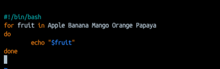


```bash
chmod 744 for_loop.sh
./for_loop.sh
```

### Output

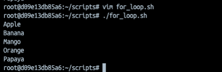

---

## 2. Print Numbers 1–10

### Script: `count.sh`

```bash
vim count.sh
```

### Add content

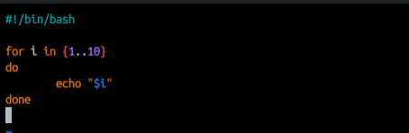


```bash
chmod 744 count.sh
./count.sh
```

### Output

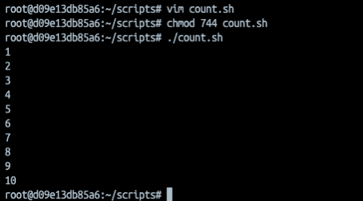

---

# Task 2: While Loop

## Countdown Script

### Script: `countdown.sh`

```bash
vim countdown.sh
```

### Add content

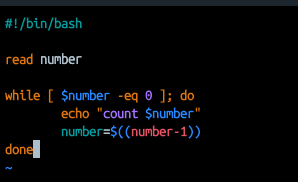

```bash
chmod 744 countdown.sh
./countdown.sh
```

### Output

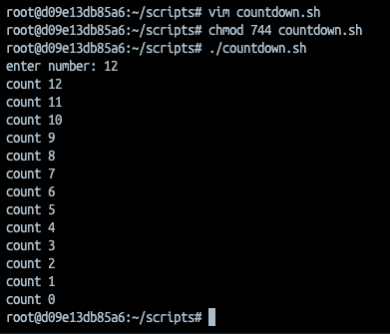

---

# Task 3: Command-Line Arguments

## 1. Greeting Script

### Script: `greet.sh`

```bash
vim greet
```

### Add content

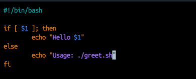

```bash
chmod 744 greet.sh
./greet.sh
./greet.sh Varsha
```

### Output

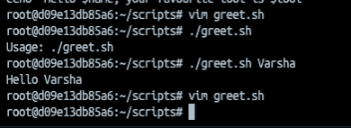

---

## 2. Argument Information Script

### Script: `args_demo.sh`

```bash
vim args_demo.sh
```

### Add content

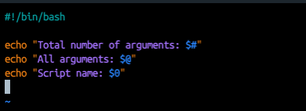

### Output

```bash
chmod 744 args_demo.sh
./args_demo.sh apple cat robin
```


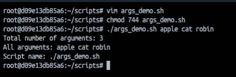


---

# Task 4: Install Packages via Script

## Script: `install_packages.sh`

```bash
vim install_packages.sh
```

### Add content

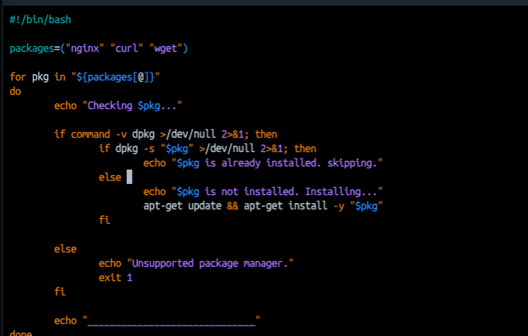

### Features

- Loops through a package list
- Checks whether a package is installed
- Installs missing packages
- Skips already installed packages
- Displays installation status

### Output

```bash
hmod 744 zinstall_package.sh
./install_package.sh
```

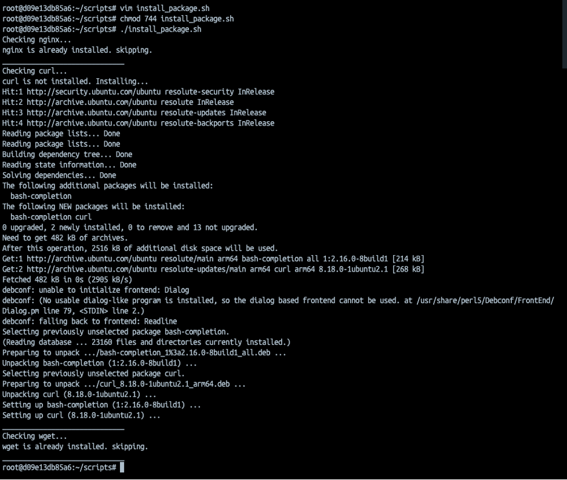

Re-run
```bash
./install_package.sh
```

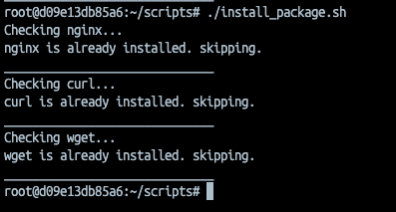

---

# Task 5: Error Handling

## Safe Script

### Script: `safe_script.sh`

```bash
vim safe_script.sh
```

### Add content

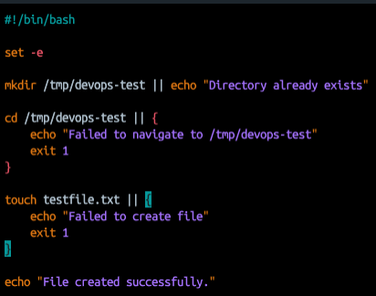


### Output

```bash
hmod 744 safe_script.sh
./safe_script.sh
```

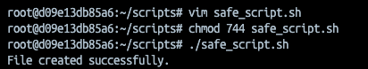

#### Verification

```bash
cd /tmp/devops-test
ls
```

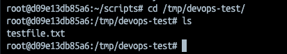


## Root User Validation

To prevent permission issues, the installation script should only run as root.

```bash
vim install_package.sh
```

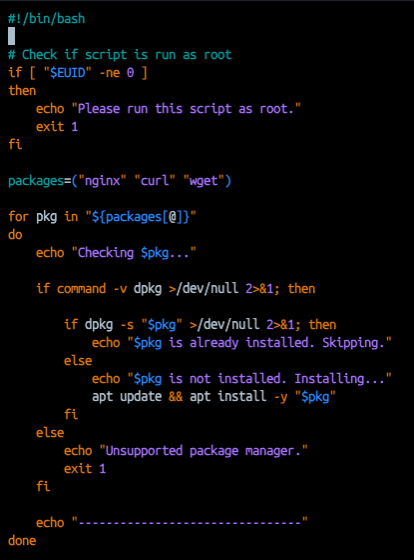

Add this block at the beginning of `install_packages.sh`.

```bash
chmod install_package.sh
./install_package.sh
```

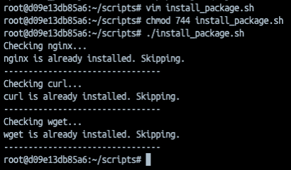

---

# Key Learnings

- Used `for` loops to iterate through lists and ranges.
- Used `while` loops to execute tasks until a condition becomes false.
- Learned how to access command-line arguments using `$1`, `$@`, `$#`, and `$0`.
- Automated package installation using Bash scripts.
- Improved script reliability with `set -e`.
- Added permission checks to ensure scripts run with the required privileges.
- Built safer and more reusable automation scripts.

---

# DevOps Takeaway

Bash scripting is a core DevOps skill. Loops, command-line arguments, package automation, and error handling enable engineers to automate repetitive system administration tasks. These scripting fundamentals are widely used in infrastructure automation, CI/CD pipelines, server provisioning, and operational workflows.