# Day 18 - Shell Scripting Functions & System Monitoring

## Overview

Today I learned:

- Creating and using Bash functions
- Passing arguments to functions
- Local vs global variables
- Bash strict mode (`set -euo pipefail`)
- Error handling and pipe failures
- Building a system monitoring script using functions

---

## Task 1. Basic Functions

### Bash Script for functions.sh

```bash
vim functions.sh
```

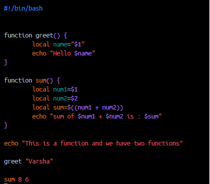

```bash
chmod 744 functions.sh
./functions.sh
```
### Output

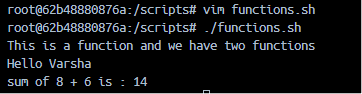

### Learnings

- Functions help organize reusable code.
- Arguments are accessed using `$1`, `$2`, etc.
- `local` variables are scoped to the function.

---

## Task 2: Function with return values
- A function check_disk that checks disk usage of / using df -h
- A function check_memory that checks free memory using free -h
- A main section that calls both and prints the results

### Bash Script for disk_check.sh 

```bash
vim disk_check.sh
```

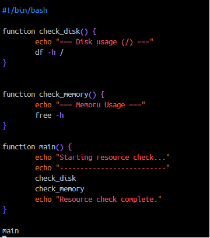

```bash
chmod 744 disk_check.sh
./disk_check.sh
```
### Output

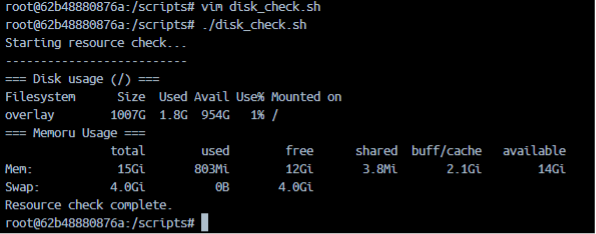

### Learnings: Resource Monitoring Functions

- Functions can call other functions.
- `main()` improves script structure.
- `df -h` shows disk usage.
- `free -h` shows memory usage.

---

## 3. Bash Strict Mode

### Bash strict_demo.sh

```bash
vim strict_demo.sh
```
#### Test 3.1 : undefined Variable (set -e)
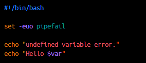

```bash
chmod 744 strict_demo.sh
./strict_demo.sh
```
### Output
Result: The script immediately crashes on line 6. It prints an error message 

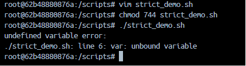

<b>The Reason</b>: Normally, Bash silently replaces empty variables with nothing. The -u flag forces the script to fail instantly if you reference a variable that has not been set, preventing typos from causing bugs.

#### Test 3.2 : command failure (set -u)
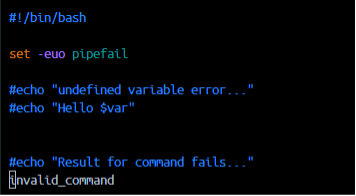

```bash
chmod 744 strict_demo.sh
./strict_demo.sh
```
### Output
Result: displays erros

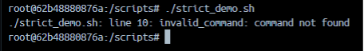

<b>The Reason</b>: The -e flag instructs Bash to exit immediately if any command returns a non-zero exit status (a failure), stopping broken code from running further.


#### Test 3.3 : Piped Failue (set -o pipefail)
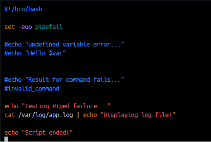

```bash
chmod 744 strict_demo.sh
./strict_demo.sh
```
### Output
Result: The script prints "Displaying Log File!" from the echo command, but then immediately crashes and does not print "Script ended!” 

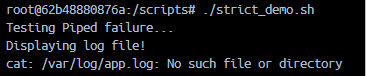

<b>The Reason</b>: Standard Bash only looks at the last command in a pipeline. Because echo "Displaying Log File!" succeeded, standard Bash would normally consider the whole line a success. The -o pipefail option forces Bash to look at the whole pipe; if any command in the pipeline fails, the whole line fails, triggers -e, and terminates the script.

### Learnings

- `-e` exits on command failure. Script execution stops immediately when a command fails.
- `-u` catches undefined variables.
- `-o pipefail` catches failures inside pipelines. Pipeline failures can be hidden. `pipefail` makes scripts safer and easier to debug.

---

## 4. Local vs Global Variables

### Bash local_demo.sh

```bash
vim local_demo.sh
```

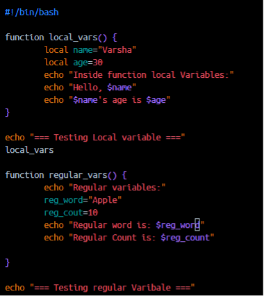


```bash
chmod 744 local_demo.sh
./local_demo.sh
```

### Output

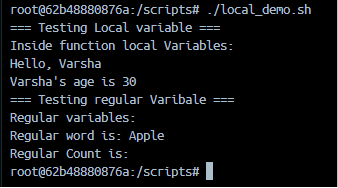

### Learnings

| Local Variables | Global Variables |
|----------------|------------------|
| Available only inside function | Available throughout script |
| Created using `local` | Created normally |
| Safer for large scripts | Can be modified anywhere |

---

## 5. System Information Report Script

### Features

- Hostname Information
- OS Details
- System Uptime
- Disk Usage
- Memory Usage
- Top CPU Processes

#### Commands:
-	print hostname: `cat /etc/os-release`
-	print uptime: `uptime`
-	print disk usage (top 5 by size): `df -h | awk 'NR==1; NR>1 {print $0 | "sort -hr -k 2"}' | head -n 6`
-	print top 5 CPU-consuming processes: `ps -eo pid,ppid,cmd,%cpu,%mem --sort=-%cpu | head -n 6`
-	print memory usage: `free -h`

### Bash system_info.sh

```bash
vim system_info.sh
```

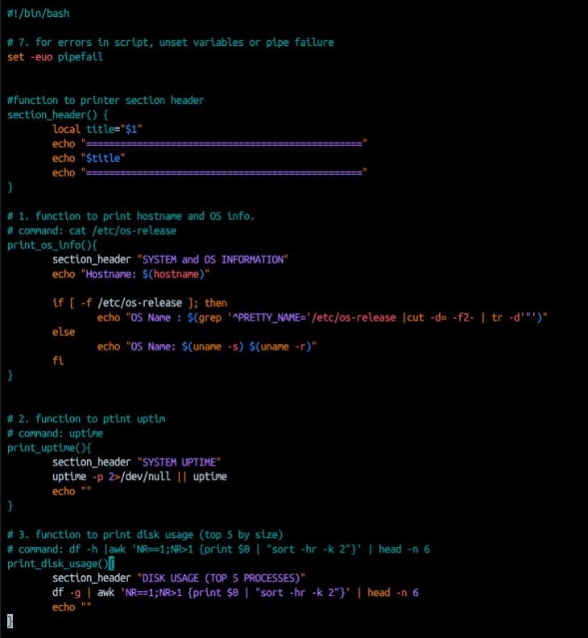
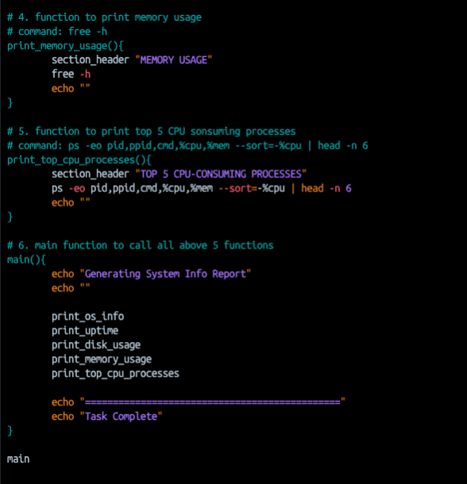

### Output

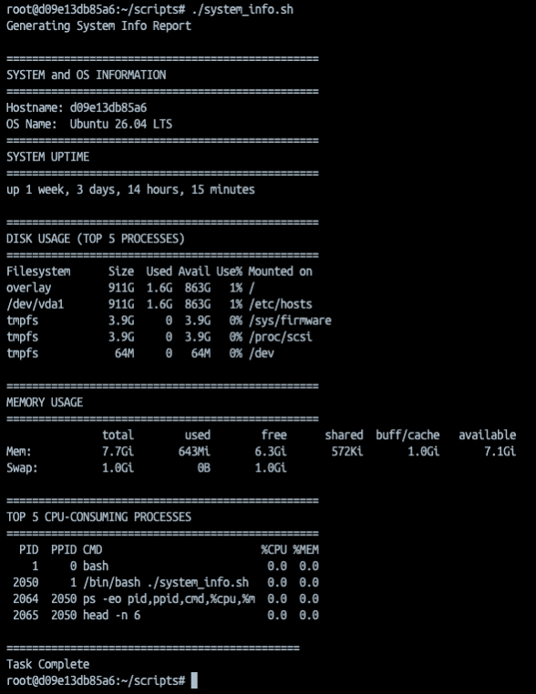


---

## Key Takeaways

### Functions

- Improve code reusability.
- Make scripts modular and maintainable.

### Strict Mode

```bash
set -euo pipefail
```

Recommended for production Bash scripts because it:

- Stops on errors.
- Prevents undefined variables.
- Detects pipeline failures.

### Commands Practiced

| Command | Purpose |
|----------|---------|
| `df -h` | Disk usage |
| `free -h` | Memory usage |
| `uptime -p` | System uptime |
| `hostname` | Hostname information |
| `ps` | Process monitoring |

---

## Summary

Today I practiced writing modular Bash scripts using functions, understood variable scope, explored strict mode for safer scripting, and built a system information reporting script to monitor system resources.