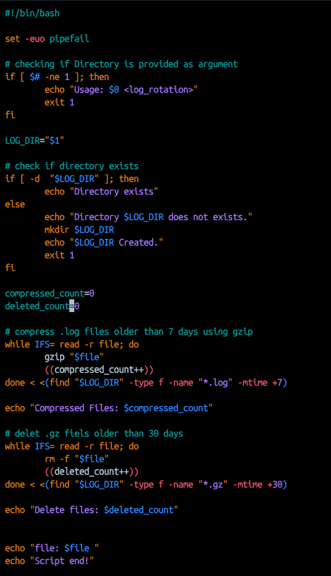
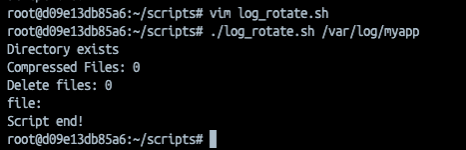
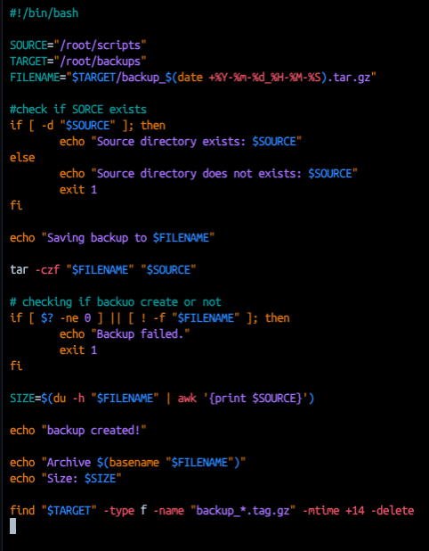
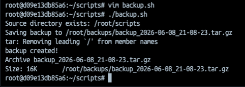
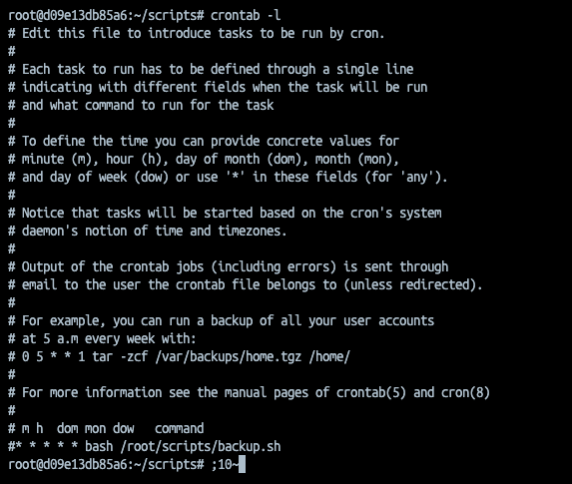
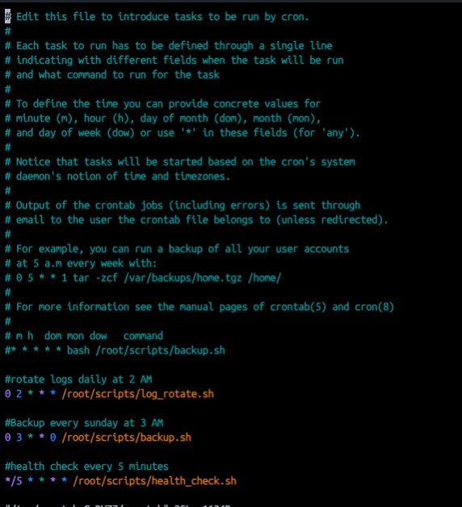
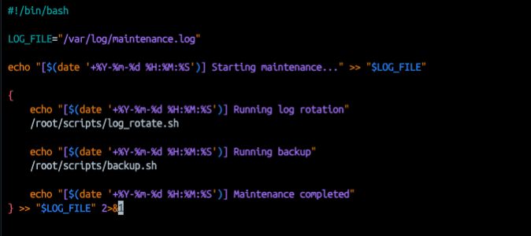

# Day 19 – Shell Scripting Project: Log Rotation, Backup & Crontab

## Overview
Today I learned how to automate Linux administration tasks using Bash scripts and Cron jobs. I created scripts for log rotation, backups, health monitoring, and scheduled maintenance.

# Task 1: Log Rotation Script

#### `log_rotate.sh`

```bash
#!/bin/bash

set -euo pipefail

# Check if directory argument is provided
if [ $# -ne 1 ]; then
    echo "Usage: $0 <log_directory>"
    exit 1
fi

LOG_DIR="$1"

# check if directory exists
if [ ! -d "$LOG_DIR" ]; then
    echo "Error: Directory '$LOG_DIR' does not exist."
    mkdir $LOGDIR
    echo "$LOGDIR created."
    exit 1
fi

compressed_count=0
deleted_count=0

# compress .log files older than 7 days using gzip
while IFS= read -r file; do
gzip "$file"
((compressed_count++))
done < <(find "$LOG_DIR" -type f -name "*.log" -mtime +7)

echo "Compressed Files: $compressed_count"

# delet .gz fiels older than 30 days
while IFS= read -r file; do
rm -f "$file"
((deleted_count++))
done < <(find "$LOG_DIR" -type f -name "*.gz" -mtime +30)

echo "Delete files: $deleted_count"


echo "file: $file "
echo "Script end!"
```

## How it works
### 1. Check for argument
```bash
if [ $# -ne 1 ]; then
```
- $# contains the number of command-line arguments.
- The script expects exactly one argument: the log directory.
- If not provided, it prints usage instructions and exits.
Eg;

```bash
./log_rotate.sh /var/log/myapp
```
### 2. Verify directory exists
```bash
if [ ! -d "$LOG_DIR" ]; then
```

- `-d` checks whether the path is an existing directory.
- If the directory doesn't exist, the script prints an error and exits with a non-zero status.

Example output:
```bash
Error: Directory '/var/log/myapp' does not exist.
```

### 3. Compress old .log files
```bash
find "$LOG_DIR" -type f -name "*.log" -mtime +7
```

This finds:

- -type f → regular files only
- -name "*.log" → files ending in .log
- -mtime +7 → modified more than 7 days ago

For each file found:

```bash
gzip "$file"
```

- Compresses the file.
- Replaces app.log with app.log.gz

### 4. Delete old compressed files

```bash
find "$LOG_DIR" -type f -name "*.gz" -mtime +30
```

This finds compressed log files older than 30 days.

Each file is removed:
```bash
rm -f "$file"
```

### 5. Reading file names safely
- `IFS`= prevents word splitting
- `-r` preserves backslashes

Process Substitution
`done < <(find ...)`

Feeds command output directly into a loop without creating a subshell.

#### Run `log_rotate.sh`

```bash
vim log_rotate.sh
```



```bash
./log_rotate.sh /var/log/myapp
```




# Task 2: Server Backup Script

### `backup.sh`

```bash
#!/bin/bash

SOURCE="/root/scripts"
TARGET="/root/backups"
FILENAME="$TARGET/backup_$(date +%Y-%m-%d_%H-%M-%S).tar.gz"

#check if SORCE exists
if [ -d "$SOURCE" ]; then
echo "Source directory exists: $SOURCE"
else
echo "Source directory does not exists: $SOURCE"
exit 1
fi

echo "Saving backup to $FILENAME"

tar -czf "$FILENAME" "$SOURCE"

# checking if backuo create or not
if [ $? -ne 0 ] || [ ! -f "$FILENAME" ]; then
echo "Backup failed."
exit 1
fi

SIZE=$(du -h "$FILENAME" | awk '{print $SOURCE}')

echo "backup created!"

echo "Archive $(basename "$FILENAME")"
echo "Size: $SIZE"

find "$TARGET" -type f -name "backup_*.tag.gz" -mtime +14 -delete
```

## How it works
### 1. Check if source exists

```bash
if [ -d "$SOURCE" ]; then
    echo "Source directory exists: $SOURCE"
else
    echo "Source directory does not exists: $SOURCE"
    exit 1
fi
```

`-d` checks whether the path is an existing directory.

If `/root/scripts` doesn't exist:

### 2. Display archive path

```bash
echo "Saving backup to $FILENAME"
```
output 
`Saving backup to /root/backups/backup_2026-06-08_19-10-30.tar.gz`

### 3. Create the backup

```bash
tar -czf "$FILENAME" "$SOURCE"
```
Options:

- -c → create archive
- -z → compress with gzip
- -f → use the specified filename

this creates backup:
`backup_2026-06-08_19-10-30.tar.gz`

containing the contents of `/root/scripts`.

### 4. Verify backup creation

```bash
if [ $? -ne 0 ] || [ ! -f "$FILENAME" ]; then
    echo "Backup failed."
    exit 1
fi
```

First condition
```bash
$?
```

contains the exit status of the previous command (tar).

- 0 = success
- non-zero = failure


Second condition
```bash
[ ! -f "$FILENAME" ]
```
checks that the archive file actually exists.

If either check fails:
```text
Backup failed
```
and the script exits.

### 5. Get archive size

```bash
SIZE=$(du -h "$FILENAME" | awk '{print $SOURCE}')
```

### 6. delete old backup

```bash
find "$TARGET" -type f -name "backup_*.tar.gz" -mtime +14 -delete
```

Meaning
- `-type f` → regular files
- `-name "backup_*.tar.gz"` → backup archives
- `-mtime +14` → older than 14 days
- `-delete` → remove them


#### Run `backup.sh`

```bash
vim backup.sh
```



```bash
./backup.sh
```



# Task 3: Crontab
to see current cron jobs:

```bash
crontab -l
```


### Cron Format
```text
* * * * * command
│ │ │ │ │
│ │ │ │ └── Day of week (0-7)
│ │ │ └──── Month (1-12)
│ │ └────── Day of month (1-31)
│ └──────── Hour (0-23)
└────────── Minute (0-59)
```

### 1. Run log_rotate.sh every day at 2 AM

```bash
0 2 * * * /root/scripts/log_rotate.sh
```

### 2. Run backup.sh every Sunday at 3:00 AM

```bash
0 3 * * 0 /root/scripts/backup.sh
```

### 3. Run a health check script every 5 minutes

```bash
*/5 * * * * /root/scripts/health_check.sh
```

to edit cron jobs:

```bash
crontab -e
```



##### Remove all cron jobs

```bash
crontab -r
```

# Task 4: Combine — Scheduled Maintenance Script

Since we have `log_rotate.sh` and `backup.sh` so we will create `maintenance.sh` file:

```bash
vim maintenance.sh
```



#### Run `maintenance.sh`:

```bash
./maintenance.sh

#see log
cat /var/log/maintenance.log
```

---

## Key Bash Concepts Learned
Variables
```text
NAME="value"
```
Command Substitution
```text
$(command)
```

File Tests
- `-d` directory exists
- `-f` file exists

Useful Commands
`tar`
`gzip`
`find`
`awk`
`du`
`curl`
`crontab`
`chmod`

#### Outcome
Today I built a small Linux automation toolkit using Bash scripting and Cron jobs.

Skills practiced:

- Bash scripting
- File handling
- Compression and archiving
- Log management
- Backup automation
- Health monitoring
- Cron scheduling
- Error handling
- Linux system administration basics

These tasks introduced real-world Linux administration concepts including automation, monitoring, backup management, log management, cron scheduling, and Bash scripting best practices.

