# Day 20 – Bash Scripting Challenge: Log Analyzer and Report Generator

## Task 1. Daily Log Analysis Solution

This document outlines the approach taken to automate daily server log analysis. The provided `log_analyzer.sh` script parses server logs, checks for critical issues, and generates a formatted report.

### Approach & Logic

1. **Input Validation:** The script first checks if an argument was passed and verifies that the file actually exists. If either condition fails, it outputs a descriptive error message and exits with a non-zero status code (`1`).
2. **Dynamic Report Naming:** Using standard Linux utilities (`date`), the script auto-names the output file to include the exact date (`log_report_<date>.txt`), ensuring previous daily reports are not overwritten.
3. **Log Aggregation & Counting:** It efficiently uses `wc -l` to count total log lines and `grep -ci` to perform case-insensitive counting of "ERROR" and "CRITICAL" keywords.
4. **Sample Display:** To provide actionable insights instantly, the script isolates the top 5 error or critical log entries and embeds them directly into the report using `grep -i -E` piped to `head -n 5`. 

### How to Run the Script
1. Make `logfile.log` in `/var/log/syslog/` as log files will be created inside `/var/log/syslog/`.
    ```bash
    mkdir -p /var/log/syslog/
    cd /var/log/syslog/
    vim logfile.log
    ```

2. Make the script executable by running:
   ```bash
   chmod +x log_analyzer.sh
   ```

3. Execute the script by passing your log file as an argument:
   ```bash
   ./log_analyzer.sh /var/log/syslog/logfile.txt
   ```

#### Expected Outputs
* A daily summary file saved as `log_report_<date_time>.txt`.

4. Check in `/var/log/syslog/` `log_report_<date_time>.txt` is created.
    ```bash
    cat /var/log/syslog/log_report_<date_time>.txt
    ```
    or
    
    ```bash
    ls /var/log/syslog/
    vim logfile.log
    ```

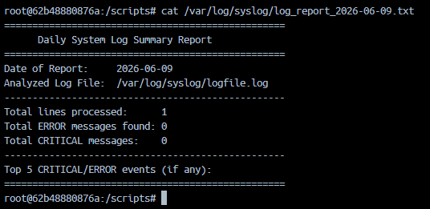
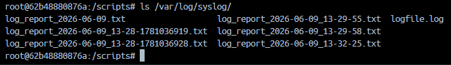


## Task 2. Error Count

1. Edit logfile.log to add error or failed text

    ```bash
    vim /var/log/syslog/logfile.log
    ```

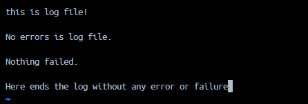

2. Execute the script by passing your log file as an argument:
   ```bash
   ./log_analyzer.sh /var/log/syslog/logfile.txt
   ```

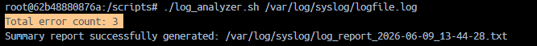

 ```bash
   cat /var/log/syslog/log_report_2026-06-09_13-44-28.txt
   ```
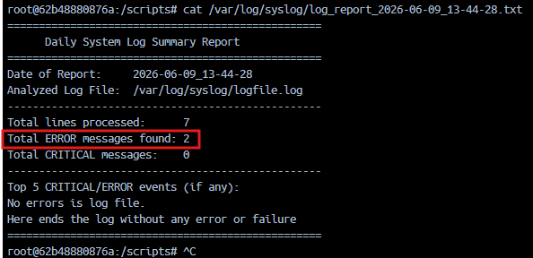

## Task 3. Critical Events

1. Edit logfile.log to add error or failed text

    ```bash
    vim /var/log/syslog/logfile.log
    ```

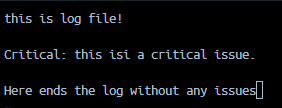


2. Execute the script by passing your log file as an argument:
   ```bash
   ./log_analyzer.sh /var/log/syslog/logfile.txt
   ```

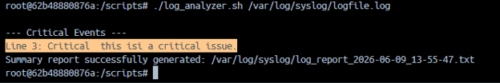

 ```bash
   cat /var/log/syslog/log_report_2026-06-09_13-55-47.txt
   ```

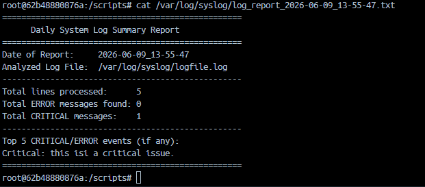

## Task 4: Top Error Messages
 **Top 5 Error Analysis (Task 4):** 
   * It extracts entries containing "ERROR".
   * A `sed` regex pattern strips leading numbers, timestamps (e.g., `YYYY-MM-DD HH:MM:SS`), and bracketed tags so identical error messages can be grouped effectively regardless of when they occurred.
   * It pipes the cleaned messages into `sort` and `uniq -c` to generate occurrence counts.
   * `sort -rn` arranges them in descending numeric order, and `head -n 5` caps the list.

1. Edit logfile.log to add error or failed text

    ```bash
    vim /var/log/syslog/logfile.log
    ```

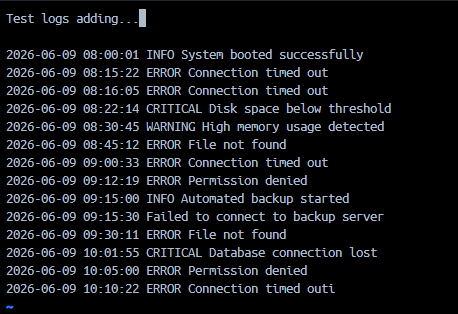


2. Execute the script by passing your log file as an argument:
   ```bash
   ./log_analyzer.sh /var/log/syslog/logfile.txt
   ```

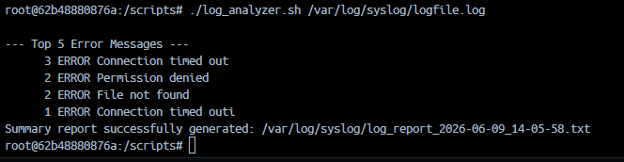


## Task 5: Summary Report
We are already creating the report in above tasks

Execute and see the report.

   ```bash
   cat /var/log/syslog/log_report_2026-06-09_14-12-54.txt
   ```

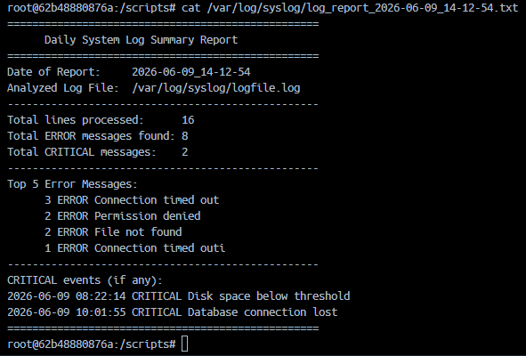

# Task 6: archive processed logs
1. add code in `log_analyzer.sh`:
    ```bash
    if [ ! -d "$ARCHIVE_DIR" ]; then
        mkdir -p "$ARCHIVE_DIR"
    fi

    # Move the processed file and print a confirmation message
    mv "$LOG_FILE" "$ARCHIVE_DIR/"
    echo "Processed log file successfully $LOG_FILE moved to '$ARCHIVE_DIR/'"
    ```
2. execute the script:
    ```bash
    ./log_analyzer.sh /var/log/syslog/log_report_2026-06-09_14-05-58.txt
    ```
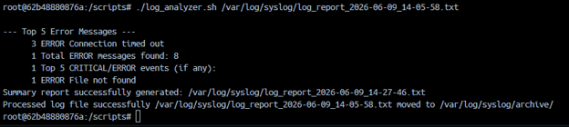


## Commands & Controls I learned

- `exit 1` : Immediately stops the script and tells the system that something went wrong (an error occurred).
- `>&2`: Sends the text to the system's "Error Channel" (`stderr`) instead of the normal screen output. This is ideal for warning messages
- `$1`: Represents the very first text file path you typed after the script name when running it.
- `date`: Grabs the current time and day from your server. 
    *   `+%Y-%m-%d_%H-%M-%S`: Formats the date cleanly into Year-Month-Day_Hour-Minute-Second.
- `wc -l`: Stands for "Word Count - Lines." It counts exactly how many total lines are inside your log file and The `<` symbol feeds the log file directly into the command
- `mkdir -p`: Make Directory. It creates your archive folder.
    *   The `-p` flag acts as a safety switch—if the folder already exists, it ignores it and doesn't crash the script
- `mv`: for Move
- `>`: A redirection tool. It acts like a funnel, taking all the report text created inside the `{` `}` brackets and dumping it directly into your new report file. Eg. `{ add_report_content } > "$REPORT_FILE"`.
- `grep`: The scanner tool. It searches your file for specific words.
    *   `-c`: Instead of showing the text lines, it only outputs the total count of how many times the word appeared.
    *   `-i`: Stands for "ignore case." It makes sure it finds `ERROR`, `error`, or `Error`.
    *   `-n`: Displays the exact line number where the keyword was found inside the log file.
    *   `-E`: Stands for "Extended Regex." It allows you to use the `|` symbol as an "OR" statement to match multiple words at once (like `"error|failed"`).
- `sed`: The eraser tool. It cleans up your lines using a custom pattern. In your script, it automatically strips away the dates, timestamps, and brackets from the front of the error messages so they look clean
- `sort`: Organizes your lines. When used alone, it groups identical lines together (alphabetically) so uniq can count them
    * `-n`: Sorts lines by their numerical values.
    * `-r`: Reverses the order so that the biggest numbers (highest errors) appear at the very top
- `uniq -c`: Filters out duplicates. The `-c` flag counts how many times each unique error message repeated itself
- `head -n 5`: The limiter. It chops off the rest of the list and only displays the top 5 lines, leaving you with just the most critical information

## Key Takeaways

*   **Mastering Text Processing Pipelines**: 
    *   Chaining commands together using pipes (`|`) allows you to transform raw data streams efficiently.
    *   Combining `grep`, `sort`, `uniq -c`, and `sort -rn` provides a lightweight but highly powerful method to instantly extract actionable analytics from thousands of text lines without needing external database engines.
*   **Log Normalization via Filtering**: 
    *   Raw log outputs are messy because timestamps change on every line, preventing tools like `uniq` from grouping identical issues.
    *   Using text manipulators like `sed` to strip dynamic datestamps or `awk` to isolate specific column boundaries normalizes your strings, turning chaotic log noise into clean, groupable error definitions.
*   **Building Bulletproof Automation Pipelines**: 
    *   Writing an effective DevOps automation script requires thinking defensively by adding robust input validation flags like `if [ ! -f "$LOG_FILE" ]`.
    *   Handling edge cases smoothly—such as ensuring directory creation tasks use safety switches like `mkdir -p`—prevents automated production cron jobs from crashing or throwing false alarm errors down the road.

