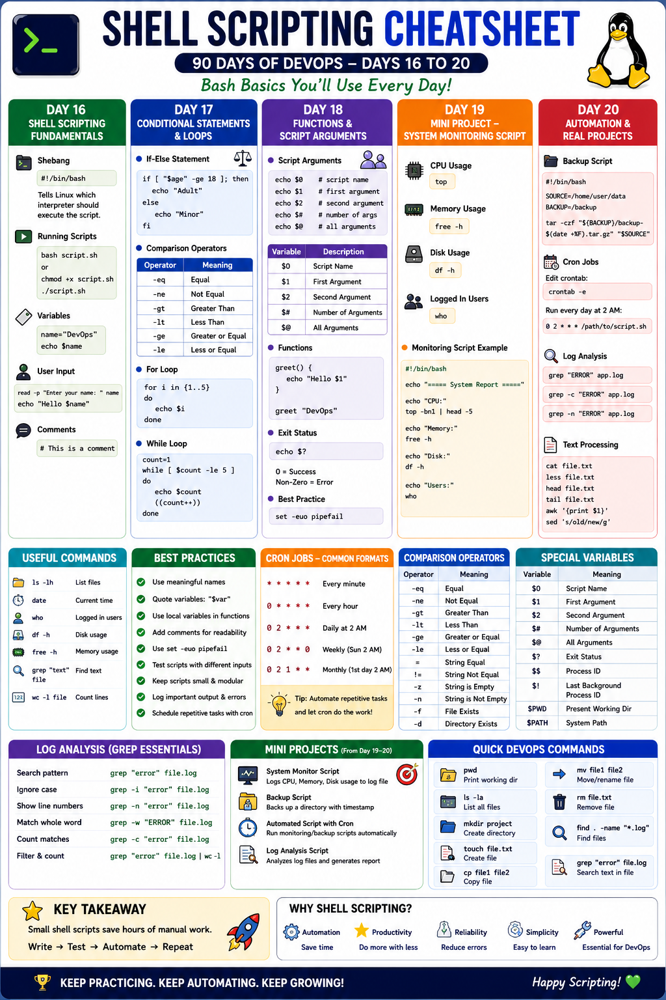

# Day 21 - Shell Scripting Cheatsheet

Over the last five days, I learned the fundamentals of shell scripting in Bash. I practiced variables, user input, arguments, conditionals, loops, functions, error handling, file handling, cron jobs, backup automation, and log analysis.

This cheatsheet summarizes what I learned from **Day 16 to Day 20** of my 90 Days of DevOps journey.



---
### What I Learned From Day 16 to Day 20

#### Day 16: Shell Scripting Fundamentals

- Basics of shell scripting
- Creating and running scripts
- Variables
- User input
- Conditional statements

#### Day 17: Loops, Arguments and Error Handling

- For loops
- While loops
- Script arguments
- Exit codes
- Error handling
- Strict mode (set -euo pipefail)

#### Day 18: Functions and Intermediate Concepts

- More scripting practice
- Functions
- Local vs global variables
- File and directory checks
- Service status checks
- Package installation automation
- Script modularization

#### Day 19: Mini Project - Backup Automation, Log Rotation and Cron Jobs

- Built shell scripting projects
- Created backup automation
- Practiced cron scheduling
- Improved script structure

#### Day 20: Automation & Real Projects - Log Analysis and Report Generation

- Built a log analyzer
- Counted errors and warnings
- Generated reports
- Practiced real DevOps-style automation

---

## 1. Basic Shell Script Structure

```bash
#!/bin/bash

echo "Hello, DevOps!"
```

### Run a Script

```bash
chmod +x script.sh
./script.sh
```

### Common Permission Commands

```bash
chmod 744 script.sh
chmod 740 script.sh
chmod +x script.sh
```

---

## 2. Variables

```bash
NAME="Varsha"
echo "Hello, $NAME"
```

### Single Quotes vs Double Quotes

```bash
NAME="DevOps"

echo "Hello $NAME"   # Expands variable
echo 'Hello $NAME'   # Prints text exactly as written
```

**Rule:**

- Double quotes allow variable expansion.
- Single quotes treat variables as plain text.

---

## 3. User Input

```bash
#!/bin/bash

read -p "Enter your name: " NAME
echo "Hello, $NAME"
```

Use `read` when the script needs input from the user.

---

## 4. Conditional Statements

```bash
#!/bin/bash

read -p "Enter a number: " NUM

if [ "$NUM" -gt 0 ]; then
    echo "Positive number"
elif [ "$NUM" -lt 0 ]; then
    echo "Negative number"
else
    echo "Zero"
fi
```

### Numeric Comparison Operators

| Operator | Meaning |
|---|---|
| `-lt` | Less than |
| `-le` | Less than or equal to |
| `-gt` | Greater than |
| `-ge` | Greater than or equal to |
| `-eq` | Equal to |
| `-ne` | Not equal to |

---

## 5. File and Directory Checks

```bash
FILE="/tmp/test.txt"
DIR="/var/log"

if [ -f "$FILE" ]; then
    echo "File exists"
fi

if [ -d "$DIR" ]; then
    echo "Directory exists"
fi

if [ -e "$FILE" ]; then
    echo "Path exists"
fi
```

### File Test Operators

| Operator | Meaning |
|---|---|
| `-f` | Regular file exists |
| `-d` | Directory exists |
| `-e` | Path exists |

---

## 6. Service Status Check

```bash
#!/bin/bash

SERVICE="nginx"

if systemctl is-active --quiet "$SERVICE"; then
    echo "$SERVICE is running"
else
    echo "$SERVICE is not running"
fi
```

Useful commands:

```bash
systemctl status nginx
systemctl is-active nginx
```

---

## 7. For Loops

### Loop Through a List

```bash
for fruit in apple banana mango; do
    echo "$fruit"
done
```

### Loop Through Numbers

```bash
for i in {1..10}; do
    echo "$i"
done
```

---

## 8. While Loops

```bash
COUNT=5

while [ "$COUNT" -gt 0 ]; do
    echo "$COUNT"
    ((COUNT--))
done
```

Use `while` when the loop should continue until a condition becomes false.

---

## 9. Command-Line Arguments

```bash
#!/bin/bash

echo "Script name: $0"
echo "First argument: $1"
echo "Second argument: $2"
echo "Total arguments: $#"
echo "All arguments: $@"
```

### Argument Variables

| Variable | Meaning |
|---|---|
| `$0` | Script name |
| `$1` | First argument |
| `$2` | Second argument |
| `$#` | Number of arguments |
| `$@` | All arguments |
| `$?` | Exit status of previous command |

---

## 10. Root User Validation

```bash
if [ "$EUID" -ne 0 ]; then
    echo "Please run as root"
    exit 1
fi
```

Use this when a script installs packages or modifies system files.

---

## 11. Package Installation Script

```bash
#!/bin/bash
set -e

PACKAGES=(nginx git curl)

for package in "${PACKAGES[@]}"; do
    if dpkg -s "$package" >/dev/null 2>&1; then
        echo "$package is already installed"
    else
        echo "Installing $package"
        apt install -y "$package"
    fi
done
```

---

## 12. Error Handling

### Exit on Failure

```bash
set -e
```

Stops the script when a command fails.

### Strict Mode

```bash
set -euo pipefail
```

| Option | Meaning |
|---|---|
| `set -e` | Exit when a command fails |
| `set -u` | Error on undefined variables |
| `set -o pipefail` | Fail if any command in a pipeline fails |

Recommended for safer production scripts:

```bash
#!/bin/bash
set -euo pipefail
```

---

## 13. Functions

```bash
#!/bin/bash

say_hello() {
    echo "Hello, $1"
}

say_hello "DevOps"
```

### Main Function Pattern

```bash
main() {
    echo "Starting script"
}

main "$@"
```

Functions make scripts cleaner, reusable, and easier to maintain.

---

## 14. Local vs Global Variables

```bash
NAME="global"

show_name() {
    local NAME="local"
    echo "$NAME"
}

show_name
echo "$NAME"
```

| Local Variable | Global Variable |
|---|---|
| Available only inside a function | Available throughout the script |
| Created using `local` | Created normally |
| Safer for large scripts | Can be changed from anywhere |

---

## 15. System Monitoring Commands

```bash
hostname
cat /etc/os-release
uptime
uptime -p
df -h
free -h
ps -eo pid,ppid,cmd,%cpu,%mem --sort=-%cpu | head -n 6
```

### System Info Script Example

```bash
#!/bin/bash
set -euo pipefail

show_disk() {
    df -h
}

show_memory() {
    free -h
}

show_processes() {
    ps -eo pid,ppid,cmd,%cpu,%mem --sort=-%cpu | head -n 6
}

main() {
    echo "Hostname: $(hostname)"
    echo "Uptime: $(uptime -p)"
    show_disk
    show_memory
    show_processes
}

main "$@"
```

---

## 16. Find Command

```bash
find /var/log -type f -name "*.log"
find /var/log -type f -name "*.log" -mtime +7
find /root/backups -type f -name "backup_*.tar.gz" -mtime +14 -delete
```

| Option | Meaning |
|---|---|
| `-type f` | Regular files only |
| `-name` | Match filename pattern |
| `-mtime +7` | Modified more than 7 days ago |
| `-delete` | Delete matched files |

---

## 17. Log Rotation

```bash
#!/bin/bash
set -euo pipefail

LOG_DIR="$1"

if [ ! -d "$LOG_DIR" ]; then
    echo "Directory does not exist: $LOG_DIR" >&2
    exit 1
fi

find "$LOG_DIR" -type f -name "*.log" -mtime +7 -exec gzip {} \;
find "$LOG_DIR" -type f -name "*.gz" -mtime +30 -delete

echo "Log rotation completed"
```

### Safer Loop for File Names

```bash
while IFS= read -r file; do
    gzip "$file"
done < <(find "$LOG_DIR" -type f -name "*.log" -mtime +7)
```

Why this is safer:

- `IFS=` prevents unwanted word splitting.
- `read -r` preserves backslashes.
- Process substitution feeds `find` output into the loop.

---

## 18. Backup Script

```bash
#!/bin/bash
set -euo pipefail

SOURCE="/root/scripts"
TARGET="/root/backups"
FILENAME="$TARGET/backup_$(date +%Y-%m-%d_%H-%M-%S).tar.gz"

mkdir -p "$TARGET"

if [ ! -d "$SOURCE" ]; then
    echo "Source directory does not exist: $SOURCE" >&2
    exit 1
fi

tar -czf "$FILENAME" "$SOURCE"

if [ ! -f "$FILENAME" ]; then
    echo "Backup failed" >&2
    exit 1
fi

SIZE=$(du -h "$FILENAME" | awk '{print $1}')
echo "Backup created: $(basename "$FILENAME")"
echo "Size: $SIZE"

find "$TARGET" -type f -name "backup_*.tar.gz" -mtime +14 -delete
```

### Tar Options

| Option | Meaning |
|---|---|
| `-c` | Create archive |
| `-z` | Compress with gzip |
| `-f` | Use filename |

---

## 19. Cron Jobs

### View Cron Jobs

```bash
crontab -l
```

### Edit Cron Jobs

```bash
crontab -e
```

### Remove All Cron Jobs

```bash
crontab -r
```

Run a script every day at midnight:

```bash
0 0 * * * /home/user/backup.sh
```

Run a script every hour:

```bash
0 * * * * /home/user/log_analyzer.sh
```

### Cron Format

```text
* * * * * command
│ │ │ │ │
│ │ │ │ └── Day of week: 0-7
│ │ │ └──── Month: 1-12
│ │ └────── Day of month: 1-31
│ └──────── Hour: 0-23
└────────── Minute: 0-59
```

### Examples

```bash
# Run every day at 2 AM
0 2 * * * /root/scripts/log_rotate.sh /var/log/myapp

# Run every Sunday at 3 AM
0 3 * * 0 /root/scripts/backup.sh

# Run every 5 minutes
*/5 * * * * /root/scripts/health_check.sh
```

---

## 20. Log Analyzer Script Concepts

### Input Validation

```bash
if [ $# -ne 1 ]; then
    echo "Usage: $0 <log-file>" >&2
    exit 1
fi

LOG_FILE="$1"

if [ ! -f "$LOG_FILE" ]; then
    echo "Log file not found: $LOG_FILE" >&2
    exit 1
fi
```

### Dynamic Report File

```bash
REPORT_FILE="log_report_$(date +%Y-%m-%d_%H-%M-%S).txt"
```

### Count Log Lines

```bash
TOTAL_LINES=$(wc -l < "$LOG_FILE")
```

### Count Errors and Critical Events

```bash
ERROR_COUNT=$(grep -ci "error" "$LOG_FILE" || true)
CRITICAL_COUNT=$(grep -ci "critical" "$LOG_FILE" || true)
```

### Extract Top 5 Error/Critical Lines

```bash
grep -i -E "error|critical" "$LOG_FILE" | head -n 5
```

### Group Top Error Messages

```bash
grep -i "error" "$LOG_FILE" \
  | sed -E 's/^[0-9-]+ [0-9:]+ //' \
  | sort \
  | uniq -c \
  | sort -rn \
  | head -n 5
```

---

## 21. Redirection and stderr

### Redirect Output to File

```bash
echo "Report content" > report.txt
```

### Append Output to File

```bash
echo "More content" >> report.txt
```

### Send Error Message to stderr

```bash
echo "Something went wrong" >&2
```

Use `stderr` for warnings and errors.

---

## 22. Useful Text Processing Commands

### grep

```bash
grep "ERROR" file.log
grep -i "error" file.log
grep -c "ERROR" file.log
grep -n "ERROR" file.log
grep -E "error|failed|critical" file.log
```

| Option | Meaning |
|---|---|
| `-i` | Ignore case |
| `-c` | Count matches |
| `-n` | Show line numbers |
| `-E` | Use extended regex |

### sed

```bash
sed 's/error/ERROR/g' file.log
```

Used for replacing, cleaning, and normalizing text.

### awk

```bash
awk '{print $1}' file.txt
```

Used for extracting columns and processing structured text.

### sort and uniq

```bash
sort file.txt
sort file.txt | uniq -c
sort file.txt | uniq -c | sort -rn
```

Used to group repeated lines and count occurrences.

### head

```bash
head -n 5 file.txt
```

Shows the first 5 lines.

---

## 23. Archive Processed Logs

```bash
ARCHIVE_DIR="/var/log/archive"

mkdir -p "$ARCHIVE_DIR"
mv "$LOG_FILE" "$ARCHIVE_DIR/"

echo "Processed log moved to $ARCHIVE_DIR"
```

---

## 24. Practical DevOps Scripts I Practiced

| Script | Purpose |
|---|---|
| `hello.sh` | First shell script |
| `variables.sh` | Practice variables |
| `greet.sh` | Accept user input or arguments |
| `check_number.sh` | Practice numeric conditions |
| `file_check.sh` | Check file or directory existence |
| `server_check.sh` | Check service status |
| `for_loop.sh` | Practice for loops |
| `countdown.sh` | Practice while loops |
| `install_packages.sh` | Automate package installation |
| `safe_script.sh` | Practice error handling |
| `functions.sh` | Practice Bash functions |
| `system_info.sh` | Generate system report |
| `log_rotate.sh` | Compress and delete old logs |
| `backup.sh` | Create timestamped backups |
| `maintenance.sh` | Combine scheduled maintenance tasks |
| `log_analyzer.sh` | Analyze logs and generate reports |

---

## 25. Best Practices I Learned

- Always start scripts with a shebang: `#!/bin/bash`.
- Use `chmod +x script.sh` before running scripts directly.
- Quote variables: `"$VAR"`.
- Validate input arguments before using them.
- Use `exit 1` when a script fails.
- Send errors to `stderr` using `>&2`.
- Use `set -euo pipefail` for safer scripts.
- Use functions to organize repeated logic.
- Use `local` variables inside functions.
- Use `mkdir -p` when creating directories safely.
- Use `find` for file cleanup and automation.
- Use `cron` to schedule recurring tasks.
- Use `grep`, `sed`, `awk`, `sort`, and `uniq` for log analysis.
- Test scripts manually before scheduling them in cron.
- Keep backups and log rotation scripts simple, readable, and safe.

---

## 26. Common Mistakes to Avoid

- Forgetting to make the script executable.
- Not quoting variables.
- Using undefined variables without `set -u`.
- Ignoring failed commands.
- Running package installation scripts without root permission.
- Hardcoding paths without checking if they exist.
- Deleting files with `find` before testing the command.
- Scheduling cron jobs without using absolute script paths.
- Not redirecting error messages to `stderr`.
- Not validating log file input before processing.

---

## Final Summary

From Day 16 to Day 20, I learned how to move from basic Bash scripts to practical DevOps automation. I practiced variables, input handling, conditionals, loops, arguments, functions, strict mode, system monitoring, backups, log rotation, cron jobs, and log analysis.

The biggest takeaway is that shell scripting is not just about writing commands. It is about writing safe, reusable, and reliable automation for real Linux administration tasks.

##### Topics Covered

- Shell scripting basics
- Variables and user input
- Conditional statements
- Loops
- Command-line arguments
- Functions
- Local vs global variables
- Strict mode and error handling
- File and directory checks
- Package installation automation
- System monitoring
- Log rotation
- Backup automation
- Cron scheduling
- Log analysis and report generation
- Text processing using `grep`, `sed`, `awk`, `sort`, and `uniq`

---
