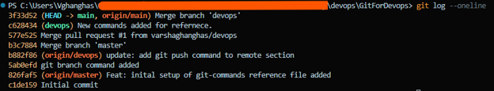

# Day 22 – Introduction to Git: Your First Repository

## What is git and why we use git?
**Git** is a distributed version control system (DVCS) that tracks changes in your files over time. It acts as a digital time machine for your project's codebase.

**Why Git Matters in DevOps**
Git is the foundation of modern DevOps for four critical reasons

- Single Source of Truth: Every piece of infrastructure, application code, and automation pipeline configuration lives in Git
- Traceability and Accountability: Every modification is tagged with a unique cryptographic hash, showing exactly who changed what, when, and why
- Risk Mitigation: If a deployment breaks a production environment, Git allows you to instantly roll back to the last known stable state
- Safe Collaboration: Features like branching allow multiple engineers to work on separate features simultaneously without overwriting each other's code

### Repository Created

For Day 22, I created my Git practice repository:

**GitForDevops:** 🔗 https://github.com/varshaghanghas/GitForDevops
**Command reference file:** https://github.com/varshaghanghas/90DaysOfDevOps/tree/master/2026/day-22/git-commands.md

---

### What I Learned

Today I learned the basic Git workflow:
### Git Configuration

Configure Git with username and email.

```bash
git config --global user.name "Varsha Ghanghas"
git config --global user.email "your-email@example.com"
```

### Initialize a Repository

Create a new Git repository.

```bash
git init
```

### Check Repository Status

View the current state of files in the repository.

```bash
git status
```

### Stage Changes

Add files to the staging area before committing.

```bash
git add git-commands.md
```

### Create Commits

Save staged changes to Git history.

```bash
git commit -m "feat: initial commit"
```

### View Changes and History

Check differences and commit history.

```bash
git diff
git log --oneline
```


## Git Branching

### Create and Switch to a New Branch

```bash
git checkout -b devops
```

Alternative command:

```bash
git switch -c devops
```

### List Branches

```bash
git branch
```

### Switch Between Branches

```bash
git switch main
```

---

## Working with Remote Repositories

### Push Changes to GitHub

```bash
git push origin main
```

### Push and Set Upstream Tracking

```bash
git push -u origin master
```

### Pull Changes from Remote Repository

```bash
git pull origin main
```

---

## Merging Branches

Merge changes from another branch into the current branch.

```bash
git merge master --allow-unrelated-histories
```

The `--allow-unrelated-histories` flag allows Git to merge branches that do not share a common commit history.

---

## Delete a Branch

Delete a local branch after it has been merged.

```bash
git branch -d master
```

---

## Git Workflow

```text
Working Directory
       │
       ▼
    git add
       │
       ▼
  Staging Area
       │
       ▼
   git commit
       │
       ▼
   Repository
```

---

## Commands Practiced

| Command | Description |
|----------|-------------|
| `git init` | Initialize a Git repository |
| `git status` | View repository status |
| `git add` | Stage changes |
| `git commit` | Save changes |
| `git diff` | View file differences |
| `git log --oneline` | View commit history |
| `git branch` | Manage branches |
| `git switch` | Switch branches |
| `git push` | Upload changes to GitHub |
| `git pull` | Download changes from GitHub |
| `git merge` | Merge branches |
| `git branch -d` | Delete a branch |

---

## Summary

On Day 22, I learned the basics of Git, including repository initialization, staging, committing, branching, merging, and working with remote repositories on GitHub. To practice these concepts, I created a dedicated repository called **GitForDevops** and explored commonly used Git commands that are essential for DevOps and software development workflows. I also learned how to work with branches, push changes to GitHub, pull remote changes, merge branches, and delete local branches safely.

