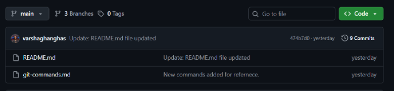
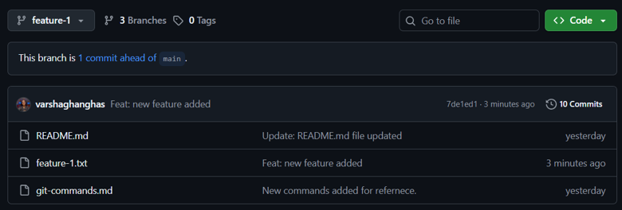
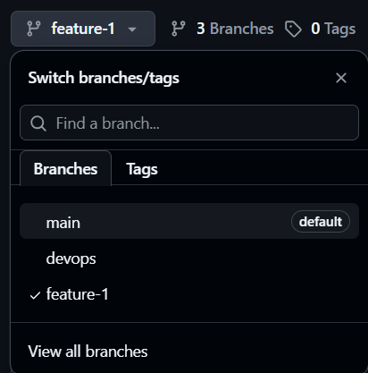

# Day 23 – Git Branching & Working with GitHub

## Reference Repository
For Day 22, I created my Git practice repository:

**GitForDevops:** 🔗 https://github.com/varshaghanghas/GitForDevops
**Command reference file:** https://github.com/varshaghanghas/GitForDevops/blob/main/git-commands.md

## TASK 1: Understanding Branches
**What is a branch in Git?**

A branch is an independent line of development in a Git repository. Think of it as a separate workspace where you can make changes without affecting other branches.

```text
main
|
A---B---C

feature-1
    \
    D---E
```

**Why do we use branches instead of committing everything to `main`?**
If everyone commits directly to `main`:

- Bugs can reach production
- Features may be incomplete
- Team collaboration becomes chaotic
- Rollbacks become harder

Branches allow:
- Feature development
- Bug fixes
- Experiments
- Code reviews through Pull Requests

without affecting the stable codebase

**What is HEAD in Git?**
`HEAD` is a pointer that tells Git where you currently are.
eg.
```text
HEAD -> main
```
means you're currently working on the main branch.

When you switch branch
```bash
git switch devops
```

Git moves `HEAD`:
```text
HEAD -> devops
```

**What happens to your files when you switch branches?**
When we switch as branch git changes your working directory to match the selected branch. For example on `main` branch we have `README.md` and on `devops` branch we have `README.md`, `hello.txt` and `new-feature.py`. When we switch from `main` to `devops` then `hello.txt` and `new-feature.py` files will be added to the repo and if we switch back to `main` then `hello.txt` and `new-feature.py` files will be removed from the repo as they only exists on `devops` branch.

---

### Task 2: Branching Commands — Hands-On
In your `devops-git-practice` repo, perform the following:
**1. List all branches in your repo**
Command to list all branch:
```bash
git branch
```

**2. Create a new branch called `feature-1`**
Command to create branch:
```bash
git branch feature-1
```
This will create branch `feature-1`.

**3. Switch to `feature-1`**
```bash
git switch feature-1
```

**4. Create a new branch and switch to it in a single command — call it `feature-2`**
```bash
git checkout -b feature-2
```
This will create branch `feature-2` and switch to `feature-2` branch at the same time.

**5. Try using `git switch` to move between branches — how is it different from `git checkout`?**
This command has exactly one job: managing which branch you are standing on. It cannot accidentally modify your files.
**`git switch`**
- Switch to an existing branch:
```bash
git switch feature-1
```
- Create and switch to a new branch:
```bash
git switch -c feature-2
```

**`git checkout`** 
We can call it **multitool** (Change branches, files, or commits). This is an older command that handles branch switching, but also modifies files and project history. Because it does so much, it is easier to accidentally overwrite your work if you type the wrong argument.
- Switch to an existing branch:
```bash
git checkout feature-1
```

- Create and switch to a new branch:
```bash
git checkout -b feature-new
```

- Discard local changes in a specific file (Dangerous!):
```bash
git checkout -- hello.txt
```

- Look at a specific past commit (Puts you in "detached HEAD" state):
```bash
git checkout a1b2c3d
```


**6. Make a commit on `feature-1` that does **not** exist on `main`**
Commands to commit on `feature-1`:
```bash
git switch feature-1
vim feature-1.txt
git add feature-1.txt
git commit -m "Feat: new feature added"
git push --set-upstream origin feature-1
```

main branch files:


feature-1 branch files:



**7. Switch back to `main` — verify that the commit from `feature-1` is not there**
Above snapshots shows the changes done in `feature-1` are not in `main` branch.

**8. Delete a branch you no longer need**
- First swicth away from `feature-2` branch as we are deleting this branch:
```bash
git switch main
```

- Force delete vs careful delete:
    ```bash
    git branch -d feature-2
    git branch -D feature-2
    ```
    - Use `-d` force delete
    - Use `-D` carefully

**9. Add all branching commands to your `git-commands.md`**
**Done here GitForDevops:** 🔗 https://github.com/varshaghanghas/GitForDevops

---

### Task 3: Push to GitHub
**1. Create a **new repository** on GitHub (do NOT initialize it with a README)**
Create a repository on GitHub first:
    Goto your github account-> repositories-> click `New` -> add repository `Name` and `Description`, keep `Add README` `off` and click `Create Repository`.

**2. Connect your local `devops-git-practice` repo to the GitHub remote**
Connect it:
```bash
git remote add origin https://github.com/<username>/devops-git-practice.git
```

Verify:
```bash
git remote -v
```

**3. Push your `main` branch to GitHub**
Switch to `main` and push changes:
```bash
git switch main
git push orgin main
```

**4. Push `feature-1` branch to GitHub**
Switch to `feature-1` and push changes:
```bash
git switch feature-1
git push orgin feature-1
```

**5. Verify both branches are visible on GitHub**
Goto your github repository and click on branch 🌿:



**6. Answer in your notes: What is the difference between `origin` and `upstream`?**
***origin***: The repository you cloned from or your fork. eg: `Varsha's fork` (origin)

***upstream***: The original repository from which the fork was created. `TrainWithShubham/90DaysOfDevOps` (upstream repository).

```text
TrainWithShubham/90DaysOfDevOps
            ^
            |
         upstream

varshaghanghas/90DaysOfDevOps
            ^
            |
          origin
```
---

### Task 4: Pull from GitHub
1. Make a change to a file **directly on GitHub** (use the GitHub editor)
2. Pull that change to your local repo
3. Answer in your notes: What is the difference between `git fetch` and `git pull`?

### Commands used
```bash
git status
git pull origin main
git status
```

If your branch is not `main`, check your branch first:
```bash
git branch --show-current
```

Then pull using your branch name:
```bash
git pull origin main
```

#### Additional commands
- Merge feature-1 changes to main
```bash
git merge feature-1
```
- Push changes to remote
```bash
git push -u origin main
```

---

### Task 5: Clone vs Fork
1. **Clone** any public repository from GitHub to your local machine
- Clone a public repository
```bash
git clone https://github.com/TrainWithShubham/90DaysOfDevOps.git
```
This creates a local copy on your machine.

2. **Fork** the same repository on GitHub, then clone your fork
- Fork the repository: Forking is done on GitHub using the **Fork** button from this repository.
- my fork would be:
```text
https://github.com/varshaghanghas/90DaysOfDevOps
```
- Then clone your fork:
```bash
git clone https://github.com/varshaghanghas/90DaysOfDevOps.git
```

3. For notes:
- **What is the difference between clone and fork?**
    - A clone is a local copy of a repository on your computer.
    - A fork is your own copy of someone else's repository on GitHub.

- **When would you clone vs fork?**
    - Clone when you only want to download and work with a repository locally.
    - Fork when you want your own GitHub copy so you can make changes and later contribute back using a Pull Request.

- After forking, **how do you keep your fork in sync with the original repo?**
    - First, check remotes:
    ```bash
    git remote -v
    ```
    - Add the original repo as upstream:
    ```bash
    git remote add upstream https://github.com/TrainWithShubham/90DaysOfDevOps.git
    ```

    - Fetch latest changes from upstream:
    ```bash
    git fetch upstream
    ```

    - Switch to your main branch:
    ```bash
    git switch main
    ```

    - Merge upstream changes:
    ```bash
    git merge upstream/master
    ```

    - Push updated changes to your fork:
    ```bash
    git push origin main
    ```

    - If the original repo uses `master` instead of `main`, use:
    ```bash
    git merge upstream/master
    ```

    - If it uses `main`, use:
    ```bash
    git merge upstream/main
    ```
---

### Important Commands Cheat Sheet
```bash
git branch
git branch feature-1
git switch feature-1
git switch -c feature-2
git checkout -b feature-2
git branch -d feature-2
git remote -v
git push -u origin main
git push -u origin feature-1
```
---

## Takeaways:
- When you create a branch, it starts from the commit you're currently on
- `git switch` is the modern alternative to `git checkout` for switching branches
- To push a new branch: `git push -u origin <branch-name>`
- A fork is a GitHub concept, not a Git concept
