# Day 24 – Advanced Git: Merge, Rebase, Stash & Cherry Pick


## Reference Repository
For Day 24, Git practice repository:

**GitForDevops:** 🔗 https://github.com/varshaghanghas/GitForDevops
**Command reference file:** https://github.com/varshaghanghas/GitForDevops/blob/main/git-commands.md


## Task 1: Git Merge — Hands-On
1. Create a new branch `feature-login` from `main`, add a couple of commits to it
2. Switch back to `main` and merge `feature-login` into `main`
3. Observe the merge — did Git do a **fast-forward** merge or a **merge commit**?
4. Now create another branch `feature-signup`, add commits to it — but also add a commit to `main` before merging
5. Merge `feature-signup` into `main` — what happens this time?

**The Fast-Forward Merge**

```bash
# 1. Start on main and create a base file
git checkout main
echo "Base Code" > auth.txt
git add auth.txt && git commit -m "Initial commit"

# 2. Create and switch to feature-login
git checkout -b feature-login

# 3. Add two commits to the feature branch
echo "Login form code" > auth.txt
git add auth.txt && git commit -m "Add login UI"

echo "Login API Integration" >> auth.txt
git add auth.txt && git commit -m "Login API connected"

# 4. Switch back to main and merge
git checkout main
git merge feature-login
```

Result `git merge feature-login`: Here this will remove the text we added to `auth.txt` from `main` branch because we added text using `echo "Login form code" > auth.txt` as `>` is used to overwrite and `>>` is used to append the text. SO we will use `echo "Login Form UI" >> auth.txt` for **fast-forward**.

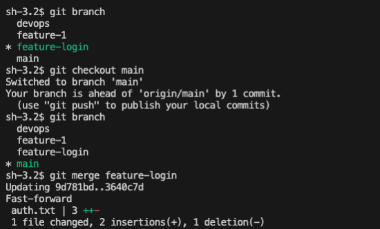

This output was **fast-forward**: 
- Why? The `main` branch did not move or change while you were working on `feature-login` but it changed when we `merge` `feature-login` in `main`.
- Result: Git didn't need to combine anything. It simply slid the `main` pointer forward to match the tip of `feature-login`.


**The Merge Commit (Three-Way Merge)**

```bash
# 1. Create and switch to feature-signup
git checkout -b feature-signup

# 2. Add a commit to feature-signup
echo "Signup Form UI" >> auth.txt
git add auth.txt && git commit -m "Add signup UI"

# 3. Switch back to main AND make a change to main
git checkout main
echo "Security Patch" >> security.txt
git add security.txt && git commit -m "Fix security vulnerability"

# 4. Merge feature-signup into main
git merge feature-signup
```
Here your terminal will pop open a text editor asking you to write a commit message. Once you save and close it, Git will output Merge made by the 'ort' strategy (or recursive).

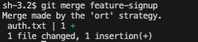

- Why? The histories of `main` and `feature-signup` parted ways. `main` moved forward with a security patch while `feature-signup` moved forward with signup UI.
- Result: Git automatically performs a **three-way merge** and creates a brand-new **Merge Commit** to stitch the two divergent histories back together

6. Answer in your notes:
    - What is a fast-forward merge?
    - When does Git create a merge commit instead?
    - What is a merge conflict? (try creating one intentionally by editing the same line in both branches)

- **What is a fast-forward merge?**
    A **fast-forward** merge occurs when the base branch (`main`) has no new commits since the `feature-login` branch was created. Because the commit history is a straight line, Git does not create a new merge commit. Instead, it simply slides the main branch pointer forward to match the latest commit of the `feature-login` branch. It accepts whatever is on the feature branch as the absolute final state—including any additions, modifications, or file deletions.

- **When does Git create a merge commit instead?**
Git creates a **merge commit** (a three-way merge) when two branches have changed. Assume, you are working in `main` branch's `auth.txt` and adding more base code and when you finish your teammate worked on `feature-login` branch and updating login form in auth.txt. Now, the two files have different updates:
    - The original login form update in `feature-login`.
    - Your changes done in `main`

    You can't just copy over the original file anymore, or you will lose your colleague's fix. Git has to look at both files, combine the login form changes and the new base code added by you, and save it. That new combined file is a merge commit.

- **What is a merge conflict?**
    Imagine your colleague changes the very first line from auth.txt and at the exact same time you also changes the first line in same file `auth.txt`. When git tries to combine then, it gets confused and git does not know which sentence is better and it does not want to guess. So git stops, raises hand(this is called merge conflict) and says *"I don't know which version you want to keep. Please open this file, delete the sentence you don't want, and tell me when you are done."* That stop is a **merge conflict**


## Task 2: Git Rebase — Hands-On
1. Create a branch `feature-dashboard` from `main`, add 2-3 commits
2. While on `main`, add a new commit (so `main` moves ahead)
3. Switch to `feature-dashboard` and rebase it onto `main`
4. Observe your git `log --oneline --graph --all` — how does the history look compared to a merge?
5. Answer in your notes:
- What does rebase actually do to your commits?
- How is the history different from a merge?
- Why should you **never rebase commits that have been pushed and shared** with others?
- When would you use rebase vs merge?

**The Rebase Simulation**
Rebase literally rewrites your repository history.

```bash
# 1. Ensure you are on main and create a base file
git checkout main
echo "Main Base" > dashboard.txt
git add dashboard.txt && git commit -m "feat: initial commit"

# 2. Create and switch to feature-dashboard
git checkout -b feature-dashboard

# 3. Add 2 distinct commits to feature-dashboard
echo "Layout Grid" >> dashboard.txt
git add dashboard.txt && git commit -m "feat: add dashboard layout"

echo "Charts Component" >> dashboard.txt
git add dashboard.txt && git commit -m "feat: add metrics charts"

# 4. Switch back to main and make main move ahead
git checkout main
echo "Global Sidebar" > sidebar.txt
git add sidebar.txt && git commit -m "chore: add global sidebar"

# 5. Switch back to feature branch and REBASE onto main
git checkout feature-dashboard
git rebase main
```

```bash
git log --oneline --graph --all
```
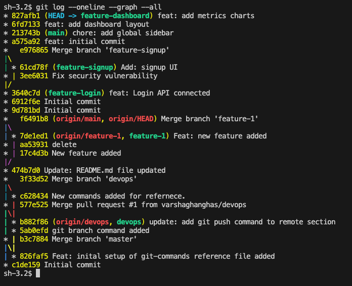

**What did rebase actually do to your commits**
When you ran git rebase main on the feature-dashboard branch, Git did this:
- It *lifted up* your two dashboard commits (`"feat: add dashboard layout"` and `"feat: add metrics charts"`) and set them aside
- It moved the base of your branch forward to match the new `"chore: add global sidebar"` commit on `main`
- It **re-applied** your two dashboard commits right on top of that sidebar commit
- It gave your dashboard commits **brand-new commit hash IDs**, completely rewriting their history

**How is the history different from a merge**
Because of the steps above, running git `log --oneline --graph --all` shows a perfectly straight vertical line
- **What you see now (Rebase)**: The timeline looks like you never split off from main. It looks like you waited for the sidebar to be finished, and then built your dashboard layout and charts directly on top of it. There is **no merge commit node**.
- **What a merge would have looked like**: You would see the timeline split into two parallel paths (one path for the sidebar, one path for the dashboard) and then a visible loop or "bubble" where those paths joined back together at a dedicated Merge Commit.

**Why should you never rebase commits that have been pushed and shared with others**
If you had pushed your `feature-dashboard` branch to GitHub before doing the rebase, your teammates might have downloaded it to work with you.
When you run `git rebase main` locally, you change the commit hashes. If you then force-push that rewritten history to GitHub, your teammates' local Git history will no longer match the cloud. When they try to run `git pull`, Git will get confused by the matching commit names but completely different *hash IDs*, resulting in messy, duplicated commits and broken files for the whole team

**When would you use rebase vs merge?**
- **You used Rebase here because** `feature-dashboard` is your private, local branch. It allowed you to pull in the latest changes from `main` (the sidebar) and clean up your dashboard timeline before anyone else saw it.
- **You would use Merge instead if** you were ready to officially deploy `feature-dashboard` into the production `main` branch, or if multiple developers were actively writing code inside `feature-dashboard` at the same time


## Task 3: Squash Commit vs Merge Commit
1. Create a branch `feature-profile`, add 4-5 small commits (typo fix, formatting, etc.)
2. Merge it into `main` using` --squash` — what happens?
3. Check `git log` — how many commits were added to main?
4. Now create another branch `feature-settings`, add a few commits
5. Merge it into `main` without `--squash` (regular merge) — compare the history
6. Answer in your notes:
- What does squash merging do?
- When would you use squash merge vs regular merge?
- What is the trade-off of squashing?

**The Squash Merge Simulation**
```bash
# 1. Ensure you are on main and create a base state
git checkout main
echo "User Profiles" > profile.txt
git add profile.txt && git commit -m "feat: setup profile baseline"

# 2. Create and switch to feature-profile
git checkout -b feature-profile

# 3. Add 4 small, messy commits
echo "Name field" >> profile.txt
git add profile.txt && git commit -m "add name"

echo "Name field fixed" >> profile.txt
git add profile.txt && git commit -m "fix typo in name"

echo "Bio field" >> profile.txt
git add profile.txt && git commit -m "add bio"

echo "Bio field formatting" >> profile.txt
git add profile.txt && git commit -m "fix bio layout spacing"

# 4. Switch back to main and execute a squash merge
git checkout main
git merge --squash feature-profile

# 5. Commit the combined staging area changes
git commit -m "feat: complete user profile feature"
```

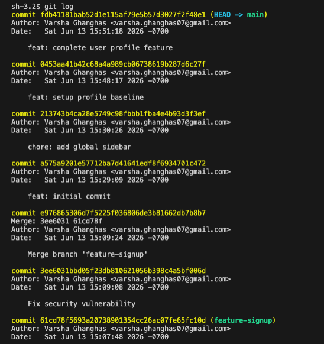

**What you will observe with `git log`**
Only one single commit (`"feat: complete user profile feature"`) was added to your main branch history. All four messy, small intermediate commits from the feature branch were compressed into a single package.


```bash
git log --oneline --graph --all
```
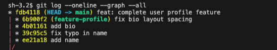

**Regular/ without Squash Merge Simulation**
```bash
# 1. Create and switch to feature-settings
git checkout -b feature-settings

# 2. Add 2 commits
echo "Theme Option" > settings.txt
git add settings.txt && git commit -m "feat: add dark theme toggle"

echo "Language Option" >> settings.txt
git add settings.txt && git commit -m "feat: add localization language options"

# 3. Switch to main and merge regularly
git checkout main
git merge feature-settings --no-edit
```

```bash
git log --oneline
```
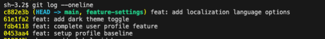

**Comparing the History:**
If you run `git log --oneline` now, you will see **every single individual commit** from the settings branch explicitly listed in the main history line, alongside a final auto-generated merge commit node.

**What does squash merging do?**
Squash merging takes all the individual commits from a feature branch, condenses them down into one single lump sum of changes, and applies that unified change as a brand-new commit directly onto the target branch (`main`). It strips away the micro-history of how the feature branch was built.

**When would you use squash merge vs regular merge?**
- **Use Squash Merge** when merging short-lived feature branches that contain a lot of messy "work-in-progress" commits (e.g., *"typo fix"*, *"debug prints"*, *"test"*). This keeps the main production timeline perfectly clean, readable, and professional.
- **Use Regular Merge** when you are merging large, long-lived development branches or when the step-by-step history of how the code evolved contains critical technical details that the team needs to track long-term.

**What is the trade-off of squashing?**
- **The Benefit**: It cleans up your project history by hiding messy trial-and-error development steps.
- **The Cost**: You completely lose granularity and historical context. If a bug is introduced during development, you can no longer use tools like `git blame` or `git bisect` to pinpoint the exact micro-commit or specific minute that broke the application—you can only see the giant squashed feature commit as a whole.

## Task 4: Git Stash — Hands-On
1. Start making changes to a file but **do not commit**
2. Now imagine you need to urgently switch to another branch — try switching. What happens?
3. Use `git stash` to save your work-in-progress
4. Switch to another branch, do some work, switch back
5. Apply your stashed changes using `git stash pop`
6. Try stashing multiple times and list all stashes
7. Try applying a specific stash from the list
8. Answer in your notes:
- What is the difference between `git stash `pop and `git stash apply`?
- When would you use stash in a real-world workflow

**The Urgent Switch Simulation**

```bash
# 1. Make sure you are on main and have a clean state
git checkout main

# 2. Make an uncommitted change to an existing file
echo "Important raw ideas" >> profile.txt

# 3. Try to switch to another branch without committing
git checkout devops
```
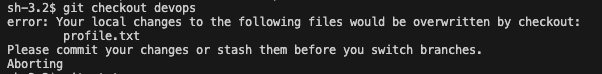

If your uncommitted changes conflict with the branch you are switching to, Git will block you and scream:
`error: Your local changes to the following files would be overwritten by checkout... Please commit your changes or stash them before you switch branches`.

**Stashing and Popping**
Let's use the stash to temporarily hide your work so you can move freely:
```bash
# 1. Stash your dirty working directory state
git stash

# 2. Check your branch status (it is now completely clean)
git status

# 3. Safely switch branches, do your urgent task, and return
git checkout devops
# (Imagine you fix a quick bug here)
git checkout main

# 4. Bring your uncommitted changes back
git stash pop
```

`git stash && git status` output:

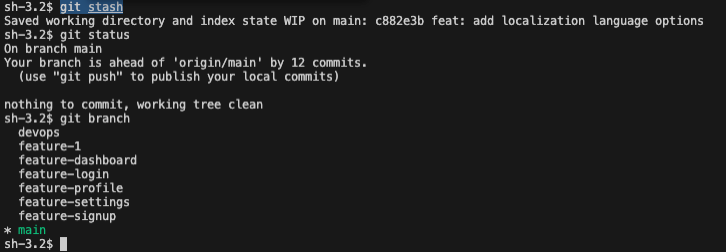

Your "Important raw ideas" text is instantly restored to `profile.txt`, and the temporary stash file is automatically deleted.

**Multiple Stashes & Specific Retrieval**

```bash
# 1. Create Stash #1
echo "Feature Draft One" >> profile.txt
git stash save "Draft One Message"

# 2. Create Stash #2
echo "Feature Draft Two" >> profile.txt
git stash save "Draft Two Message"

# 3. View your stack list of saved stashes
git stash list
```

output:
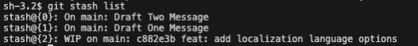

*(Note: Stash operates like a stack—the newest item is always index 0)*
```bash
# 4. Apply your older stash (Draft One) instead of the newest one
git stash apply stash@{1}
```

output:
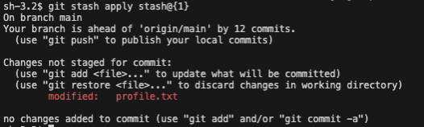

**What is the difference between `git stash pop` and `git stash apply`?**
- **`git stash pop`** cuts and pastes your work. It restores your saved modifications to your working directory and **instantly deletes** that specific stash entry from your stash history list
- **`git stash apply`** copies and pastes your work. It restores your modifications to your working directory but keeps the stash item saved in your stash history list. You must manually run `git stash drop` later to clear it.

**When would you use stash in a real-world workflow?**
- **Context Switching for Urgent Bug Fixes**: You are halfway through writing a complex feature, and a critical bug breaks production. You aren't ready to commit your unfinished, broken code. You stash your work, switch to `main`, fix and deploy the bug, switch back to your feature branch, and pop your stash to resume working.
- **Pulling Remote Updates on a Dirty Branch**: You want to run `git pull` to fetch your team's latest code updates, but Git won't let you because you have local uncommitted file changes. You stash your changes, pull the remote code safely, and then pop your stash on top of the fresh updates.
- **Testing Experimental Code Safely**: You want to try a completely wild refactoring idea without messing up your current progress. You stash your stable work, play around with the experiment, and if it fails, you clear the working directory and apply your original stash back.

## Task 5: Cherry Picking
1. Create a branch feature-hotfix, make 3 commits with different changes
2. Switch to main
3. Cherry-pick only the second commit from feature-hotfix onto main
4. Verify with git log that only that one commit was applied
5. Answer in your notes:
- What does cherry-pick do?
- When would you use cherry-pick in a real project?
- What can go wrong with cherry-picking?

**The Cherry-Pick Simulation**
```bash
# 1. Make sure you are starting fresh on main
git checkout main

# 2. Create and switch to the feature-hotfix branch
git checkout -b feature-hotfix

# 3. Make Commit #1 (A minor typo fix)
echo "Fixing spelling" >> profile.txt
git add profile.txt && git commit -m "fix: corrected spelling typo"

# 4. Make Commit #2 (The CRITICAL bug fix we actually want)
echo "Critical Security Patch Code" >> security.txt
git add security.txt && git commit -m "hotfix: resolved broken login loop"

# 5. Make Commit #3 (An unrelated experimental feature)
echo "Experimental layout design" >> profile.txt
git add profile.txt && git commit -m "feat: added temporary theme toggle"

# 6. Switch back to main
git checkout main
```

Now, let's find the exact commit hash ID for that second commit (`"hotfix: resolved broken login loop"`):
```bash
# 7. View the history of your hotfix branch to get the hash
git log feature-hotfix --oneline
```
output will list the commits:

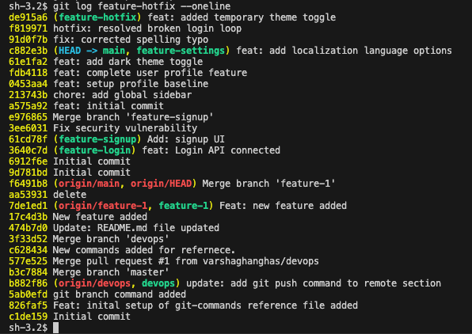

```bash
# 8. Cherry-pick ONLY that critical security commit onto main
# git cherry-pick <insert-commit-hash-here>
git cherry-pick f819971
```
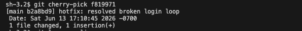

**Verification:**
Run **`git log --oneline`** on your `main` branch. You will observe that only the `"hotfix: resolved broken login loop"` commit has been applied to `main`. The typo fix and the theme toggle commits were left behind completely on the other branch
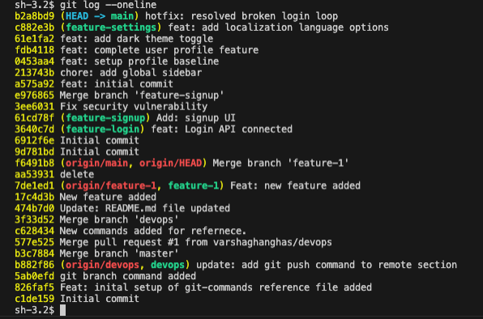


- **What does cherry-pick do?**
`git cherry-pick` extracts a specific commit from an entirely different branch and copies it as a brand-new commit onto your currently active branch. Instead of merging a whole branch and bringing over dozens of unrelated updates, it allows you to surgical-strike and duplicate one exact change.

- **When would you use cherry-pick in a real project?**
    - **Backporting Urgent Fixes**: A developer accidentally commits a vital production bug fix into a messy, uncompleted feature branch that won't be ready to release for weeks. You can use cherry-pick to pull just that bug fix commit onto the stable production branch (`main`) immediately.
    - **Salvaging Work from Dead Branches**: A team member builds a feature branch that gets completely cancelled and abandoned. However, inside that abandoned branch, they wrote a fantastic helper function that you need. You can cherry-pick just that specific helper commit into your active branch.

- **What can go wrong with cherry-picking?**
    - **Duplicate Commits**: Cherry-picking does not move the commit; it *copies* it. This creates two distinct commits with different hashes that contain the exact same code changes. If you later try to merge the original feature branch into `main`, Git can get confused, leading to ugly merge conflicts.
    - **Missing Dependencies**: If the commit you cherry-picked relies on code or variables created in an earlier commit on that feature branch, your code will break or fail to compile because those necessary foundational changes were left behind.


Push all changes to remote with all branches:
```bash
git push origin --all
```

Command:
```bash
git log --graph
```

Snapshot of output:

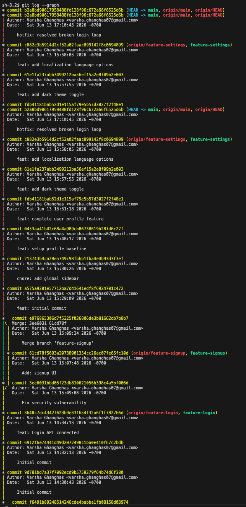
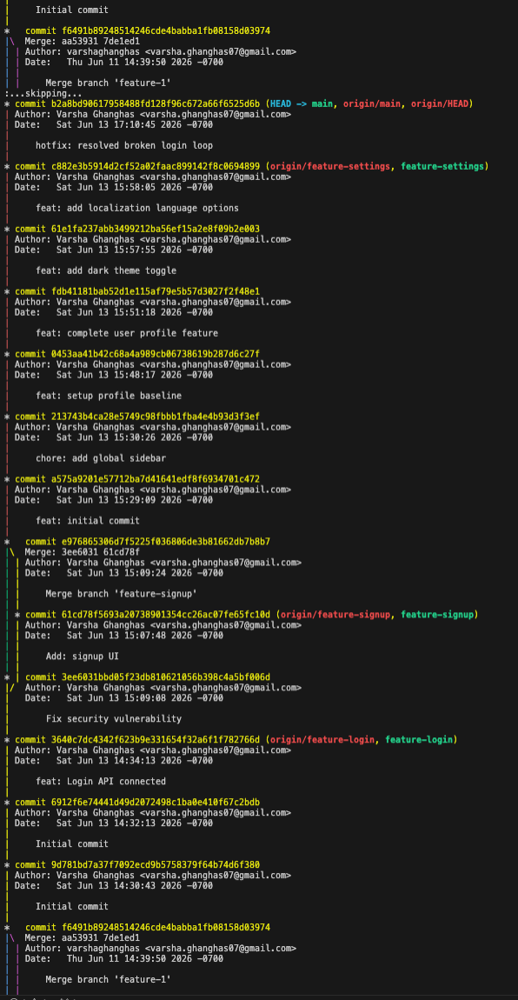
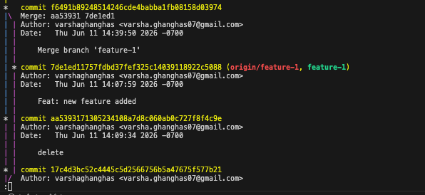

