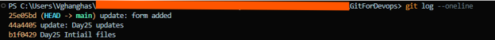
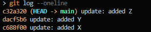
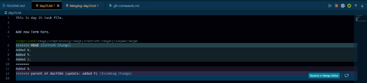
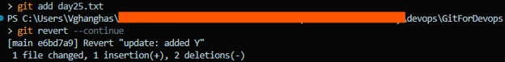
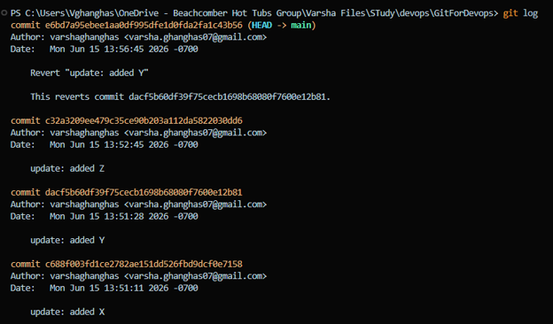

# Day 25 – Git Reset vs Revert & Branching Strategies

**Git Reset** and **Git Revert** are two distinct methods for undoing changes in version control, where reset rewrites commit history locally and revert records new history forward. Choosing between them depends entirely on whether your code is private or shared with a team

Understanding Git Reset Modes:
The `git reset` command changes where your current branch pointer (`HEAD`) points. It offers three distinct flag behaviors depending on what you want to do with your code changes:
- `--soft`: Moves `HEAD` back but keeps all your modified files in the **Staging Area**. Use this to group several small commits into one clean commit.
- `--mixed` (Default): Moves `HEAD` back and unstages your files, leaving them strictly in your **Working Directory**. Your changes are safe but un-tracked until you stage them again.
- `--hard`: Moves `HEAD` back and **permanently deletes** all modifications from both the staging area and working directory.
    - *Warning*: Any uncommitted work will be permanently destroyed

**Git Reset** vs. **Git Revert**- **Core Differences:**

| Feature | `git reset` | `git revert` |
|----------|-------------|-------------|
| Primary Action | Moves the branch pointer backward | Creates a new "inverse" commit |
| History Effect | Rewrites/erases history | Preserves history linearly |
| Best Used For | Local, unpushed commits | Shared, public remote branches |
| Risk Level | High (can lose uncommitted work) | Low (safe for collaboration) |


## Task 1: Git Reset — Hands-On
1. Make 3 commits in your practice repo (commit A, B, C)
2. Use `git reset --soft` to go back one commit — what happens to the changes?
3. Re-commit, then use `git reset --mixed` to go back one commit — what happens now?
4. Re-commit, then use `git reset --hard` to go back one commit — what happens this time?
5. Answer in your notes:
   - What is the difference between `--soft`, `--mixed`, and `--hard`?
   - Which one is destructive and why?
   - When would you use each one?
   - Should you ever use `git reset` on commits that are already pushed?

```bash
git log --oneline
```


- Effects of git `reset --soft HEAD~1`:
    - What happens: Commit C is removed from the project history.
    - Status of changes: The file modifications from Commit C are kept entirely intact and are placed directly back into your Staging Area (Index). Running git status shows the files in green, ready to be committed again.

- Effects of `git reset --mixed HEAD~1`:
    - What happens: Commit C is removed from the project history.
    - Status of changes: The modifications from Commit C are preserved but moved to your Working Directory. The staging area is cleared. Running git status shows the files in red as unstaged modifications.

- Effects of `git reset --hard HEAD~1`:
    - What happens: Commit C is removed from the project history.
    - Status of changes: All modifications from Commit C are permanently deleted. Your working directory and staging area are forced to match Commit B exactly. Any uncommitted work is destroyed.

**What is the difference between `--soft`, `--mixed`, and `--hard`?**

- Difference: `--soft` moves HEAD but leaves the staging area and working directory alone. `--mixed` moves `HEAD` and resets the staging area, leaving files unstaged. `--hard` resets HEAD, the staging area, and your local working directory files.
- Destructive Option: `--hard` is highly destructive because it alters the local file system on your disk. Uncommitted modifications or changes in the rolled-back commit cannot be easily recovered.
- When to use: Use `--soft` to squish or rename your most recent local commit. Use `--mixed` when you want to unstage files and break a large commit down into smaller pieces. Use `--hard` when a local experiment completely fails and you want to wipe it out.
- Pushed Commits: Never use `git reset` on commits that are already pushed to a shared remote branch. It alters history, which breaks the local repositories of your teammates and forces messy conflict resolutions

---

## Task 2: Git Revert — Hands-On
1. Make 3 commits (commit X, Y, Z)
2. Revert commit Y (the middle one) — what happens?
3. Check `git log` — is commit Y still in the history?
4. Answer in your notes:
   - How is `git revert` different from `git reset`?
   - Why is revert considered **safer** than reset for shared branches?
   - When would you use revert vs reset?

```bash
git log --oneline
```


We will use `git revert <commitID>`

```bash
git revert dacf5b6
```


Click *Accept Current changes*.

```bash
git add day25.txt
git revert --continue
```


**Check `git log` — is commit Y still in the history?**
Yes, *Commit Y* remains locked inside the project history. The new revert commit simply sits on top of Commit Z to neutralize what Commit Y originally did.


- **How is `git revert` different from `git reset`?**: `git reset` goes backward in time by deleting or altering history. `git revert` moves forward in time by creating a new commit that undoes changes without deleting old commits.
- **Why is `revert` considered **safer** than `reset` for shared branches?**: `revert` does not overwrite or alter existing history. Because it only appends new commits, team members can pull the changes normally without running into history synchronization issues
- **When would you use `revert` vs `reset`?**: Use `git reset` for private, local commits that have not left your computer. Use `git revert` for public commits that are already pushed to GitHub and shared with a team.

---

## Task 3: Reset vs Revert — Summary
Create a comparison in your notes:

| | `git reset` | `git revert` |
|---|---|---|
| What it does | Moves current branch HEAD backward to a specific commit | Creates a new commit that inverses changes of a specific commit |
| Removes commit from history? | Yes | No |
| Safe for shared/pushed branches? | No | Yes |
| When to use | Cleaning up local work before pushing | Fixing mistakes already pushed to production/main |

---

### Task 4: Branching Strategies
Research the following branching strategies and document each in your notes with:
- How it works (short description)
- A simple diagram or flow (text-based is fine)
- When/where it's used
- Pros and cons

1. **GitFlow** — develop, feature, release, hotfix branches
2. **GitHub Flow** — simple, single main branch + feature branches
3. **Trunk-Based Development** — everyone commits to main, short-lived branches
4. Answer:
   - Which strategy would you use for a startup shipping fast?
   - Which strategy would you use for a large team with scheduled releases?
   - Which one does your favorite open-source project use? (check any repo on GitHub)

#### GitFlow
- **How it works**: A strict framework utilizing persistent `main` (production) and `develop` branches, augmented by short-lived `feature`, `release`, and `hotfix` branches
- **Diagram**:
```text
main     -------------------------[Release]--------->
                                     /       \
release                           / [Fix]   \
                                   /   /       \
develop  --------[Feature]------/---/---------\----->
                     /     \     /   /
feature  ---------\-------\---/---/----------------->
```
- **Usage**: Legacy enterprise applications, physical goods software, and environments with strict QA cycles.
- **Pros**: Organized, isolated testing environments, ideal for scheduled release cycles.
- **Cons**: Highly complex, slows down deployment speed, and leads to difficult merge conflicts.

#### GitHub Flow
- **How it works**: A lightweight strategy where everything stems from `main`. Features are developed on temporary branches, tested, reviewed via Pull Requests, and merged straight to `main` for immediate deployment.
- **Diagram**
```text
trunk/main  ---[Commit]---[Commit]---[Merge]---[Commit]--->
                                         /
short-lived branch -------------------/ (<24 hrs)
```
- **Usage**: Web applications, SaaS products, and continuous delivery teams.
- **Pros**: Extremely fast, easy to learn, minimal overhead, perfect for CI/CD pipelines.
- **Cons**: Production can break easily if tests are weak; hard to track multiple distinct software releases.

#### Trunk-Based Development
- **How it works**: Developers merge small, frequent updates directly into a single central branch ("trunk" or main) multiple times a day. If feature branches are used, they live for less than 24 hours.
- **Diagram**:
```text
trunk/main  ---[Commit]---[Commit]---[Merge]---[Commit]--->
                                       /
short-lived branch -------------------/ (<24 hrs)
```
- **Usage**: High-performing tech organizations (e.g., Google, Meta) practicing true continuous integration.
- **Pros**: Eliminates merge conflicts completely, accelerates feedback loops, keeps code highly visible.
- **Cons**: Requires senior-level discipline, extensive automated test suites, and extensive use of feature flags.

#### Which strategy would you use for a startup shipping fast?
**Startup Shipping Fast**: **GitHub Flow** or **Trunk-Based Development**. They prioritize speed, eliminate process overhead, and fit modern automated release tooling perfectly

#### Which strategy would you use for a large team with scheduled releases?
**Large Team with Scheduled Releases**: **GitFlow**. It provides the governance, isolated release staging branches, and structured QA windows required for scheduled intervals

#### Which one does your favorite open-source project use? (check any repo on GitHub)
**Open-Source Standard**: Most modern popular open-source projects (like Kubernetes or VS Code) use a variant of **GitHub Flow** backed by main branch stability, leveraging forks and short-lived feature branches reviewed via Pull Requests

---

### Task 5: Git Commands Reference Update
Update your `git-commands.md` to cover everything from Days 22–25:
- Setup & Config
- Basic Workflow (add, commit, status, log, diff)
- Branching (branch, checkout, switch)
- Remote (push, pull, fetch, clone, fork)
- Merging & Rebasing
- Stash & Cherry Pick
- Reset & Revert

**Here**: https://github.com/varshaghanghas/90DaysOfDevOps/blob/master/2026/day-25/git-commands.md


