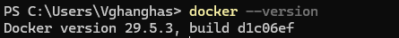
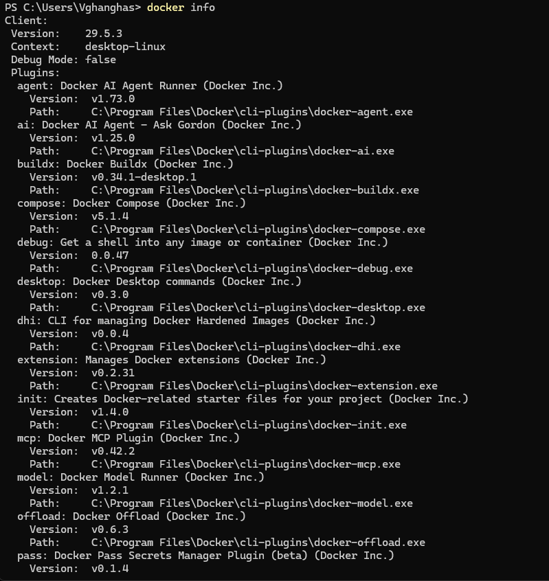
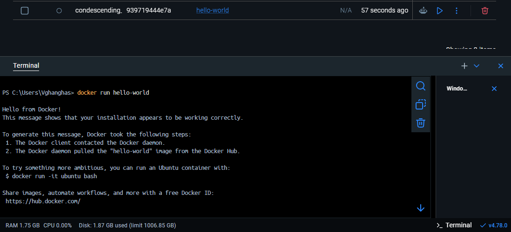
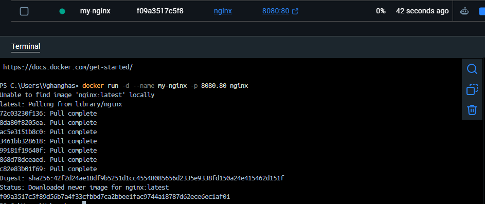
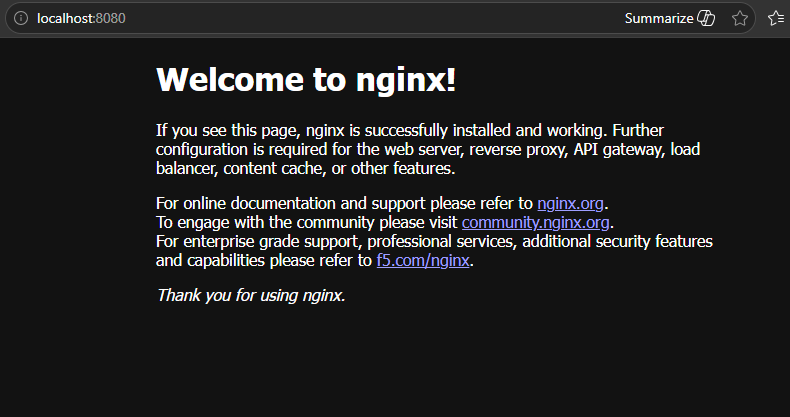
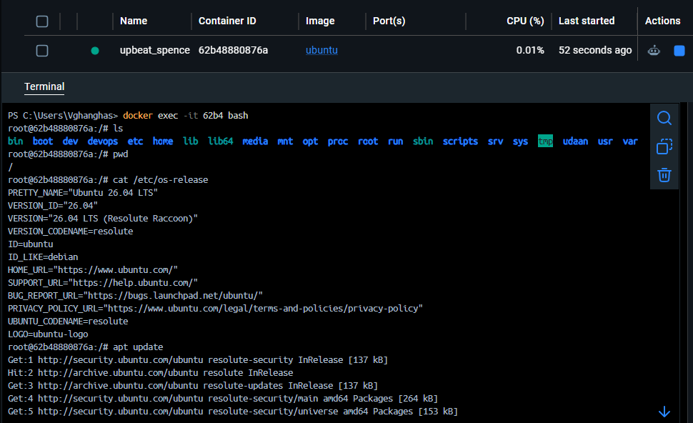

# Day 29 - Introduction to Docker

## Overview

Today I learned the basics of Docker and ran my first containers. Docker helps package an application with everything it needs so it can run consistently on different machines.

Earlier, if an application worked on one laptop but failed on another server, the reason was usually a mismatch in OS packages, runtime versions, environment variables, or dependencies. Containers reduce that problem by packaging the application and its runtime environment together.

---

## Task 1: What is Docker?

### What is a container?

A container is a lightweight, isolated environment used to run an application. It contains the application code, required libraries, dependencies, and runtime configuration.

A container does **not** include a full operating system like a virtual machine. Instead, it uses the host machine's kernel and runs the application in an isolated user space.

### Why do we need containers?

Containers are useful because they make applications:

- **Portable** - the same container can run on a laptop, server, or cloud machine.
- **Consistent** - the app runs with the same dependencies everywhere.
- **Fast to start** - containers usually start much faster than virtual machines.
- **Easy to deploy** - DevOps teams can build once and deploy the same image across environments.
- **Easy to scale** - multiple containers can be started when traffic increases.

---

## Containers vs Virtual Machines

| Feature | Containers | Virtual Machines |
|---|---|---|
| OS usage | Share host OS kernel | Each VM has its own full OS |
| Startup time | Fast | Slower |
| Size | Lightweight | Heavier |
| Isolation | Process-level isolation | Full machine-level isolation |
| Resource usage | Lower | Higher |
| Best use | App packaging, microservices, CI/CD | Full OS isolation, legacy apps, strong separation |

### Simple explanation

A virtual machine is like renting a full house with its own kitchen, bathroom, and electricity.

A container is like renting a separate room inside the same building. It is isolated, but still uses the building's shared infrastructure.

---

## Docker Architecture

Docker mainly uses a client-server architecture.

```text
User
 |
 | docker commands
 v
Docker Client (docker CLI)
 |
 | REST API request
 v
Docker Daemon (dockerd)
 |
 | manages
 v
Images, Containers, Networks, Volumes
 |
 | pulls/pushes images
 v
Docker Registry / Docker Hub
```

### Main components

#### Docker Client

The Docker client is the command-line tool we use, such as:

```bash
docker run hello-world
docker ps
docker stop container_name
```

When we run these commands, the client sends the request to the Docker daemon.

#### Docker Daemon

The Docker daemon, also called `dockerd`, does the real work. It creates containers, downloads images, manages networks, handles volumes, and keeps Docker objects running.

#### Docker Image

An image is a read-only template used to create containers. For example, `nginx`, `ubuntu`, and `hello-world` are Docker images.

#### Docker Container

A container is a running instance of an image. If an image is like a class or blueprint, a container is the actual running object created from it.

#### Docker Registry

A registry stores Docker images. Docker Hub is the default public registry where official images like `nginx`, `ubuntu`, and `mysql` are available.

---

## Task 2: Install Docker

I installed Docker on my machine and verified the installation.

### Check Docker version

```bash
docker --version
```

Output:


### Check Docker system information

```bash
docker info
```

Output:


This command shows Docker server details, images, containers, storage driver, and other system information.

### Run the hello-world container

```bash
docker run hello-world
```

Output:


### What happened here?

1. Docker checked whether the `hello-world` image was already available locally.
2. Since it was not present, Docker pulled it from Docker Hub.
3. Docker created a new container from that image.
4. The container printed a message explaining that Docker was installed correctly.
5. The container exited after completing its job.

---

## Task 3: Run Real Containers

### 1. Run an Nginx container

```bash
docker run -d --name my-nginx -p 8080:80 nginx
```

Meaning of the command:

- `docker run` - create and start a container
- `-d` - run in detached/background mode
- `--name my-nginx` - give the container a custom name
- `-p 8080:80` - map host port `8080` to container port `80`
- `nginx` - use the Nginx image

Now open this in the browser:

```text
http://localhost:8080
```

Expected result: the default Nginx welcome page should appear.

Output:



---

### 2. Run Ubuntu in interactive mode

```bash
docker run -it ubuntu bash
```

Meaning:

- `-i` keeps STDIN open.
- `-t` gives an interactive terminal.
- `ubuntu` is the image.
- `bash` starts a shell inside the container.

Inside the Ubuntu container, I can run Linux commands:

```bash
ls
pwd
cat /etc/os-release
apt update
```

Output:


To exit the container:

```bash
exit
```

---

### 3. List running containers

```bash
docker ps
```

This shows only containers that are currently running.

---

### 4. List all containers

```bash
docker ps -a
```

This shows running and stopped containers.

---

### 5. Stop and remove a container

Stop the Nginx container:

```bash
docker stop my-nginx
```

Remove the container:

```bash
docker rm my-nginx
```

If I want to force remove a running container:

```bash
docker rm -f my-nginx
```

---

## Task 4: Explore

### Run a container in detached mode

```bash
docker run -d --name webserver -p 8080:80 nginx
```

Detached mode means the container runs in the background and gives the terminal back immediately.

### Give a container a custom name

```bash
docker run -d --name custom-nginx nginx
```

A custom name makes the container easier to manage. Instead of using a random container ID, I can use `custom-nginx`.

### Map a port from container to host

```bash
docker run -d --name nginx-port-test -p 8080:80 nginx
```

Here:

```text
host_port:container_port
8080:80
```

So traffic coming to my machine on port `8080` is forwarded to port `80` inside the container.

### Check logs of a running container

```bash
docker logs nginx-port-test
```

Follow logs continuously:

```bash
docker logs -f nginx-port-test
```

### Run a command inside a running container

```bash
docker exec -it nginx-port-test bash
```

If Bash is not available, use:

```bash
docker exec -it nginx-port-test sh
```

Inside the container:

```bash
ls
pwd
cat /etc/os-release
```

Exit:

```bash
exit
```

---

## Useful Docker Commands

| Command | Purpose |
|---|---|
| `docker --version` | Check Docker version |
| `docker info` | Show Docker system information |
| `docker images` | List downloaded images |
| `docker pull nginx` | Download an image |
| `docker run hello-world` | Run first test container |
| `docker run -it ubuntu bash` | Run Ubuntu interactively |
| `docker run -d -p 8080:80 nginx` | Run Nginx in background with port mapping |
| `docker ps` | List running containers |
| `docker ps -a` | List all containers |
| `docker stop container_name` | Stop a container |
| `docker rm container_name` | Remove a container |
| `docker logs container_name` | View container logs |
| `docker exec -it container_name bash` | Enter a running container |

---

## Common Mistakes I Need to Avoid

### Confusing image and container

An image is the template. A container is the running instance created from that image.

### Forgetting port mapping

Running Nginx without `-p 8080:80` means the web server may be running inside the container, but I will not be able to access it from my browser through `localhost:8080`.

### Leaving unused containers

Stopped containers still remain on the system. I need to remove them when no longer needed.

```bash
docker ps -a
docker rm container_name
```

### Removing images before containers

Docker will not remove an image if a container is still using it. Remove the container first, then remove the image.

```bash
docker rm container_name
docker rmi image_name
```

---

## Practice Commands I Ran

```bash
# Verify Docker
docker --version
docker info

# First test container
docker run hello-world

# Run Nginx
docker run -d --name my-nginx -p 8080:80 nginx

# Check containers
docker ps
docker ps -a

# View logs
docker logs my-nginx

# Exec into container
docker exec -it my-nginx bash

# Run Ubuntu interactively
docker run -it ubuntu bash

# Stop and remove Nginx
docker stop my-nginx
docker rm my-nginx
```

---

## Key Learnings

- Docker helps solve environment mismatch problems.
- Containers are lighter than virtual machines because they share the host OS kernel.
- Docker uses images to create containers.
- Docker Hub is a registry where images are stored.
- `docker run` creates and starts containers.
- `docker ps` shows running containers.
- `docker ps -a` shows all containers.
- `-d` runs a container in the background.
- `-it` is used for interactive containers.
- `-p` maps a host port to a container port.
- `docker exec` lets me run commands inside a running container.
- `docker logs` helps troubleshoot containers.

---

## Why Docker Matters for DevOps

Docker is important in DevOps because it makes application deployment more reliable and repeatable. Developers can package an app once, and operations teams can run the same package in testing, staging, and production.

Docker also connects directly with future DevOps topics like:

- CI/CD pipelines
- Kubernetes
- Microservices
- Cloud deployments
- Infrastructure automation
- Application scaling

Today was the foundation. Without understanding Docker basics properly, Kubernetes and modern deployment workflows will feel confusing later.

---

## Conclusion

Day 29 introduced me to Docker and containers. I learned what containers are, how they differ from virtual machines, how Docker architecture works, and how to run real containers like `hello-world`, `nginx`, and `ubuntu`.

The most important takeaway is that Docker is not just another tool. It is a standard way to package, ship, and run applications in modern DevOps workflows.