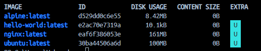
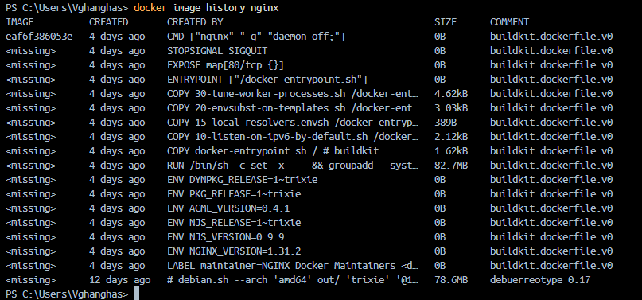
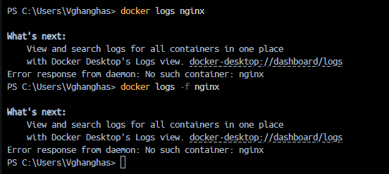
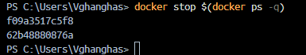

# Day 30: Docker Images and Container Lifecycle

## Challenge Tasks

### Task 1: Docker Images

#### Pull Different Images

Pull the following images:

```bash
docker pull nginx
docker pull ubuntu
docker pull alpine
```

List downloaded images:

```bash
docker images
```

Output:


#### Compare Ubuntu vs Alpine

| Image | Approx Size |
|---------|-------------|
| Ubuntu | ~80 MB |
| Alpine | ~7 MB |

**Why is Alpine smaller?**

- Alpine is built specifically to be lightweight.
- Uses BusyBox instead of GNU core utilities.
- Includes only essential packages.
- Faster to download and deploy.
- Ideal for containers and microservices.

---

### Inspect an Image

Inspect the nginx image:

```bash
docker image inspect nginx
```

Information available includes:

- Image ID
- Creation date
- Environment variables
- Exposed ports
- Architecture
- Entrypoint
- Layers

---

### Remove an Image

```bash
docker rmi ubuntu
```

---

## Task 2: Understanding Docker Image Layers

View image history:

```bash
docker image history nginx
```

Output:


### What are Docker Layers?

Docker images are composed of multiple read-only layers.

Example Dockerfile:

```dockerfile
FROM ubuntu
RUN apt update
RUN apt install -y nginx
COPY . /app
```

Each instruction creates a new layer.

### Benefits of Layers

- Faster image builds through caching.
- Reduced storage consumption.
- Faster downloads.
- Reusable across multiple images.

### Why do some layers show 0B?

Some layers only contain metadata changes such as:

- CMD
- ENV
- LABEL
- EXPOSE

These do not add filesystem data.

---

## Task 3: Container Lifecycle

### Create a Container

```bash
docker create --name mycontainer nginx
```

### Start Container

```bash
docker start mycontainer
```

### Pause Container

```bash
docker pause mycontainer
```

### Unpause Container

```bash
docker unpause mycontainer
```

### Stop Container

```bash
docker stop mycontainer
```

### Restart Container

```bash
docker restart mycontainer
```

### Kill Container

```bash
docker kill mycontainer
```

### Remove Container

```bash
docker rm mycontainer
```

### Check Status

```bash
docker ps -a
```

### Container Lifecycle Diagram

```text
Created
   ↓
Running
   ↓
Paused
   ↓
Running
   ↓
Stopped
   ↓
Restarted
   ↓
Killed
   ↓
Removed
```

---

## Task 4: Working with Running Containers

### Run Nginx Container

```bash
docker run -d --name nginx-server -p 8080:80 nginx
```

Verify:

```bash
docker ps
```

Open in browser:


---

### View Container Logs

```bash
docker logs nginx-server
```

Follow logs in real time:

```bash
docker logs -f nginx-server
```

---

### Access Container Shell

```bash
docker exec -it nginx-server bash
```

Run a command inside the container:

```bash
docker exec nginx-server ls /
```


---

### Inspect Running Container

```bash
docker inspect nginx-server
```

Useful information:

- Container IP address
- Port mappings
- Network settings
- Environment variables
- Mount points

---

## Task 5: Docker Cleanup

### Stop All Running Containers

```bash
docker stop $(docker ps -q)
```


### Remove Stopped Containers

```bash
docker container prune -f
```

### Remove Unused Images

```bash
docker image prune -a
```

### Check Docker Disk Usage

```bash
docker system df
```

### Remove Everything Unused

```bash
docker system prune -a
```

---

## Key Learnings

- Docker images are templates used to create containers.
- Images are built using multiple layers.
- Docker layers improve caching and storage efficiency.
- Containers follow a lifecycle from creation to removal.
- Docker logs and inspect commands are useful for troubleshooting.
- Cleanup commands help reclaim disk space.

## Commands

- `docker images`
- `docker image history nginx`
- `docker ps -a`
- `docker logs nginx-server`
- `docker inspect nginx-server`
- `docker system df`
