# Day 31 – Dockerfile: Build Your Own Images

## Task
Today's goal is to **write Dockerfiles and build custom images**.

This is the skill that separates someone who uses Docker from someone who actually ships with Docker.

---

## Expected Output
- A markdown file: `day-31-dockerfile.md`
- All Dockerfiles you create

---

## Challenge Tasks

### Task 1: Your First Dockerfile
1. Create a folder called `my-first-image`
```bash
mkdir my-first-image
cd my-first-image
```

2. Inside it, create a `Dockerfile` that:
   - Uses `ubuntu` as the base image
   - Installs `curl`
   - Sets a default command to print `"Hello from my custom image!"`

```dockerfile
# Pull ubuntu base image
FROM ubuntu:latest

# Update package lists and install curl without prompting for inputs
RUN apt-get update && apt-get install -y curl

# Set the default command to print the message
CMD ["echo", "Hello from my custom image!"]
```

3. Build the image and tag it `my-ubuntu:v1`

Dockerfile:
```bash
cd my-first-image
docker build -t my-ubuntu:v1 .
```
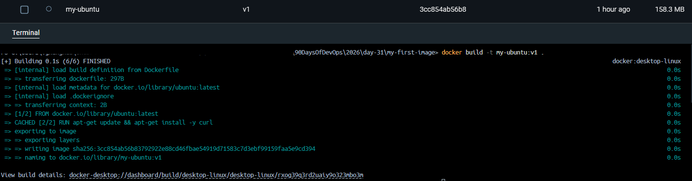

or `docker run --name my-running-container my-ubuntu:v1` to name container as `my-running-container`.


4. Run a container from your image
**Verify:** The message prints on `docker run`

```bash
docker run my-ubuntu:v1
```
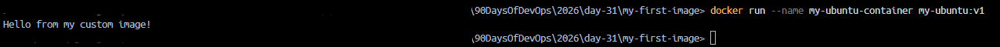

---

### Task 2: Dockerfile Instructions
Create a new Dockerfile that uses **all** of these instructions:
- `FROM` — base image
- `RUN` — execute commands during build
- `COPY` — copy files from host to image
- `WORKDIR` — set working directory
- `EXPOSE` — document the port
- `CMD` — default command

Dockerfile:
```dockerfile
# 1. base image
FROM nginx:alpine

# 2 working directory
WORKDIR 'C:/Users/Vghanghas/devops/90DaysOfDevOps/2026/day-31/task2-dockerfile'

# 3. Copy Files
COPY index.html .

# 4. Build Commands
RUN chmod 644 index.html

# 5. Document Port
EXPOSE 8088

# 6. Default Command
CMD ["nginx", "-g", "daemon off;"]

```

Build and run it. Understand what each line does.

#### Understanding What Each Line Does
- `FROM nginx:alpine`
    - What it does: Sets the foundation. It fetches a minimal, secure Linux image pre-configured with the Nginx web server.

- `WORKDIR C:/Users/Vghanghas/devops/90DaysOfDevOps/2026/day-31/task2-dockerfile`
    - What it does: Creates this directory inside the container (if it does not exist) and shifts focus there. All following commands (`COPY`, `RUN`, `CMD`) execute relative to this folder.

- `COPY index.html .`
    - What it does: Copies `index.html` from your computer into the current container working directory (`.`). This replaces Nginx's default welcome page.

- `RUN chmod 644 index.html`
    - What it does: Executes a file permission change *during the build process*. This ensures the Nginx server has permission to read and serve your file.

- `EXPOSE 80`
    - What it does: Documents that the container will listen on port 80 at runtime. It serves as communication between the image creator and the person running it.

- `CMD ["nginx", "-g", "daemon off;"]`
    - What it does: The actual command that starts the web server. It runs in the foreground to keep your container alive.

#### Build and run it
- Build image:
```bash
docker build -t task2-image:v1 .
```

- Run container:
    - Run the container in the background (`-d`), map host port `8088` to container port `80` (`-p`), and name it `web-task2`
```bash
docker run -d -p 8088:80 --name web-task2 task2-image:v1
```
Once run, open your browser to `http://localhost:8088` to see your page
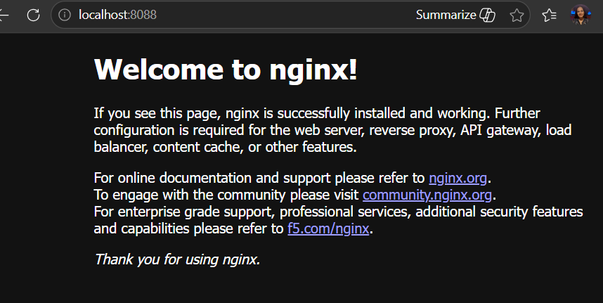

---

### Task 3: CMD vs ENTRYPOINT
1. Create an image with `CMD ["echo", "hello"]` — run it, then run it with a custom command. What happens?

- Dockerfile:
```dockerfile
FROM alpine:latest
CMD ["echo", "hello"]
```

- Build it with a unique tag:
    - We use a unique tag (like `test-cmd` vs `test-entrypoint`) so Docker can keep the two built images separate in your computer's memory.
```bash
docker build -f Dockerfile -t test-cmd .
```

Execution Tests:
- Run normally: 
    - Output: `hello`
```bash
docker run test-cmd
```
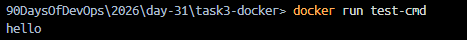

- Run with a custom command (`world`):
    - Output: `world`
```bash
docker run test-cmd echo world
```
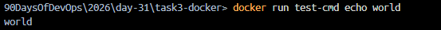

- What happens? 
    - Your custom arguments completely overwrite and replace the `CMD` array. The original `"echo"`, `"hello"` is ignored, and Docker executes `echo world` instead.

2. Create an image with `ENTRYPOINT ["echo"]` — run it, then run it with additional arguments. What happens?
- Create `Dockerfile.entrypoint` and add lines:
```dockerfile
FROM alpine:latest
ENTRYPOINT ["echo"]
```

- Build with unique tag:
```bash
docker build -f Dockerfile.entrypoint -t test-entrypoint .
```

- Run normally:
    - Output: (*blank line / empty echo*)
```bash
docker run test-entrypoint
```

- Run with additional arguments (world):
    - Output: `world`
```bash
docker run test-entrypoint world
```
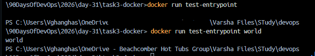

3. Write in your notes: When would you use `CMD` vs `ENTRYPOINT`?
- `CMD` vs `ENTRYPOINT` Cheat Sheet:
    - Use `ENTRYPOINT` when your container is designed to act like a specific tool or executable file. It defines the core command that the container must always execute upon starting. It makes it hard for users to accidentally break or skip the primary runtime process.
    - Use `CMD` when you want to provide default parameters or arguments that users can easily override from the command line.

The Best Practice Pattern: Combining BothIn real production workflows, DevOps engineers combine them. Use ENTRYPOINT for the executable and CMD for the default flag:
```dockerfile
ENTRYPOINT ["ping"]
CMD ["localhost"]
```
- Running `docker run my-image` executes: `ping localhost`.
- Running `docker run my-image google.com` executes: `ping google.com`.

---

### Task 4: Build a Simple Web App Image
1. Create a small static HTML file (`index.html`) with any content
2. Write a Dockerfile that:
   - Uses `nginx:alpine` as base
   - Copies your `index.html` to the Nginx web directory
```dockerfile
# Use nginx:alpine as base
FROM nginx:alpine

# Copy index.html to the Nginx web directory
COPY index.html /usr/share/nginx/html/index.html
```

3. Build and tag it `my-website:v1`
```bash
docker build -t my-website:v1 .
```

4. Run it with port mapping and access it in your browser
- Map your computer's port 8080 to the container's internal port 80 so you can view it. We will name this container web-app-v1: 
```bash
docker run -d -p 8080:80 --name web-app-v1 my-website:v1
```

Open your web browser and go to: `http://localhost:8080`
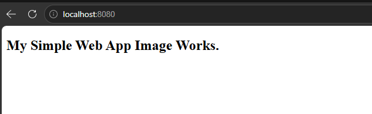

---

### Task 5: .dockerignore
1. Create a `.dockerignore` file in one of your project folders
2. Add entries for: `node_modules`, `.git`, `*.md`, `.env`
3. Build the image — verify that ignored files are not included
- Dockerfile:
```dockerfile
# Use nginx:alpine as base
FROM nginx:alpine

# Working dir
WORKDIR /usr/share/nginx/html

# Copy everything from the current Windows directory into the container
COPY . .
```
- Build and Run the Container:
```bash
docker build -t ignore-test:v1 .
docker run -it --name test-container ignore-test:v1 sh
```
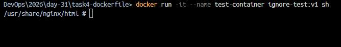

- Verify the Results:
    - What you will see:You will see `Dockerfile` and `index.html`.You will NOT see `.env` or `README.md` [docker.com].
```bash
ls -la
```
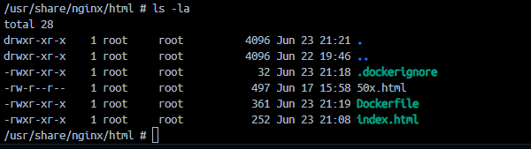
The `.dockerignore` file successfully blocked them from being sent to the Docker daemon [docker.com]. Type `exit` to close the container session when you are finished.

---

### Task 6: Build Optimization
1. Build an image, then change one line and rebuild — notice how Docker uses **cache**
- Create folder task6-dockerfile
```bash
cd task6-dockerfile
```
- Dockerfile:
```dockerfile
# base image
FROM nginx:alpine

# working dir
WORKDIR /usr/share/nginx/html

# Copy the file first
COPY index.html .

# Run a dummy update script
RUN echo "Installing dependencies..." && sleep 3
```

- The First Build
```bash
docker build -t cache-test:v1 .
```

- Change One Line and Rebuild (The "Cache Bust"):
    - Now, open your `index.html` file on Windows, add a single character or change a word, and save it. Run the exact same build command again
```bash
docker build -t cache-test:v1 .
```

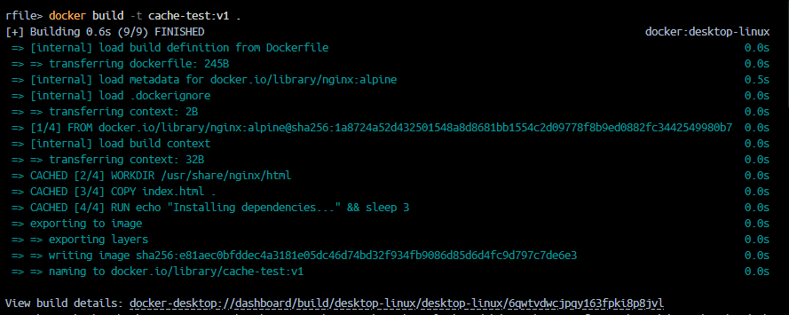
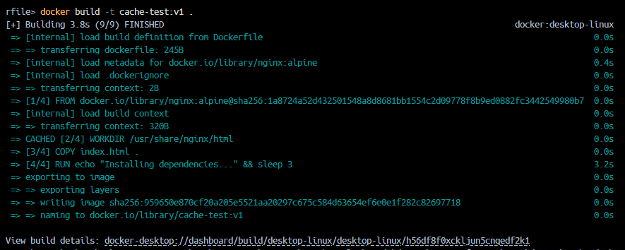

Look closely at your terminal output for the `RUN` step. You will notice it did not use the cache; it ran the `sleep 3` command all over again. Because `index.html` changed, every single step listed *after* that `COPY` line was forced to run from scratch.

2. Reorder your Dockerfile so that frequently changing lines come **last**
- Optimize the Order:
    - Update your `Dockerfile `to look like this
```dockerfile
FROM nginx:alpine
WORKDIR /usr/share/nginx/html

# 1. Run static setup steps first (these rarely change)
RUN echo "Installing dependencies..." && sleep 3

# 2. Copy code files last (these change constantly)
COPY index.html .
```
- Test the Optimization: Run the build command once to establish the new base: `docker build -t cache-test:v2 .`
- Change your `index.html` file again and save it
- Run the build command one more time: `docker build -t cache-test:v2 .`

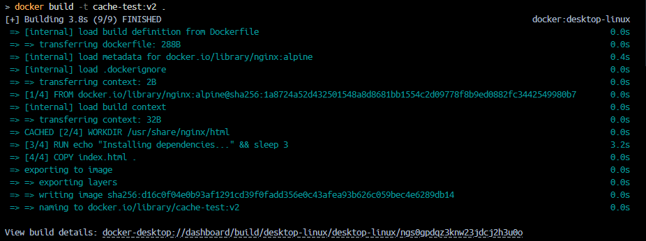

**What happens now?** Your terminal will show `CACHED` next to the `RUN` step! The build completes instantly because Docker reuses the cached layer for the time-consuming installation and only processes the modified `index.html` file.

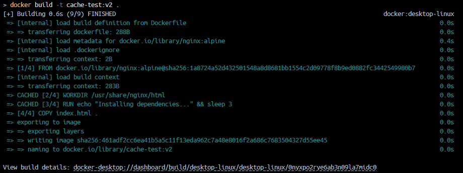

3. Write in your notes: **Why does layer order matter for build speed?**
- **Top-Down Invalidation**: Docker builds images layer by layer [docker.com]. If a single layer changes (like a modified source code file), that layer's cache is broken ("busted") [docker.com].
- **The Domino Effect**: Once a layer cache is broken, every single subsequent layer after it is completely invalidated and must be rebuilt from scratch [docker.com].
- **The Golden Rule**: Always structure your Dockerfiles from least frequently changed to most frequently changed. Put package installations (`npm install`, `apt-get`, `pip install`) at the top, and copy your actual source code at the very bottom [docker.com].


