# Day 32 – Docker Volumes & Networking

Today's goal is to **solve two real problems: data persistence and container communication**.

Containers are ephemeral — they lose data when removed. And by default, containers can't easily talk to each other. Today you fix both.

## Overview
Today we are shifting away from building images and focusing on how containers manage data and communication at runtime.

By default, containers are isolated and stateless—if a container crashes or gets deleted, all data inside it disappears instantly. Today, we fix that.

### Docker Storage (Volumes vs. Bind Mounts)
Docker Storage (Volumes vs. Bind Mounts):
| Feature | Docker Volumes 📦 | Bind Mounts 🔗 |
|-----|-------|-------|
| Management | Managed entirely by Docker. | Managed by you (uses absolute host paths). |
| Location | Hidden inside Docker's storage directory.  | Any accessible path on your local drive. |
| Best For | Production databases and persistent app state.  | Local development (live-reloading source code). |
| Portability | Highly portable across OS types. | Tied directly to the host machine's file structure. |

### Docker Networking Basics
When Docker installs, it automatically sets up three default networks. You can see them by running `docker network ls`:
1. **Bridge** (Default): A private internal network created on your host. Containers attached to this can talk to each other using their container names as hostnames.
2. **Host**: Removes network isolation between the container and the host machine. The container binds directly to your host's network ports.
3. **None**: Completely disables networking for the container, ensuring absolute isolation.

---

### Task 1: The Problem
1. Run a Postgres or MySQL container
We will intentionally run a stateless database container to observe how data disappears when the container is deleted [docker.com].
- Start a temporary PostgreSQL container
```bash
docker run --name pg-temporary -e POSTGRES_PASSWORD=mysecretpassword -d postgres:alpine
```
- Connect to it and add some sample data
    - Open the PostgreSQL interactive terminal (`psql`) inside that container [docker.com]:
```bash
docker exec -it pg-temporary psql -U postgres
```
(*Your prompt will change to postgres=#*)
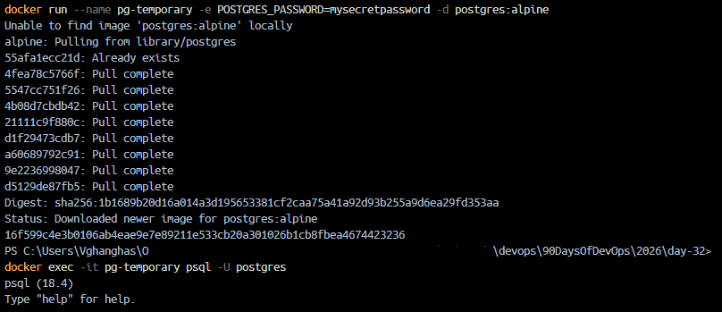

2. Create some data inside it (a table, a few rows — anything)
- Paste this SQL script into the prompt and press Enter to create a table and seed a row:
```sql
CREATE TABLE day32_data (id SERIAL PRIMARY KEY, note TEXT);
INSERT INTO day32_data (note) VALUES ('Testing data loss');
SELECT * FROM day32_data;
```
*(Verify you see the row Testing data loss in your terminal layout).*
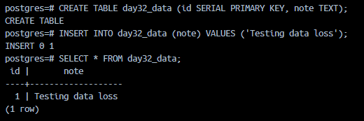
Type `\q` and press Enter to exit the container's SQL shell.

3. Stop and remove the container
```bash
docker stop pg-temporary
docker rm pg-temporary
```

4. Run a new one — is your data still there?
- Create another container with the exact same name and configuration (docker.com):
```bash
docker run --name pg-temporary -e POSTGRES_PASSWORD=mysecretpassword -d postgres:alpine
```
- Open the PostgreSQL interactive terminal (`psql`) inside that container (docker.com):
```bash
docker exec -it pg-temporary psql -U postgres
```
- Try query:
```sql
SELECT * FROM day32_data;
```
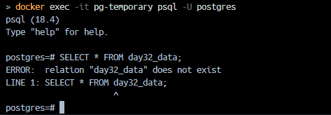

- **Why**: Containers are fundamentally ephemeral (temporary) (docker.com). Any changes or databases created inside it are saved in a temporary "writable layer" (docker.com). When you run `docker rm`, that specific layer is deleted forever (docker.com). A new container starts with a completely blank slate file system (docker.com).

---

### Task 2: Named Volumes
1. Create a named volume
```bash
docker volume create pg-data-v16
```

2. Run the same database container, but this time **attach the volume** to it
```bash
docker run --name pg-persistent -e POSTGRES_PASSWORD=mysecretpassword -v pg-data-v16:/var/lib/postgresql/data -d postgres:16-alpine
docker exec -it pg-persistent psql -U postgres
```

3. Add some data, stop and remove the container
- Create a table and seed a record:
```sql
CREATE TABLE safe_data (id SERIAL PRIMARY KEY, note TEXT);
INSERT INTO safe_data (note) VALUES ('This data is safe inside a volume!');
SELECT * FROM safe_data;
\q
```
- Destroy the container completely
```bash
docker stop pg-persistent
docker rm pg-persistent
```
4. Run a brand new container with the **same volume**
```bash
docker run --name pg-persistent-new -e POSTGRES_PASSWORD=mysecretpassword -v pg-data-v16:/var/lib/postgresql/data -d postgres:16-alpine
docker exec -it pg-persistent-new psql -U postgres
```
- run query:
```sql
SELECT * FROM safe_data;
```
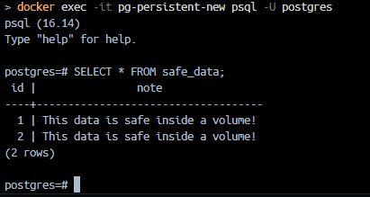


5. Is the data still there?

**Verify:** `docker volume ls`, `docker volume inspect volumne_name`

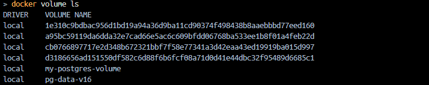
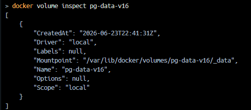

---

### Task 3: Bind Mounts
1. Create a folder on your host machine with an `index.html` file
2. Run an Nginx container and **bind mount** your folder to the Nginx web directory
```bash
docker run -d --name local-web -p 8080:80 -v "C:\Users\Vghanghas\OneDrive - Beachcomber Hot Tubs Group\Varsha Files\STudy\devops\90DaysOfDevOps\2026\day-32\web-project:/usr/share/nginx/html" nginx:alpine
```
3. Access the page in your browser
`http://localhost:8080`
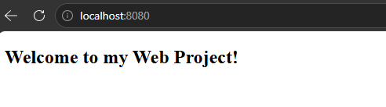

4. Edit the `index.html` on your host — refresh the browser
Output after updating `index.html`:


Write in your notes: What is the difference between a named volume and a bind mount?
[TODO]
---

### Task 4: Docker Networking Basics
1. List all Docker networks on your machine
```bash
docker network ls
```
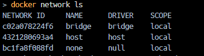

2. Inspect the default `bridge` network
```bash
docker network inspect bridge
```
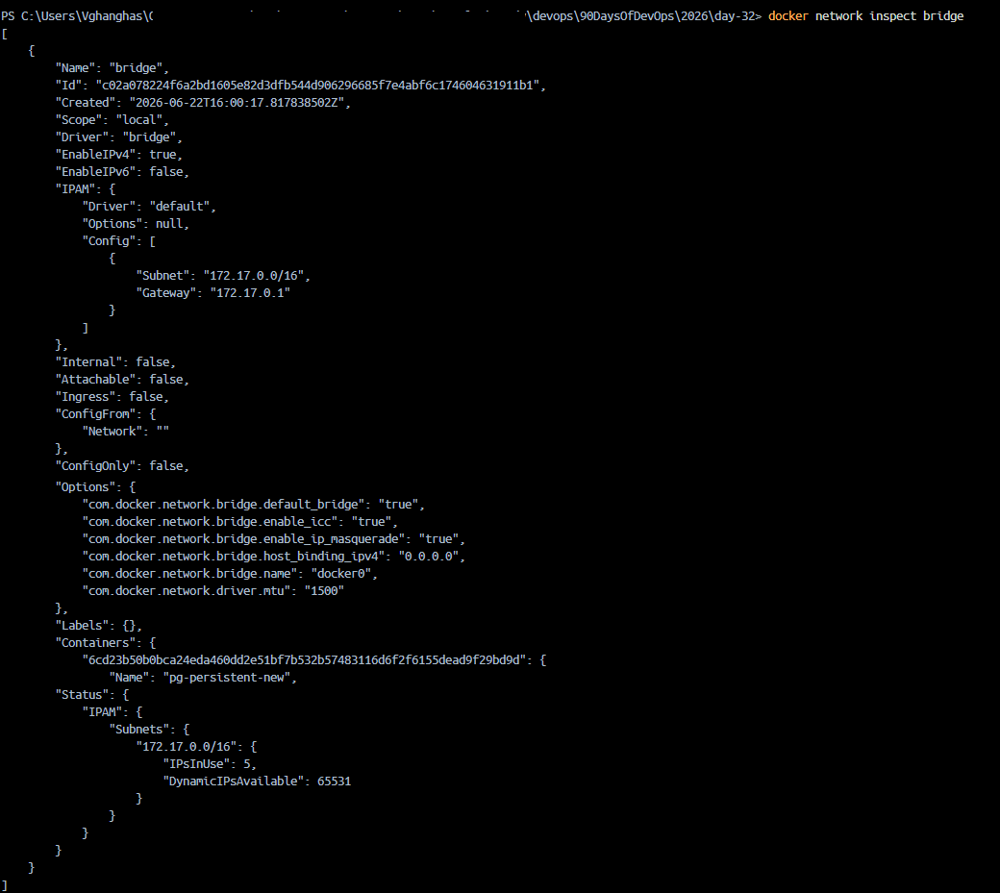

3. Run two containers on the default bridge — can they ping each other by **name**?
```bash
docker run -d --name container-a alpine sleep 3600
docker run -d --name container-b alpine sleep 3600
```
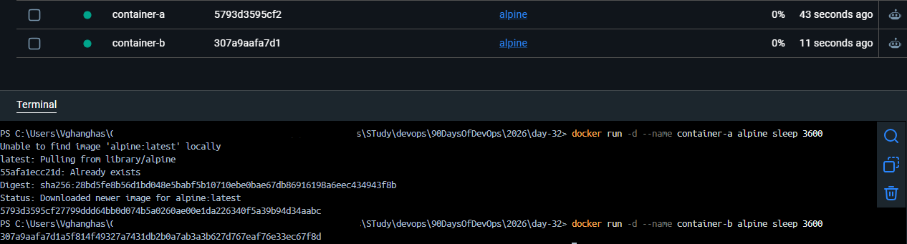

4. Run two containers on the default bridge — can they ping each other by **IP**?
```bash
docker exec container-a ping -c 2 container-b
```
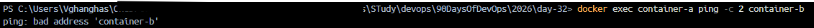
This fails with `ping: bad address 'container-b'`. The default bridge does not support automatic name resolution (DNS) (docker.com).

5. Test IP-Based Communication
```bash
docker inspect -f "{{.NetworkSettings.Networks.bridge.IPAddress}}" container-b
```
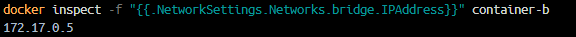

Now ping that specific IP from container-a:
```bash
docker exec container-a ping -c 2 172.17.0.5
```
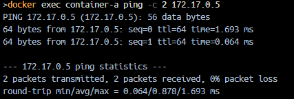

---

### Task 5: Custom Networks
1. Create a custom bridge network called `my-app-net`
```bash
docker network create my-app-net
```

2. Run two containers on `my-app-net`
```bash
docker run -d --name container-c --network my-app-net alpine sleep 3600
docker run -d --name container-d --network my-app-net alpine sleep 3600
```

3. Can they ping each other by **name** now?
```bash
docker exec container-c ping -c 2 container-d
```
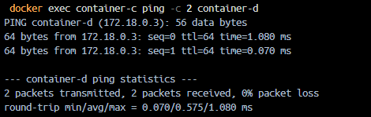

4. Write in your notes: Why does custom networking allow name-based communication but the default bridge doesn't?
**Why it works**: User-defined custom networks feature an **embedded DNS service** provided automatically by Docker. This server translates container names directly into their actual backend IP addresses, completely abstracting away tracking IP changes (docker.com). The default bridge network explicitly lacks this built-in DNS capability for legacy compatibility reasons (docker.com) 

---

### Task 6: Put It Together
1. Create a custom network
Let's link up a safe backend database and an app container securely over our custom network fabric
```bash
# Run the Database
# docker run --name microservice-db --network my-app-net -v my-postgres-volume:/var/lib/postgresql/data -e POSTGRES_PASSWORD=mysecretpassword -d postgres:alpine

# as the above command didn't work
docker run --name microservice-db --network my-app-net -e POSTGRES_PASSWORD=mysecretpassword -d postgres:alpine
```
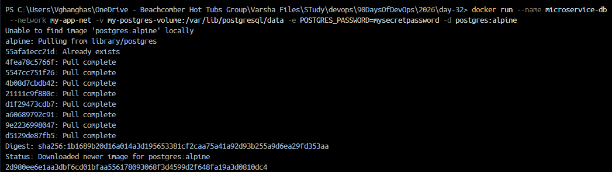

2. Run a **database container** (MySQL/Postgres) on that network with a volume for data

3. Run an **app container** (use any image) on the same network
```bash
# Run the App
docker run --name microservice-app --network my-app-net -d alpine sleep 3600
```

4. Verify the app container can reach the database by container name
```bash
# Verify the connection
docker exec -it microservice-app sh -c "apk add --no-cache netcat-openbsd && nc -zv microservice-db 5432"
```
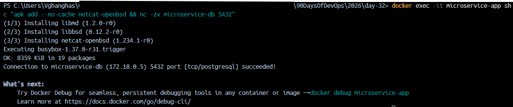

