# Day 33 – Docker Compose: Multi-Container Basics

### Task 1: Install & Verify
1. Check if Docker Compose is available on your machine
2. Verify the version
```bash
docker compose version
```
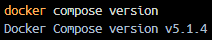

---

### Task 2: Your First Compose File
1. Create a folder  🔗[`compose-basics`](https://github.com/varshaghanghas/90DaysOfDevOps/tree/master/2026/day-33/compose-basics)
```bash
mkdir compose-basics
cd compose-basics
```

2. Write a `docker-compose.yml` that runs a single **Nginx** container with port mapping
```yaml
version: '3.8'

services:
  webserver:
    image: nginx:alpine
    container_name: nginx_basic
    ports:
      - "8080:80"
    restart: always
```

3. Start it with `docker compose up`
```bash
docker compose up
```

4. Access it in your browser: `http://localhost:8080`
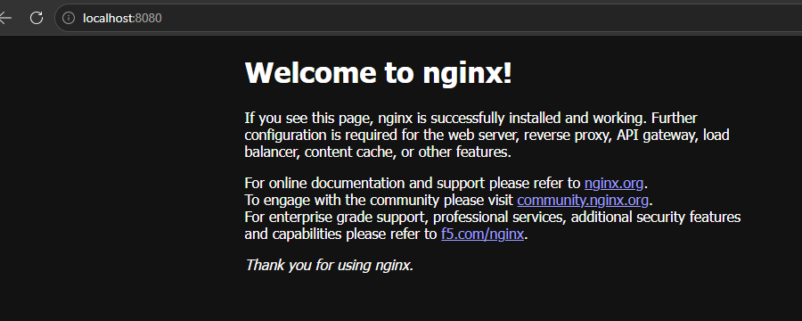

5. Stop it with `docker compose down`
```bash
docker compose down
```
This cleanly stops and removes the container and the default network created by Compose.

#### Execution Commands
* **Start:** `docker compose up` (Runs in foreground; press `CTRL + C` to stop)
* **Access:** Open browser at `http://localhost:8080` to see the "Welcome to nginx!" page.
* **Stop:** `docker compose down` (Removes containers and default networks cleanly)

---

### Task 3: Two-Container Setup
Write a `docker-compose.yml` that runs:
- A **WordPress** container
- A **MySQL** container

They should:
- Be on the same network (Compose does this automatically)
- MySQL should have a named volume for data persistence
- WordPress should connect to MySQL using the service name

Start it, access WordPress in your browser, and set it up.

**Verify:** Stop and restart with `docker compose down` and `docker compose up` — is your WordPress data still there?

- Create the Project Directory: 🔗[`wordpress-mysql`](https://github.com/varshaghanghas/90DaysOfDevOps/tree/master/2026/day-33/wordpress-mysql)
```bash
mkdir wordpress-mysql
cd wordpress-mysql
```
- Create the docker-compose.yml File
- Start the Application Stack
```bash
docker compose up -d
```
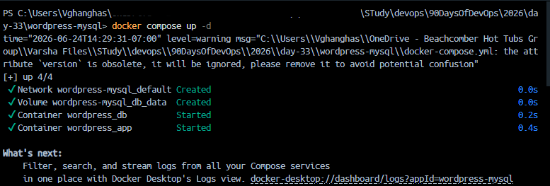

- Access and Set Up WordPress
    - Open your web browser and go to: `http://localhost:8000`
    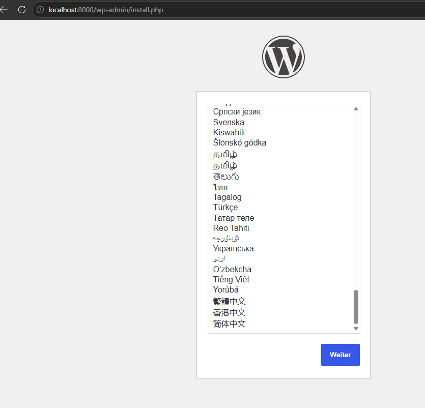
    - Select your language and click Continue.
    - Fill out the site details (Site Title, Username, Password, and Email) and click Install WordPress.
    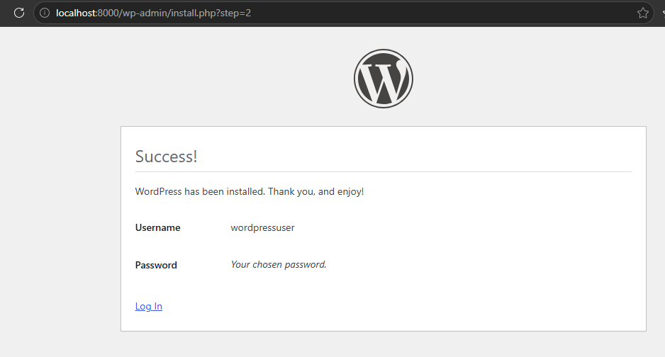
    - Log in to the WordPress dashboard to confirm it is fully functional.
    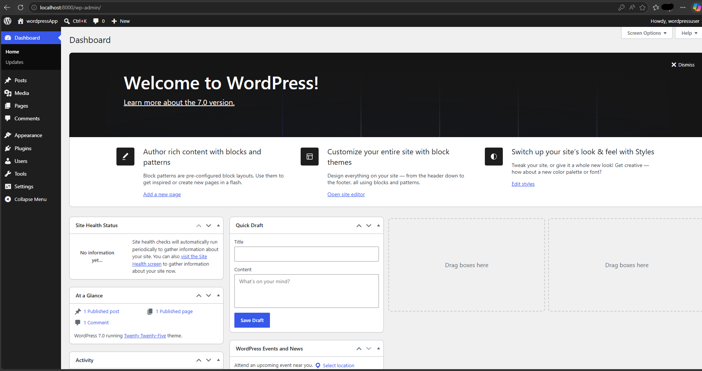
    - Verify Data Persistence: To test if the named volume `db_data` is keeping your data safe when the containers are destroyed:
        - Stop and remove the containers, networks, and internal configurations:
        ```bash
        docker compose down
        ```
        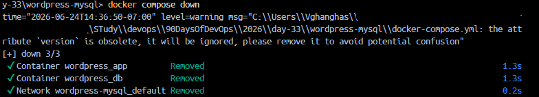
        - Verify the containers are completely gone by checking `docker ps` (container is stopped and removed).
        - Start the stack back up:
        ```bash
        docker compose up -d
        ```
        - Refresh your browser at `http://localhost:8000`:
            *Verification Result*: You will be taken straight to your completed website or login page instead of the installation screen. This proves your MySQL data survived container destruction.

---

### Task 4: Compose Commands
Practice and document these:
1. Start services in **detached mode**
```bash
docker compose up -d
```


2. View running services
```bash
docker compose ps
```
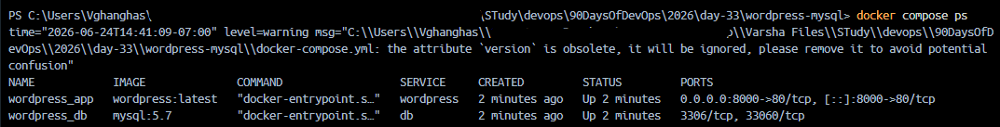

3. View **logs** of all services
```bash
docker compose logs
```
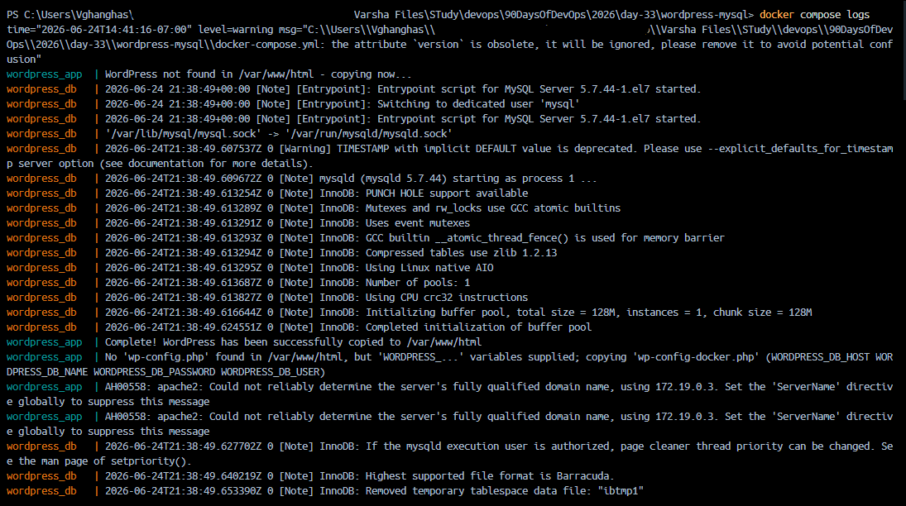
*(Add the `-f` flag to follow/stream live updates: `docker compose logs -f`)*
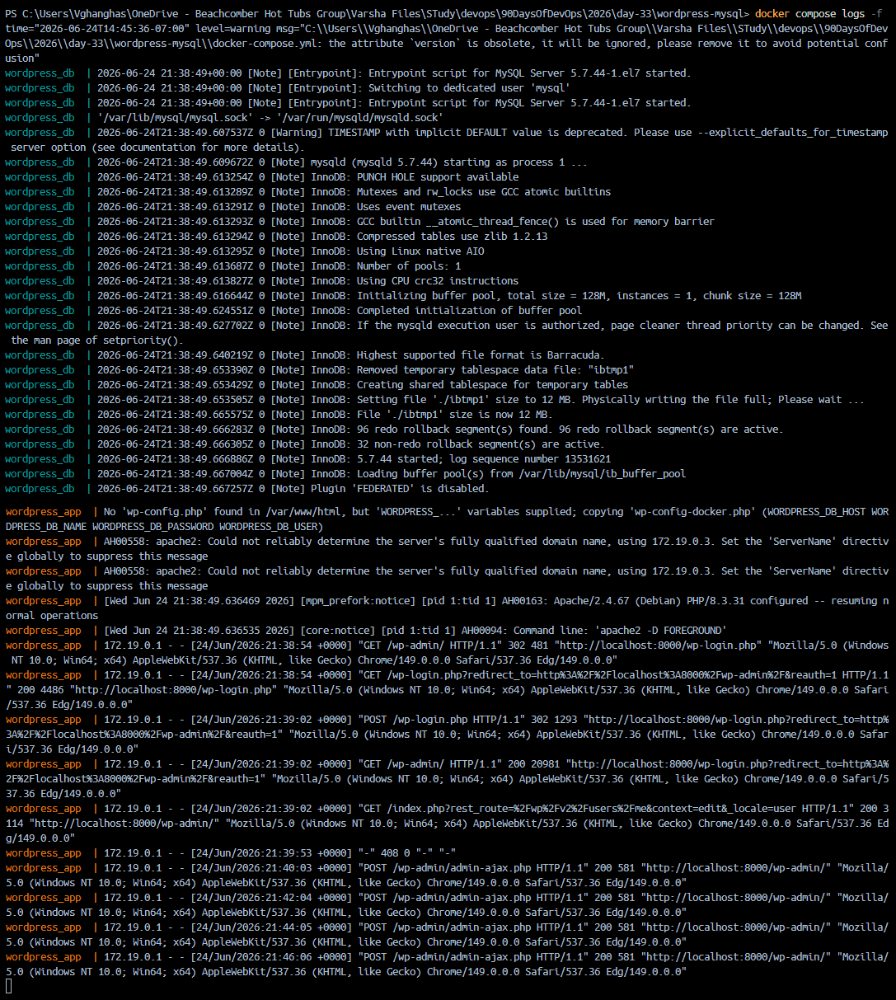

4. View logs of a **specific** service: check `db` logs
```bash
docker compose logs db
```
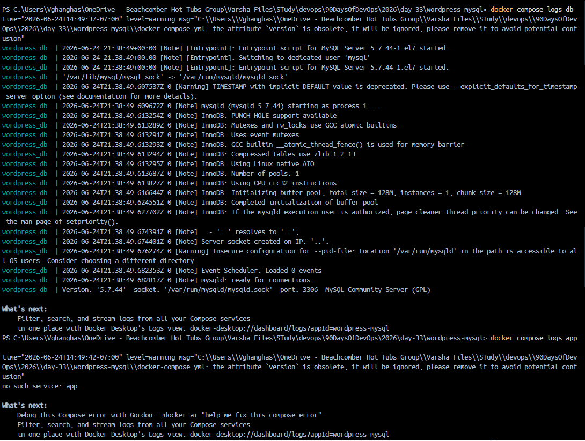

5. **Stop** services without removing
```bash
docker compose stop
```

6. **Remove** everything (containers, networks)
```bash
docker compose down
```
*(To wipe out named volumes at the same time, include the volume flag: docker compose down -v)*

7. **Rebuild** images if you make a change
```bash
docker compose up -d --build
```
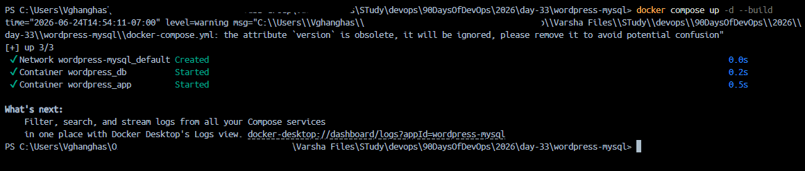

---

### Task 5: Environment Variables
1. Add environment variables directly in your `docker-compose.yml`
2. Create a `.env` file and reference variables from it in your compose file
```bash
# Database Configuration Secrets
DB_ROOT_PASSWORD=rootpassword
DB_NAME=wordpress
DB_USER=wp_user
DB_PASSWORD=wppassword
```
Use env variables in `docker-compose.yml` like `${DB_NAME}` etc.

3. Verify the variables are being picked up
    - Check Interpolation without Running
    ```bash
    docker compose config
    ```
    *Expected Result*: The terminal will output your complete configuration file with all `${VARIABLES}` replaced by the real values from your `.env` file.
    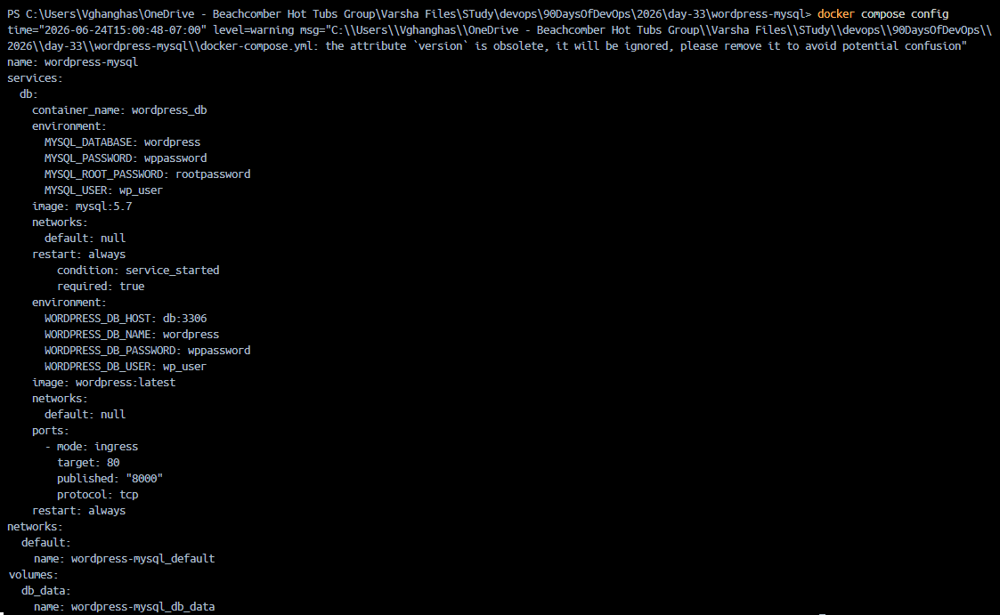
    - Check Runtime Variables Inside the Live Container
    ```bash
    docker compose up -d
    # for ubuntu use grep
    docker compose exec db env | grep MYSQL

    # for  powershell use select-string or findstr
    docker compose exec db env | Select-String "MYSQL"
    # OR findstr
    docker compose exec db env | findstr MYSQL
    ```
    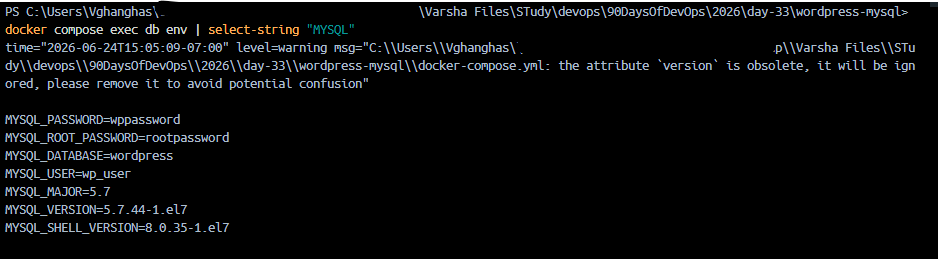

---

## 📌 Key Takeaways & Lessons Learned

* **Automatic DNS Resolution:** Docker Compose creates an isolated network automatically. Services within the same file use their defined block name (e.g., `db`) as a functional network host name without needing explicit IP mappings.
* **Detached Mode Wins**: Running `docker compose up -d` is essential for multi-tasking because it detaches the container process from your shell, keeping your terminal terminal window completely free for other commands.
* **Live Log Streaming**: Using `docker compose logs -f` keeps you from guessing what is happening inside your app by locking your terminal onto a live, real-time output stream of all internal application traffic and errors.
* **Volume Life Cycles:** Running `docker compose down` destroys container instances but preserves named system volumes intact. To completely purge configurations and cached database tables for testing, use the `-v` flag (`docker compose down -v`).
* **Environment Isolation:** Using a `.env` file prevents hardcoded production credentials from accidentally leaking into public repository files, separating runtime configuration logic from orchestration structure.


