# Day 34 – Docker Compose: Real-World Multi-Container Apps

### Task 1: Build Your Own App Stack
Create a `docker-compose.yml` for a 3-service stack:
- A **web app** (use Python Flask, Node.js, or any language you know)
- A **database** (Postgres or MySQL)
- A **cache** (Redis)

Write a simple Dockerfile for the web app. The app doesn't need to be complex — even a "Hello World" that connects to the database is enough.

```bash
mkdir 3-tierApp
cd 3-tierApp
```

Project Repo: [3-tierApp](https://github.com/varshaghanghas/3-tierApp)

Now create `app.py`, `Dockerfile` and `docker-compose.yml`

```bash
docker compose up -d --build
```

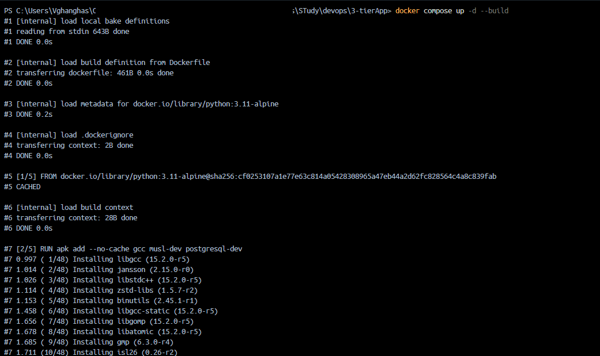

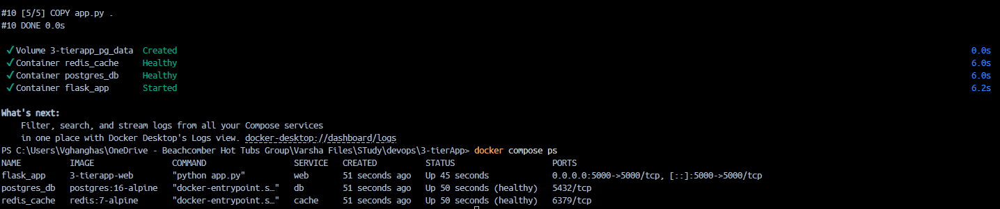

```bash
docker compose ps
```

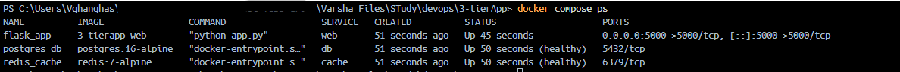

Run app in `http://localhost:5000/` and you will see app is running.


---

### Task 2: depends_on & Healthchecks
1. Add `depends_on` to your compose file so the app starts **after** the database
2. Add a **healthcheck** on the database service
3. Use `depends_on` with `condition: service_healthy` so the app waits for the database to be truly ready, not just started

**Test:** Bring everything down and up — does the app wait for the DB?

In `docker-compose.yml` file add:

```yaml
    web:
        ...
        # Forces web to wait for successful health check runs
        depends_on:
            db:
                condition: service_healthy
            cache:
                condition: service_healthy

    db:
        ...
        # Dynamic health check using matching .env credentials
        healthcheck:
            test: ["CMD-SHELL", "pg_isready -U $$POSTGRES_USER -d $$POSTGRES_DB"]
            interval: 5s
            timeout: 5s
            retries: 5
            start_period: 5s
```

**Run the Lifecycle Test**
- Purge the Active Stack:

```bash
docker compose down
```

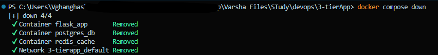

- Start and Watch the Startup Sequencing:

```bash
docker compose up --build
```
Run the stack creation in the foreground (without the `-d` flag) so you can visually confirm that the app waits patiently for the backing services:

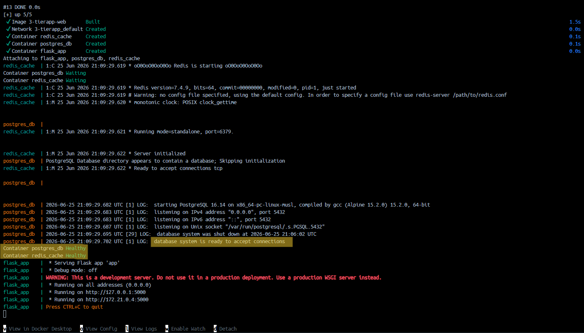

**What to Look For in Your Terminal Logs:**
- You will see `postgres_db` and `redis_cache` containers spin up first.
- The engine will show `postgres_db` logs initializing database structures, while `flask_app` remains completely uninitiated.
- Once the database displays `database system is ready to accept connections`, Docker runs the `pg_isready` healthcheck script.
- As soon as the database status switches to **healthy**, Docker Compose finally kicks off the build/execution step for `flask_app`.

Once the logs settle, open a secondary PowerShell tab and check the health status explicitly:

```bash
docker compose ps
```

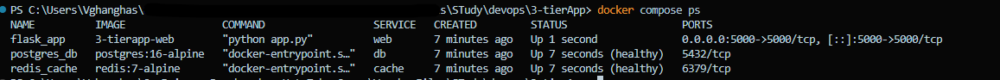

**Lets simulate real time database crach**
- Kill the database container instantly and observer the original log window:
    - You will immediately see an error entry showing that `postgres_db` exited with code `137` (SIGKILL).

```bash
docker compose kill db
```

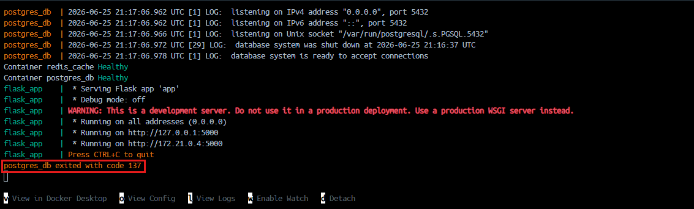

    - I tried running curl `http://localhost:5000` right now. The web app will pause or display a database connection error page, proving that the web service didn't crash entirely; it's gracefully throwing handling exceptions

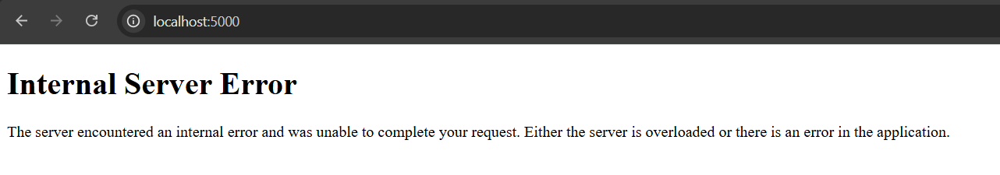

- Watch Docker heal itself:
    - Because your `docker-compose.yml` specifies `restart: unless-stopped`, Docker Daemon recognizes the abrupt crash and automatically boots a fresh container instance.

    To fix this we will update `app.py` function `init_db()` and `hello()`, we have wrapped the connection inside a local retry loop

```python
# Simple DB Initialization
def init_db():
    # Wrap connection instantiation inside a local retry loop to survive initialization racing
    retries = 5
    while retries > 0:
        try:
            conn = get_db_connection()
            cur = conn.cursor()
            cur.execute('CREATE TABLE IF NOT EXISTS visits (id SERIAL PRIMARY KEY, ts TIMESTAMP DEFAULT CURRENT_TIMESTAMP);')
            conn.commit()
            cur.close()
            conn.close()
            break
        except Exception as e:
            retries -= 1
            print(f"Database not ready yet, retrying... ({retries} left)")
            time.sleep(2)

def hello():
    count = get_hit_count()
    
    # FIX: We dynamically request a new socket from the database container here!
    # If the DB crashed and restarted, this will connect cleanly to the new instance.
    try:

        # Log to PostgreSQL
        conn = get_db_connection()
        cur = conn.cursor()
        cur.execute('INSERT INTO visits DEFAULT VALUES;')
        conn.commit()
        cur.close()
        conn.close()
    except Exception as e:
        print(f"Database logging failed: {e}")
        return f"Hello World! This page has been viewed {count} times. (Database log failed but app survived!)"
    
    return f"Hello World! This page has been viewed {count} times.\n"

```

    Wait 5 seconds for the database to complete auto-initialization, then execute another request refresh curl `http://localhost:5000`


---

### Task 3: Restart Policies
1. Add `restart: always` to your database service
2. Manually kill the database container — does it come back?

Update `docker-compose.yml`

```yaml
db:
    ...
    restart: always     # update to `always` not `unless-stopped`
```

test it:
```bash
docker compose kill db
```

`http://localhost:5000` will work again. Run `docker compose ps` repeatedly. You will witness the container state cycle from exited/dead straight back into a initializing state until it reads (`healthy`). Docker daemon monitors the process and spins up a matching container immediately.

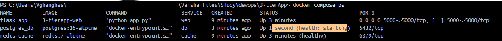

3. Try `restart: on-failure` — how is it different?
- Update `docker-compose.yml` file to `restart: on-failure` and apply it with `docker compose up -d`. Now, simulate a clean, manual shutdown vs an abrupt crash:
    - **Scenario A (Clean Exit)**: Run `docker compose stop db`. Check `docker compose ps`. The container stays stopped. This is because a manual stop command tells Docker the exit was intentional (Exit Code 0).
    - `Scenario B (Crash Exit):` Run `docker compose kill db`. The container will come back. The kill command generates a non-zero exit code (typically 137), triggering the on-failure mechanism.


4. Write in your notes: When would you use each restart policy?

| Restart Policy | Behavioral Rule  | Best Production Use Case  |
|----|----|----|
| `no` | Default setting. Docker never attempts to restart a dead container under any circumstance. | **One-off utilities or migration routines** (e.g., database schema migrations, data backfill scripts, test runners). |
| `always` | Always restarts the container when it stops. If manually stopped, it kicks back alive immediately when the Docker system daemon restarts. | **Mission-critical stateless applications** (e.g., public API gateways, web servers, reverse proxies like Nginx) that must match the uptime of the host node. |
| `unless-stopped` | Restarts the container in all failure states, but respects manual administrative actions. If you stop it manually, it *stays* stopped even if the machine reboots. | **Stateful infrastructure engines** (e.g., PostgreSQL, MySQL, Redis, Kafka clusters). This prevents unexpected database boots during planned maintenance windows. |
| `on-failure` | Restarts the container only if the application crashes with a non-zero exit code. | **Background workers, microservice consumers, or cron-like systems** (e.g., queue processors, log aggregators). If they finish successfully, they sleep; if they crash, they recover. |

---

### Task 4: Custom Dockerfiles in Compose
1. Instead of using a pre-built image for your app, use `build:` in your compose file to build from a Dockerfile
2. Make a code change in your app
3. Rebuild and restart with one command

Update `app.py`

```py
@app.route('/')
def hello():
    count = get_hit_count()
    
    try:
        conn = get_db_connection()
        cur = conn.cursor()
        cur.execute('INSERT INTO visits DEFAULT VALUES;')
        conn.commit()
        cur.close()
        conn.close()
    except Exception as e:
        print(f"Database logging failed: {e}")
        return f"🚀 [V2 Production Engine] Viewed {count} times. (Database log failed!)"
    
    # Updated output message text string
    return f"🚀 [V2 Production Engine] Hello from Docker Compose! This page has been viewed {count} times.\n"

```

Rebuild and Restart with One Command `docker compose up -d --build`
    - `--build`: Tells Docker to scan local file hashes, notice the change inside `app.py`, invalidate the old layer cache, and build an updated container image.
    - `-d` (Detached): Hands control back to your terminal window.
    - **Zero Downtime Optimization**: Docker Compose keeps your old container version servicing requests until the compilation step completes successfully, minimizing endpoint downtime.

Confirm the update by running `http://localhost:5000` in browser:


---

### Task 5: Named Networks & Volumes
1. Define **explicit networks** in your compose file instead of relying on the default
2. Define **named volumes** for database data
3. Add **labels** to your services for better organization

Update `docker-compose.yml` to:

```yml
services:
  web:
    build: .
    container_name: flask_app
    ports:
      - "${BACKEND_HOST_PORT}:${BACKEND_PORT}"
    environment:
      - DB_HOST=db
      - DB_USER=${POSTGRES_USER}
      - DB_PASSWORD=${POSTGRES_PASSWORD}
      - DB_NAME=${POSTGRES_DB}
      - REDIS_HOST=cache
    restart: always
    # Connects to both frontend traffic and backend data pools
    networks:
      - web_network
      - data_network
    depends_on:
      db:
        condition: service_healthy
      cache:
        condition: service_healthy
    labels:
      com.devboard.tier: "frontend"
      com.devboard.environment: "production"
      com.devboard.managed-by: "docker-compose"

  db:
    image: postgres:16-alpine
    container_name: postgres_db
    environment:
      - POSTGRES_USER=${POSTGRES_USER}
      - POSTGRES_PASSWORD=${POSTGRES_PASSWORD}
      - POSTGRES_DB=${POSTGRES_DB}
    volumes:
      - pg_production_data:/var/lib/postgresql/data
    restart: always
    # Isolated strictly to the internal data layer
    networks:
      - data_network
    healthcheck:
      test: ["CMD-SHELL", "pg_isready -U $$POSTGRES_USER -d $$POSTGRES_DB"]
      interval: 5s
      timeout: 5s
      retries: 5
      start_period: 5s
    labels:
      com.devboard.tier: "database"
      com.devboard.environment: "production"

  cache:
    image: redis:7-alpine
    container_name: redis_cache
    restart: unless-stopped
    # Isolated strictly to the internal data layer
    networks:
      - data_network
    healthcheck:
      test: ["CMD", "redis-cli", "ping"]
      interval: 5s
      timeout: 5s
      retries: 3
      start_period: 3s
    labels:
      com.devboard.tier: "cache"
      com.devboard.environment: "production"

# 1. Declaring Explicit Isolated Bridge Networks
networks:
  web_network:
    driver: bridge
  data_network:
    driver: bridge

# 2. Declaring Named Persistent Volumes
volumes:
  pg_production_data:
    driver: local

```

**Production Architecture**
- Network Segregation for Security
    - **The Vulnerability**: In standard setups, if a hacker compromises your web container, they have open channel visibility to run exploits directly against your raw database ports.
    - **The Shield**: By creating `web_network` and `data_network`, we insulate the database. The `flask_app` sits on both networks to bridge requests, but `postgres_db` and `redis_cache` are locked inside `data_network`, keeping them completely hidden from public traffic.
- Production Labels
    - Labels function as structural metadata. They don't change how code runs, but they are required for production environments to allow tools like log aggregators, security scanners, or automated metric pipelines to target specific container scopes cleanly.

**Deploy and Verify the Upgrades**
- apply changes with `docker compose up -d --build`
- Audit your newly configured isolated networks with `docker network ls`

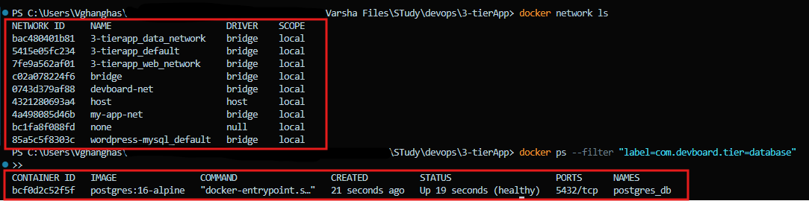

*(You will see 3-tierapp_web_network and 3-tierapp_data_network successfully provisioned).*

---

### Task 6: Scaling (Bonus)
1. Try scaling your web app to 3 replicas using `docker compose up --scale`
2. What happens? What breaks?
3. Write in your notes: Why doesn't simple scaling work with port mapping?

- Scale Your Web App to 3 Replicas

```bash
docker compose up -d --scale web=3
```

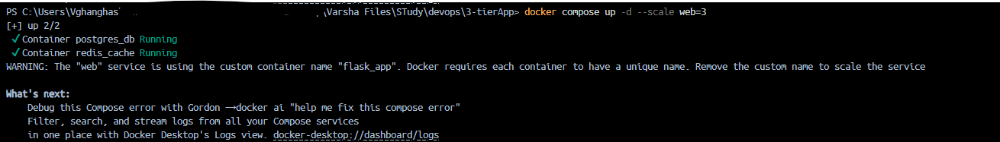

- The Hidden Conflict: `container_name`. 
- Why it creashes? Before Docker Compose could even attempt to bind network ports, it crashed on a Name Collision. So remove `container_name` completely and re-run `docker compose up -d --scale web=3`

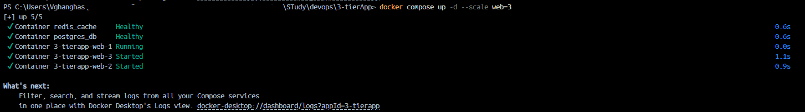

Run `docker compose ps` now:
```bash
docker compose ps
```

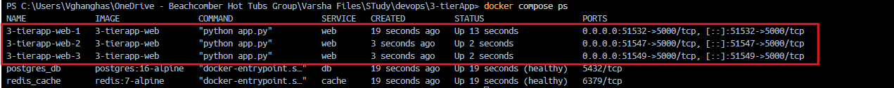

We will now see three separate containers running named `3-tierapp-web-1`, `3-tierapp-web-2`, and `3-tierapp-web-3` working concurrently, each mapped to a separate random host port!

Also all 3 apps are accessible:

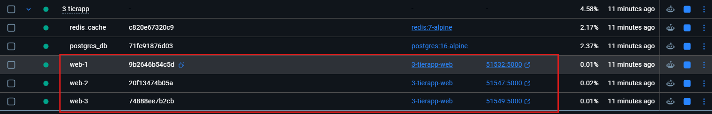

**Production Resolution**: Remove fixed *container naming strings*, map internally via dynamic or exposed port parameters, and insert an orchestrator layer (like an Nginx or Traefik Load Balancer) at the gateway layer to distribute traffic down to the underlying backend instances.

---

## Hints
- Build from Dockerfile: `build: ./app`
- Healthcheck: `healthcheck:` with `test`, `interval`, `timeout`
- Rebuild: `docker compose up --build`
- Scale: `docker compose up --scale web=3`

---

## Submission
1. Add your compose files, Dockerfiles, and `day-34-compose-advanced.md` to `2026/day-34/`
2. Commit and push to your fork

---

## Learn in Public
Share your 3-service app stack running via Compose on LinkedIn.

`#90DaysOfDevOps` `#DevOpsKaJosh` `#TrainWithShubham`

Happy Learning!
**TrainWithShubham**
