# Day 35 – Multi-Stage Builds & Docker Hub

Multi-stage builds allow you to use multiple `FROM` statements in a single `Dockerfile`. You build your application in one stage and copy only the final, essential artifacts (like a compiled binary or static files) into a lightweight production stage, drastically reducing final image sizes and improving security.


### Task 1: The Problem with Large Images
1. Write a simple Go, Java, or Node.js app (even a "Hello World" is fine)

```bash
mkdir node-test-stage
cd node-test-stage
```
Create a file named `app.js` and add this simple server code

```bash
const http = require('http');

const server = http.createServer((req, res) => {
    res.writeHead(200, { 'Content-Type': 'text/plain' });
    res.end('Testing single-stage image size\n');
});

server.listen(5000, () => {
    console.log('Server running on port 5000');
});

```

2. Create a Dockerfile that builds and runs it in a **single stage**
Create the Single-Stage `Dockerfile`:

```dockerfile
# Single stage using the full Node.js development image
FROM node:22

WORKDIR /usr/src/app

# Copy the application file
COPY app.js .

EXPOSE 5000

# Start the application
CMD [ "node", "app.js" ]
```

3. Build the image and check its **size**
Run the build command to generate your heavy single-stage image:

```bash
docker build -t 3tier-node-heavy:v1 .
```

Run the following command to view the total disk space this single-stage image uses:

```bash
docker images 3tier-node-heavy:v1
```

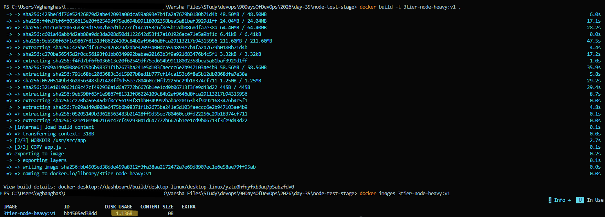

We'll compare it later.

---

### Task 2: Multi-Stage Build
1. Rewrite the Dockerfile using **multi-stage build**:
   - Stage 1: Build the app (install dependencies, compile)
   - Stage 2: Copy only the built artifact into a minimal base image (`alpine`, `distroless`, or `scratch`)

```dockerfile
# --- STAGE 1: Build & Dependency Stage ---
# Use the full Node image to handle heavy installations or build tasks
FROM node:22 AS builder

WORKDIR /usr/src/app

# Copy the app file (or package.json if you had dependencies)
COPY app.js .


# --- STAGE 2: Lightweight Production Stage ---
# Use a minimal, security-hardened Alpine Linux runner image
FROM node:22-alpine

WORKDIR /usr/src/app

# Copy ONLY the final application files from Stage 1
COPY --from=builder /usr/src/app/app.js .

EXPOSE 5000

# Run the app using the minimal Alpine Node runtime
CMD [ "node", "app.js" ]
```

2. Build the image and check its size again

```bash
docker build -t 3tier-node-slim:v1 .
```

3. Compare the two sizes

```bash
docker images | Select-String "3tier-node"
```

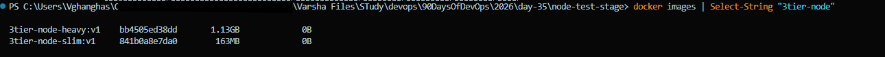

**Why is the multi-stage image so much smaller?**
- **Stripped Build Tooling**: The full `node:22` image contains an entire Debian Linux OS backdrop equipped with build suites, Python interpreters, C++ compilers, package managers, and header libraries designed to compile native code. The production multi-stage runner completely leaves these behind.
- **Minimal Base Image**: Stage 2 utilizes `node:22-alpine` which is built on top of Alpine Linux—a distribution designed around a tiny, highly secure 5 MB footprint.
- **No Build Artifact Fluff**: Any intermediate log files, cached downloads, or temporary files generated during dependency installations stay trapped in the temporary `builder` stage, ensuring they never leak into your deployment container.

---

### Task 3: Push to Docker Hub
1. Create a free account on [Docker Hub](https://hub.docker.com) (if you don't have one)
2. Log in from your terminal
3. Tag your image properly: `yourusername/image-name:tag`

```bash
docker tag 3tier-node-slim:v1 varshaghanghas/3tier-node-slim:v1
```

Run command to see your tagged image:

```bash
docker images
```

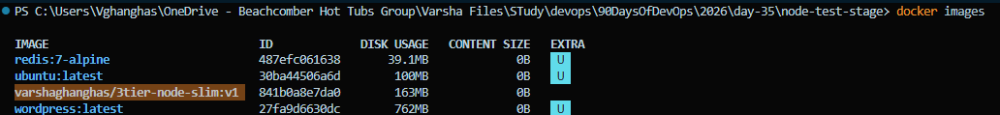

4. Push it to Docker Hub: We will pull a new copy and push that image to docker hub.

```bash
docker push varshaghanghas/3tier-node-slim:v1
```
Image pushed on GitHub

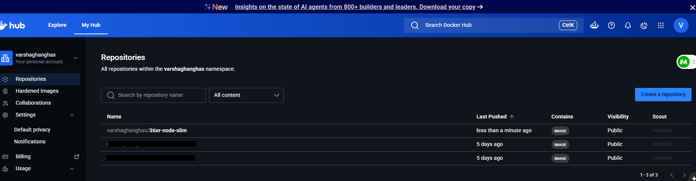

5. Pull it on a different machine (or after removing locally) to verify

```bash
docker rmi 3tier-node-slim:v1
docker rmi varshaghanghas/3tier-node-slim:v1
```

Build new image and run:

```bash
docker build -t varshaghanghas/3tier-node-slim:v1 .
docker run -d -p 5000:5000 --name running-cloud-app varshaghanghas/3tier-node-slim:v1
```

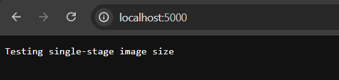

**Let's apply these multi-stage build optimization techniques directly to [3-tierApp](https://github.com/varshaghanghas/3-tierApp/)**
    1. Navigate to project folder: `cd ../3-tierApp`
    2. Update `Dockerfile`:

    ```dockerfile
    # --- STAGE 1: Build and Wheel Compilation ---
    FROM python:3.12-slim AS builder

    WORKDIR /app

    # Install native system build requirements needed for certain Python wheels
    RUN apt-get update && apt-get install -y --no-install-recommends \
        build-essential \
        libpq-dev \
        && rm -rf /var/lib/apt/lists/*

    # Copy your dependency configurations
    COPY requirements.txt .

    # Build wheels into a local wheelhouse directory to avoid dirtying system paths
    RUN pip wheel --no-cache-dir --no-deps --wheel-dir /app/wheels -r requirements.txt


    # --- STAGE 2: Lightweight Production Deployment Runtime ---
    FROM python:3.12-slim

    WORKDIR /app

    # Install runtime-only system dependencies (like libpq for PostgreSQL connectivity)
    RUN apt-get update && apt-get install -y --no-install-recommends \
        libpq5 \
        && rm -rf /var/lib/apt/lists/*

    # Grab the pre-compiled Python wheels from the builder stage
    COPY --from=builder /app/wheels /app/wheels
    COPY --from=builder /app/requirements.txt .

    # Install the dependencies instantly from your local compiled wheels
    RUN pip install --no-cache-dir /app/wheels/*

    # Copy your actual application files into the production path
    COPY . .

    EXPOSE 5000

    CMD ["python", "app.py"]
    ```

    3. Build code & validate optimized result:

    ```bash
    docker build -t 3tier-flask-optimized:v1 .

    #validate optimized
    docker images | Select-String -Pattern "python", "3tier-flask"
    ```

    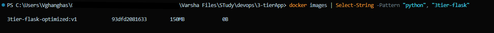

---

### Task 4: Docker Hub Repository
1. Go to Docker Hub and check your pushed image


2. Add a **description** to the repository

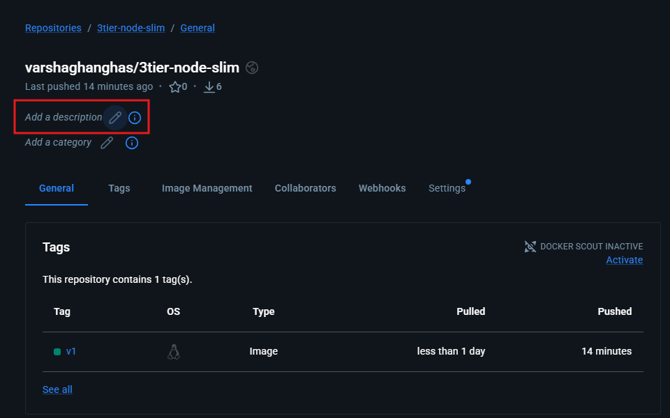

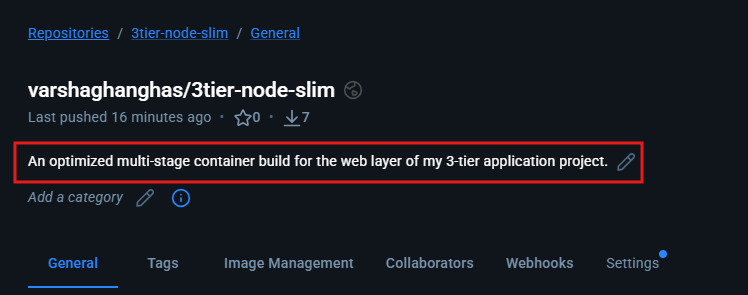

3. Explore the **tags** tab — understand how versioning works
Click on the Tags tab at the top of your repository page.

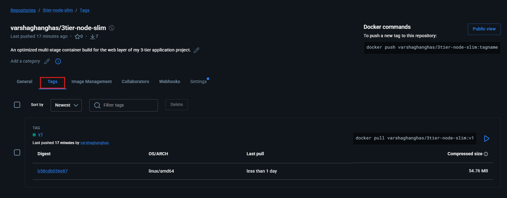

In software deployment, tags act as explicit version pointers. Instead of constantly overwriting your files, versioning allows you to preserve your historical code releases:
- **Production Safety**: If you deploy a broken update to production, you can immediately roll back to an older, working version tag (like `v1`).
- **Traceability**: You can easily track exactly which version of your source code matches a specific container build running in the cloud.

- Think of **Docker tags** exactly like GitHub releases or commits, but for your entire application instead of just your code. Like when you finish a stable feature on GitHub, you might create a release named `v1.0`. No matter what you change on your main branch later, that `v1.0` release remains locked in time.

Docker tags work the exact same way. When you run:

```bash
docker pull yourusername/app:v1
```

You are telling Docker: "*Give me the exact snapshot of the app from when I tagged it `v1`*." It is safe, predictable, and never changes.

- The `latest` tag is like the `main` or `master` branch:
On GitHub, the `main` branch is a moving target. Every time you push new code, `main` updates to show the newest files. If a teammate clones your repo using `main` today, they might get totally different code than if they cloned it last week.
In Docker, if you run a command without a version number, Docker automatically looks for the word `latest`:

```bash
docker pull yourusername/app
# (Docker automatically turns this into app:latest)
```

Just like the `main` branch, `latest` simply points to whatever was uploaded most recently.

4. Pull a specific tag vs `latest` — what happens?
- Pull a specific tag:

```bash
docker pull varshaghanghas/3tier-node-slim:v1
```

**What happens**: Docker asks the registry explicitly for the immutable image layer bundle locked under the `v1` label.
**The Result**: You are guaranteed to get the exact same image content every single time, no matter how much time has passed.

- Pulling `latest`:

```bash
docker pull varshaghanghas/3tier-node-slim
```

**What happens**: It returns error as we never uploaded a version tagged as `latest` to Docker Hub repository. I only uploaded `v1`. Because we did not type a version at the end of your command, Docker automatically assumed I wanted `latest`. Since that tag does not exist in the cloud, Docker panicked and threw an error.
This proves exactly what we just discussed: `latest` does not mean "the newest file I uploaded." It is literally just a text label!

**How to Fix It**
To pull your image successfully, you must tell Docker exactly which tag to look for:

```bash
docker pull varshaghanghas/3tier-node-slim:v1
```

**What to Do If You Actually WANT a `latest` Tag**
If you want people to be able to run your command without typing a version number, you have to explicitly create and push a `latest` tag from your machine:
- Tag your local image again with the word `latest`:

```bash
docker tag varshaghanghas/3tier-node-slim:v1 varshaghanghas/3tier-node-slim:latest
```

- Push that new tag to Docker Hub:

```bash
docker push varshaghanghas/3tier-node-slim:latest
```

Now if we goto Docker Hub , we will see two tags sitting inside our repository: `v1` and `latest`.

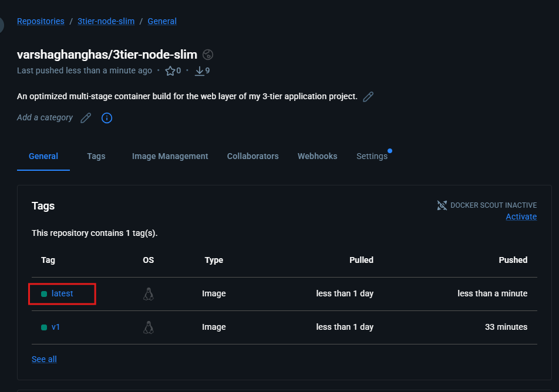

---

### Task 5: Image Best Practices
Apply these to one of your images and rebuild:
1. Use a **minimal base image** (alpine vs ubuntu — compare sizes)
2. **Don't run as root** — add a non-root USER in your Dockerfile
3. Combine `RUN` commands to **reduce layers**
4. Use **specific tags** for base images (not `latest`)

```bash
cd node-test-stage
```

Update `Dockerfile`:

```dockerfile
# --- STAGE 1: Build & Dependency Stage ---
# Practice 1: Use specific tags for base images (node:22.14.0 instead of node:latest)
FROM node:22.14.0 AS builder

WORKDIR /usr/src/app

COPY app.js .


# --- STAGE 2: Lightweight & Secure Production Stage ---
# Practice 2: Use a minimal base image (alpine instead of full ubuntu/debian)
FROM node:22.14.0-alpine

WORKDIR /usr/src/app

# Practice 3: Combine RUN commands to reduce layers (Example if you had system tools)
# RUN apk update && apk add --no-cache curl

# Copy the application from the builder stage
COPY --from=builder /usr/src/app/app.js .

# Practice 4: Don't run as root! Use the built-in 'node' user for security.
USER node

EXPOSE 5000

CMD [ "node", "app.js" ]
```

Build Image:

```bash
docker build -t 3tier-node-bestpractice:v1 .
```

Check and Compare the size Before and After:

```bash
docker images | Select-String "3tier-node"
```

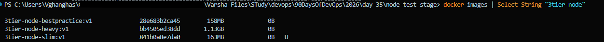

Before Best Practices (3tier-node-heavy:v1): ~1.1 GB
Before Best Practices (3tier-node-slim:v1): ~163 MB
After Best Practices (3tier-node-bestpractice:v1): ~158 MB

**Why These Best Practices Matter**
- **Minimal Base Images** (Alpine vs. Ubuntu): A standard Ubuntu base image starts at around 75 MB before adding your application runtime. Alpine Linux starts at just 5 MB. Using Alpine strips away hundreds of megabytes of extra utilities you don't need to run a simple script.
- **Non-Root USER Security**: By default, Docker containers run your code as the root (administrator) user. If a hacker exploits a vulnerability in your Node app, they instantly gain full root control over your container environment. Switching to `USER node` blocks this attack vector completely.
- **Combining RUN Commands**: Every separate `RUN`, `COPY`, and `FROM` instruction creates a distinct physical layer on your disk. Combining commands using `&&` and cleaning up caches in the same line ensures temporary installation junk is never saved into your final image layers.
- **Specific Base Image Tags**: Locking down your base image to a strict version (like `node:22.14.0-alpine`) guarantees that your container builds will look identical today, next month, or three years from now. It prevents a breaking language update from breaking your app automatically.

---
