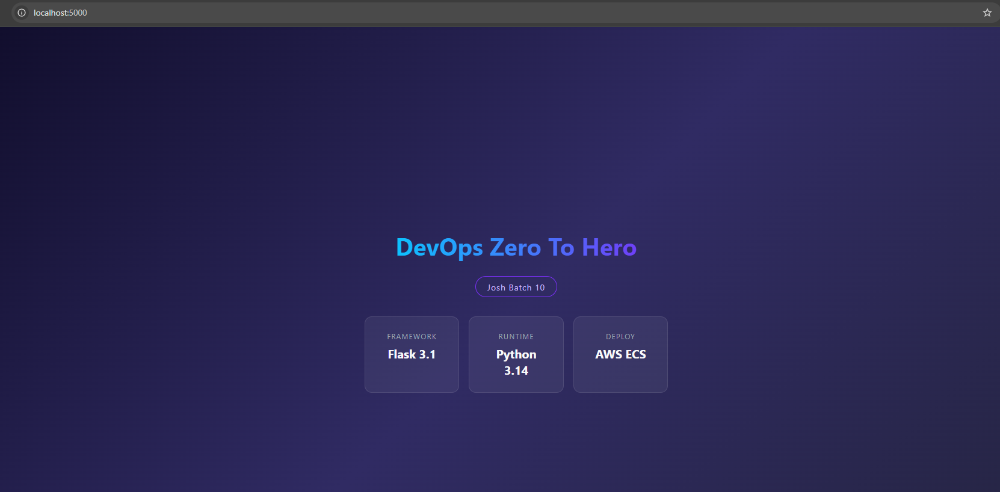

# Day 36 – Docker Project: Dockerize a Full Application


### Task 1: Pick Your App

1. Clone Repo: [flask-app-ecs](https://github.com/LondheShubham153/flask-app-ecs)
2. Remove Dockerfile and try rewriting it:

---

### Task 2: Write the `Dockerfile`

```dockerfile
# Base image (OS)
FROM python:3.14-slim

# Working directory
WORKDIR /app

# Copy src code to container
COPY . .

# Run the build commands
RUN pip install -r requirements.txt

# expose port 5000
EXPOSE 5000

# run the app
CMD ["python","run.py"]
```

3. Build:

```bash
docker build -t flask-app .
docker run -p 5000:5000 flask-app flask-app
```

4. Check if your app is running `http://localhost:5000/` and it should work.



---
### Task 3: Add Docker Compose

`docker-compose.yml`:

```yml
version: "3.8"

services:
  web_app:
    build:
      context: .
      dockerfile: Dockerfile
    container_name: flask_web_container
    restart: always
    ports:
      - "5000:5000"
    env_file:
      - .env
    depends_on:
      db_service:
        condition: service_healthy
    networks:
      - devops_network

  db_service:
    image: postgres:15-alpine
    container_name: postgres_db_container
    restart: always
    env_file:
      - .env
    volumes:
      - pg_data_volume:/var/lib/postgresql/data
    networks:
      - devops_network
    healthcheck:
      test:
        [
          "CMD-SHELL",
          "pg_isready -U $POSTGRES_USER -d $POSTGRES_DB"
        ]
      interval: 10s
      timeout: 5s
      retries: 5
      start_period: 10s

volumes:
  pg_data_volume:
    driver: local

networks:
  devops_network:
    driver: bridge
```

- Run and Verify the Setup

```bash
# build your Flask image & launch 
docker compose up -d --build

# Verify running containers
docker compose ps

# check live logs
docker compose logs -f
```

---

### Task 4: Ship It
1. Tag your app image: check if docker login:

```bash
docker login
```

2. Push it to Docker Hub

```bash
# tag using exact local image name `flask-app-ecs-web_app`
docker tag flask-app-ecs-web_app:latest varshaghanghas/flask-app-ecs:v1.0

# push to dockerHub
docker push varshaghanghas/flask-app-ecs:v1.0
```

3. Share the [Docker Hub link](https://hub.docker.com/repository/docker/varshaghanghas/flask-app-ecs/tags/v1.0)

Now try pulling this image in local

```bash
# remove all local  images
# 1. Stop and remove the active Docker Compose stack
docker compose down

# 2. Delete your old local app images to clear space
docker rmi flask-app-ecs-web_app:latest
docker rmi varshaghanghas/flask-app-ecs:v1.0


# 1. pull image
docker pull varshaghanghas/flask-app-ecs:v1.0

# 2. run server on port 5000
docker run -d -p 5000:5000 --name cloud-app-test varshaghanghas/flask-app-ecs:v1.0
```

4. Write a `README.md` in your project with:
    - **What the app does**:
    This is a containerized Python Flask web application paired with a PostgreSQL database. The project demonstrates multi-stage builds, non-root user execution, custom networks, and automated database health check bindings.
        - **Frontend Dashboard**: Renders a dynamic web page to track configurations.
        - **Data Persistence**: Uses a background PostgreSQL server with dedicated volumes to retain information.
        - **Security First**: Runs using a dedicated non-root account for container process safety.
        - **Resilient Orchestration**: The web container waits until the database passes its internal health checks before starting up.

    - **Any environment variables needed**:
    We need `.env`. Create a `.env` file in the root folder before launching. It must contain the following variables:

    ```env
    # Flask Setup
    FLASK_ENV=production
    DATABASE_URL=postgresql://devops_user:secure_password123@db_service:5432/flask_db

    # PostgreSQL Configurations
    POSTGRES_USER=devops_user
    POSTGRES_PASSWORD=secure_password123
    POSTGRES_DB=flask_db
    ```

    - **How to run it with Docker Compose**:
        - Make sure your `.env` file is saved in the root folder.
        - Build and launch the container stack in the background:

        ```bash
        docker compose up -d

        # check logs  to check everythung connected successfully
        docker compose up -d

        # Verify both containers are up and running
        docker compose ps
        ```

        - Open your web browser and run locally `http://localhost:80`
        - To bring the stack down while saving your database information using `docker compose down`.
