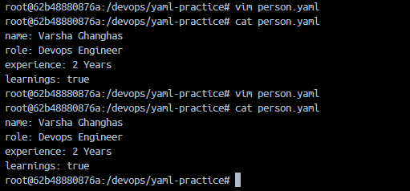
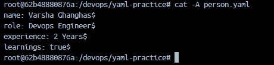
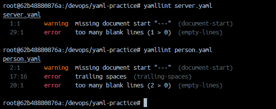

# Day 38 – YAML Basics

**YAML** stands for *YAML Ain't Markup Language* and it is a highly popular human-readable data serialization format primarily used for writing configurations files in tools like Docker, Kubernetes & Ansible. It relies heavily on indentation to structure data, making it much cleaner and easier to read than XML or JSON.

## Rules of writing a YAML
- **Spaces only**: You must use spaces for indentation.
- **No tabs**: Pressing the Tab key will break your file entirely.
- **Space after punctuation**: Colons (`:`) and dashes (`-`) must always be followed by a space.
- **Case sensitivity**: The words `True` and `true` are different from `TRUE` depending on the parser.

### Building Blocks
1. Key-Value Pairs (Mappings): The most basic element is a key followed by a colon, a space, and a value.

```yml
server_name: production_backend
port: 8080
is_active: true
```

2. Lists (Sequences): Items in a list are designated by a leading dash and a space. Every item sits at the exact same indentation level.

```yml
allowed_environments:
  - development
  - staging
  - production
```

3. Nested Objects (Dictionaries): You can nest data by indenting child keys underneath a parent key (typically using 2 spaces).

```yml
database:
  host: localhost
  port: 5432
  credentials:
    username: admin
```

4. Strings and Multi-line Text: Quotes around strings are completely optional unless the text contains special characters (like `:`, `{`, or `[`). When writing paragraphs, you can control how newlines behave:
    - Literal Block (`|`): Keeps all your line breaks exactly as written.
    - Folded Block (`>`): Replaces single line breaks with spaces, turning text into one continuous paragraph.

```yml
# Literal block example
description: |
  This is line one.
  This is line two.

# Folded block example
bio: >
  This long sentence will
  be read as a single
  paragraph by the machine.
```

5. Extra Syntax Basics
    - Comments: Use the `#` symbol to add notes; anything after it on that line is ignored.
    - Document Dividers: You can optionally start a file with `---` and end it with `...` to separate multiple documents within a single file.

```yml
---
# Configuration for Service A
service: web
---
# Configuration for Service B
service: api
...

```

---

### Task 1: Key-Value Pairs
Create `person.yaml` that describes yourself with:
- `name`
- `role`
- `experience_years`
- `learning` (a boolean)

```yml
name: Varsha Ghanghas
role: DevOps Engineer
experience: 2 Years
learning: true
```

**Verify:** Run `cat person.yaml` — does it look clean? No tabs?



If you want to be 100% sure you didn't accidentally hit the Tab key, you can run this command to expose hidden tabs:

```yaml
cat -A person.yaml
```



---

### Task 2: Lists
Add to `person.yaml`:
- `tools` — a list of 5 DevOps tools you know or are learning
- `hobbies` — a list using the inline format `[item1, item2]`

```yaml
# Block list format
tools:
  - CI/CD
  - GitHubs Actions
  - Docker
  - Kubernetes
  - Ansible

# Inline format
hobbies: [reading, writing code, hiking]
```

Write in your notes: What are the two ways to write a list in YAML?
- **Block list format**: Best for readability
- **Inline list format** Best for short, compact data

---

### Task 3: Nested Objects
Create `server.yaml` that describes a server:
- `server` with nested keys: `name`, `ip`, `port`
- `database` with nested keys: `host`, `name`, `credentials` (nested further: `user`, `password`)

```yaml
server:
  name: web-app-01
  ip: 192.168.1.120
  port: 8080

database:
  host: db-app-01
  name: postgres
  credentials:
    user: user_admin
    password: SuperUserPass12345
```

**Verify:** Try adding a tab instead of spaces — what happens when you validate it?

**The Tab Test: What Happens?**
To see exactly how unforgiving YAML is with tabs, open your file and replace the 2 spaces before `name: web-app-01` with a single **Tab** key press. 
When you pass this tab-polluted file to a validator or parser, **it will completely crash**.
1. What an Online Validator Says:
    If you paste it into YAML Lint, you will get an immediate, loud error message like this:
    
    ```text
    "YAML Exception: found character '\t' that cannot start any token"
    ```

2. What a Programming Engine/CLI Says:
    If a Python, Docker, or CI/CD engine tries to read it, the parser will throw a fatal error and stop execution:

    ```text
    yaml.scanner.ScannerError: while scanning for the next token; found character '\t' that cannot start any token
    ```

**Why does this happen?**
YAML forbids tabs because different computer systems, text editors, and command-line tools display tabs with different visual widths (some show 4 spaces, some show 8). To ensure a configuration file looks exactly the same on every machine in the world, YAML forces everyone to use explicit spaces.

---

### Task 4: Multi-line Strings
In `server.yaml`, add a `startup_script` field using:
1. The `|` block style (preserves newlines)
2. The `>` fold style (folds into one line)

Update `server.yaml` File:

```yaml
server:
  name: web-app-01
  ip: 192.168.1.120
  port: 8080

database:
  host: db-app-01
  name: postgres
  credentials:
    user: user_admin
    password: SuperUserPass12345

app:
  name: reactapp
  user: varsha

# literal stype
startup_script_literal: |
  echo "Starting server"
  systemctl start nginx
  echo "Server is live!"

# folded style
startup_script_folded: >
  docker run -d
  --name web_app
  -p 8080:80
  my-custom-image:lates
```

Write in your notes: When would you use `|` vs `>`?
- Use the Literal Block (`|`) when Line Breaks Matter:
    - **Why**: It preserves every single new line and indentation exactly as you type it.
    - Best Used For:
        - **Shell Scripts**: Multi-line terminal commands where each command must execute on its own line.
        - **Public Keys**: SSH keys or SSL certificates that require rigid block formatting.
        - **Config Files**: Embedding entire configuration files (like an Nginx config) inside your YAML.
- Use the Folded Block (`>`) when Readability Matters to Humans, but the Machine Needs One Line
    - **Why**: It allows you to break up an incredibly long string in your text editor so you don't have to scroll horizontally, but it converts those line breaks into standard spaces when processed.
    - Best Used For:
        - **Long CLI Commands**: Breaking up a massive Docker or Kubernetes command with many flags into an easy-to-read stack.
        - **Descriptions**: Writing long multi-sentence paragraphs, documentation, or deployment notes.

---

### Task 5: Validate Your YAML
1. Install `yamllint` or use an online validator

```bash
# Install yamllint
sudo apt install yamllint      # Ubuntu/Debian
brew install yamllint          # macOS
```

2. Validate both your YAML files

```bash
# Validate your files
yamllint person.yaml
yamllint server.yaml
```

3. Intentionally break the indentation — what error do you get?



4. Fix it and validate again: clean it automatically with
I missed adding `---` in both my files so its fixed now

```bash
sed -i 's/[[:space:]]*$//' person.yaml
```


---

### Task 6: Spot the Difference
Read both blocks and write what's wrong with the second one:

```yaml
# Block 1 - correct
name: devops
tools:
  - docker
  - kubernetes
```

```yaml
# Block 2 - broken
name: devops
tools:
- docker
  - kubernetes
```

In **Block 2**, the list items under `tools` are misaligned because `- docker` has zero indentation spaces and `- kubernetes` **has two indentation spaces**.

---

**Common Beginner Mistakes to Avoid**
- The Missing Space: Writing `key:value` instead of `key: value`.
- Hidden Tabs: Copy-pasting text that contains a Tab character. You can catch these early by using a tool like **YAML Lint** to validate your code syntax.
- Unquoted Booleans: If you want a country code like NO (Norway) to be a string, wrap it in quotes (`"NO"`), otherwise YAML might parse it as the boolean `false`.
