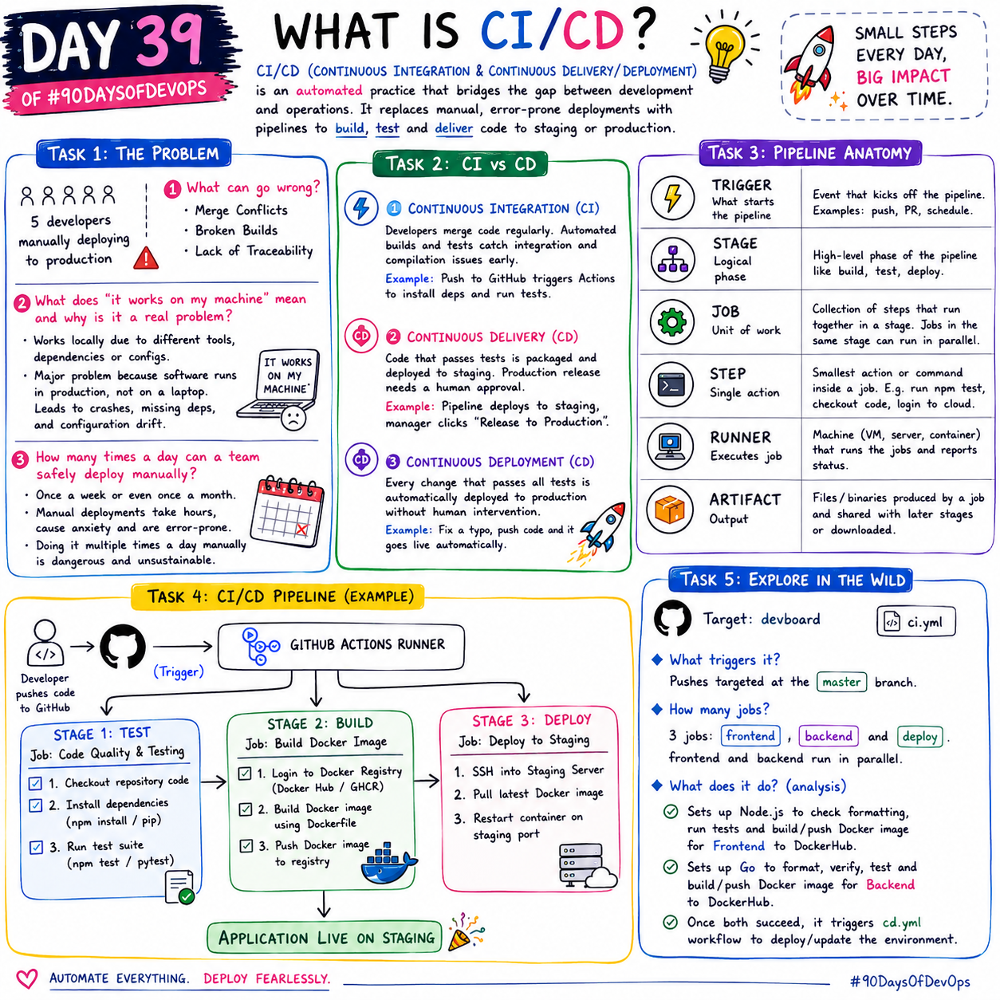

# Day 39 – What is CI/CD?

CI/CD (**Continuous Integration and Continuous Delivery/Deployment**) is an automated software development practice that bridges the gap between development and operations. It replaces manual, error-prone deployment processes with structured pipelines to compile code, run automated tests, and seamlessly push updates to staging or production environments.

---

## Challenge Tasks

### Task 1: The Problem
Think about a team of 5 developers all pushing code to the same repo manually deploying to production.

Write in your notes:
1. What can go wrong?
    - **Merge Conflicts**: Developers can overwrite each other's code if working on the same files simultaneously.
    - **Broken Builds**: Without automated checks, someone might introduce syntax errors or incompatible changes directly to the production environment, causing downtime.
    - **Lack of Traceability**: It is nearly impossible to figure out which developer deployed a faulty version of the application if they are manually updating servers without versioned artifacts.
2. What does "it works on my machine" mean and why is it a real problem?
    - It means the application functions locally because the developer has specific tools, local dependencies, or environment configurations installed that do not match the production server.
    - It is a major problem because software is ultimately meant to run for users in production, not on a local laptop. This discrepancy leads to unpredictable crashes, missing dependencies, and configuration drift.
3. How many times a day can a team safely deploy manually?
    - In a purely manual environment, teams can typically only deploy *safely once a week or even once a month* (often requiring tedious "code freezes").
    - Manual deployments take hours of human effort, trigger anxiety, and leave high room for human error, so doing it multiple times a day manually is usually considered incredibly dangerous and unsustainable.

---

### Task 2: CI vs CD

1. **Continuous Integration (CI)**
   * Developers regularly merge code changes into a main branch where automated systems execute builds and run immediate testing suites. This practice ensures compilation flaws and integration bugs are caught immediately.
   * *Example:* Pushing a bug fix to GitHub triggers GitHub Actions to spin up an isolated machine, install project packages, and run tests.

2. **Continuous Delivery (CD)**
   * Built on top of CI, code that passes automated testing is wrapped cleanly into an artifact and deployed directly onto a staging or pre-production machine. Bringing it to full production simply requires a final human click.
   * *Example:* A pipeline deploys the latest build to a Staging server, waiting for a manager to explicitly select "Release to Production" inside Jenkins.

3. **Continuous Deployment (CD)**
   * This process bypasses human intervention entirely. Any code commit passing every single testing validation phase automatically rolls out onto public production infrastructure.
   * *Example:* A developer fixes a simple typographical error, pushes the file, and the automated pipeline delivers it directly to live users without external approvals.

---

### Task 3: Pipeline Anatomy
A pipeline has these parts — write what each one does:
- **Trigger** — what starts the pipeline
    The event that kicks off the pipeline. It automatically detects code *pushes*, *pull* request creations, or can be scheduled to run at a specific time.

- **Stage** — a logical phase (build, test, deploy)
    A high-level chronological phase of the pipeline. It groups similar tasks together, such as compiling code first, then testing it, and finally deploying it.

- **Job** — a unit of work inside a stage
    A collection of sequential steps that execute together within a specific stage. Multiple jobs inside the same stage can run at the same time on different machines to save time.

- **Step** — a single command or action inside a job
    The smallest individual action or CLI command executed inside a job. It represents a single task, like running an npm command, checking out code, or logging into a cloud provider.

- **Runner** — the machine that executes the job
    The physical server, virtual machine, or container where the jobs are actually executed. It listens for pipeline commands, runs them, and reports the success or failure back to the UI.

- **Artifact** — output produced by a job
    The files, binaries, or compiled code generated by a job that need to be saved. They are preserved after the runner shuts down so they can be passed to later stages or downloaded by the team.

---

### Task 4: Draw a Pipeline
Draw a CI/CD pipeline for this scenario:
> A developer pushes code to GitHub. The app is tested, built into a Docker image, and deployed to a staging server.

```text
               [ DEVELOPER PUSHES CODE TO GITHUB ]
                               │
                               ▼ (Trigger)
               ┌───────────────────────────────┐
               │    GITHUB ACTIONS RUNNER      │
               └───────────────┬───────────────┘
                               │
                               ▼
┌─────────────────────────────────────────────────────────────┐
│ STAGE 1: TEST                                               │
│ ┌─────────────────────────────────────────────────────────┐ │
│ │ Job: Code Quality & Testing                             │ │
│ │  ├─ Step 1: Checkout repository code                    │ │
│ │  ├─ Step 2: Install dependencies (npm install / pip)    │ │
│ │  └─ Step 3: Run test suite (npm test / pytest)          │ │
│ └─────────────────────────────────────────────────────────┘ │
└──────────────────────────────┬──────────────────────────────┘
                               │ (All tests pass)
                               ▼
┌─────────────────────────────────────────────────────────────┐
│ STAGE 2: BUILD                                              │
│ ┌─────────────────────────────────────────────────────────┐ │
│ │ Job: Build Container Image                              │ │
│ │  ├─ Step 1: Log in to Docker Registry (Docker Hub/GHCR) │ │
│ │  ├─ Step 2: Build Docker image using Dockerfile         │ │
│ │  └─ Step 3: Push Docker image to registry               │ │
│ └─────────────────────────────────────────────────────────┘ │
└──────────────────────────────┬──────────────────────────────┘
                               │ (Artifact uploaded)
                               ▼
┌─────────────────────────────────────────────────────────────┐
│ STAGE 3: DEPLOY                                             │
│ ┌─────────────────────────────────────────────────────────┐ │
│ │ Job: Deploy to Staging                                  │ │
│ │  ├─ Step 1: SSH into Staging Server                     │ │
│ │  ├─ Step 2: Pull the latest Docker image                │ │
│ │  └─ Step 3: Restart container on Staging port           │ │
│ └─────────────────────────────────────────────────────────┘ │
└─────────────────────────────────────────────────────────────┘
                               │
                               ▼
                [ APPLICATION LIVE ON STAGING ]

```

Include at least 3 stages. Hand-drawn and photographed is perfectly fine.

---

### Task 5: Explore in the Wild
1. Target file: [devboard workflow](https://github.com/varshaghanghas/devboard)
3. Open one workflow YAML file  
    [ci.yaml file](https://github.com/varshaghanghas/devboard/blob/master/.github/workflows/ci.yml)
4. Write in your notes:
    - What triggers it?
        Pushes targeted at the `master` branch. The workflow is triggered automatically whenever a `push` event occurs on the `master` branch.
    - How many jobs does it have?
        It contains 3 distinct jobs: `frontend`, `backend`, and `deploy`. The `frontend` and `backend` jobs run in parallel, while the `deploy` job waits until those two finish.
    - What does it do? (analysis)
        This CI configuration tests and processes an application architecture across decoupled steps. The `frontend` and `backend` environments boot separate concurrent runners to checkout workspace files, initialize software platforms (`Node.js` & `Go`), execute syntax checks, run active test scripts, and build specific container components pushed straight onto DockerHub. Once both tasks finish cleanly, a specialized step targets a secondary configuration file (`cd.yml`) to systematically coordinate environment deployment.
        - It sets up `Node.js` to check formatting, run tests, and build/push a Docker image for the **Frontend** container to DockerHub.
        - It sets up Go to format, run code verification, test, and build/push a Docker image for the **Backend** container to DockerHub.
        - Once both components successfully pass, it automatically triggers a separate `cd.yml` deployment workflow to update the environment.

---



