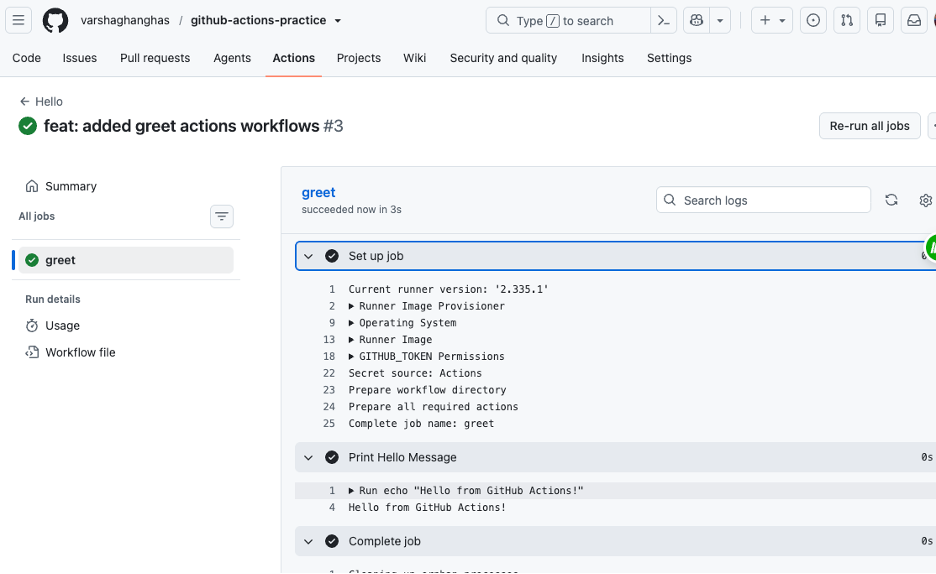
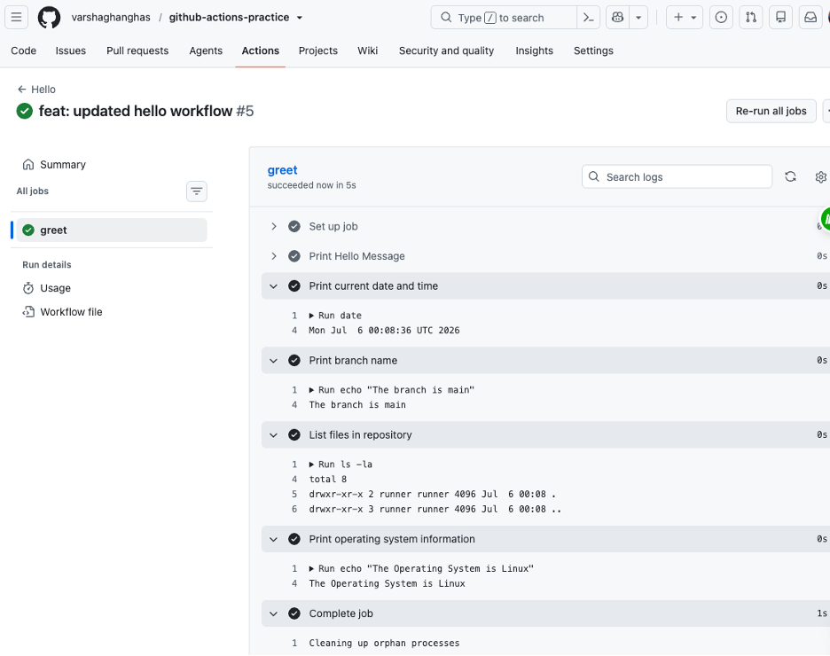
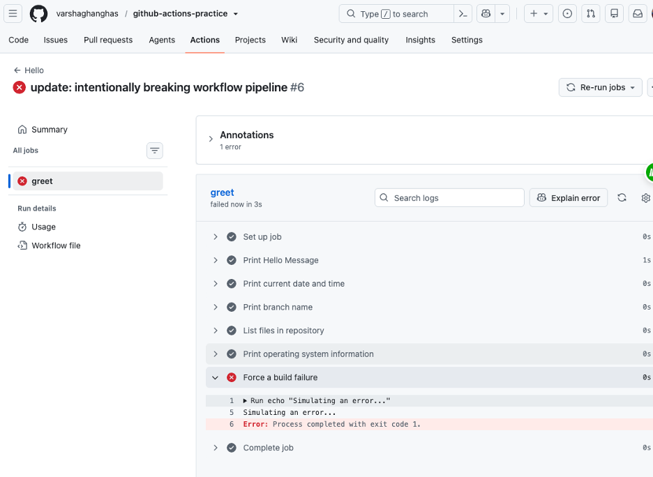
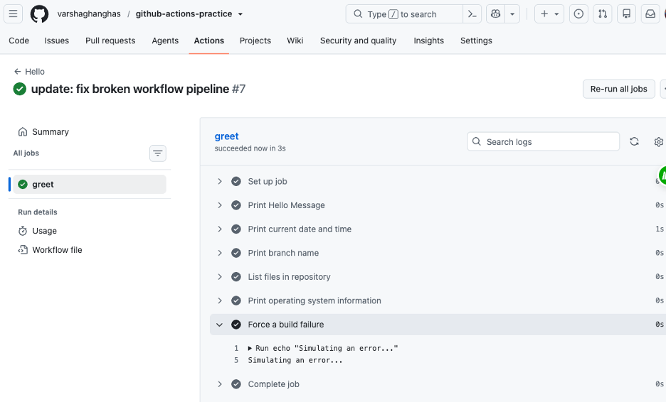

# Day 40 – Your First GitHub Actions Workflow

### Task 1: Set Up
1. GitHub repository: [github-actions-practice](https://github.com/varshaghanghas/github-actions-practice)
2. Workflow folder: [.github/workflows/](https://github.com/varshaghanghas/github-actions-practice/tree/main/.github/workflows)

---

### Task 2: Hello Workflow
Created `.github/workflows/hello.yml` with a workflow that:
1. Triggers on every `push`
2. Has one job called `greet`
3. Runs on `ubuntu-latest`
4. Has two steps:
   - Step 1: Check out the code using `actions/checkout`
   - Step 2: Print `Hello from GitHub Actions!`

**Verify**: Opne github repository and click **Actions** tab on top and click on latest commit message and you can see the **greet** job on left sidebar and when you expand **Print Hello Message** step to see the printed step.



---

### Task 3: Understand the Anatomy
Here is a breakdown of what each key does. Copy this into your study notes
- `on:` Defines the **trigger**. It specifies which GitHub event (like a push, pull_request, or schedule) starts the workflow.
- `jobs:` Groups the **work**. It contains one or more independent blocks of tasks that run in parallel by default.
- `runs-on:` Defines the **environment**. It specifies the type of virtual machine runner (like Ubuntu, macOS, or Windows) to execute the job.
- `steps:` Groups the **actions**. It lists the sequential tasks that need to run in order inside that specific job.
- `uses:` Imports **reusable code**. It tells the runner to fetch and run a pre-built action created by GitHub or the community (like checking out code).
- `run:` Executes **shell commands**. It runs terminal commands (like `npm install`, `pytest`, or `echo`) directly inside the runner environment.
- `name:` Labels the **step**. It provides a human-readable title that shows up in the GitHub UI log for easy debugging.

---

### Task 4: Add More Steps
Update `hello.yml` to also:
1. Print the current date and time
2. Print the name of the branch that triggered the run (hint: GitHub provides this as a variable)
3. List the files in the repo
4. Print the runner's operating system

`hello.yml`:

```yml
name: Hello

on: 
  push:

jobs:
  greet:
    runs-on: ubuntu-latest

    steps:
      - name: Print Hello Message
        run: echo "Hello from GitHub Actions!" 

      # Print the current date and time
      - name: Print current date and time
        run: date

      # print branch name
      - name: Print branch name
        run: echo "The branch is ${{ github.ref_name }}"

      # list repo files
      - name: List files in repository
        run: ls -la

      # print operating system information
      - name: Print operating system information
        run: echo "The Operating System is ${{ runner.os }}"
```



* **`${{ github.ref_name }}`**: A built-in context variable containing the short name of the branch (e.g., `main`).
* **`${{ runner.os }}`:** A context variable that outputs the OS type (e.g., `Linux`)
* **`ls -la`**: Runs because actions/checkout ran first. Without that first step, this folder would be empty!

---

### Task 5: Break It On Purpose
1. Add a step that runs a command that will **fail** (e.g., `exit 1` or a misspelled command)
2. Push and observe what happens in the Actions tab
3. Fix it and push again

`hello.yml`:

```yml
        # ... previous step remain same

        # adding step to fail
        - name: Force a build failure
            run: |
            echo "Simulating an error..."
            exit 1

```



Fix the failed pipeline by updating `exit 1` to `exit 0`



### Notes: Anatomy of a Pipeline Failure
- **Visual Indicators**:
    - The entire workflow run turns **red** with a cross icon (`X`).
    - GitHub sends an automatic email notification alerting you to the failed build.
    - The specific job and step that caused the crash will display a red error icon, while steps before it show green checkmarks.
- **Execution Halt**: Any steps listed *after* the failed step are automatically skipped. The pipeline stops executing immediately to save compute time.
- **How to Read the Error**:
    - Click into the failed workflow run from the **Actions** tab.
    - Click the specific failed job (e.g., `greet`) on the left.
    - Look for the automatically expanded step highlighted in red.
    - Read the standard error (`stderr`) console output directly inside the logs. It usually displays a non-zero exit code (e.g., `Error: Process completed with exit code 1.`) or a command-not-found error.

