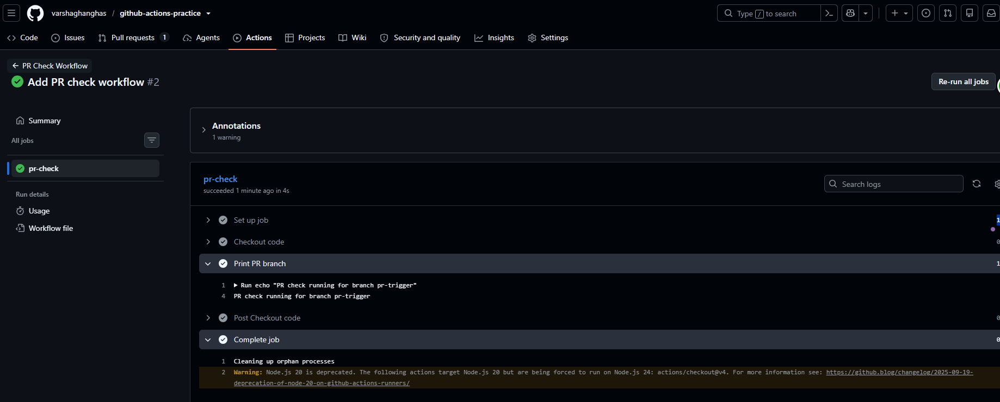
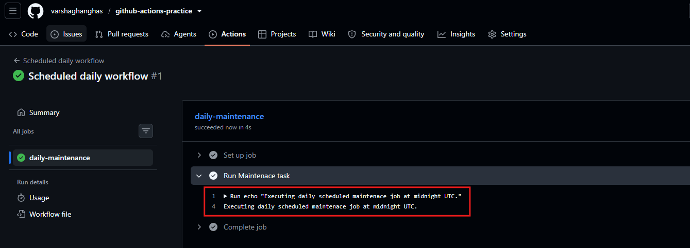
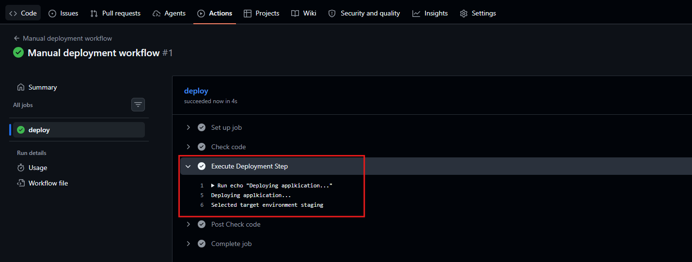
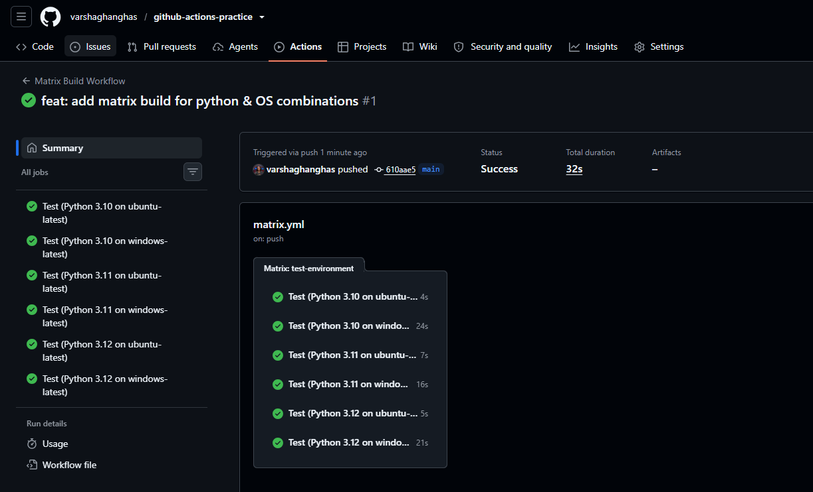
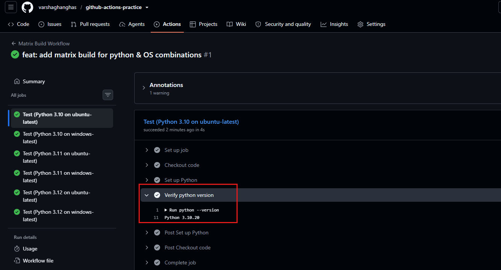
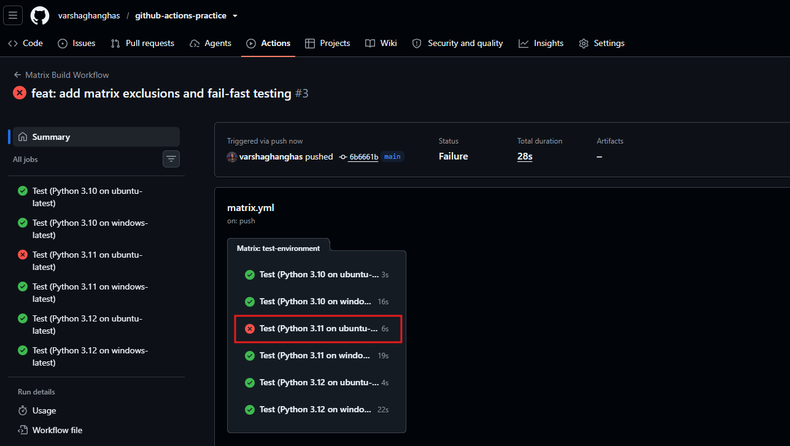

# Day 41 – Triggers & Matrix Builds

Triggers and Matrix Builds are fundamental CI/CD concepts that automate and scale software delivery. **Triggers** act as the starting mechanism for pipelines, initiating workflows based on specific events. **Matrix builds** dynamically multiply a single job into multiple parallel variants to test against different environments or configurations.

## CI/CD Triggers
Triggers dictate when and why your pipeline should run. Instead of manually deploying code, CI/CD platforms listen for repository events or schedules and execute the workflow file automatically.
- **Event-based Triggers**: Workflows can trigger on `push`, pull requests, or branch creation (e.g., merging a branch in a repository).
- **Scheduled Triggers**: Set up to execute at specific times or intervals using cron syntax (e.g., running deep security or integration tests every night).
- **Manual/API Triggers**: Can be executed on-demand via UI buttons or external API webhooks, often passing custom parameters or payloads.

## Matrix Builds
A build matrix is a CI/CD strategy that allows you to run a single job across multiple combinations of variables (e.g., operating systems, runtime versions, or environment configurations) in parallel.

Instead of writing separate pipelines or duplicating code for each version of your application, a matrix defines all variations declaratively and tests them efficiently.

**Use Cases:**
- **Multi-Platform Testing**: Verifying your application or CLI tool builds properly on Ubuntu, Windows, and macOS.
- **Multi-Version Runtime Testing**: Testing Node.js, Python, or Java applications against different versions of the language (e.g., Python 3.9, 3.10, 3.11).
- **Environment Configuration**: Deploying to multiple cloud regions or running tests against multiple database versions simultaneously.

---

### Task 1: Trigger on Pull Request
I configured a GitHub Actions workflow that automatically executes validation checks whenever a developer opens a new pull request or pushes new commits (synchronize) to an existing pull request targeting the `main` branch.

1. Create [.github/workflows/pr-check.yml](https://github.com/varshaghanghas/github-actions-practice/blob/pr-trigger/.github/workflows/pr-check.yml)

`pr-check.yml`

```yml
name: PR Check Workflow

on:
  pull_request:
    branches:
      - main
    types:
      - opened
      - synchronize

jobs:
  pr-check:
    runs-on: ubuntu-latest

    steps:
      - name: Checkout code
        uses: actions/checkout@v4

      - name: Print PR branch
        run: echo "PR check running for branch ${{ github.head_ref }}"
```



**Verification Steps:**
- Navigate to your GitHub repository in your browser.
- Click the **"Compare & pull request"** button for your newly pushed branch.
- Set the base branch to `main` and click **"Create pull request"**.
- **Result**: Look at the bottom of the PR conversation page. You will see the **PR Check Workflow** start running automatically under the checks section.

---

### Task 2: Scheduled Trigger

1. Add a `schedule:`. Created [.github/workflows/scheduled-cleanup.yml](https://github.com/varshaghanghas/github-actions-practice/blob/pr-trigger/.github/workflows/scheduled-cleanup.yml)

`scheduled-cleanup.yml`

```yml
name: Scheduled daily workflow

on:
  workflow_dispatch:
    
  schedule:
    - cron: '0 0 * * *' # runs daily at 00:00 UTC

jobs:
  daily-maintenance:
    runs-on: ubuntu-latest

    steps:
      - name: Run Maintenace task
        run: echo "Executing daily scheduled maintenace job at midnight UTC."
```

Push code to github and merge the code `pr-trigger` to `main` banch.
For now I manually run the workflow:



---

### Task 3: Manual Trigger
1. Created `.github/workflows/manual.yml` with a `workflow_dispatch:` trigger. [.github/workflows/manual.yml](https://github.com/varshaghanghas/github-actions-practice/blob/pr-trigger/.github/workflows/manual.yml)

`manual.yml`

```yml
name: Manual deployment workflow

on:
  workflow_dispatch:
    inputs:
      environment:
        description: 'Target Environment'
        required: true
        default: 'staging'
        type: choice
        options:
          - staging
          - production

jobs:
  deploy:
    runs-on: ubuntu-latest
    steps:
      - name: Check code
        uses: actions/checkout@v4

      - name: Execute Deployment Step
        run: |
          echo "Deploying applkication..."
          echo "Selected target environment ${{ github.event.inputs.environment }}"
```

I implemented the `workflow_dispatch` trigger, defining a required option named `environment`. This sets up a safe dropdown UI inside GitHub to prevent typos during deployment.
- **Inputs Context**: Input parameters are accessed securely via the `${{ github.event.inputs.<input_name> }}` context object.
- **Input Types**: You can configure various input types such as `string`, `choice` (dropdown), `boolean` (checkbox), or `environment`.

Manually ran the workflow and verified the printed output:



---

### Task 4: Matrix Builds
Create `.github/workflows/matrix.yml` that:
1. Created `.github/workflows/matrix.yml` trigger. [.github/workflows/matrix.yml](https://github.com/varshaghanghas/github-actions-practice/blob/pr-trigger/.github/workflows/matrix.yml):

- It uses a matrix strategy to run the same job across:
    - Python versions: `3.10`, `3.11`, `3.12`
- Each job installs Python and prints the version
- all 3 run in parallel

`matrix.yml`

```yml
name: Matrix Build Workflow

on:
  workflow_dispatch:
  push:
    branches:
      - main

jobs:
  test-environment:
    strategy:
      matrix:
        python-version: ['3.10', '3.11', '3.12']
        os: [ubuntu-latest, windows-latest]

    runs-on: ${{ matrix.os }}

    name: Test (Python ${{ matrix.python-version }} on ${{ matrix.os }})

    steps:
      - name: Checkout code
        uses: actions/checkout@v4

      - name: Set up Python
        uses: actions/setup-python@v5
        with:
          python-version: ${{ matrix.python-version }}

      - name: Verify python version
        run: python --version
```





---

### Task 5: Exclude & Fail-Fast

### Fail-Fast Behavior Comparison
- **`fail-fast: true` (Default)**: If a single matrix combination fails (e.g., an edge case bug on an old OS), GitHub instantly cancels all other incomplete matrix jobs. This saves active runner minutes but leaves you without data for the remaining environments.
- **`fail-fast: false`**: If one combination fails, all other parallel paths continue executing normally. This allows you to see the full matrix test results and determine if a bug is isolated to one specific system or widespread.

### Key Learnings
- **`exclude` Property**: Allows you to strip out impossible or unsupported combinations (like legacy runtimes on new operating systems) without breaking the clean matrix structure.
- **Failure Isolation**: Using `fail-fast: false` is essential for nightly test suites where you want a complete compatibility report across all targeted versions.

`matrix.yml`

```yml
name: Matrix Build Workflow

on:
  workflow_dispatch:
  push:
    branches:
      - main

jobs:
  test-environment:
    strategy:
      fail-fast: false    # keeps other jobs running if one fails
      matrix:
        python-version: ['3.10', '3.11', '3.12']
        os: [ubuntu-latest, windows-latest]

    runs-on: ${{ matrix.os }}

    name: Test (Python ${{ matrix.python-version }} on ${{ matrix.os }})

    steps:
      - name: Checkout code
        uses: actions/checkout@v4

      - name: Set up Python
        uses: actions/setup-python@v5
        with:
          python-version: ${{ matrix.python-version }}

      - name: Verify python version
        run: python --version


      # Task 5 Part 2: Simulate a failure ONLY on Python 3.11 on Ubuntu
      - name: Simulating Test Failure
        if: matrix.python-version == '3.11' && matrix.os == 'ubuntu-latest'
        run: |
          echo "Intentionally failing this environment to test fail-fast..."
          exit 1
```

### Verification Status
- [x] Configured matrix `exclude` for Python 3.10 on Windows
- [x] Changed matrix strategy to `fail-fast: false`
- [x] Triggered intentional failure and confirmed parallel jobs completed successfully



