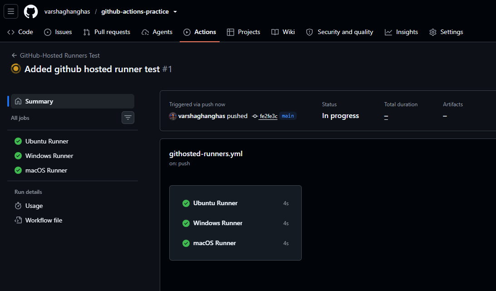
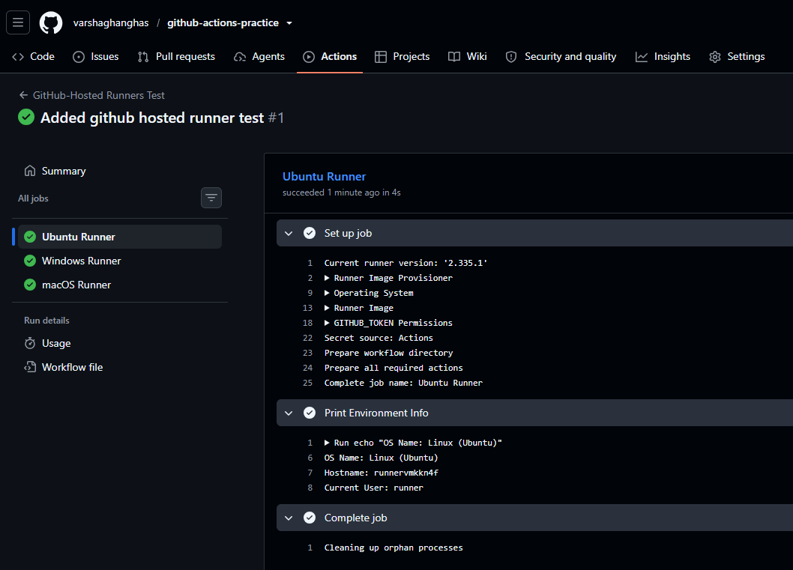
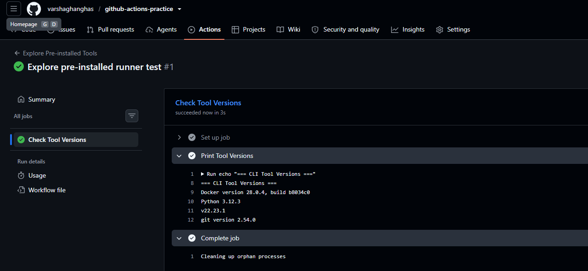
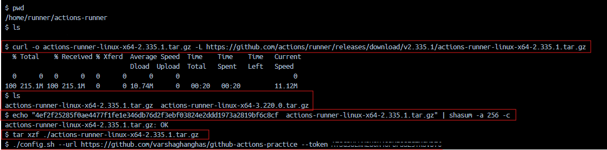
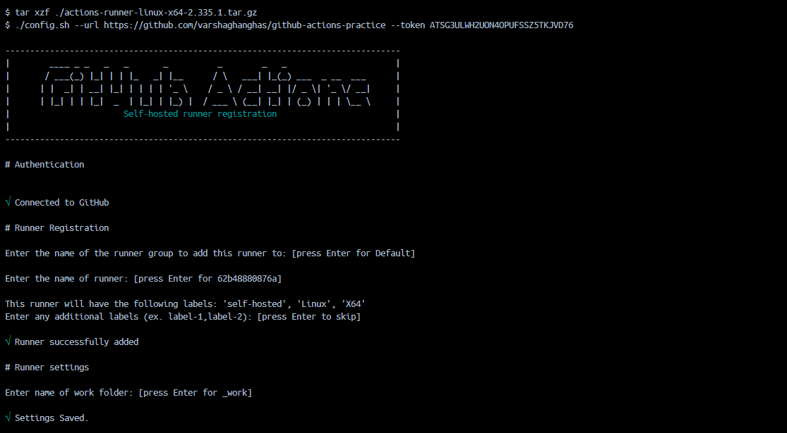
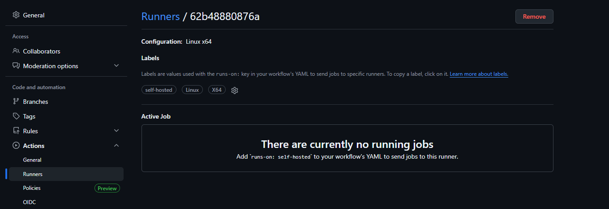
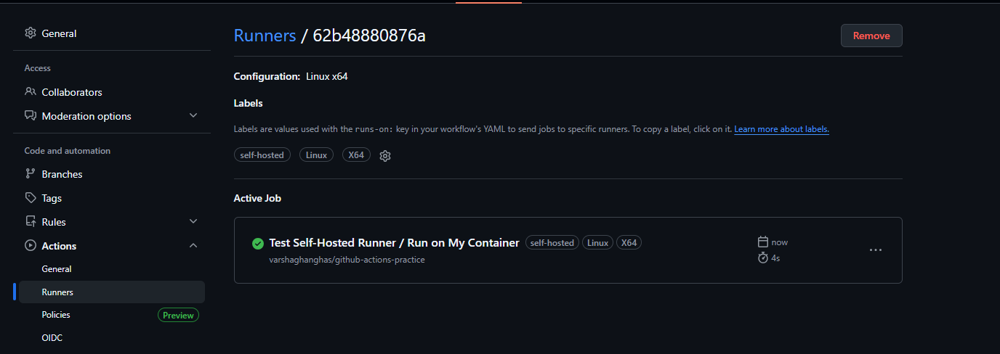
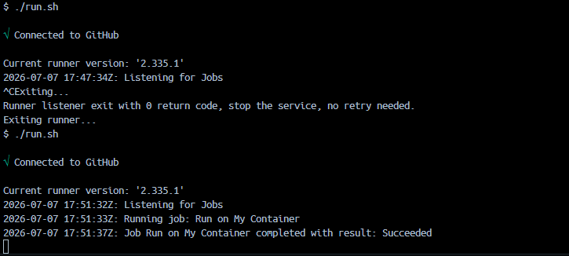
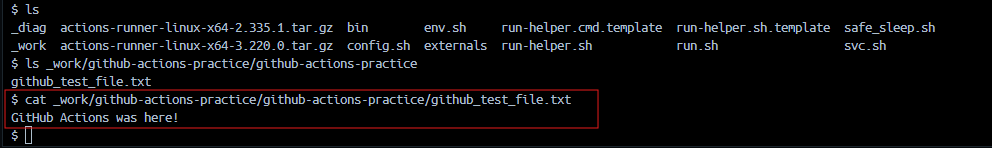
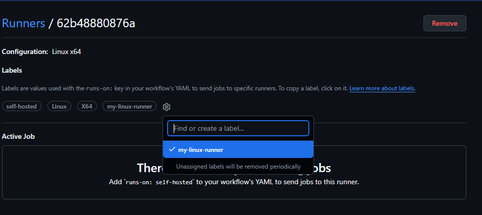

# Day 42 – Runners: GitHub-Hosted & Self-Hosted

## GitHub-Hosted Runners
**GitHub-hosted runners** are cloud virtual machines (VMs) maintained by GitHub, provisioning a fresh, ephemeral environment for every job. 
- **Maintenance**: Zero setup. GitHub automatically handles provisioning, updating, and destroying instances after the job runs.
- **Security**: Runs in an isolated, clean sandbox. Excellent and recommended for public open-source repositories.
- **Environment**: Comes pre-loaded with a standard suite of operating systems (Ubuntu, Windows, macOS) and developer tooling.
- **Cost**: Billed on a per-minute basis, depending on machine specs. Generous free tiers are available for standard runners.
- **Limitations**: Job timeout is 6 hours, and you cannot alter the root OS, access internal networks, or retain local state between jobs.

## Self-Hosted Runners
**Self-hosted runners** are build servers or clusters you provision, manage, and scale in your own infrastructure (AWS, GCP, or on-premises).
- **Maintenance**: Complete operational overhead. You are responsible for OS updates, security patching, scaling, and the runner application.
- **Security**: Requires careful management, especially for public repositories where untrusted pull requests could execute malicious code on your internal infrastructure.
- **Environment**: Fully customizable. You can use specialized hardware, custom OS versions, pre-cached dependencies, and access private networks, databases, or firewalled APIs.
- **Cost**: You pay directly for your underlying cloud/server infrastructure. (Note: Self-hosted runners also incur a small per-minute usage fee for private repositories).
- **Limitations**: Job execution can last up to 5 days, and stateful setups mean you have to manage cleaning up caches and temp files.

### When to choose which?
- **Use GitHub-hosted runners if**: You want a hands-off CI/CD experience, your build times are relatively quick, and you don't need access to internal, firewalled resources.
- **Use self-hosted runners if**: You have heavy hardware demands (e.g., lots of RAM/CPU), require specialized environments, build for niche architectures, or need to test against local databases.For

---

### Task 1: GitHub-Hosted Runners
1. Create a workflow with 3 jobs, each on a different OS:
   - `ubuntu-latest`
   - `windows-latest`
   - `macos-latest`
2. In each job, it print:
   - The OS name
   - The runner's hostname
   - The current user running the job
3. Will watch all 3 run in parallel

`githosted-runners.yml`

```yml
name: GitHub-Hosted Runners Test

on:
  push:
    branches: [ main ]
  workflow_dispatch:

jobs:
  ubuntu-job:
    name: Ubuntu Runner
    runs-on: ubuntu-latest
    steps:
      - name: Print Environment Info
        run: |
          echo "OS Name: Linux (Ubuntu)"
          echo "Hostname: $(hostname)"
          echo "Current User: $(whoami)"

  windows-job:
    name: Windows Runner
    runs-on: windows-latest
    steps:
      - name: Print Environment Info
        shell: cmd
        run: |
          echo OS Name: Windows
          echo Hostname: %COMPUTERNAME%
          echo Current User: %USERNAME%

  macos-job:
    name: macOS Runner
    runs-on: macos-latest
    steps:
      - name: Print Environment Info
        run: |
          echo "OS Name: macOS"
          echo "Hostname: $(hostname)"
          echo "Current User: $(whoami)"
```





**Notes**: 
- What is a GitHub-hosted runner? 
    It is a fresh, ephemeral virtual machine (VM) provisioned specifically to execute a single workflow job. Once the job finishes, the VM is completely destroyed.
- Who manages it?
    GitHub entirely manages, maintains, updates, and secures the underlying infrastructure, operating systems, and pre-installed software tools

---

### Task 2: Explore What's Pre-installed
1. On the `ubuntu-latest` runner, run a step that prints:
   - Docker version
   - Python version
   - Node version
   - Git version
2. Look up the GitHub docs for the full list of pre-installed software on `ubuntu-latest`

`explore-tools.yml`

```yml
name: Explore Pre-installed Tools

on:
  push:
    branches: [ main ]
  workflow_dispatch:

jobs:
  check-versions:
    name: Check Tool Versions
    runs-on: ubuntu-latest
    steps:
      - name: Print Tool Versions
        run: |
          echo "=== CLI Tool Versions ==="
          docker --version
          python3 --version
          node --version
          git --version
```



- Why does it matter that runners come with tools pre-installed?
    - **Faster Build Times**: Eliminates the need to download, compile, or install standard tools (like Docker or Python) at the beginning of every job execution.
    - **Cleaner YAML Files**: Decreases boilerplate configurations and minimizes configuration overhead since common software works out-of-the-box.
    - **Standardization**: Guarantees uniform build environments across runs, reducing the risk of localized environmental bugs or flaky network requests during initial setups.

---

### Task 3: Set Up a Self-Hosted Runner

**Install Required Prerequisites:**

```bash
# Update package lists
apt-get update

# Install mandatory dependencies
apt-get install -y curl sudo git libicu-dev ca-certificates

# Create a non-root user (GitHub runners cannot be configured as root)
useradd -m runner
echo "runner ALL=(ALL) NOPASSWD:ALL" >> /etc/sudoers

# Switch to the new user and navigate to home directory
su - runner
cd ~

# Create and enter the runner folder
mkdir actions-runner && cd actions-runner
```

**Configure runner:**
1. Go to your GitHub repo → Settings → Actions → Runners → **New self-hosted runner**
2. Choose Linux as the OS
3. Follow the instructions to download and configure the runner on:
   - Your local machine, OR
   - A cloud VM (EC2, Utho, or any VPS)



4. Start the runner — verify it shows as **Idle** in GitHub



Your runner appears in the Runners list with a green dot.



---

### Task 4: Use Your Self-Hosted Runner
1. Create `.github/workflows/self-hosted.yml`
2. Set `runs-on: self-hosted`
3. Add steps that:
   - Print the hostname of the machine (it should be YOUR machine/VM)
   - Print the working directory
   - Create a file and verify it exists on your machine after the run
4. Trigger it and watch it run on your own hardware

`selfhosted-runner.yml`

```yml
name: Test Self-Hosted Runner

on:
  push:
    branches: [ main ]
  workflow_dispatch:

jobs:
  verify-runner:
    name: Run on My Container
    runs-on: [self-hosted, Linux, X64]
    steps:
      - name: Verify Environment
        run: |
          echo "=== Runner Verification ==="
          echo "Testing execution inside the self-hosted container!"
          echo "Hostname: $(hostname)"
          echo "Current User: $(whoami)"
```



Look back at your active terminal running `./run.sh` inside your Docker container. You will see it instantly wake up, print Running job: verify-runner, process the steps, and go back to waiting..



**Verify:** Check your machine — the file is there.



---

### Task 5: Labels
1. Add a **label** to your self-hosted runner (e.g., `my-linux-runner`)
    - Navigate to your GitHub repository webpage
    - Click Settings → Actions → Runners
    - Locate your running container (62b48880876a) and click the Gear Icon (φ) next to the existing labels.
    - Type `my-linux-runner` into the text box, click Add label, and save



2. Update your workflow to use `runs-on: [self-hosted, my-linux-runner]`.

Updated `selfhosted-runner.yml`:

```yml
name: Test Self-Hosted Runner Labels

on:
  push:
    branches: [ main ]
  workflow_dispatch:

jobs:
  labeled-run:
    name: Execute on Labeled Runner
    runs-on: [self-hosted, my-linux-runner]
    steps:
      - name: Confirm Execution
        run: |
          echo "Success! The job successfully routed using custom labels."
          echo "Executed on runner: $(hostname)"

```

3. Trigger it — does it still pick up the job? Yes. (you have to execute `./run/sh`)
`Commit` and `push` these modifications to your repository's `main` branch. Your runner container will immediately accept, pick up, and complete the job.

**Why are labels useful when you have multiple self-hosted runners?**
- **Targeted Routing**: Allows you to send specific jobs to machines with specific hardware capabilities (e.g., matching a heavy compilation job to a label like `high-gpu` or `32gb-ram`).
- **Environment Isolation**: Ensures code meant for specific production steps only runs on staging environments or internal subnets (e.g., using labels like `production-vpc` or `testing-subnet`).
- **Operating System Matrixing**: Simplifies handling workflows across complex build matrices by distinguishing identical architecture structures (e.g., sorting builds cleanly between `arm64-ubuntu-22` and `arm64-alpine`).

---

### Task 6: GitHub-Hosted vs Self-Hosted
Fill this in your notes:

| | GitHub-Hosted | Self-Hosted |
|---|---|---|
| Who manages it? | Fully managed by GitHub | Managed by you (infrastructure, OS, software updates). |
| Cost | Billed per minute (has a free tier for public/private repos). | Paid directly to your cloud provider (AWS/Docker/VPS host infrastructure). |
| Pre-installed tools | Massive library pre-installed (Docker, Python, Node, Git, etc.). | Minimal/None; you must explicitly install every tool your build needs. |
| Good for | Quick, standard builds, open-source projects, and hands-off CI/CD. | Large builds, custom hardware (GPUs), private network access, and heavy caching. |
| Security concern | Safe; runs in a fresh, isolated, public sandbox every single run. | Riskier; untrusted code from public PRs could execute inside your private network. |

---

### Hints
- Runner setup script is generated by GitHub — just copy and run it
- Self-hosted runner runs as a background service: `./run.sh`
- To run as a service (persistent): `sudo ./svc.sh install && sudo ./svc.sh start`
- `runs-on: self-hosted` targets any self-hosted runner
- `runs-on: [self-hosted, linux, my-label]` targets specific ones
