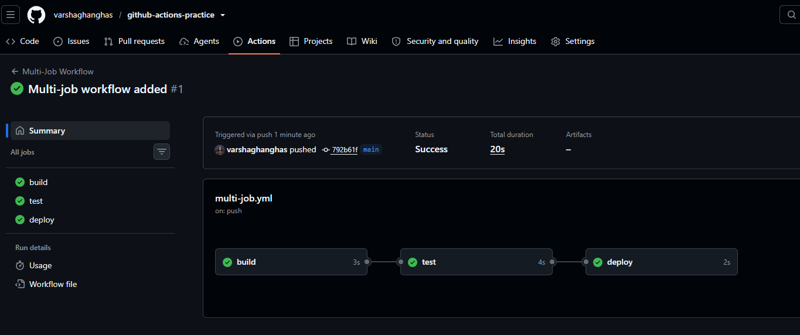
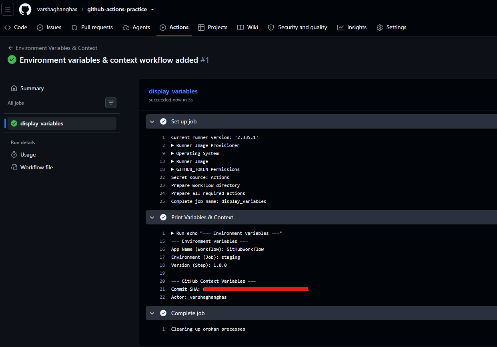
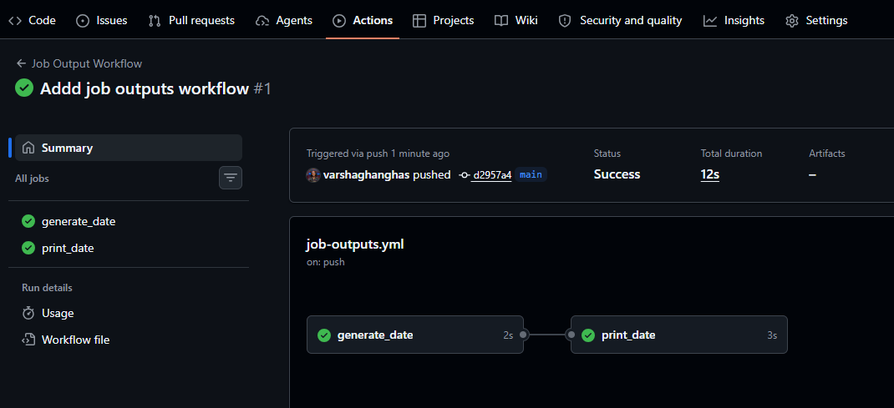
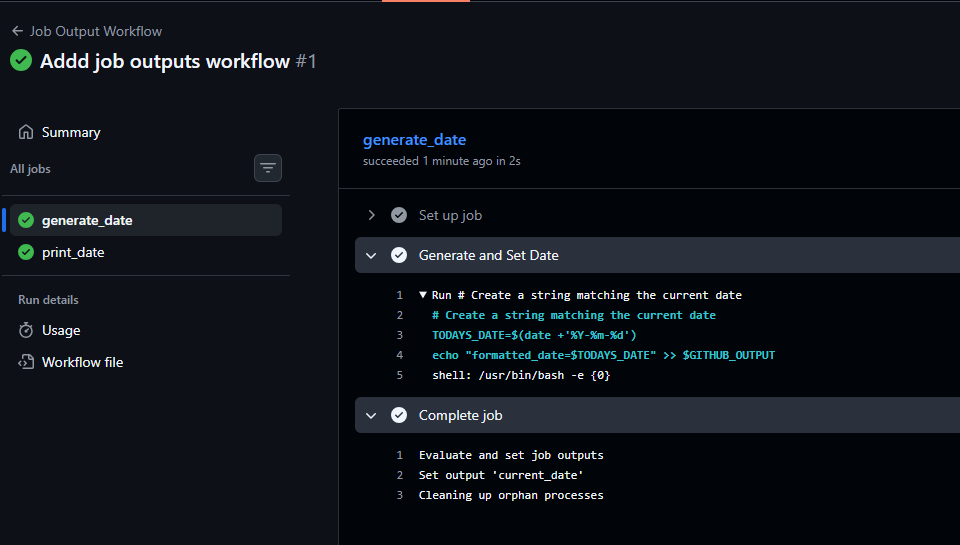
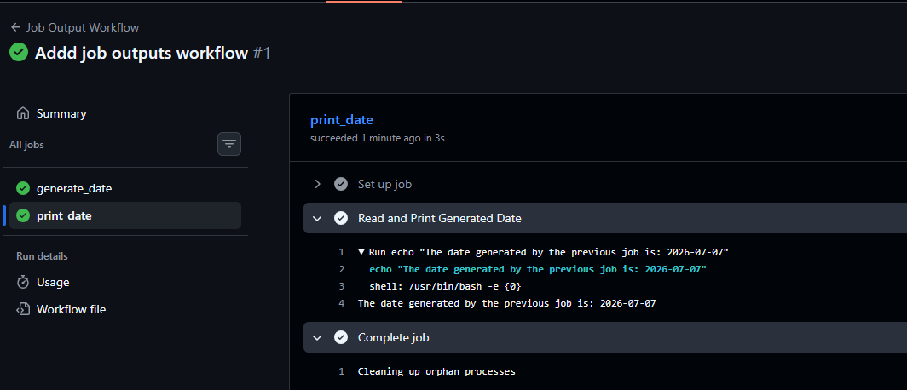
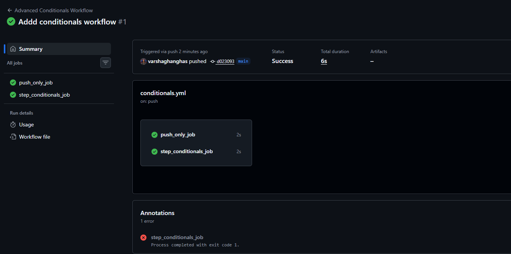
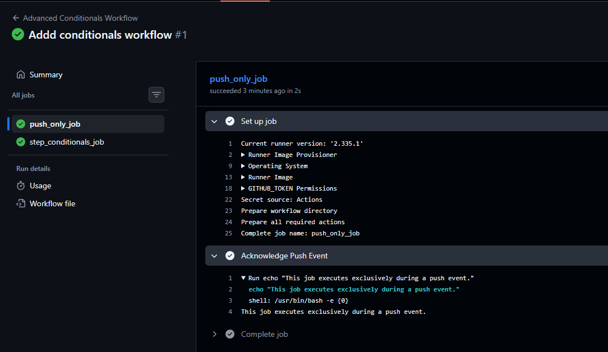
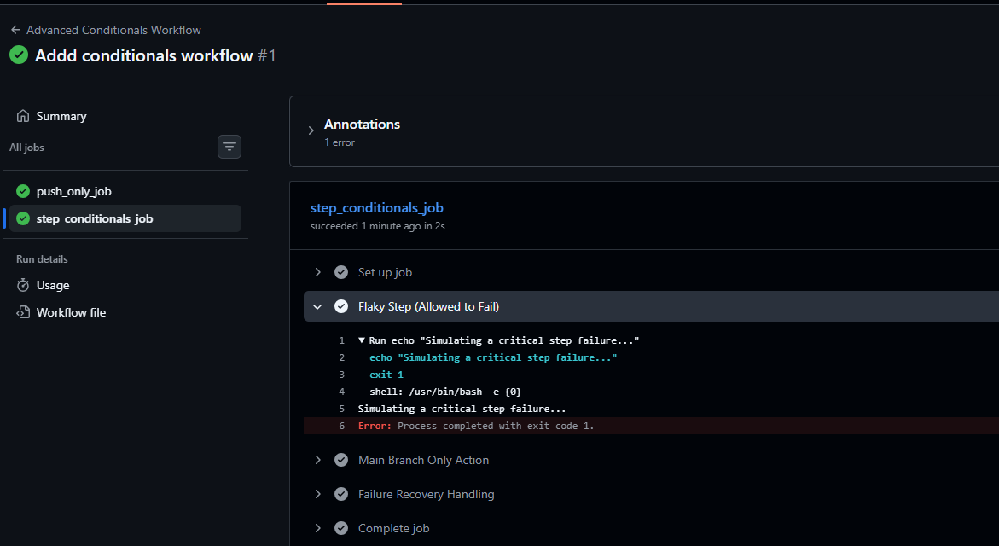
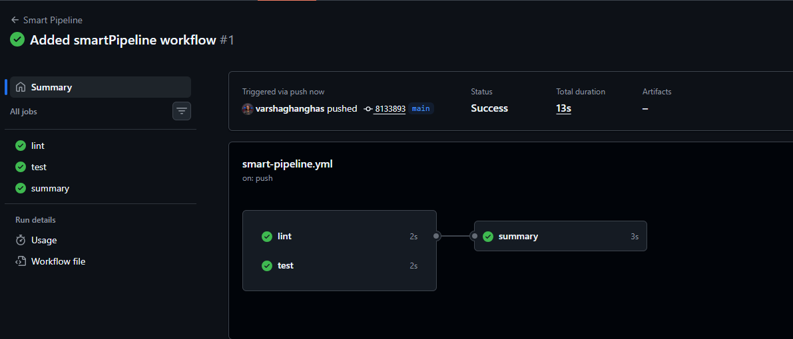
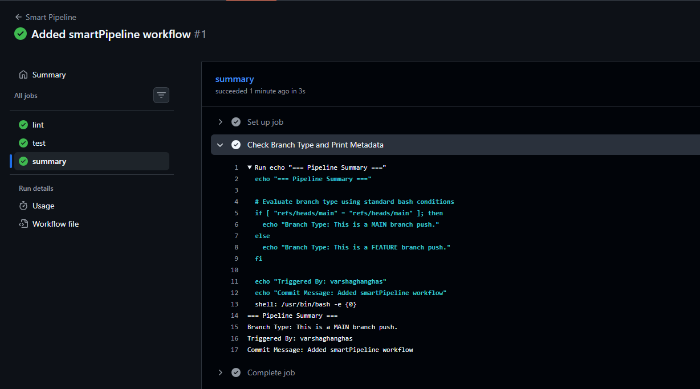

# Day 43 – Jobs, Steps, Env Vars & Conditionals

In **GitHub Actions**, workflows are structured into **Jobs**, which are executed by a **Runner** and contain a sequence of individual **Steps**. You can control when these execute using conditional statements and customize their behaviors using environment variables (`env vars`).

**Core Workflow Hierarchy & Execution**
- **Workflows**: The highest-level automation process, triggered by GitHub events (e.g., a push or pull request).
- **Jobs**: A collection of steps that run within the same runner. By default, jobs run in parallel, but they can be made to depend on one another using `needs`.
- **Steps**: Individual tasks (either a shell command or an action) run sequentially within a job.


## Challenge Tasks

### Task 1: Multi-Job Workflow
1. Created `.github/workflows/multi-job.yml` with 3 jobs:
- `build` — prints "Building the app"
- `test` — prints "Running tests"
- `deploy` — prints "Deploying"

2. Made `test` run only **after** `build` succeeds.
3. Made `deploy` run only **after** `test` succeeds.

`multi-job.yml`

```yml
name: Multi-Job Workflow

on:
  push:
    branches:
      - main
  workflow_dispatch:
  
jobs:
  build:
    runs-on: ubuntu-latest
    steps:
      - name: Build Application
        run: echo "Building the app"

  test:
    runs-on: ubuntu-latest
    needs: build
    steps:
      - name: Run Test
        run: echo "Running test"

  deploy:
    runs-on: ubuntu-latest
    needs: test
    steps:
      - name: Deploy Application
        run: echo "Deploying App"
```



---

### Task 2: Environment Variables
In a new workflow, we will use environment variables at 3 levels:
1. **Workflow level** — `APP_NAME: myapp`
2. **Job level** — `ENVIRONMENT: staging`
3. **Step level** — `VERSION: 1.0.0`

`env-vars.yml`:

```yml
name: Environment Variables & Context

on:
  push:
  workflow_dispatch:
    
# workflow level Environment Vars
env:
  APP_NAME: GitHubWorkflow

jobs:
  display_variables:
    runs-on: ubuntu-latest

    # JOb level env vars
    env:
      ENVIRONMENT: staging

    steps:
      - name: Print Variables & Context
        # step level env vars
        env:
          VERSION: 1.0.0
        run: |
          echo "=== Environment variables ==="
          echo "App Name (Workflow): $APP_NAME"
          echo "Environment (Job): $ENVIRONMENT"
          echo "Version (Step): $VERSION"
          echo ""
          echo "=== GitHub Context Variables ==="
          echo "Commit SHA: ${{ github.sha }}"
          echo "Actor: ${{ github.actor }}"
```



**Verification & Key Details:**
- **Variable Precedence**: If you defined VERSION at the workflow level as well, the step-level value (`1.0.0`) would override it for this specific task.
- **Context Syntax**: Notice that github context items use the `${{ }}` expression syntax, which GitHub evaluates before translating the workflow into a runner shell script.
- **Runner OS Access**: The defined environment variables are injected directly into the runner's native environment, allowing you to access them using standard shell syntax like `$APP_NAME`.

---

### Task 3: Job Outputs
1. Create a job that **sets an output** — e.g., today's date as a string
2. Create a second job that **reads that output** and prints it
3. Pass the value using `outputs:` and `needs.<job>.outputs.<name>`

`job-outputs.yml`:

```yml
name: Job Output Workflow

on:
  push:
  workflow_dispatch:
    
jobs:
  generate_date:
    runs-on: ubuntu-latest
    outputs:
      current_date: ${{ steps.date_step.outputs.formatted_date }}
    
    steps:
      - name: Generate and Set Date
        id: date_step
        run: |
          # Create a string matching the current date
          TODAYS_DATE=$(date +'%Y-%m-%d')
          echo "formatted_date=$TODAYS_DATE" >> $GITHUB_OUTPUT

  print_date:
    runs-on: ubuntu-latest
    needs: generate_date
    steps:
      - name: Read and Print Generated Date
        run: |
          echo "The date generated by the previous job is: ${{ needs.generate_date.outputs.current_date }}"
```







- The Step Execution (`steps`)
    - `id: date_step`: This is critical. You must assign an identifier to the step so that GitHub Actions knows exactly which step the data is coming from later on.
- Generating and Saving the Value (`run:`)
    - `TODAYS_DATE=$(...)`: This runs a standard Linux command to fetch the current date (e.g., `2026-07-07`) and saves it into a temporary local shell variable.
    - `>> $GITHUB_OUTPUT`: This is a special file provided by GitHub on the runner machine. By writing to this file using the `key=value` format, you are telling GitHub: "*Save `formatted_date` as a step-level output*."
- Exposing the Output to the Job (`outputs:`)
    - Even though the step saved the value, other jobs still cannot see it. Other jobs can only read job-level outputs.
    - This block bridges that gap. It creates a job-level output variable named `current_date`.
    - It assigns it the value from your step by pointing directly to the step's ID: `steps.date_step.outputs.formatted_date`.

**Why would you pass outputs between jobs?**
- **Jobs Run Independently**: Every GitHub Actions job runs on its own isolated runner (a fresh virtual machine or container). Since jobs can't directly access each other's files, memory, or environment variables, outputs provide a simple way to pass small pieces of information between them without relying on external storage.
-**Passing Dynamic Values**: Sometimes a workflow generates values that aren't known beforehand, such as a staging URL, a Docker image tag, or a Kubernetes cluster IP. These values can be stored as job outputs and reused by later jobs in the workflow.
- **Controlling Workflow Execution**: Outputs can be used to decide whether later jobs should run. For example, an initial job might perform validation checks and output `run_tests=true` or `run_tests=false`. Downstream jobs can use this value in an `if:` condition to either continue or skip execution.
- **Sharing Build Information**: Artifacts are used to transfer files like compiled binaries, while outputs are better suited for sharing small pieces of metadata. Examples include image digests, commit IDs, version numbers, or build status summaries that later jobs need for deployment, reporting, or release creation.


---

### Task 4: Conditionals
In a workflow, add:
1. A step that only runs when the branch is `main`
2. A step that only runs when the previous step **failed**
3. A job that only runs on **push** events, not on pull requests

`conditionals.yml`:

```yml
name: Advanced Conditionals Workflow

on:
  push:
  pull_request:

jobs:
  # Requirement 3: A job that only runs on push events, not on pull requests
  push_only_job:
    if: github.event_name == 'push'
    runs-on: ubuntu-latest
    steps:
      - name: Acknowledge Push Event
        run: echo "This job executes exclusively during a push event."

  step_conditionals_job:
    runs-on: ubuntu-latest
    steps:
      # Requirement 4: A step with continue-on-error: true
      - name: Flaky Step (Allowed to Fail)
        id: flaky_step
        continue-on-error: true
        run: |
          echo "Simulating a critical step failure..."
          exit 1

      # Requirement 1: A step that only runs when the branch is main
      - name: Main Branch Only Action
        if: github.ref == 'refs/heads/main'
        run: echo "This text is only printed when executing on the main branch."

      # Requirement 2: A step that only runs when the previous step failed
      # Note: Since step 1 used continue-on-error, we track its explicit step outcome
      - name: Failure Recovery Handling
        if: steps.flaky_step.outcome == 'failure'
        run: echo "Alert! The flaky step failed. Initiating fallback routines."
```





4. A step with `continue-on-error: true` — what does this do?



Setting `continue-on-error: true` changes how GitHub Actions handles step failures:
- **Prevents the Job from Stopping**: By default, if a step exits with a non-zero status (such as `exit 1`), the job immediately fails and any remaining steps are skipped. When `continue-on-error: true` is enabled, GitHub Actions treats the step as successful, allowing the job to continue.
- **Allows Later Steps to Run**: Even if the step encounters an error, the workflow continues executing the remaining steps instead of stopping at the failure.
- Preserves the Actual Result: Although the workflow continues, GitHub Actions still records the real outcome of the step:
    - `steps.<step_id>.outcome` shows the actual result (`success` or `failure`).
    - `steps.<step_id>.conclusion` shows the final result after applying `continue-on-error` (usually `success`).
- **Common Use Cases**: This option is useful for tasks that are helpful but not critical to the workflow. For example, you might use it for experimental tests, code quality checks, optional security scans, or uploading reports that shouldn't prevent the main build or deployment from completing.

---

### Task 5: Putting It Together
Create `.github/workflows/smart-pipeline.yml` that:
1. Triggers on push to any branch
2. Has a `lint` job and a `test` job running in parallel
3. Has a `summary` job that runs after both, prints whether it's a `main` branch push or a feature branch push, and prints the commit message

`smart-pipeline.yml`:

```yml
name: Smart Pipeline

on:
  push:

jobs:
  # Job 1: Runs in parallel with test
  lint:
    runs-on: ubuntu-latest
    steps:
      - name: Run Linter
        run: echo "Linting code compliance..."

  # Job 2: Runs in parallel with lint
  test:
    runs-on: ubuntu-latest
    steps:
      - name: Run Tests
        run: echo "Executing test suite..."

  # Job 3: Runs only after both lint and test succeed
  summary:
    runs-on: ubuntu-latest
    needs: [lint, test]
    steps:
      - name: Check Branch Type and Print Metadata
        run: |
          echo "=== Pipeline Summary ==="
          
          # Evaluate branch type using standard bash conditions
          if [ "${{ github.ref }}" = "refs/heads/main" ]; then
            echo "Branch Type: This is a MAIN branch push."
          else
            echo "Branch Type: This is a FEATURE branch push."
          fi
          
          echo "Triggered By: ${{ github.actor }}"
          echo "Commit Message: ${{ github.event.head_commit.message }}"

```






**Visual and Structural Mechanics**
- **Parallel Execution**: Since the `lint` and `test` jobs don't specify a `needs:` dependency, GitHub Actions runs them in parallel on separate runners. This reduces the total workflow execution time because both jobs execute simultaneously.
- **Fan-In Dependency**: The summary job uses `needs: [lint, test]`, meaning it waits for both jobs to finish before it starts. By default, the `summary` job only runs if both dependent jobs complete successfully.
- **Reading the Commit Message**: The `github.event.head_commit.message` context retrieves the commit message directly from the GitHub event payload that triggered the workflow. Because this information is already included in the event data, there's no need to check out the repository just to access the commit message.

---

## Hints
- Job dependency: `needs: [job-name]`
- Set output: `echo "date=$(date)" >> $GITHUB_OUTPUT`
- Read output: `${{ needs.job-name.outputs.date }}`
- Conditionals: `if: github.ref == 'refs/heads/main'`
- Commit message: `${{ github.event.commits[0].message }}`

