# Day 44 – Secrets, Artifacts & Running Real Tests in CI

## Secrets in CI
Most projects need sensitive information during a CI pipeline. This could be API keys, database passwords, cloud credentials, or deployment tokens. Instead of storing these values in the repository, CI platforms provide a secure way to save them as secrets.

Secrets are encrypted and injected into the workflow only when needed. They should never be printed in logs or hardcoded into source code.

**Good practices**:
- Store all sensitive values in the CI platform's secret manager.
- Give workflows only the permissions they actually need.
- Rotate secrets regularly.
- Never commit `.env` files containing production credentials.

Example:

```env
env:
  API_KEY: ${{ secrets.API_KEY }}
```

## Artifacts
Artifacts are files created during a CI run that you want to keep after the job finishes. They help with debugging, testing, or sharing build outputs.

Common artifacts include:

- Compiled applications
- Test reports
- Coverage reports
- Log files
- Screenshots from UI tests

Instead of rebuilding everything locally, developers can simply download the generated artifacts.

Example in GitHub Actions:

```yml
- uses: actions/upload-artifact@v4 
    with:
        name: test-report 
        path: reports/
```

Artifacts usually have an expiration period and are automatically removed after a certain number of days.

## Running Real Tests in CI

A CI pipeline becomes valuable only when it actually verifies that the application works correctly. Running tests automatically helps catch bugs before code is merged.

Typical test stages include:

- Install dependencies.
- Build the project.
- Run unit tests.
- Run integration or API tests.
- Generate coverage reports.
- Publish test results or artifacts.

Example:

```yml
- name: Install dependencies 
    run: npm install

- name: Run tests
    run: npm test

# For Python:
- name: Install packages
    run: pip install -r requirements.txt

- name: Run tests
    run: pytest
```

Using secrets keeps sensitive information secure, artifacts make debugging and sharing outputs much easier, and automated tests ensure every change is checked before it reaches production.

Together, these features make CI pipelines more secure, reliable, and easier to maintain.

---

### Task 1: GitHub Secrets
1. Go to your repo → Settings → Secrets and Variables → Actions
2. Create a secret called `MY_SECRET_MESSAGE`

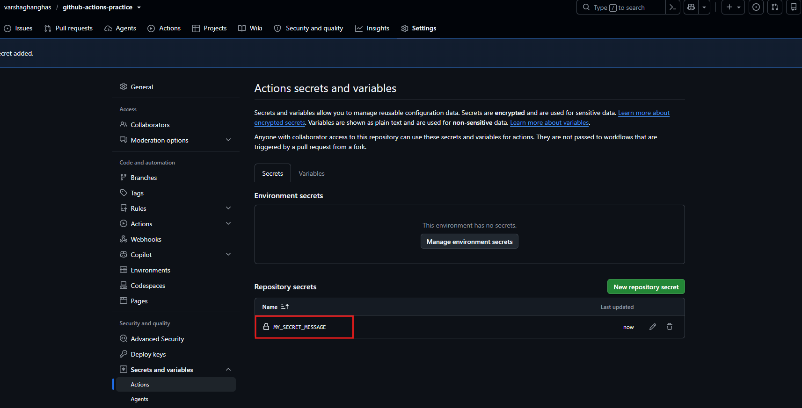

3. Create a workflow that reads it and prints: `The secret is set: true` (never print the actual value)
4. Try to print `${{ secrets.MY_SECRET_MESSAGE }}` directly — what does GitHub show?

`secrets-test.yml`:

```yml
name: Secrets Test Workflow

on: [push, workflow_dispatch]

jobs:
  test-secrets:
    runs-on: ubuntu-latest
    steps:
      - name: Safely check if secret is set
        run: |
          if [ -n "${{ secrets.MY_SECRET_MESSAGE }}" ]; then
            echo "The secret is set: true"
          else
            echo "The secret is set: false"
          fi

      - name: Attempt to print secret directly
        run: echo "Direct print attempt ${{ secrets.MY_SECRET_MESSAGE }}"
```

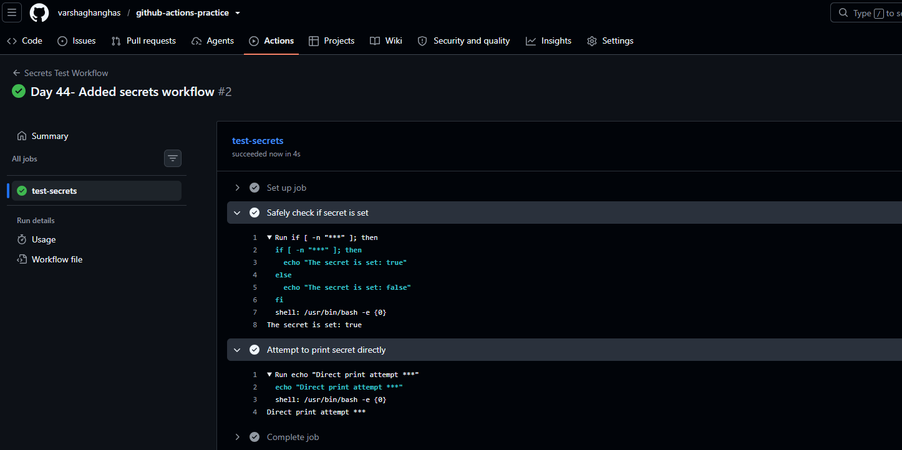

**Why should you never print secrets in CI logs?**
- CI logs are usually visible to anyone who has access to the repository, which can include teammates, external contributors, or auditors. Printing secrets there increases the chance that someone who shouldn't see them can.
- Once a secret appears in a CI log, it often stays in the build history until the logs are manually removed or expire, making accidental exposure long-lasting.
- GitHub's secret masking isn't foolproof. It only hides exact matches, so if a secret is modified (for example, Base64-encoded, URL-encoded, or otherwise transformed), it may not be detected and could be exposed in plain text.
- If an attacker gets access to your CI logs, leaked API keys, database passwords, or cloud credentials can be used to access production systems, steal data, or perform unauthorized actions.

---

### Task 2: Use Secrets as Environment Variables
1. Pass a secret to a step as an environment variable

`secrets-env.yml`:

```yml
name: Step Environment Variables Test

on: [push, workflow_dispatch]

jobs:
  env-secrets:
    runs-on: ubuntu-latest
    steps:
      - name: Use secret as environment variable
        env:
          SECRET_MESSAGE: ${{ secrets.MY_SECRET_MESSAGE }}
        run: |
          # Use standard shell variable syntax ($SECRET_MESSAGE)
          # The CI runner still intercepts and masks the value if outputted
          echo "Processing the secure payload..."
          
          # Example of safe evaluation checking string length
          if [ -z "$SECRET_MESSAGE" ]; then
            echo "Error: Secret token is empty."
            exit 1
          else
            echo "Success: Secret token loaded into environment memory."
          fi
```

2. Use it in a shell command without ever hardcoding it
It maps `MY_SECRET_MESSAGE` to a localized environment variable named `SECRET_MESSAGE` and reads it safely using standard shell syntax

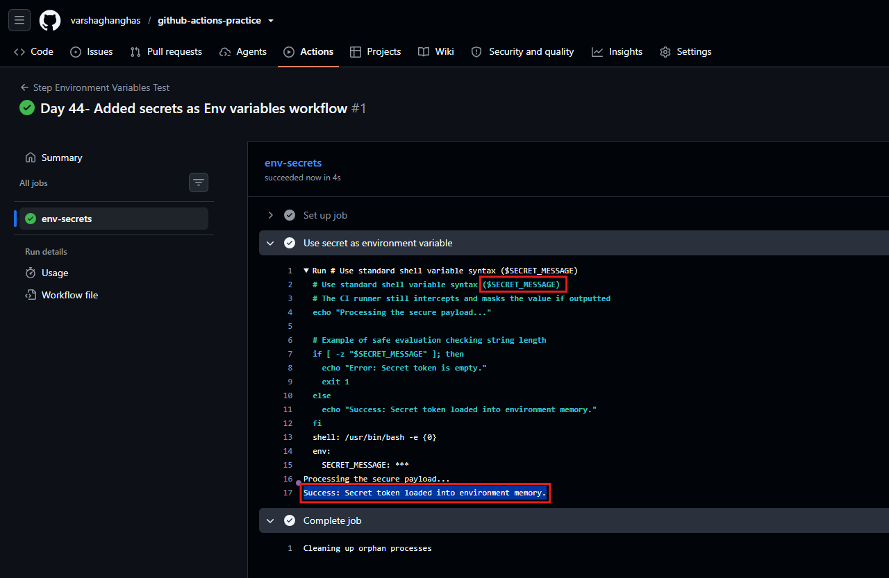

3. Add `DOCKER_USERNAME` and `DOCKER_TOKEN` as secrets (you'll need these on Day 45)
- Navigate to your repository on GitHub.
- Click on Settings → Secrets and variables → Actions.
- Click New repository secret.
- Secret 1:
    - Name: `DOCKER_USERNAME`
    - Value: *Your Docker Hub username*
- Secret 2:
    - Name: `DOCKER_TOKEN`
    - Value: Your Docker Hub *Personal Access Token* (PAT) — Do not use your Docker Hub password here


---

### Task 3: Upload Artifacts
1. Create a step that generates a file — e.g., a test report or a log file
2. Use `actions/upload-artifact` to save it
3. After the workflow runs, download the artifact from the Actions tab

`upload-artifact-test.yml`: **Artifacts** are used to save files between jobs or keep build outputs after the runner shuts down. They help share files across different jobs in the same workflow.

```yml
name: Upload Artifacts Test

on: [push, workflow_dispatch]

jobs:
  build-and-test:
    runs-on: ubuntu-latest
    steps:
      - name: Checkout repository code
        uses: actions/checkout@v4

      # 1. Create a step that generates a file (a mock test report)
      - name: Generate mock test report
        run: |
          mkdir -p output/reports
          echo "=== TEST RUN SUMMARY ===" > output/reports/test-results.log
          echo "Timestamp: $(date)" >> output/reports/test-results.log
          echo "Status: SUCCESS" >> output/reports/test-results.log
          echo "Total Tests: 42" >> output/reports/test-results.log
          echo "Passed: 42 | Failed: 0" >> output/reports/test-results.log

      # 2. Use actions/upload-artifact to save it
      - name: Upload execution report
        uses: actions/upload-artifact@v4
        with:
          name: execution-test-report  # The download name on GitHub
          path: output/reports/        # Path to the directory or file
          retention-days: 5            # Optional: Automatic cleanup policy
```

**Verify:** Can you see and download it from GitHub?
- **Commit and push** this YAML file to your `.github/workflows/` directory.
- Go to your GitHub repository and click the Actions tab.
- Click on the latest run titled **Upload Artifacts Test**.
- Scroll completely down to the bottom of the execution summary page to the **Artifacts** section.

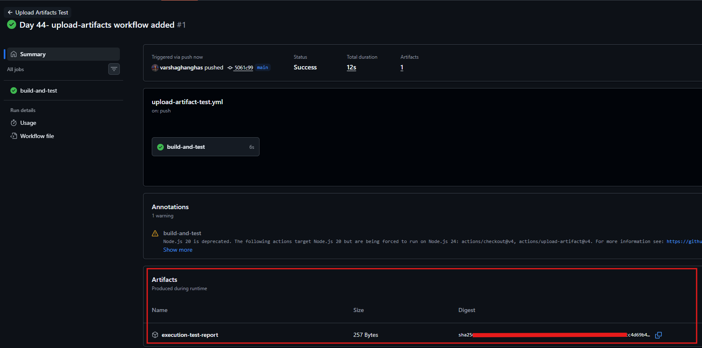

- Click on the `execution-test-report` link to download your zipped log bundle.

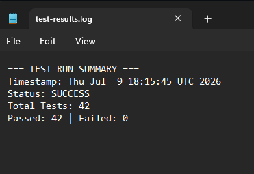

---

### Task 4: Download Artifacts Between Jobs
1. Job 1: generate a file and upload it as an artifact
2. Job 2: download the artifact from Job 1 and use it (print its contents)

**Artifacts** are used to save files between jobs or keep build outputs after the runner shuts down. They help share files across different jobs in the same workflow.

`multi-job-artifacts.yml`: this configures two independent, sequential jobs to pass files between one another.

```yml
name: Multi-Job Artifacts Pass

on: [push, workflow_dispatch]

jobs:
  # Job 1: Generates the file and uploads it
  generate-artifact-job:
    runs-on: ubuntu-latest
    steps:
      - name: Generate build build-metadata file
        run: |
          mkdir -p build-info
          echo "Build-ID: GHA-${{ github.run_number }}" > build-info/metadata.txt
          echo "Commit-SHA: ${{ github.sha }}" >> build-info/metadata.txt

      - name: Upload build metadata
        uses: actions/upload-artifact@v4
        with:
          name: shared-build-metadata
          path: build-info/metadata.txt

  # Job 2: Downloads the artifact from Job 1 and processes it
  consume-artifact-job:
    runs-on: ubuntu-latest
    needs: generate-artifact-job # Forces Job 2 to wait for Job 1 to finish
    steps:
      - name: Download metadata from Job 1
        uses: actions/download-artifact@v4
        with:
          name: shared-build-metadata
          path: received-info/

      - name: Read and print artifact contents
        run: |
          echo "=== Reading Downloaded Artifact ==="
          cat received-info/metadata.txt
```

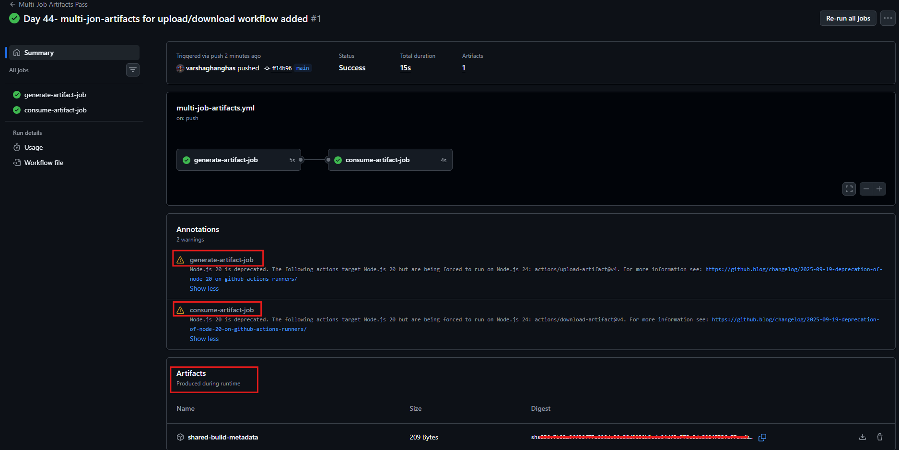

**When would you use artifacts in a real pipeline?**
- **To pass build outputs between jobs**
    - Build the application in one job and upload the compiled files (e.g., binaries, dist/, or build/ folders).
    - Download them in later testing or deployment jobs instead of rebuilding.
- **To separate security-sensitive stages**
    - Build Docker images or application assets in a regular build job.
    - Store them as artifacts and retrieve them in a deployment job that has production credentials, keeping privileged access isolated.
- **To preserve test results**
    - Save test logs, JUnit XML reports, HTML coverage reports, and Cypress screenshots/videos.
    - Makes it easier to debug failed pipelines and maintain audit records.
- **To store security and compliance reports**
    - Upload outputs from SAST scans, dependency vulnerability scans, and license audits.
    - These reports remain available for review even after the workflow finishes.

---

### Task 5: Run Real Tests in CI
Take any script from your earlier days (Python or Shell) and run it in CI: [run_validation.py](https://github.com/varshaghanghas/github-actions-practice/blob/main/app.py)

1. Add your script to the `github-actions-practice` repo
2. Write a workflow that:
   - Checks out the code
   - Installs any dependencies needed
   - Runs the script
   - Fails the pipeline if the script exits with a non-zero code

   [script-integration.yml](https://github.com/varshaghanghas/github-actions-practice/blob/main/.github/workflows/script-integration.yml)

Initial Push Output:

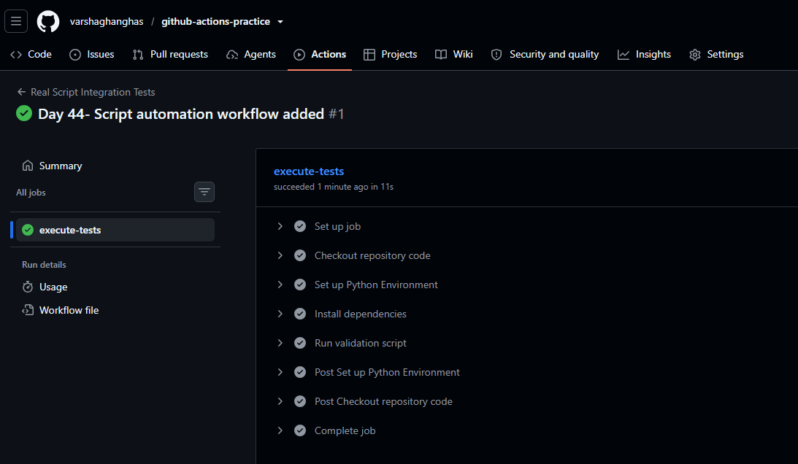

3. Intentionally break the script — verify the pipeline goes red
    - Edit `run_validation.py`.
    - Change `environment_ready = True` to `environment_ready = False`.
    - Commit and push your change.
    - Result: Navigate to the Actions tab. The step `Run validation script` will fail with exit code `1`, causing the entire pipeline run status icon to turn Red.

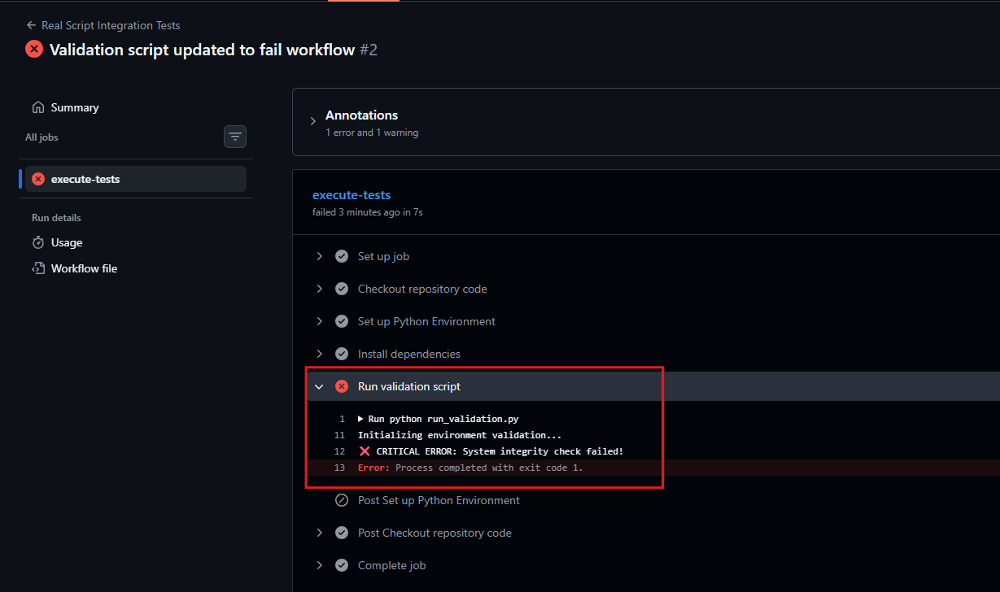

4. Fix it — verify it goes green again
    - Revert change `environment_ready = False` to `environment_ready = True`.
    - Commit and push your change.
    - Result: Navigate to the Actions tab. The step `Run validation script` will fail with exit code `0`, and the pipeline run status icon turn to Green.

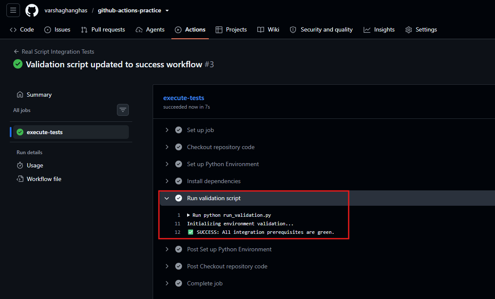

---

### Task 6: Caching
1. Add `actions/cache` to a workflow that installs dependencies

`caching.yml`:

```yml
name: Dependency Caching Test

on: [push, workflow_dispatch]

jobs:
  cache-dependencies:
    runs-on: ubuntu-latest
    steps:
      - name: Checkout repository code
        uses: actions/checkout@v4

      - name: Set up Python Environment
        uses: actions/setup-python@v5
        with:
          python-version: '3.11'

      # 1. Look for an existing cache based on requirements.txt hash
      - name: Cache pip dependencies
        id: cache-pip
        uses: actions/cache@v4
        with:
          path: ~/.cache/pip # Path to the local pip package storage directory
          key: ${{ runner.os }}-pip-${{ hashFiles('**/requirements.txt') }}
          restore-keys: |
            ${{ runner.os }}-pip-

      # 2. Only install if there is a cache miss, or run standard install
      - name: Install dependencies
        run: |
          python -m pip install --upgrade pip
          # Create a dummy requirements file if it doesn't exist for testing
          if [ ! -f requirements.txt ]; then
            echo "requests==2.31.0" > requirements.txt
            echo "pytest==8.0.0" >> requirements.txt
          fi
          pip install -r requirements.txt
```

2. Run it twice — observe the time difference
- Run 1 (Cache Miss): The runner searches for the key but finds nothing. It downloads all packages directly from the internet. The installation step will typically take 15 to 45 seconds. At the end of the job, GitHub saves this folder to the cache store.

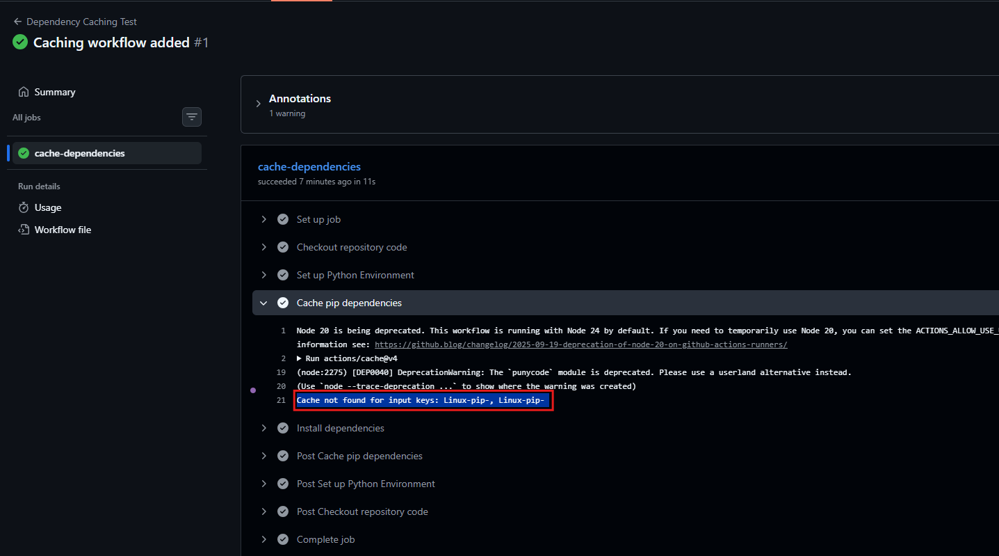

- Run 2 (Cache Hit): Trigger the workflow again without changing `requirements.txt`. The runner finds the key match, downloads the archive internally, and extracts it instantly. The installation step drops significantly to 2 to 5 seconds. In my case it didn't show much time difference as my request is small size but it shows the output *Cache restored from key: Linux-pip-*.

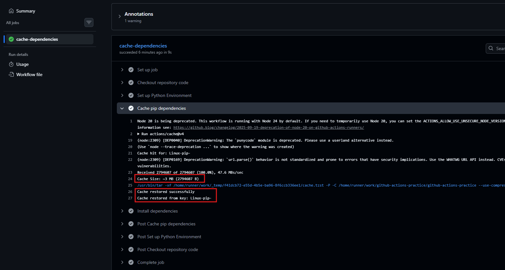


3. Write in your notes: What is being cached and where is it stored?

---

## Hints
- Secrets: `${{ secrets.SECRET_NAME }}`
- Upload artifact: `uses: actions/upload-artifact@v4`
- Download artifact: `uses: actions/download-artifact@v4`
- Cache: `uses: actions/cache@v4`
- GitHub masks secret values in logs automatically
