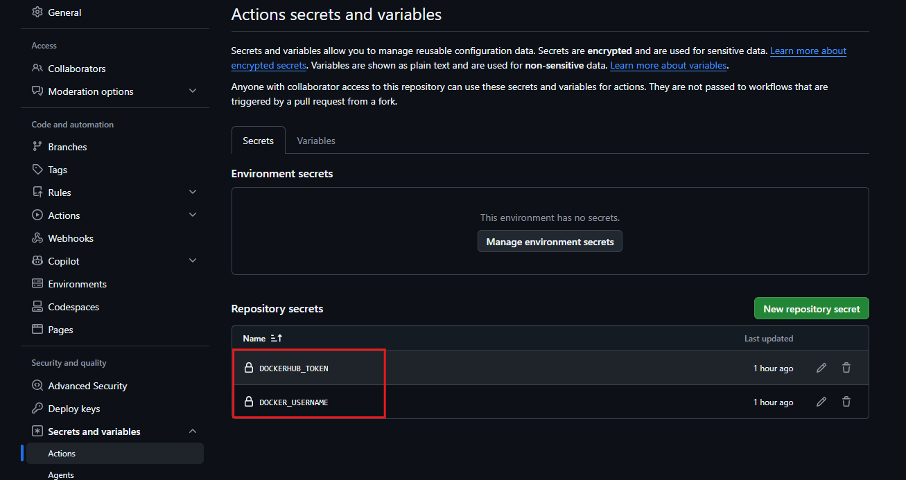
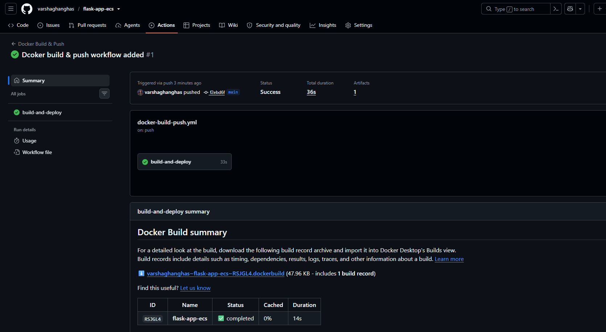
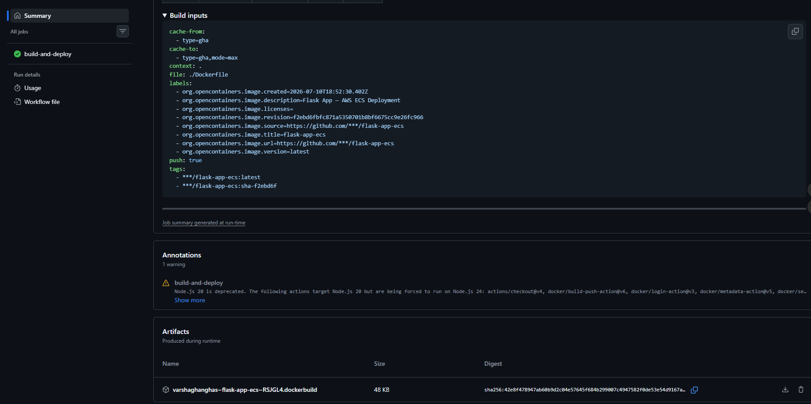
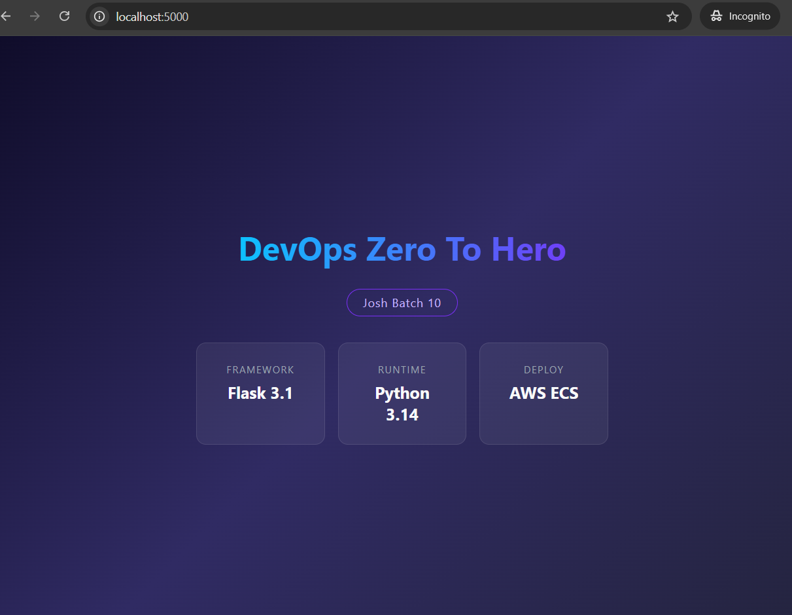
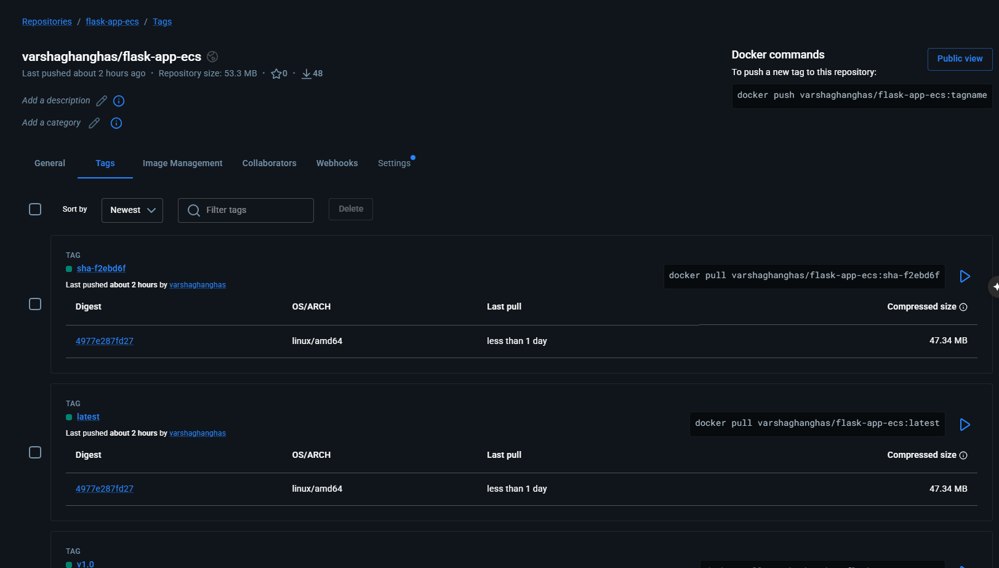
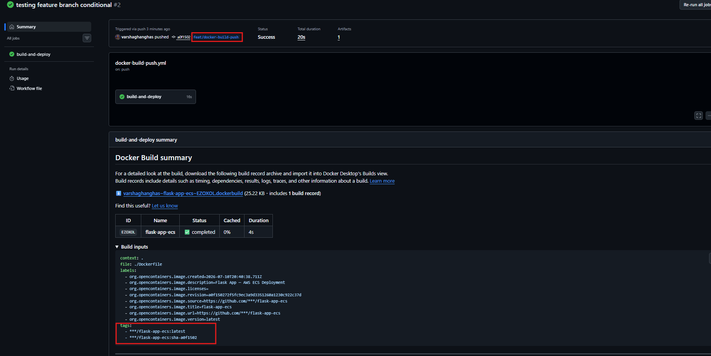
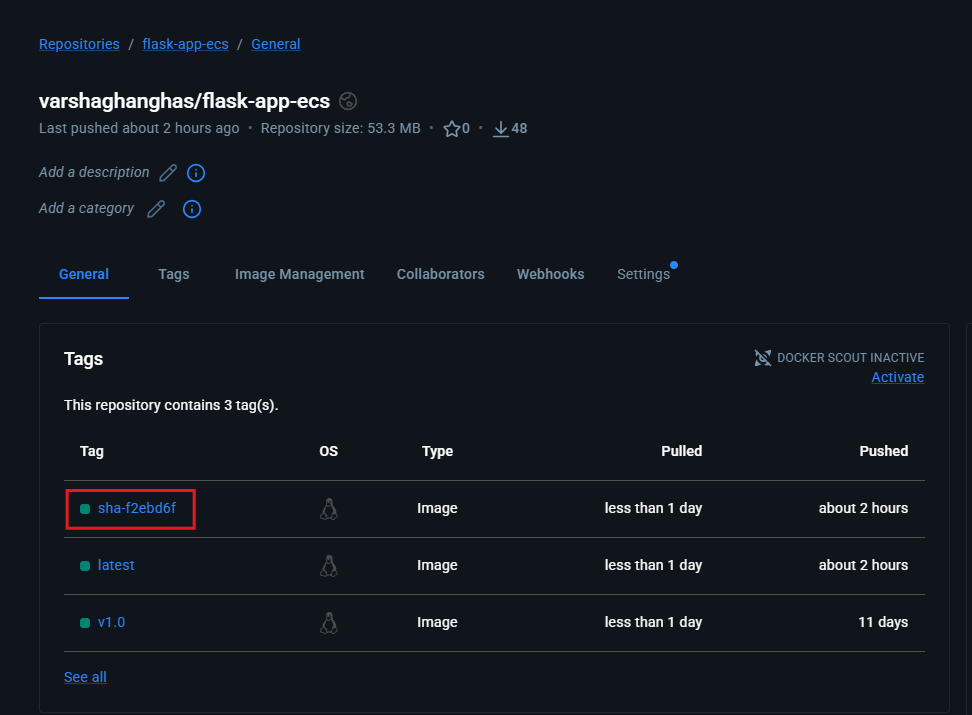
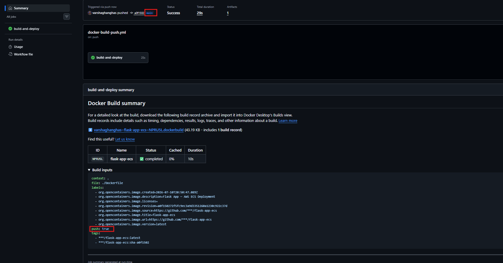
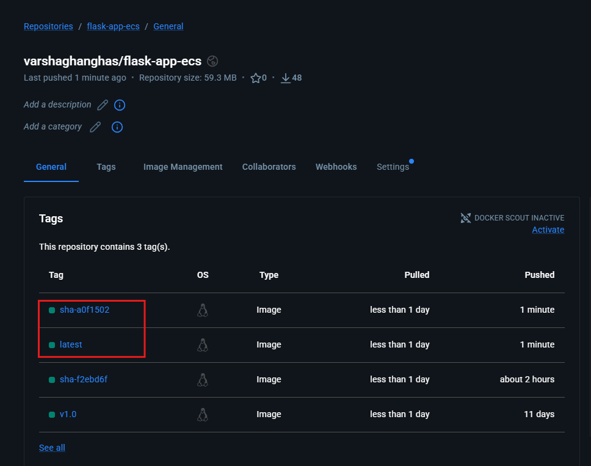
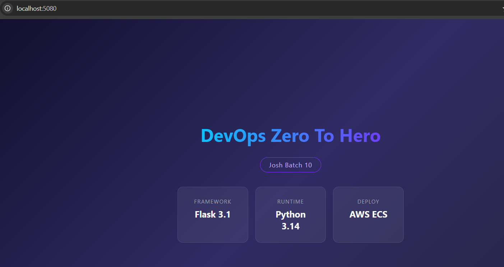

# Day 45 – Docker Build & Push in GitHub Actions

## Task
Today you build a **complete CI/CD pipeline** — code pushed to GitHub automatically builds a Docker image and ships it to Docker Hub. No manual steps.

This is exactly what happens in real production pipelines.

---

### Task 1: Prepare
- We will use Dockerized Day 36 app to [flask-app-ecs](https://github.com/varshaghanghas/flask-app-ecs) repo

```dockerfile
# Base image (OS)

FROM python:3.14-slim

# Working directory

WORKDIR /app

# Copy src code to container

COPY . .

# Run the build commands

RUN pip install -r requirements.txt

# expose port 80

EXPOSE 5000

# serve the app / run the app (keep it running)

CMD ["python","run.py"]
```

-  Creta secrets `DOCKER_USERNAME` and `DOCKER_TOKEN`



---

### Task 2: Build the Docker Image in CI
1. Created [`.github/workflows/docker-build-push.yml`](https://github.com/varshaghanghas/flask-app-ecs/blob/main/.github/workflows/docker-build-push.yml) that:
    - Triggers on push to `main`
    - Checks out the code
    - Builds the Docker image and tags it

Check Github Workflow:





**Verify:** Check the build step logs — does the image build successfully?

```bash
docker build -t flask-app .
docker run -p 5000:5000 flask-app flask-app
```



---

### Task 3: Push to Docker Hub
Add steps to:
1. Log in to Docker Hub using your secrets
2. Tag the image as `username/repo:latest` and also `username/repo:sha-<short-commit-hash>`
3. Push both tags : Pushed through [`.github/workflows/docker-build-push.yml`](https://github.com/varshaghanghas/flask-app-ecs/blob/main/.github/workflows/docker-build-push.yml)

**Verify:** Go to Docker Hub — is your image there with both tags?



---

### Task 4: Only Push on Main
Add a condition so the push step only runs on the `main` branch — not on feature branches or PRs.

Updated YAML `.github/workflows/docker-build-push.yml`:

```yml
name: Docker Build & Push

on:
  push:
    branches: [ "**" ]  # Triggers when code pushes to main

jobs:
  build-and-deploy:
    runs-on: ubuntu-latest
    steps:
      # Step 1: Clone the repository files into the runner environment
      - name: Checkout Code
        uses: actions/checkout@v4

      # Step 2: Initialize Docker Buildx for enhanced layer caching support
      - name: Set up Docker Buildx
        uses: docker/setup-buildx-action@v3

      # Step 3: Log in using your exact custom GitHub Secret names
      - name: Log in to Docker Hub
        # Only log in if we are working on the main branch
        if: github.ref == 'refs/heads/main'
        uses: docker/login-action@v3
        with:
          username: ${{ secrets.DOCKER_USERNAME }}
          password: ${{ secrets.DOCKERHUB_TOKEN }}

      # Step 4: Extract tags based on Git commits (creates 'latest' and a short git-sha)
      - name: Gather Image Metadata
        id: meta
        uses: docker/metadata-action@v5
        with:
          images: ${{ secrets.DOCKER_USERNAME }}/flask-app-ecs
          tags: |
            type=raw,value=latest
            type=sha,format=short

      # Step 5: Build the image from your Dockerfile and push it to the hub
      - name: Build and Push Docker Image
        uses: docker/build-push-action@v6
        with:
          context: .
          file: ./Dockerfile
          # push: true
          # DYNAMIC PUSH: true only if branch is main, false for feature branches
          push: ${{ github.ref == 'refs/heads/main' }}
          tags: ${{ steps.meta.outputs.tags }}
          labels: ${{ steps.meta.outputs.labels }}
          # cache-from: type=gha    # Speeds up repetitive steps using GitHub cache
          # cache-to: type=gha,mode=max
```

Test it: push to a feature branch and verify the image is built but NOT pushed.
- Test the **Feature Branch** (Should Build, but NOT Push)

```bash
git checkout -b feat/docker-build-push
```

- Commit and push the changes
- Goto githubs Actions and workflow is running:
    - It only tags the image but didn't push



- If you goto your DockerHub and check the image isn't pushed: you see the latest push tags are

```yml
tags:
    - ***/flask-app-ecs:latest
    - ***/flask-app-ecs:sha-a0f1502
```



- Test the `Main` Branch (Should Build AND Push):

```bash
git checkout main
git merge feat/docker-build-push
git push origin main
```
- goto Action tab and check
    


- goto you DockerHub and check the latest images are pushed as `push: true`
    


---

### Task 5: Add a Status Badge
1. Get the badge URL for your `docker-publish` workflow from the Actions tab
2. Add it to your `README.md`
3. Push — the badge should show green. 

**Flask ECS App Pipeline:**

[](https://github.com/varshaghanghas/flask-app-ecs/actions/workflows/docker-build-push.yml)

---

### Task 6: Pull and Run It
1. On your local machine (or a cloud server), pull the image you just pushed
2. Run it

```bash
# 1. Pull the fresh image you just built and pushed from your GitHub pipeline
docker pull varshaghanghas/flask-app-ecs:latest

# 2. Run the container detached (-d) and map your local machine port 80 to container port 80
docker run -d -p 80:80 --name local-flask-test varshaghanghas/flask-app-ecs:latest

# but it won't run on post 80 as Flask apps by default also launch on port 5000 unless explicitly forced to run on port 80/5080 inside the code (run.py).
# 2.0 Map your browser's port 8080 to the container's internal port 5000
docker run -d -p 5080:5000 --name local-flask-test varshaghanghas/flask-app-ecs:latest

# 3. Confirm it's running smoothly
docker ps

```

3. Confirm it works



**What is the full journey from `git push` to a running container?**

```text
┌────────────┐      GitHub Webhook      ┌─────────────────┐      Runs Dockerfile      ┌─────────────────┐
│  git push  │ ───────────────────────> │  GitHub Runner  │ ───────────────────────> │  BuildKit Cache │
└────────────┘                          └─────────────────┘                          └─────────────────┘
                                                 │                                            │
                                                 ▼                                            ▼
┌────────────┐      Local Deployment    ┌─────────────────┐      Secure Transfer     ┌─────────────────┐
│ Running App│ <─────────────────────── │   Docker Pull   │ <─────────────────────── │   Docker Hub    │
└────────────┘                          └─────────────────┘                          └─────────────────┘
```

1. Trigger (git push)
    - I make changes to my project and run:

```bash
git push origin main
```

    - GitHub receives the new commit.
    - Since my workflow is configured with:

```yml
on:
  push:
    branches:
      - main
```

GitHub automatically starts the GitHub Actions workflow.


2. GitHub Creates a Runner
    - GitHub launches a fresh virtual machine (called a runner).
    - The runner uses the operating system mentioned in the workflow, for example:

    ```yml
    runs-on: ubuntu-latest
    ```

    - The runner is temporary—it only exists while the workflow is running.
    - `actions/checkout` downloads my repository into the runner so all project files are available.
3. Setup and Login: Before building the Docker image, a few things need to happen.
    - Buildx Setup
        - GitHub installs and configures Docker Buildx.
        - Buildx uses BuildKit, which makes Docker builds faster and supports advanced features like caching.
    - Docker Login
        - The workflow securely logs into Docker Hub.
        - It uses credentials stored in GitHub Secrets, such as:
        - `DOCKER_USERNAME`
        - `DOCKERHUB_TOKEN`
        - This keeps my username and password hidden from the workflow logs.
4. Build the Docker Image:     Now GitHub starts building the Docker image.
During this step it:
    - Reads the `Dockerfile`.
    - Downloads the base image (if needed).
    - Installs dependencies.
    - Copies my application files.
    - Creates the final Docker image.

**Automatic Tags**
The workflow usually creates tags such as:
    - `latest`
    - `sha-abcdef1` (short Git commit hash)
This makes every build easy to identify.

**Build Cache**
If BuildKit caching is enabled:

```yml
cache-from: type=gha
cache-to: type=gha,mode=max
```

GitHub reuses previously built layers instead of rebuilding everything.
This makes future builds much faster.

5. Push Image to Docker Hub
Once the image is built successfully:
    - GitHub uploads the Docker image to Docker Hub.
    - The image is pushed with all generated tags.
    - Only the changed image layers are uploaded, making the push faster.
After everything finishes, the temporary GitHub runner is deleted automatically.
6. Pull and Run Anywhere
On another computer or server, I can download the image using:

```bash
docker pull username/myapp:latest
```

Docker checks which image layers already exist locally and downloads only the missing ones.
To start the application:

```bash
docker run -p 80:80 username/myapp:latest
```

Docker creates an isolated container, starts my application, and exposes port 80 so users can access it.

**Complete Flow**

```text
git push
     │
     ▼
GitHub detects push
     │
     ▼
Starts GitHub Actions Runner
     │
     ▼
Checkout Repository
     │
     ▼
Setup Buildx
     │
     ▼
Login to Docker Hub
     │
     ▼
Build Docker Image
     │
     ▼
Use Build Cache (if available)
     │
     ▼
Tag Image
     │
     ▼
Push Image to Docker Hub
     │
     ▼
Runner is deleted
     │
     ▼
docker pull
     │
     ▼
docker run
     │
     ▼
Application is running inside a Docker container
```

---

## Hints
- Docker login: `uses: docker/login-action@v3`
- Build and push: `uses: docker/build-push-action@v5`
- Short SHA: `${{ github.sha }}` (use `cut` or `slice` to get first 7 chars)
- Badge URL format: `https://github.com/<user>/<repo>/actions/workflows/<file>.yml/badge.svg`
