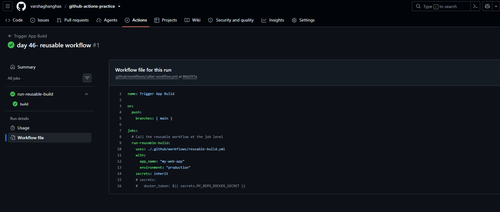
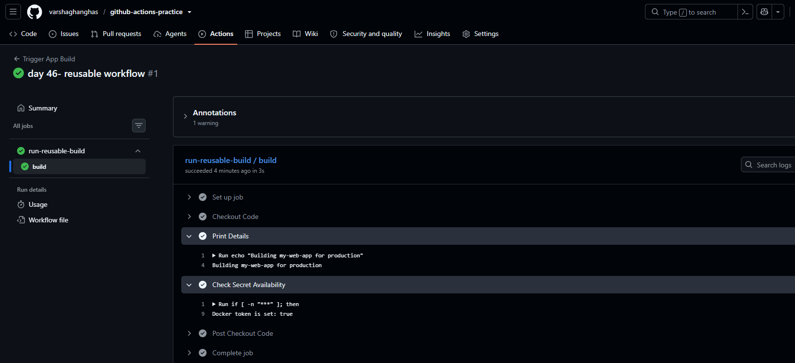

# Day 46 – Reusable Workflows & Composite Actions

**Why do we use them?**

As projects grow, GitHub Actions workflows often contain the same code in multiple repositories or multiple workflows. Instead of copying and pasting the same logic everywhere, GitHub provides two ways to reuse code:

- Reusable Workflows → Reuse an entire workflow or job.
- Composite Actions → Reuse a group of steps as one step.

The biggest difference is:
- Reusable Workflow = Reuse complete jobs or pipelines
- Composite Action = Reuse a collection of steps

## Reusable Workflows
Think of a reusable workflow as a ready-made pipeline that other workflows can call.

Instead of creating the same CI/CD pipeline in every repository, you write it once and reuse it wherever needed.

**Trigger**
Reusable workflows use:

```yml
on:
  workflow_call:
```

Location: `.github/workflows/`

They are stored just like normal workflow files.

**Best Use Cases:**
- Standard CI pipelines
- Company-wide deployment process
- Security scanning
- Compliance checks
- Multi-job workflows
- Different runners for different jobs

**Advantages**
- Reuse entire pipelines
- Can contain multiple jobs
- Supports matrix builds
- Supports environments
- Better secret management
- Each job can run on a different runner

**Example**
Instead of writing:

```text
Build
↓

Test
↓

Security Scan
↓

Deploy
```

inside every repository,
create it once and simply call it from other repositories.

## Composite Actions
Composite Actions are much smaller.
Instead of reusing an entire workflow, they package several steps into one reusable action.
Think of them like creating your own custom GitHub Action.

**Trigger**
Defined using:

```yml
runs:
  using: composite
```

Location: 
Stored inside a folder containing: `action.yml`

For example: 
```text
.github/actions/setup-node/
    action.yml
```

or inside a separate GitHub repository.

**Best Use Cases:**
- Install dependencies
- Configure tools
- Run common shell scripts
- Code formatting
- Linting
- Small automation tasks

**Advantages:**
- Easy to reuse
- Keeps workflows clean
- Great for repeated setup tasks
- Can be shared publicly on GitHub Marketplace

**Need to reuse an entire workflow or multiple jobs? → Use a Reusable Workflow.**
**Need to reuse a group of repeated steps? → Use a Composite Action.**

**Simple memory trick:**
- Reusable Workflow = Reuse Jobs
- Composite Action = Reuse Steps

---

### Task 1: Understand `workflow_call`
Before writing any code, research and answer in your notes:
1. What is a **reusable workflow**?

Think of a reusable workflow as a ready-made pipeline that other workflows can call.

Instead of creating the same CI/CD pipeline in every repository, you write it once and reuse it wherever needed.

2. What is the `workflow_call` trigger?

**Trigger**
Reusable workflows use:

```yml
on:
  workflow_call:
```

3. How is calling a reusable workflow different from using a regular action (`uses:`)?
- **Scope & Level:** A regular action is called at the **Step level** inside a job. A reusable workflow is called at the Job level—it completely replaces or defines a job block.
- **Infrastructure Management:** A regular action inherits the machine runner (`runs-on`) of the job it sits in. A reusable workflow manages its own runners, environments, and concurrency rules inside its own file.
- **Syntax difference:**
    - Regular Action: Placed inside `jobs.<job_id>.steps[*].uses`
    - Reusable Workflow: Placed inside `jobs.<job_id>.uses` (no steps block below it)

4. Where must a reusable workflow file live?

Workflow Location: `.github/workflows/`

They are stored just like normal workflow files.

**Best Use Cases:**
- Standard CI pipelines
- Company-wide deployment process
- Security scanning
- Compliance checks
- Multi-job workflows
- Different runners for different jobs

**Advantages**
- Reuse entire pipelines
- Can contain multiple jobs
- Supports matrix builds
- Supports environments
- Better secret management
- Each job can run on a different runner

**Example**
Instead of writing:

```text
Build
↓

Test
↓

Security Scan
↓

Deploy
```

inside every repository,
create it once and simply call it from other repositories.

---

### Task 2: Create Your First Reusable Workflow
Create `.github/workflows/reusable-build.yml`:
1. Set the trigger to `workflow_call`
2. Add an `inputs:` section with:
   - `app_name` (string, required)
   - `environment` (string, required, default: `staging`)
3. Add a `secrets:` section with:
   - `docker_token` (required)
4. Create a job that:
   - Checks out the code
   - Prints `Building <app_name> for <environment>`
   - Prints `Docker token is set: true` (never print the actual secret)

`.github/workflows/caller-workflow.yml`:

```yml
name: Reusable Build Pipeline

# 1. Set the trigger to workflow_call
on:
  workflow_call:
    # 2. Add an inputs section
    inputs:
      app_name:
        description: 'The name of the application'
        type: string
        required: true
      environment:
        description: 'Target deployment environment'
        type: string
        required: true
        default: 'staging'
    # 3. Add a secrets section
    secrets:
      docker_token:
        description: 'Authentication token for Docker registry'
        required: true

jobs:
  # 4. Create a job that executes the build steps
  build:
    runs-on: ubuntu-latest
    steps:
      - name: Checkout Code
        uses: actions/checkout@v4

      - name: Print Details
        run: |
          echo "Building ${{ inputs.app_name }} for ${{ inputs.environment }}"

      - name: Check Secret Availability
        # Conditional validation to safely check if the token exists without printing it
        run: |
          if [ -n "${{ secrets.docker_token }}" ]; then
            echo "Docker token is set: true"
          else
            echo "Docker token is set: false"
            exit 1
          fi
```

**Verify:** This file alone won't run — it needs a caller. That's next.
We create `.github/workflows/caller-workflow.yml` next.
---

### Task 3: Create a Caller Workflow
Create `.github/workflows/caller-workflow.yml`:
1. Trigger on push to `main`
2. Add a job that uses your reusable workflow:
   ```yaml
   jobs:
     build:
       uses: ./.github/workflows/reusable-build.yml
       with:
         app_name: "my-web-app"
         environment: "production"
       secrets:
         docker_token: ${{ secrets.DOCKER_TOKEN }}
   ```
3. Push to `main` and watch it run

Caller workflow: `caller-workflow.yml`

```yml
name: Trigger App Build

on:
  push:
    branches: [ main ]

jobs:
  # Call the reusable workflow at the job level
  run-reusable-build:
    uses: ./.github/workflows/reusable-build.yml
    with:
      app_name: "my-web-app"
      environment: "production"
    secrets: inherit
    # secrets:
    #   docker_token: ${{ secrets.MY_REPO_DOCKER_SECRET }}
```
**Verify:** In the Actions tab, do you see the caller triggering the reusable workflow? Click into the job — can you see the inputs printed?





---

### Task 4: Add Outputs to the Reusable Workflow
Extend `reusable-build.yml`:
1. Add an `outputs:` section that exposes a `build_version` value
2. Inside the job, generate a version string (e.g., `v1.0-<short-sha>`) and set it as output
3. In your caller workflow, add a second job that:
   - Depends on the build job (`needs:`)
   - Reads and prints the `build_version` output

Updated `reusable-build.yml`:

```yml
name: Reusable Build Pipeline

# 1. Set the trigger to workflow_call
on:
  workflow_call:
    # 2. Add an inputs section
    inputs:
      app_name:
        description: 'The name of the application'
        type: string
        required: true
      environment:
        description: 'Target deployment environment'
        type: string
        required: true
        default: 'staging'
    # 3. Add a secrets section
    secrets:
      docker_token:
        description: 'Authentication token for Docker registry'
        required: true

    # day 46 task 4: Declare the workflow-level outputs
    outputs:
      build_version:
        description: "The generated version string"
        value: ${{ jobs.build.outputs.version_string }} # Maps the job output up to the workflow

jobs:
  # 4. Create a job that executes the build steps
  build:
    runs-on: ubuntu-latest
    # day 46 task 4.2. Map the step output to the job output
    outputs:
      version_string: ${{ steps.gen_version.outputs.version }}
    steps:
      - name: Checkout Code
        uses: actions/checkout@v4

      - name: Generate Version String
        id: gen_version # Needed so other steps/jobs can reference this specific step
        run: |
          # Grab the first 7 characters of the commit SHA
          SHORT_SHA=$(echo "${{ github.sha }}" | cut -c1-7)
          VERSION="v1.0-${SHORT_SHA}"
          
          echo "Generated version: $VERSION"
          # Save it to the official GitHub environment file
          echo "version=$VERSION" >> $GITHUB_OUTPUT

      - name: Print Details
        run: |
          echo "Building ${{ inputs.app_name }} for ${{ inputs.environment }}"

      - name: Check Secret Availability
        # Conditional validation to safely check if the token exists without printing it
        run: |
          if [ -n "${{ secrets.docker_token }}" ]; then
            echo "Docker token is set: true"
          else
            echo "Docker token is set: false"
            exit 1
          fi
```

Updated `.github/workflows/caller-workflow.yml`:

```yml
name: Trigger App Build

on:
  push:
    branches: [ main ]

jobs:
  # Call the reusable workflow at the job level
  run-reusable-build:
    uses: ./.github/workflows/reusable-build.yml
    with:
      app_name: "my-web-app"
      environment: "production"
    secrets: inherit
    # secrets:
    #   docker_token: ${{ secrets.MY_REPO_DOCKER_SECRET }}

  # Day 46- task 3: Run a downstream task that uses the output
  deploy-app:
    runs-on: ubuntu-latest
    needs: run-reusable-build # <-- CRITICAL: Ensures this job waits for the build to finish
    steps:
      - name: Print Version From Reusable Workflow
        run: |
          # Reference pattern: needs.<job_id>.outputs.<output_name>
          echo "The version retrieved from the build job is: ${{ needs.run-reusable-build.outputs.build_version }}"
```


**Verify:** Does the second job print the version from the reusable workflow?

---

### Task 5: Create a Composite Action
Create a **custom composite action** in your repo at `.github/actions/setup-and-greet/action.yml`:
1. Define inputs: `name` and `language` (default: `en`)
2. Add steps that:
   - Print a greeting in the specified language
   - Print the current date and runner OS
   - Set an output called `greeted` with value `true`
3. Use the composite action in a new workflow with `uses: ./.github/actions/setup-and-greet`

**Verify:** Does your custom action run and print the greeting?

---

### Task 6: Reusable Workflow vs Composite Action
Fill this in your notes:

| | Reusable Workflow | Composite Action |
|---|---|---|
| Triggered by | `workflow_call` | `uses:` in a step |
| Can contain jobs? | ? | ? |
| Can contain multiple steps? | ? | ? |
| Lives where? | ? | ? |
| Can accept secrets directly? | ? | ? |
| Best for | ? | ? |

---

## Hints
- Reusable workflows must be in `.github/workflows/` directory
- Caller syntax: `uses: ./.github/workflows/file.yml` (same repo) or `uses: org/repo/.github/workflows/file.yml@main` (cross-repo)
- Composite action: `action.yml` with `runs: using: "composite"`
- Reusable workflow outputs: `on: workflow_call: outputs: name: value: ${{ jobs.job-id.outputs.name }}`
- A reusable workflow can be called by at most 20 unique caller workflows in a single run

---

## Documentation
Create `day-46-reusable-workflows.md` with:
- Your reusable workflow and caller workflow YAML
- Your composite action YAML
- The comparison table from Task 6
- Screenshot of the caller workflow triggering the reusable one

---

## Submission
1. Add `day-46-reusable-workflows.md` to `2026/day-46/`
2. Commit and push to your fork

---

## Learn in Public
Share how you built your first reusable workflow on LinkedIn — this is a real production skill.

`#90DaysOfDevOps` `#DevOpsKaJosh` `#TrainWithShubham`

Happy Learning!
**TrainWithShubham**
