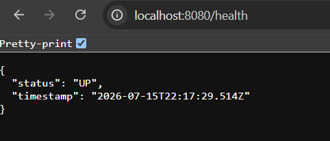
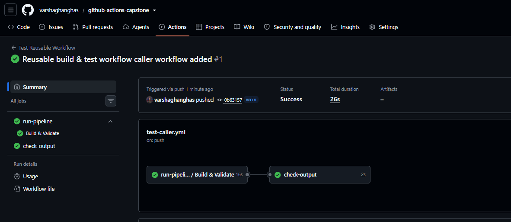
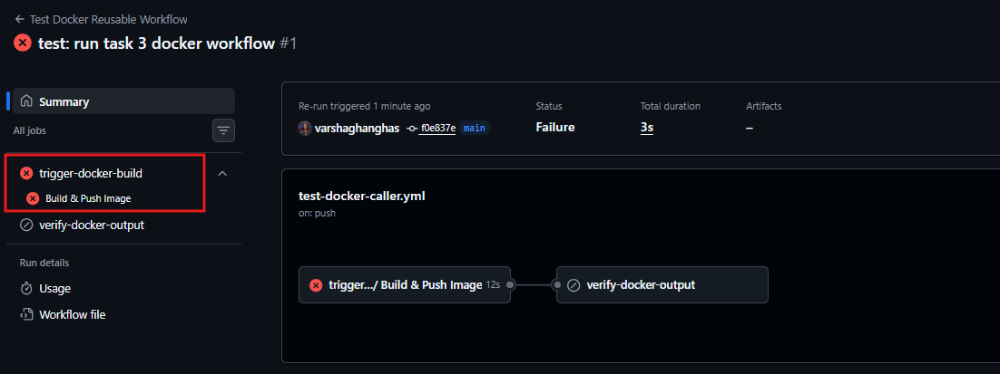
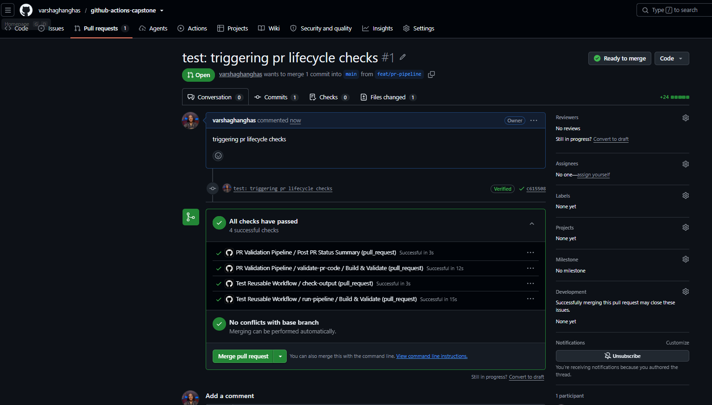
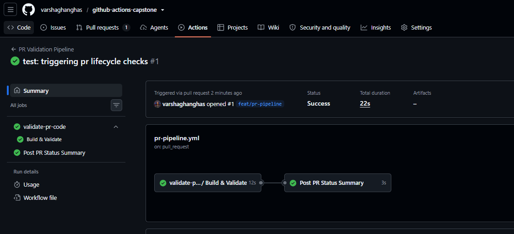
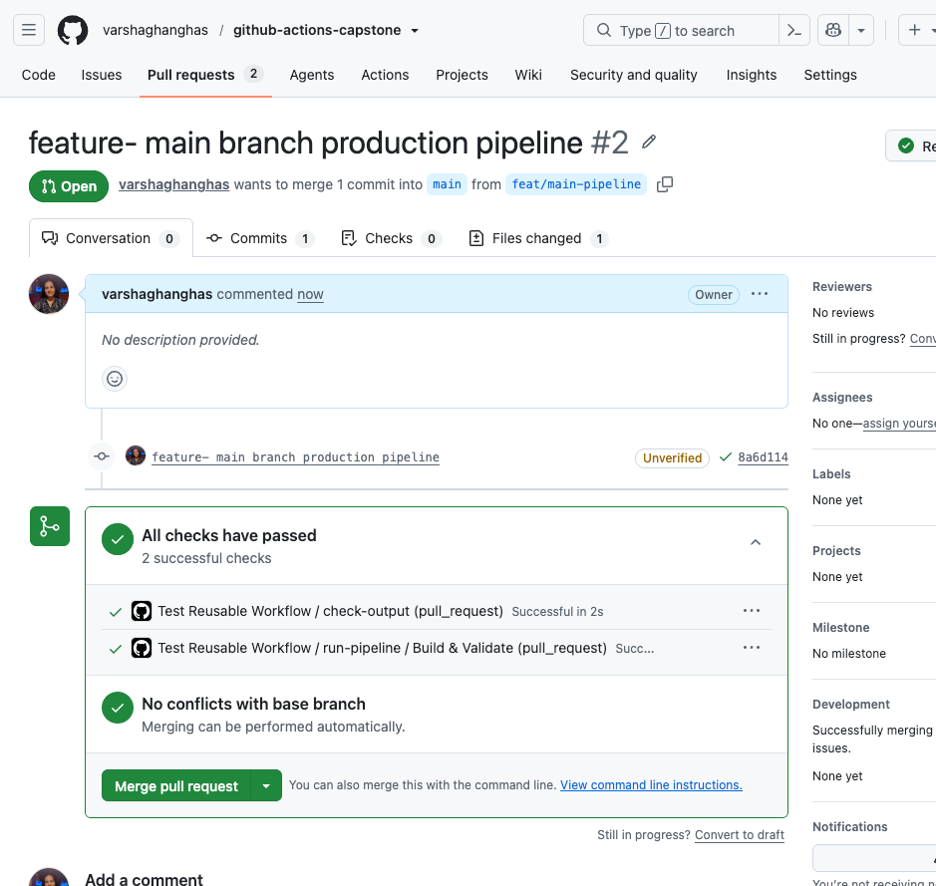
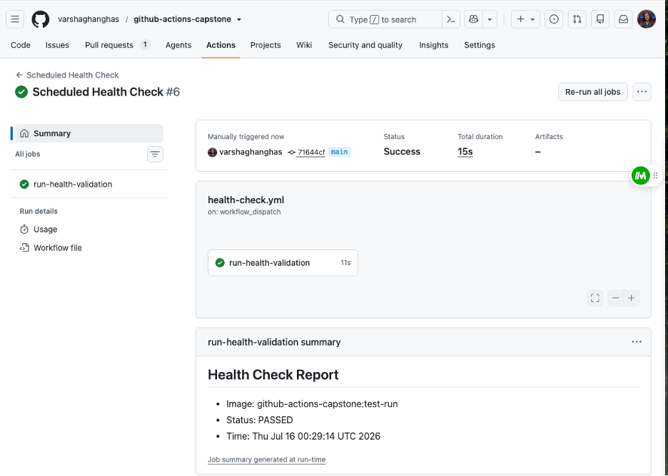

# Day 48 – GitHub Actions Project: End-to-End CI/CD Pipeline

Today, I brought everything together by building an **end-to-end CI/CD pipeline** that resembles how modern software is built, tested, packaged, and prepared for deployment.
Today's focus was on building a **Production-Style CI/CD Pipeline with GitHub Actions**.

## 🏗️ Project Architecture Overview

1. **Pull Request (CI) Workflow**: Triggers on PRs to main. It handles linting, testing, and security scanning.
2. **Release & Deployment (CD) Workflow**: Triggers on merges to main. It builds a Docker image, pushes it to GitHub Packages (GHCR), and simulates a deployment using environments and approvals.

```text
[ Developer Pull Request ] 
       │
       ▼
┌────────────────────────────────────────────────────────┐
│ 1. CI Workflow (PR Target)                             │
│ ───► Code Linting ───► Unit Tests ───► Security Scan   │
└───────────────────────┬────────────────────────────────┘
                        │ (Merge to main)
                        ▼
┌────────────────────────────────────────────────────────┐
│ 2. CD Workflow (Main Branch)                           │
│ ───► Docker Build & Tag ───► Push to GHCR              │
└───────────────────────┬────────────────────────────────┘
                        │
                        ▼
┌────────────────────────────────────────────────────────┐
│ 3. Deployment (Environment Gate)                       │
│ ───► Manual Approval ───► Simulated Production Deploy  │
└────────────────────────────────────────────────────────┘
```

---

### Task 1: Set Up the Project Repo
1. Create a new repo called [github-actions-capstone](https://github.com/varshaghanghas/github-actions-capstone)
2. Add a simple app — pick any one:
   - A Python Flask/FastAPI app with one endpoint
   - A Node.js Express app with one endpoint
   - Your Dockerized app from Day 36
3. Add a `Dockerfile` and a basic test (even a script that curls the health endpoint counts)
4. Add a `README.md` with a project description


Setup project `github-actions-capstone` commands:

```bash
# install dependencies
npm install

# build docker image
docker build -t capstone-app .

# run container and start app
docker run -d -p 8080:3000 --name my-running-app capstone-app
```

Now open browser with `http://localhost:8080/health`



---

### Task 2: Reusable Workflow — Build & Test
Create `.github/workflows/reusable-build-test.yml`:
1. Trigger: `workflow_call`
2. Inputs: `python_version` (or `node_version`), `run_tests` (boolean, default: true)
3. Steps:
   - Check out code
   - Set up the language runtime
   - Install dependencies
   - Run tests (only if `run_tests` is true)
   - Set output: `test_result` with value `passed` or `failed`

`github-actions-capstone/.github/workflows/reusable-build-test.yml`:

```yml
name: Reusable Build and Test

on:
  workflow_call:
    inputs:
      node_version:
        description: 'Target Node.js runtime version string'
        required: false
        default: '20'
        type: string
      run_tests:
        description: 'Boolean flag controlling test suite execution'
        required: false
        default: true
        type: boolean
    outputs:
      test_result:
        description: 'Result string capturing pipeline success status'
        value: ${{ jobs.build-and-test.outputs.status }}

jobs:
  build-and-test:
    name: Build & Validate
    runs-on: ubuntu-latest
    outputs:
      status: ${{ steps.set-outcome.outputs.status }}

    steps:
      - name: Checkout Code Base
        uses: actions/checkout@v4

      - name: Initialize Node.js Environment
        uses: actions/setup-node@v4
        with:
          node-version: ${{ inputs.node_version }}
          cache: 'npm'

      - name: Install Project Dependencies
        run: |
          if [ -f package-lock.json ]; then
            npm ci
          else
            npm install
          fi

      - name: Run Quality Verification Tests
        if: ${{ inputs.run_tests }}
        id: exec-tests
        run: npm test

      - name: Determine Pipeline Status Output
        id: set-outcome
        if: always()
        run: |
          # If tests were skipped, or if they passed successfully, mark as passed
          if [ "${{ steps.exec-tests.outcome }}" == "failure" ]; then
            echo "status=failed" >> "$GITHUB_OUTPUT"
          else
            echo "status=passed" >> "$GITHUB_OUTPUT"
          fi
```

>This workflow does NOT deploy — it only builds and tests.

Add caller workflow `.github/workflows/test-caller.yml`:

```yml
name: Test Reusable Workflow

on:
  push:
    branches: [ "main" ]
  pull_request:
    branches: [ "main" ]

jobs:
  # Call the reusable workflow you built in Task 2
  run-pipeline:
    uses: ./.github/workflows/reusable-build-test.yml
    with:
      node_version: '20'
      run_tests: true

  # Verify the output returned by the reusable workflow
  check-output:
    needs: run-pipeline
    runs-on: ubuntu-latest
    steps:
      - name: Print Test Result Output
        run: |
          echo "The reusable workflow returned: ${{ needs.run-pipeline.outputs.test_result }}"
```



---

### Task 3: Reusable Workflow — Docker Build & Push
Create `.github/workflows/reusable-docker.yml`:
1. Trigger: `workflow_call`
2. Inputs: `image_name` (string), `tag` (string)
3. Secrets: `docker_username`, `docker_token`
4. Steps:
   - Check out code
   - Log in to Docker Hub
   - Build and push the image with the given tag
   - Set output: `image_url` with the full image path

`.github/workflows/reusable-docker.yml`:

```yml
name: Reusable Docker Build and Push

on:
  workflow_call:
    inputs:
      image_name:
        description: 'The target name for the Docker image'
        required: true
        type: string
      tag:
        description: 'The semantic or commit-based version tag'
        required: true
        type: string
    secrets:
      docker_username:
        description: 'Your Docker Hub profile username'
        required: true
      docker_token:
        description: 'Your Docker Hub Personal Access Token (PAT)'
        required: true
    outputs:
      image_url:
        description: 'The full path pointing to the published image repository artifact'
        value: ${{ jobs.docker-pipeline.outputs.full_image_path }}

jobs:
  docker-pipeline:
    name: Build & Push Image
    runs-on: ubuntu-latest
    outputs:
      full_image_path: ${{ steps.construct-output.outputs.image_url }}

    steps:
      - name: Checkout Code Base
        uses: actions/checkout@v4

      - name: Log in to Docker Hub
        uses: docker/login-action@v3
        with:
          username: ${{ secrets.docker_username }}
          password: ${{ secrets.docker_token }}

      - name: Build and Push Docker Image
        uses: docker/build-push-action@v5
        with:
          context: .
          push: true
          tags: ${{ secrets.docker_username }}/${{ inputs.image_name }}:${{ inputs.tag }}

      - name: Construct Image URL Output
        id: construct-output
        run: |
          FULL_PATH="${{ secrets.docker_username }}/${{ inputs.image_name }}:${{ inputs.tag }}"
          echo "image_url=$FULL_PATH" >> "$GITHUB_OUTPUT"
```

create caller workflow `.github/workflows/test-docker-caller`:

```yml
name: Test Docker Reusable Workflow

on:
  push:
    branches: [ "main" ]

jobs:
  # This job calls your Task 3 reusable workflow
  trigger-docker-build:
    uses: ./.github/workflows/reusable-docker.yml
    with:
      image_name: "github-actions-capstone"
      tag: "test-run"
    secrets:
      docker_username: ${{ secrets.DOCKERHUB_USERNAME }}
      docker_token: ${{ secrets.DOCKERHUB_TOKEN }}

  # This job verifies that Task 3 successfully passed back the image URL
  verify-docker-output:
    needs: trigger-docker-build
    runs-on: ubuntu-latest
    steps:
      - name: Print Returned Image Path
        run: |
          echo "The Docker reusable workflow successfully created:"
          echo "${{ needs.trigger-docker-build.outputs.image_url }}"
```



The workflow won't work as this code is deploying to production.

---

### Task 4: PR Pipeline
Create `.github/workflows/pr-pipeline.yml`:
1. Trigger: `pull_request` to `main` (types: `opened`, `synchronize`)
2. Call the reusable build-test workflow:
   - Run tests: `true`
3. Add a standalone job `pr-comment` that:
   - Runs after the build-test job
   - Prints a summary: "PR checks passed for branch: `<branch>`"
4. Do **NOT** build or push Docker images on PRs

`.github/workflows/pr-pipeline.yml`:

```yml
name: PR Validation Pipeline

on:
  pull_request:
    branches: [ "main" ]
    types: [ opened, synchronize ]

jobs:
  # 1. Call the reusable validation workflow from Task 2
  validate-pr-code:
    uses: ./.github/workflows/reusable-build-test.yml
    with:
      node_version: '20'
      run_tests: true

  # 2. Print the completion summary after tests succeed
  pr-comment:
    name: Post PR Status Summary
    needs: validate-pr-code
    runs-on: ubuntu-latest
    steps:
      - name: Print Summary Status to Console
        run: |
          echo "PR checks passed for branch: ${{ github.head_ref }}"

```

**Verify:** Open a PR — does it run tests only (no Docker push)?





---

### Task 5: Main Branch Pipeline
Create `.github/workflows/main-pipeline.yml`:
1. Trigger: `push` to `main`
2. Job 1: Call the reusable build-test workflow
3. Job 2 (depends on Job 1): Call the reusable Docker workflow
   - Tag: `latest` and `sha-<short-commit-hash>`
4. Job 3 (depends on Job 2): `deploy` job that:
   - Prints "Deploying image: `<image_url>` to production"
   - Uses `environment: production` (set this up in repo Settings → Environments)
   - Requires manual approval if you've set up environment protection rules

Create `.github/workflows/main-pipeline.yml` in new branch called `feat/main-pipeline`:

```yml
name: Production Deployment Pipeline

on:
  push:
    branches:
      - main

jobs:
  # 1. Execute Continuous Integration via Task 2 Reusable Workflow
  ci-testing:
    uses: ./.github/workflows/reusable-build-test.yml
    with:
      node_version: '20'
      run_tests: true

  # 2. Package & Deliver Artifact via Task 3 Reusable Workflow (Depends on CI passing)
  cd-packaging:
    needs: ci-testing
    runs-on: ubuntu-latest
    outputs:
      short_sha: ${{ steps.vars.outputs.short_sha }}
    steps:
      - name: Checkout Repository
        uses: actions/checkout@v4

      # Generates short hash required by the prompt instructions
      - name: Compute Short Commit Hash
        id: vars
        run: echo "short_sha=$(git rev-parse --short HEAD)" >> "$GITHUB_OUTPUT"

  # We invoke the Task 3 Docker compilation workflow using sequential dependencies
  docker-hub-delivery:
    needs: cd-packaging
    uses: ./.github/workflows/reusable-docker.yml
    with:
      image_name: "github-actions-capstone"
      tag: "sha-${{ needs.cd-packaging.outputs.short_sha }}"
    secrets:
      docker_username: ${{ secrets.DOCKERHUB_USERNAME }}
      docker_token: ${{ secrets.DOCKERHUB_TOKEN }}

  # 3. Secure Production Release (Depends on Docker Hub pushing successfully)
  deploy:
    needs: [cd-packaging, docker-hub-delivery]
    runs-on: ubuntu-latest
    
    # Hooks directly into GitHub Settings -> Environments -> production
    environment: production
    
    steps:
      - name: Print Deploy Target Summary
        run: |
          # Grabs and streams the structured output variable exported from Task 3
          echo "Deploying image: ${{ needs.docker-hub-delivery.outputs.image_url }} to production"

      - name: Simulate Production Environment Rollout
        run: |
          echo "Establishing handshake with cluster nodes..."
          echo "Rolling out stable container instances..."
          echo "Deployment phase completed successfully."
```

**Verify:** Merge a PR to `main` — does it run tests → build Docker → deploy in sequence?



---

### Task 6: Scheduled Health Check
Create `.github/workflows/health-check.yml`:
1. Trigger: `schedule` with cron `'0 */12 * * *'` (every 12 hours) + `workflow_dispatch` for manual testing
2. Steps:
   - Pull your latest Docker image
   - Run the container in detached mode
   - Wait 5 seconds, then curl the health endpoint
   - Print pass/fail based on the response
   - Stop and remove the container
3. Add a step that creates a summary using `$GITHUB_STEP_SUMMARY`:
   ```bash
   echo "## Health Check Report" >> $GITHUB_STEP_SUMMARY
   echo "- Image: myapp:latest" >> $GITHUB_STEP_SUMMARY
   echo "- Status: PASSED" >> $GITHUB_STEP_SUMMARY
   echo "- Time: $(date)" >> $GITHUB_STEP_SUMMARY
   ```

`.github/workflows/health-check.yml`:

```yml
name: Scheduled Health Check

on:
  schedule:
    # Executes precisely every 12 hours
    - cron: '0 */12 * * *'
  workflow_dispatch: # Enables immediate UI triggering for manual verification

jobs:
  run-health-validation:
    runs-on: ubuntu-latest
    steps:
      - name: Log in to Docker Hub Registry
        uses: docker/login-action@v3
        with:
          username: ${{ secrets.DOCKERHUB_USERNAME }}
          password: ${{ secrets.DOCKERHUB_TOKEN }}

      - name: Pull Target Image From Hub
        run: |
          # Adjust the tag target name if your latest build falls under a different repository tag convention
          docker pull ${{ secrets.DOCKERHUB_USERNAME }}/github-actions-capstone:test-run

      - name: Run Test Container in Detached Mode
        run: |
          # Maps host port 8080 to internal Express API port 3000
          CONTAINER_ID=$(docker run -d -p 8080:3000 ${{ secrets.DOCKERHUB_USERNAME }}/github-actions-capstone:test-run)
          echo "CONTAINER_ID=$CONTAINER_ID" >> $GITHUB_ENV

          - name: Execute Endpoint Curl Inspection
          id: inspect_api
          run: |
            echo "Checking application health status..."
            
            # Initialize variables for the polling loop
            ATTEMPTS=0
            MAX_ATTEMPTS=5
            SUCCESS=false
  
            until [ $ATTEMPTS -ge $MAX_ATTEMPTS ]; do
              echo "Attempt $((ATTEMPTS+1)) of $MAX_ATTEMPTS: Connecting to endpoint..."
              
              # Request endpoint with a 2-second timeout per attempt
              if curl --silent --fail --max-time 2 http://localhost:8080/health; then
                echo "API structural response check: OK"
                SUCCESS=true
                break
              fi
              
              ATTEMPTS=$((ATTEMPTS+1))
              echo "Endpoint not ready yet. Sleeping 3 seconds..."
              sleep 3
            done
  
            # Evaluate overall execution status
            if [ "$SUCCESS" = true ]; then
              echo "HEALTH_STATUS=PASSED" >> $GITHUB_ENV
            else
              echo "API endpoint failed validation or returned a non-200 block after $MAX_ATTEMPTS attempts."
              echo "HEALTH_STATUS=FAILED" >> $GITHUB_ENV
              
              echo "=== Printing Container Logs for Debugging ==="
              docker logs ${{ env.CONTAINER_ID }}
              exit 1
            fi

      - name: Clean Up Isolated Container Resources
        if: always() # Ensures that cleanup steps run even if the curl execution reports a failure
        run: |
          if [ -n "${{ env.CONTAINER_ID }}" ]; then
            echo "Halting container instance: ${{ env.CONTAINER_ID }}"
            docker stop ${{ env.CONTAINER_ID }}
            docker rm ${{ env.CONTAINER_ID }}
          fi

      - name: Populate Run Report Log
        if: always()
        run: |
          echo "## Health Check Report" >> $GITHUB_STEP_SUMMARY
          echo "- Image: myapp:latest" >> $GITHUB_STEP_SUMMARY
          echo "- Status: ${{ env.HEALTH_STATUS || 'FAILED' }}" >> $GITHUB_STEP_SUMMARY
          echo "- Time: $(date)" >> $GITHUB_STEP_SUMMARY
```

Health check passed:



---

### Task 7: Add Badges & Documentation
1. Add status badges for all your workflows to the repo `README.md`
2. Add a **pipeline architecture diagram** in your notes — draw (or describe) the flow:
   ```
   PR opened → build & test → PR checks pass
   Merge to main → build & test → Docker build & push → deploy
   Every 12 hours → health check
   ```
3. Fill in your notes: What would you add next? (Slack notifications? Multi-environment? Rollback?)

Here is [README.md](https://github.com/varshaghanghas/github-actions-capstone) for Github Actions Capstone Project.

---

## Brownie Points: Add Security to Your Pipeline
Want to go above and beyond? Add a **DevSecOps** step to your main pipeline:
1. Add `aquasecurity/trivy-action` after the Docker build step to scan your image for vulnerabilities
2. Fail the pipeline if any **CRITICAL** severity CVE is found
3. Upload the scan report as an artifact

This is a preview of what you'll do in depth on **Day 49**. If you get this working today, you're already thinking like a DevSecOps engineer.

---

## Hints
- Environment protection: Repo Settings → Environments → Add `production` → enable "Required reviewers"
- `$GITHUB_STEP_SUMMARY` renders markdown in the Actions run summary page
- Short SHA for tags: `$(echo ${{ github.sha }} | cut -c1-7)`
- Reusable workflow outputs: accessed via `${{ needs.<job>.outputs.<name> }}`
- Use `actions/github-script` if you want to post PR comments programmatically

---

## Documentation
Create `day-48-actions-project.md` with:
- Your pipeline architecture (the flow diagram from Task 7)
- All workflow YAML files
- Screenshot of a PR running the test-only pipeline
- Screenshot of a main branch push running the full pipeline
- Docker Hub link to your pushed image
- What you'd improve next

---

## Submission
1. Add `day-48-actions-project.md` to `2026/day-48/`
2. Commit and push to your fork

---

## Learn in Public
Share your complete pipeline architecture on LinkedIn — you just built production-grade CI/CD from scratch using only GitHub Actions. That's serious DevOps skill.

`#90DaysOfDevOps` `#DevOpsKaJosh` `#TrainWithShubham`

Happy Learning!
**TrainWithShubham**
