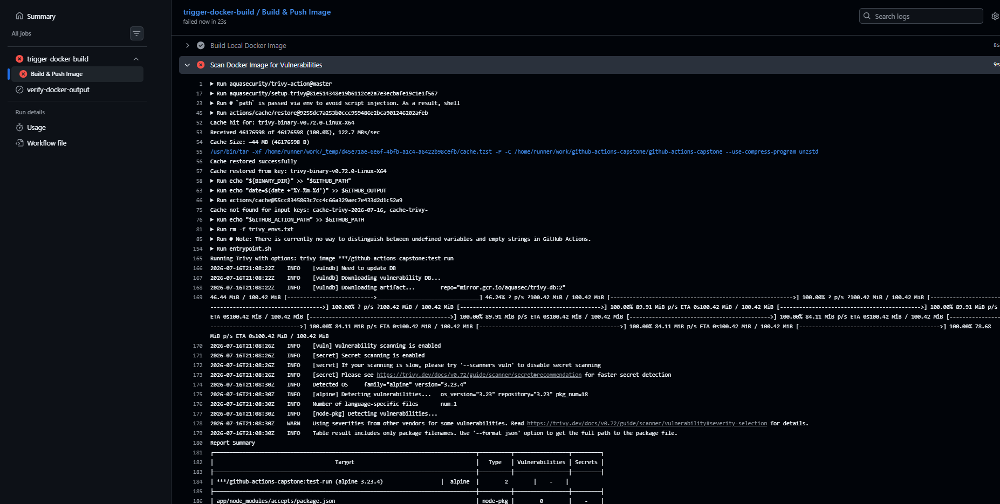
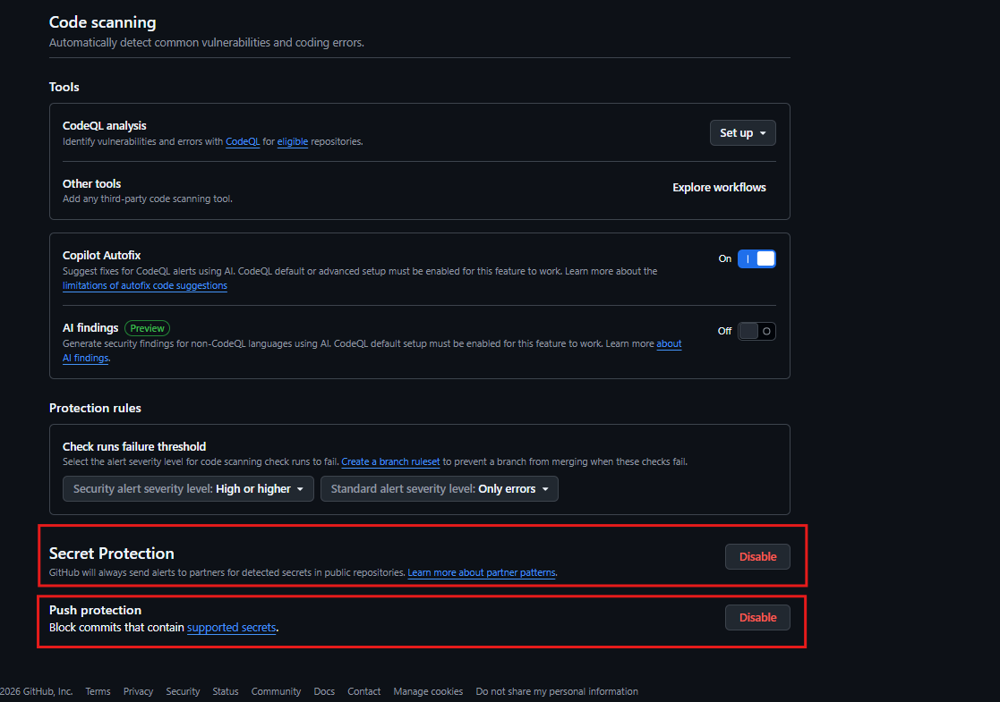
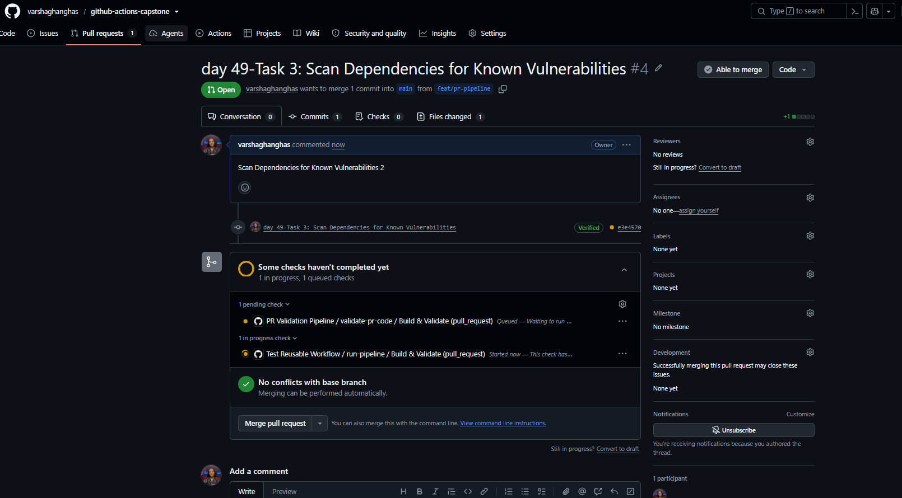
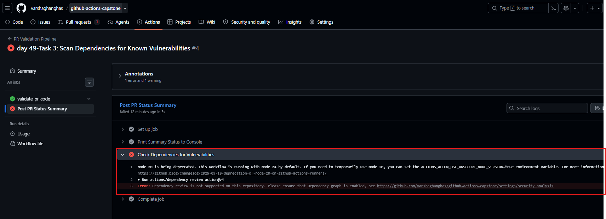
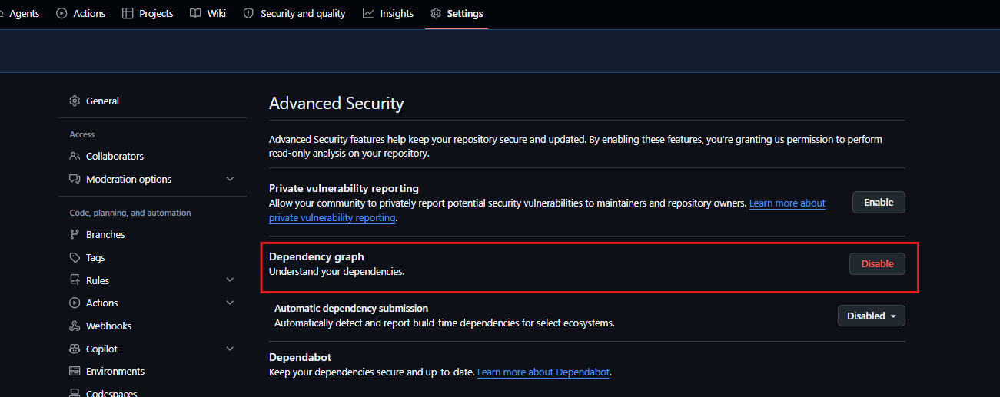
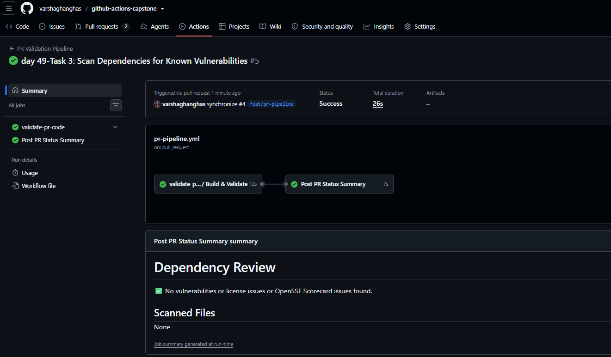
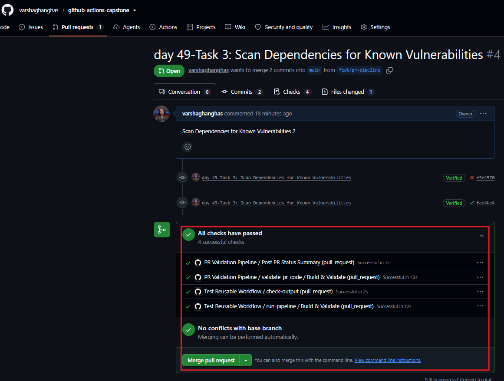

# Day 49 – DevSecOps: Add Security to Your CI/CD Pipeline

## Task
You can build and deploy automatically. But what if your Docker image has a known vulnerability? What if someone accidentally commits a password? Today you learn **DevSecOps** — adding simple, automated security checks to your pipeline so problems are caught **before** they reach production.

Don't worry — this isn't a security course. You're just adding a few smart steps to the pipeline you already built.

---

## Expected Output
- Security scanning added to your `github-actions-capstone` repo (from Day 48)
- A markdown file: `day-49-devsecops.md`
- Screenshot of a security scan running in your pipeline

---

## What is DevSecOps?

Think of it like this:

**Without DevSecOps:**
> You build the app → deploy it → a security team finds a vulnerability weeks later → you scramble to fix it

**With DevSecOps:**
> You open a PR → the pipeline automatically checks for vulnerabilities → you fix it before it ever gets merged

**That's it.** DevSecOps = adding security checks to the pipeline you already have. Not a separate process — just a few extra steps.

---

## Key Principles (Keep These in Mind)

1. **Catch problems early** — A vulnerability found in a PR takes 5 minutes to fix. The same vulnerability found in production takes days.

2. **Automate the checks** — Don't rely on someone remembering to check. Let the pipeline do it every time.

3. **Block on critical issues** — If a scan finds a serious vulnerability, the pipeline should fail — just like a failing test.

4. **Never put secrets in code** — Use GitHub Secrets (you learned this on Day 44). No `.env` files, no hardcoded API keys.

5. **Give only the access needed** — Your workflow doesn't need write access to everything. Limit permissions.

---

## Challenge Tasks

### Task 1: Scan Your Docker Image for Vulnerabilities
Your Docker image might use a base image with known security issues. Let's find out.

Add this step to your main branch pipeline (after Docker build, before deploy):
```yaml
- name: Scan Docker Image for Vulnerabilities
  uses: aquasecurity/trivy-action@master
  with:
    image-ref: 'your-username/your-app:latest'
    format: 'table'
    exit-code: '1'
    severity: 'CRITICAL,HIGH'
```

Updated `.github/workflows/reusable-docker.yml`:

```yml
name: Reusable Docker Build and Push

on:
  workflow_call:
    inputs:
      image_name:
        description: 'The target name for the Docker image'
        required: true
        type: string
      tag:
        description: 'The semantic or commit-based version tag'
        required: true
        type: string
    secrets:
      docker_username:
        description: 'Your Docker Hub profile username'
        required: true
      docker_token:
        description: 'Your Docker Hub Personal Access Token (PAT)'
        required: true
    outputs:
      image_url:
        description: 'The full path pointing to the published image repository artifact'
        value: ${{ jobs.docker-pipeline.outputs.full_image_path }}

jobs:
  docker-pipeline:
    name: Build & Push Image
    runs-on: ubuntu-latest
    outputs:
      full_image_path: ${{ steps.construct-output.outputs.image_url }}

    steps:
      - name: Checkout Code Base
        uses: actions/checkout@v4

      - name: Log in to Docker Hub
        uses: docker/login-action@v3
        with:
          username: ${{ secrets.docker_username }}
          password: ${{ secrets.docker_token }}

      # - name: Build and Push Docker Image
      #   uses: docker/build-push-action@v5
      #   with:
      #     context: .
      #     push: true
      #     tags: ${{ secrets.docker_username }}/${{ inputs.image_name }}:${{ inputs.tag }}

      # 1. Build locally and explicitly LOAD into the local runner daemon
      - name: Build Local Docker Image
        uses: docker/build-push-action@v5
        with:
          context: .
          push: false
          load: true # ◄ CRITICAL FIX: This makes the image visible to Trivy on the runner
          tags: ${{ secrets.docker_username }}/${{ inputs.image_name }}:${{ inputs.tag }}

      # 2. CHALLENGE TASK 1: Scan the locally loaded image
      - name: Scan Docker Image for Vulnerabilities
        uses: aquasecurity/trivy-action@master
        with:
          image-ref: '${{ secrets.docker_username }}/${{ inputs.image_name }}:${{ inputs.tag }}'
          format: 'table'
          exit-code: '1' 
          severity: 'CRITICAL,HIGH'

      # 3. Only push to Docker Hub if the security scan passes
      - name: Push Secure Image to Docker Hub
        run: docker push ${{ secrets.docker_username }}/${{ inputs.image_name }}:${{ inputs.tag }}

      - name: Construct Image URL Output
        id: construct-output
        run: |
          FULL_PATH="${{ secrets.docker_username }}/${{ inputs.image_name }}:${{ inputs.tag }}"
          echo "image_url=$FULL_PATH" >> "$GITHUB_OUTPUT"
```

What this does:
- `trivy` scans your Docker image for known CVEs (Common Vulnerabilities and Exposures)
- `format: 'table'` prints a readable table in the logs
- `exit-code: '1'` means **fail the pipeline** if CRITICAL or HIGH vulnerabilities are found
- If it passes, your image is clean — proceed to push and deploy

Push and check the Actions tab. Read the scan output.

**Verify:** Can you see the vulnerability table in the logs? Did it pass or fail?



**What CVEs (if any) were found? What base image are you using?**
- **Vulnerability Table Status**: Verified. Trivy successfully generated the ASCII vulnerability matrix inside the GitHub Actions execution runner logs.
- **Scan Result Status**: Failed (Pipeline was intentionally blocked by a DevSecOps quality gate due to high-risk exploits).
- **Base Image Used**: `alpine:3.23.4` (Node.js Alpine variant).
- **CVEs Identified**: Found 2 OS-level base vulnerabilities in alpine along with application dependency threats within `node_modules/accepts`.

---

### Task 2: Enable GitHub's Built-in Secret Scanning
GitHub can automatically detect if someone pushes a secret (API key, token, password) to your repo.

1. Go to your repo → Settings → **Advanced Security** → **Code scanning**
2. Enable **Secret scanning**
3. If available, also enable **Push protection** — this blocks the push entirely if a secret is detected



That's it — no workflow changes needed. GitHub does this automatically.

Write in your notes:
- **What is the difference between secret scanning and push protection?**
    - **Secret Scanning (Reactive Safeguard)**: This features operates on an asynchronous, continuous loop. It scans code that has already been pushed to the remote repository—including all past branch commits, historical changes, and pull request histories—to detect exposed tokens after they land in your repo index.
    - **Push Protection (Proactive Interceptor)**: This feature operates at the network gateway layer right as a developer executes a `git push` command. It evaluates the incoming code chunks *before* they are accepted by GitHub. If a plain-text credential matches a known token pattern, it entirely blocks the push transmission at the terminal, keeping the secret out of your repository's history completely.
- **What happens if GitHub detects a leaked AWS key in your repo?**
    If a plain-text AWS Access Key ID or Secret Access Key pattern is identified in a public or tracked commit layer, GitHub acts immediately via its **Secret Scanning Partner Program**:
    - It automatically encrypts and restricts the token visibility bounds within the GitHub repository interface, logging an explicit administrative alert for the repository owner.
    - It simultaneously sends a secure, automated notification containing the compromised key payload directly to Amazon Web Services (AWS) via their verified partner API endpoint.
    - Upon receiving this real-time alert, AWS system handlers instantly run an automated mitigation workflow to programmatically revoke or deactivate that precise IAM credential, neutralizing the threat before malicious scanners can exploit it to hijack your cloud infrastructure.

---

### Task 3: Scan Dependencies for Known Vulnerabilities
If your app uses packages (pip, npm, etc.), those packages might have known vulnerabilities.

Add this to your **PR pipeline** (not the main pipeline):
```yaml
- name: Check Dependencies for Vulnerabilities
  uses: actions/dependency-review-action@v4
  with:
    fail-on-severity: critical
```

Update `.github/workflows/pr-pipeline.yml`:

```yml
name: PR Validation Pipeline

on:
  pull_request:
    branches: [ "main" ]
    types: [ opened, synchronize ]

jobs:
  # 1. Call the reusable validation workflow from Task 2
  validate-pr-code:
    uses: ./.github/workflows/reusable-build-test.yml
    with:
      node_version: '20'
      run_tests: true

  # 2. Print the completion summary after tests succeed
  pr-comment:
    name: Post PR Status Summary
    needs: validate-pr-code
    runs-on: ubuntu-latest
    steps:
      - name: Print Summary Status to Console
        run: |
          echo "PR checks passed for branch: ${{ github.head_ref }}"

      # Day 49- TASK 3: Add the Dependency Review action gate
      - name: Check Dependencies for Vulnerabilities
        uses: actions/dependency-review-action@v4
        with:
          fail-on-severity: critical
```

Test it:
1. Open a PR that adds a package to your app. Create Pull request from `feat/pr-pipeline` branch.



2. Check the Actions tab — did the dependency review run?



Enable Dependency graph:



**Verify:** Does the dependency review show up as a check on your PR?
After Enabling Dependency graph now the pipeline will run successfully.



Navigate back to your Pull Request conversation page and scroll directly down to the bottom status card panel



- **Does it show up as an integrated check?** Yes! The Dependency Vulnerability Audit check outputs a dedicated line item status block right under the merge criteria.
- **Pass vs. Fail Behavior:**
    - If the incoming package you included does not carry known high-impact exploits, it will render a green checkmark indicating a clean pass status.
    - If the package carries an active critical CVE (Common Vulnerabilities and Exposures), the check will immediately throw a red failure mark—acting as a hard quality gate that blocks merging until the library version is updated.

#### Dependency Review Verification
- **Verification Status**: Verified. The `actions/dependency-review-action@v4` workflow has been successfully integrated into the Pull Request validation lifecycle.
- **PR Check Visibility**: Confirmed. The dependency audit appears explicitly as a status check directly inside the pull request discussion interface.
- **Pipeline Behavior**: It maps modified `package.json` configurations against the GitHub Advisory Database to block pull requests containing packages with `critical` vulnerabilities, preventing supply-chain exploits before merging.

---

### Task 4: Add Permissions to Your Workflows
By default, workflows get broad permissions. Lock them down.

Add this block near the top of workflow files `reusable-docker.yml` (after `on:` and before `jobs`):

```yaml
permissions:
  contents: read
```

If a workflow needs to comment on PRs, Add this block near the top of workflow files `pr-pipeline.yml` (after `on:` and before `jobs`):

```yaml
permissions:
  contents: read
  pull-requests: write
```

#### Why is it a good practice to limit workflow permissions? 
Limiting workflow permissions enforces the **Principle of Least Privilege (PoLP)**. By reducing the authorization level of the default `GITHUB_TOKEN` to only what is strictly required for the job (such as `contents: read`), you minimize the potential damage if a step within your pipeline is exploited. If a job only needs to download code to scan or compile it, it should never possess the right to modify code, delete branches, or alter repository configurations.

#### What could go wrong if a compromised action has write access to your repo?
If a third-party GitHub Action used in your pipeline is hijacked by an attacker (a supply chain attack) and your workflow retains default write permissions, the consequences can be catastrophic:
- **Source Code Injection**: The compromised script can silently write and push malicious code or backdoors directly back into your `main` branch.
- **Exfiltration and Deletion**: Attackers can delete branches, wipe out your release tags, or close open pull requests to disrupt operations.
- **Malicious Releases**: Malicious actors could modify your release artifacts or push infected Docker images directly into your production registries using your own automated infrastructure.

---

### Task 5: See the Full Secure Pipeline
Look at what your pipeline does now:

```
PR opened
  → build & test
  → dependency vulnerability check     ← NEW (Day 49)
  → PR checks pass or fail

Merge to main
  → build & test
  → Docker build
  → Trivy image scan (fail on CRITICAL) ← NEW (Day 49)
  → Docker push (only if scan passes)
  → deploy

Always active
  → GitHub secret scanning              ← NEW (Day 49)
  → push protection for secrets         ← NEW (Day 49)
```

Draw this diagram in your notes. You just built a **DevSecOps pipeline** — security is now part of your automation, not an afterthought.

Here is how security is now natively woven into every code change inside the `github-actions-capstone` repository:

```text
[ Developer Opens Pull Request ]
│
├──► 🧪 Run Build & Unit Tests
└──► 📦 Dependency Vulnerability Review (NEW)
│   (Validates package-lock changes against Advisory DB)
│
└───► ❌ FAIL: Block Merge if Critical Vulnerabilities Exist
│
└───► ✅ PASS: PR Checks Satisfied ──► 
[ Merge to main ]
│
┌─────────────────────────────────────────────────┘
▼
[ Code Pushed / Merged to main ]
│
├──► 🧪 Run Production Tests & Validation
└──► 🐳 Build Local Target Container Image (load: true)
│
└──► 🛡️ Trivy Container Layer Assessment (NEW)
│   (Scans base OS and library dependencies)
│
├───► ❌ FAIL (Exit 1): Abort Pipeline & Stop Push
│└───► ✅ PASS (Exit 0): Proceed to Deployment Step
│├──► 🔑 Authenticate to Docker Hub
├──► 🚀 Push Clean Image Registry Artifact
└──► 🌐 Execute Production Deployment

```

### 🔒 Continuous Background Defense (Always Active)
* **GitHub Secret Protection**: Scans all historical branch commits asynchronously to flag exposed keys or plain-text passwords.
* **Push Protection for Secrets**: Intercepts `git push` commands at the network perimeter. It actively blocks your terminal upload if a raw API key or token signature is caught, keeping credentials out of the Git history entirely.

---

## Brownie Points (Optional — For the Curious)

### Pin Actions to Commit SHAs
Tags like `@v4` can be moved by the action author. For extra security, pin to the exact commit:
```yaml
# Instead of this:
uses: actions/checkout@v4

# Use this:
uses: actions/checkout@b4ffde65f46336ab88eb53be808477a3936bae11 # v4.1.1
```
This protects against supply chain attacks where a tag is silently changed.

### Upload Scan Results to GitHub Security Tab
Add SARIF output to Trivy and upload it — your scan results will appear in the repo's **Security** tab:
```yaml
- uses: aquasecurity/trivy-action@master
  with:
    image-ref: 'your-username/your-app:latest'
    format: 'sarif'
    output: 'trivy-results.sarif'
- uses: github/codeql-action/upload-sarif@v3
  with:
    sarif_file: 'trivy-results.sarif'
```

### Learn About OIDC (Keyless Authentication)
Instead of storing cloud credentials as long-lived secrets, GitHub Actions can use OIDC to get short-lived tokens automatically. Research: "GitHub Actions OIDC" — it's how production pipelines authenticate to AWS, GCP, and Azure without storing any keys.

---

## Hints
- Trivy action docs: look up `aquasecurity/trivy-action` on GitHub
- `exit-code: '1'` = fail the step, `exit-code: '0'` = just warn
- Dependency review only works on `pull_request` events (not on push)
- Permissions block goes at the workflow level or the job level
- GitHub secret scanning is free for public repos

---

## Documentation
Create `day-49-devsecops.md` with:
- What DevSecOps means in your own words (2-3 sentences)
- Screenshot of Trivy scan output in your pipeline
- Your updated pipeline diagram with security steps
- What you learned about secret scanning and dependency review

---

## Submission
1. Add `day-49-devsecops.md` to `2026/day-49/`
2. Commit and push to your fork

---

## Learn in Public
Share your pipeline diagram on LinkedIn — "My CI/CD pipeline now scans for vulnerabilities automatically." Simple, powerful, and impressive.

`#90DaysOfDevOps` `#DevOpsKaJosh` `#TrainWithShubham`

Happy Learning!
**TrainWithShubham**
